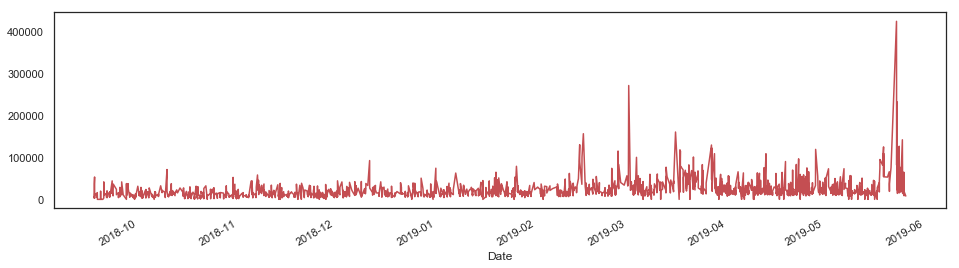
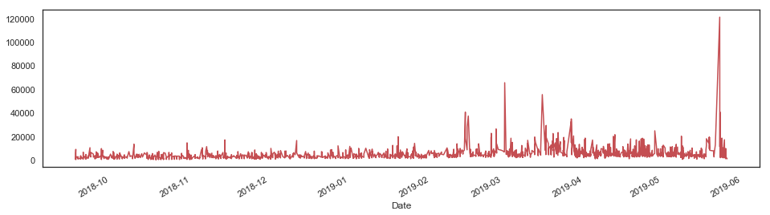
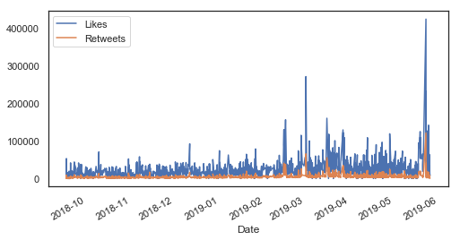
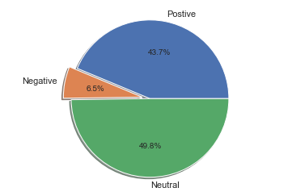
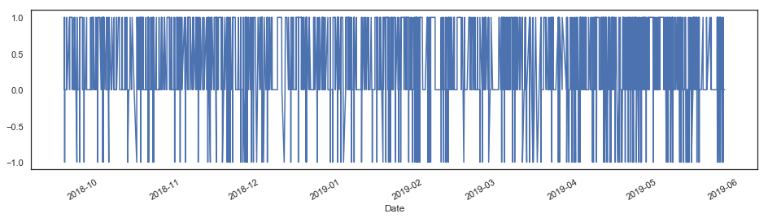
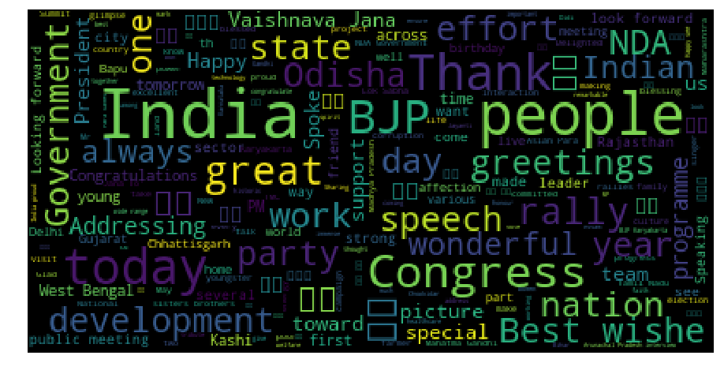
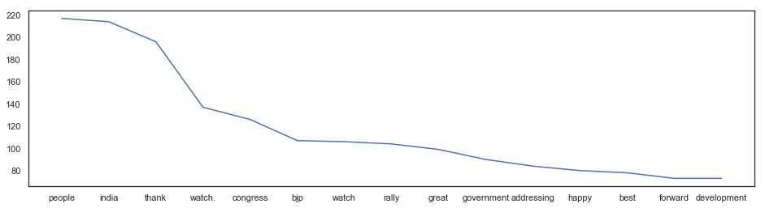
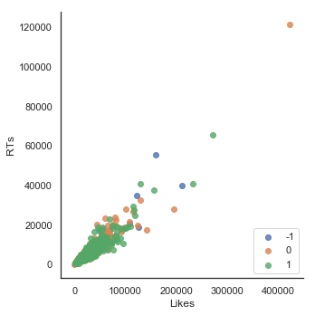

```python
import tweepy 
import pandas as pd
import numpy as np

from IPython.display import display 
import matplotlib.pyplot as plt
import seaborn as sns 
from textblob import TextBlob
import re
import warnings
warnings.filterwarnings('ignore')

%matplotlib inline
```


```python
#It's not a good pratice to include the keys in the same code, as we have to display. However, I am lazy
consumer_key = "XXXXXXXXXXXXXXXXX"
consumer_secret = "XXXXXXXXXXXXXXXX"
access_key = "XXXXXXXXXXXXXXXXXX"
access_secret = "XXXXXXXXXXXXXXXXXX"
```


```python
def twitter_setup():
    auth=tweepy.OAuthHandler(consumer_key, consumer_secret)
    auth.set_access_token(access_key, access_secret)
    
    api = tweepy.API(auth)
    return api
```


```python
screen_name="narendramodi"

def get_all_tweets(screen_name):
    auth=tweepy.OAuthHandler(consumer_key, consumer_secret)
    auth.set_access_token(access_key, access_secret)
    api=tweepy.API(auth)
    
    tweets=[]
    new_tweets=api.user_timeline(screen_name=screen_name, count=200)
    tweets.extend(new_tweets)
    
    oldest=tweets[-1].id-1
    
    while len(new_tweets)>0:
        print(f"Getting tweets before {oldest}")
        #all request will include oldest parameter to exclude the chances of the duplicates 
        new_tweets=api.user_timeline(screen_name=screen_name, count=200, max_id=oldest)
        tweets.extend(new_tweets)
        oldest=tweets[-1].id-1
        print(f"Number of Tweets have been downloaded so far: {len(tweets)}")
    
    return tweets

tweets=get_all_tweets(screen_name)
print("5 recent Tweets")
for tweet in tweets[:5]:
    print(tweet.text)
    print()
```

    Getting tweets before 1128239437836455936
    Number of Tweets have been downloaded so far: 400
    Getting tweets before 1123154927549702144
    Number of Tweets have been downloaded so far: 600
    Getting tweets before 1118387307969699840
    Number of Tweets have been downloaded so far: 800
    Getting tweets before 1114156417592594432
    Number of Tweets have been downloaded so far: 1000
    Getting tweets before 1108374231736172544
    Number of Tweets have been downloaded so far: 1200
    Getting tweets before 1102229996393848836
    Number of Tweets have been downloaded so far: 1400
    Getting tweets before 1094478785406164991
    Number of Tweets have been downloaded so far: 1600
    Getting tweets before 1087975109858656258
    Number of Tweets have been downloaded so far: 1800
    Getting tweets before 1081212834896175105
    Number of Tweets have been downloaded so far: 2000
    Getting tweets before 1074339124310495236
    Number of Tweets have been downloaded so far: 2200
    Getting tweets before 1066900026310328319
    Number of Tweets have been downloaded so far: 2400
    Getting tweets before 1061623240521469958
    Number of Tweets have been downloaded so far: 2600
    Getting tweets before 1055114175880454144
    Number of Tweets have been downloaded so far: 2800
    Getting tweets before 1052224586157182975
    Number of Tweets have been downloaded so far: 3000
    Getting tweets before 1047053345658195967
    Number of Tweets have been downloaded so far: 3200
    Getting tweets before 1041712659203321857
    Number of Tweets have been downloaded so far: 3212
    Getting tweets before 1041701171143090176
    Number of Tweets have been downloaded so far: 3212
    5 recent Tweets
    Called on Vice President Shri @MVenkaiahNaidu Ji. @VPSecretariat https://t.co/6buaaCFn5z
    
    Thank you President @jairbolsonaro. I look forward to making your acquaintance and working with you to develop Indi… https://t.co/9EnWgQFAZ6
    
    शुभकामनाओं के लिए बहुत-बहुत आभार @aanandlrai जी। https://t.co/ngIF8gAYqR
    
    Thank you @SDhawan25. We will continue to serve our citizens and enhance India’s growth trajectory. https://t.co/Vp2fwXaeQj
    
    Thank you @mauriciomacri! I look forward to continue working with you to take the India-Argentina strategic partner… https://t.co/j412vP9QLG
    
    


```python
data=pd.DataFrame(data=[tweet.text for tweet in tweets], columns=['Tweets'])
display(data.head(10))
```


<div>
<style scoped>
    .dataframe tbody tr th:only-of-type {
        vertical-align: middle;
    }

    .dataframe tbody tr th {
        vertical-align: top;
    }

    .dataframe thead th {
        text-align: right;
    }
</style>
<table border="1" class="dataframe">
  <thead>
    <tr style="text-align: right;">
      <th></th>
      <th>Tweets</th>
    </tr>
  </thead>
  <tbody>
    <tr>
      <th>0</th>
      <td>Called on Vice President Shri @MVenkaiahNaidu ...</td>
    </tr>
    <tr>
      <th>1</th>
      <td>Thank you President @jairbolsonaro. I look for...</td>
    </tr>
    <tr>
      <th>2</th>
      <td>शुभकामनाओं के लिए बहुत-बहुत आभार @aanandlrai ज...</td>
    </tr>
    <tr>
      <th>3</th>
      <td>Thank you @SDhawan25. We will continue to serv...</td>
    </tr>
    <tr>
      <th>4</th>
      <td>Thank you @mauriciomacri! I look forward to co...</td>
    </tr>
    <tr>
      <th>5</th>
      <td>Thanks. @varunsharma90 https://t.co/sFoBIw1AJm</td>
    </tr>
    <tr>
      <th>6</th>
      <td>Thank you for the good wishes. @Its_Badshah. h...</td>
    </tr>
    <tr>
      <th>7</th>
      <td>For 70 years, India’s poor were betrayed. In t...</td>
    </tr>
    <tr>
      <th>8</th>
      <td>Our Constitution is a rich and extensive socia...</td>
    </tr>
    <tr>
      <th>9</th>
      <td>I thank colleagues of the BJP and NDA for plac...</td>
    </tr>
  </tbody>
</table>
</div>


```python
print(dir(tweets[0]))
```

    ['__class__', '__delattr__', '__dict__', '__dir__', '__doc__', '__eq__', '__format__', '__ge__', '__getattribute__', '__getstate__', '__gt__', '__hash__', '__init__', '__init_subclass__', '__le__', '__lt__', '__module__', '__ne__', '__new__', '__reduce__', '__reduce_ex__', '__repr__', '__setattr__', '__sizeof__', '__str__', '__subclasshook__', '__weakref__', '_api', '_json', 'author', 'contributors', 'coordinates', 'created_at', 'destroy', 'entities', 'extended_entities', 'favorite', 'favorite_count', 'favorited', 'geo', 'id', 'id_str', 'in_reply_to_screen_name', 'in_reply_to_status_id', 'in_reply_to_status_id_str', 'in_reply_to_user_id', 'in_reply_to_user_id_str', 'is_quote_status', 'lang', 'parse', 'parse_list', 'place', 'possibly_sensitive', 'retweet', 'retweet_count', 'retweeted', 'retweets', 'source', 'source_url', 'text', 'truncated', 'user']
    


```python
#Add relevant data to Panda DataFrame 
data['Length']=np.array([len(tweet.text) for tweet in tweets])
data['ID']=np.array([tweet.id for tweet in tweets])
data['Date']=np.array([tweet.created_at for tweet in tweets])
data['Source']=np.array([tweet.source for tweet in tweets])
data['Likes']=np.array([tweet.favorite_count for tweet in tweets])
data['RTs']=np.array([tweet.retweet_count for tweet in tweets])
display(data.head(10))
```


<div>
<style scoped>
    .dataframe tbody tr th:only-of-type {
        vertical-align: middle;
    }

    .dataframe tbody tr th {
        vertical-align: top;
    }

    .dataframe thead th {
        text-align: right;
    }
</style>
<table border="1" class="dataframe">
  <thead>
    <tr style="text-align: right;">
      <th></th>
      <th>Tweets</th>
      <th>Length</th>
      <th>ID</th>
      <th>Date</th>
      <th>Source</th>
      <th>Likes</th>
      <th>RTs</th>
    </tr>
  </thead>
  <tbody>
    <tr>
      <th>0</th>
      <td>Called on Vice President Shri @MVenkaiahNaidu ...</td>
      <td>88</td>
      <td>1132527835812225024</td>
      <td>2019-05-26 06:04:12</td>
      <td>Twitter Web Client</td>
      <td>7845</td>
      <td>1027</td>
    </tr>
    <tr>
      <th>1</th>
      <td>Thank you President @jairbolsonaro. I look for...</td>
      <td>140</td>
      <td>1132341572090191872</td>
      <td>2019-05-25 17:44:03</td>
      <td>Twitter for iPhone</td>
      <td>18518</td>
      <td>2573</td>
    </tr>
    <tr>
      <th>2</th>
      <td>शुभकामनाओं के लिए बहुत-बहुत आभार @aanandlrai ज...</td>
      <td>72</td>
      <td>1132340882898915329</td>
      <td>2019-05-25 17:41:19</td>
      <td>Twitter for iPhone</td>
      <td>14741</td>
      <td>1529</td>
    </tr>
    <tr>
      <th>3</th>
      <td>Thank you @SDhawan25. We will continue to serv...</td>
      <td>123</td>
      <td>1132340602132209664</td>
      <td>2019-05-25 17:40:12</td>
      <td>Twitter for iPhone</td>
      <td>21601</td>
      <td>2048</td>
    </tr>
    <tr>
      <th>4</th>
      <td>Thank you @mauriciomacri! I look forward to co...</td>
      <td>140</td>
      <td>1132340296866500608</td>
      <td>2019-05-25 17:38:59</td>
      <td>Twitter for iPhone</td>
      <td>11312</td>
      <td>1469</td>
    </tr>
    <tr>
      <th>5</th>
      <td>Thanks. @varunsharma90 https://t.co/sFoBIw1AJm</td>
      <td>46</td>
      <td>1132339567489617920</td>
      <td>2019-05-25 17:36:05</td>
      <td>Twitter for iPhone</td>
      <td>8538</td>
      <td>968</td>
    </tr>
    <tr>
      <th>6</th>
      <td>Thank you for the good wishes. @Its_Badshah. h...</td>
      <td>68</td>
      <td>1132339386450939907</td>
      <td>2019-05-25 17:35:22</td>
      <td>Twitter for iPhone</td>
      <td>11659</td>
      <td>1204</td>
    </tr>
    <tr>
      <th>7</th>
      <td>For 70 years, India’s poor were betrayed. In t...</td>
      <td>140</td>
      <td>1132320901003747328</td>
      <td>2019-05-25 16:21:54</td>
      <td>Twitter Media Studio</td>
      <td>34046</td>
      <td>6666</td>
    </tr>
    <tr>
      <th>8</th>
      <td>Our Constitution is a rich and extensive socia...</td>
      <td>139</td>
      <td>1132318267832295424</td>
      <td>2019-05-25 16:11:27</td>
      <td>Twitter Web Client</td>
      <td>64312</td>
      <td>9790</td>
    </tr>
    <tr>
      <th>9</th>
      <td>I thank colleagues of the BJP and NDA for plac...</td>
      <td>139</td>
      <td>1132314619161206785</td>
      <td>2019-05-25 15:56:57</td>
      <td>Twitter Web Client</td>
      <td>30804</td>
      <td>4793</td>
    </tr>
  </tbody>
</table>
</div>


```python
#Data analysis 
mean=np.mean(data['Length'])
print(f"The mean length of the tweets:  {mean}")
```

    The mean length of the tweets:  126.94925280199253
    


```python
#Most liked and retweeted tweets
lik_max=np.max(data['Likes'])
rt_max=np.max(data['RTs'])

#Extract the index of max
fav=data[data.Likes==lik_max].index[0]
rt=data[data.RTs==rt_max].index[0]

#Print the result
print(f"The most liked tweet is: {data['Tweets'][fav]}")
print(f"Number of likes: {lik_max}")
print("------------------")
print()

#Print the most retweeted tweet
print(f"The most liked tweet is: {data['Tweets'][rt]}")
print(f"Number of likes: {rt_max}")
print("------------------")
print()

```

    The most liked tweet is: सबका साथ + सबका विकास + सबका विश्वास = विजयी भारत
    
    Together we grow. 
    
    Together we prosper. 
    
    Together we will buil… https://t.co/orKx7u7syJ
    Number of likes: 422854
    ------------------
    
    The most liked tweet is: सबका साथ + सबका विकास + सबका विश्वास = विजयी भारत
    
    Together we grow. 
    
    Together we prosper. 
    
    Together we will buil… https://t.co/orKx7u7syJ
    Number of likes: 121051
    ------------------
    
    


```python
#Plots 
like=pd.Series(data=data['Likes'].values, index=data['Date'])
retweet=pd.Series(data=data['RTs'].values, index=data['Date'])
```


```python
like.plot(figsize=(16,4), color='r')
```


    <matplotlib.axes._subplots.AxesSubplot at 0x1fe919a1f60>





```python
retweet.plot(figsize=(16,4), color='r')
```


    <matplotlib.axes._subplots.AxesSubplot at 0x1fe83ddd198>





```python
like.plot(figsize=(8,4), label="Likes", legend=True)
retweet.plot(figsize=(8,4), label="Retweets", legend=True)
```


    <matplotlib.axes._subplots.AxesSubplot at 0x1fe919a1be0>





```python
#Before proceeding with any data analysis let's analyze whether we have null in dataset.
#We got False, stating that we have no null in DataFrame
data.isnull().any()
```


    Tweets    False
    Length    False
    ID        False
    Date      False
    Source    False
    Likes     False
    RTs       False
    dtype: bool


```python
data.describe()
```


<div>
<style scoped>
    .dataframe tbody tr th:only-of-type {
        vertical-align: middle;
    }

    .dataframe tbody tr th {
        vertical-align: top;
    }

    .dataframe thead th {
        text-align: right;
    }
</style>
<table border="1" class="dataframe">
  <thead>
    <tr style="text-align: right;">
      <th></th>
      <th>Length</th>
      <th>ID</th>
      <th>Likes</th>
      <th>RTs</th>
    </tr>
  </thead>
  <tbody>
    <tr>
      <th>count</th>
      <td>3212.000000</td>
      <td>3.212000e+03</td>
      <td>3212.000000</td>
      <td>3212.000000</td>
    </tr>
    <tr>
      <th>mean</th>
      <td>126.949253</td>
      <td>1.087410e+18</td>
      <td>16837.234745</td>
      <td>3864.905044</td>
    </tr>
    <tr>
      <th>std</th>
      <td>23.801556</td>
      <td>2.807952e+16</td>
      <td>18983.062909</td>
      <td>4317.286641</td>
    </tr>
    <tr>
      <th>min</th>
      <td>33.000000</td>
      <td>1.041701e+18</td>
      <td>0.000000</td>
      <td>41.000000</td>
    </tr>
    <tr>
      <th>25%</th>
      <td>124.000000</td>
      <td>1.061404e+18</td>
      <td>6950.500000</td>
      <td>1748.000000</td>
    </tr>
    <tr>
      <th>50%</th>
      <td>140.000000</td>
      <td>1.087907e+18</td>
      <td>12294.500000</td>
      <td>2971.000000</td>
    </tr>
    <tr>
      <th>75%</th>
      <td>140.000000</td>
      <td>1.114145e+18</td>
      <td>19991.250000</td>
      <td>4570.250000</td>
    </tr>
    <tr>
      <th>max</th>
      <td>148.000000</td>
      <td>1.132528e+18</td>
      <td>422854.000000</td>
      <td>121051.000000</td>
    </tr>
  </tbody>
</table>
</div>


```python
#I'm curious how many times Modi talks about Swachh Bharat. Let's see. 
swachh_count = data.Tweets[data.Tweets.str.contains('Swachh', flags=re.IGNORECASE)].count() 
print(f"PM Modi has tweeted about Swachh Bharat {swachh_count} times.")
print("--------------------------------")
print()
data.Tweets[data.Tweets.str.contains('Swachh', flags=re.IGNORECASE)] 

```

    PM Modi has tweeted about Swachh Bharat 14 times.
    --------------------------------
    
    


    1248    ‘Swachh Kumbh, Swachh Aabhaar’ was a great pla...
    1252    Addressing the ‘Swachh Kumbh, Swachh Aabhaar’ ...
    1361    You’ve heard of many competitions but we’ve be...
    1367    The Swachh Shakti- 2019 in Haryana’s Kurukshet...
    1661    Here is a unique contest that strengthens the ...
    1684    The Sulabh International family has added imme...
    1840    When Jabalpur has passionate citizens like you...
    2979    The stupendous efforts of the @JagranNews team...
    2988    Thank you @iamsrk, for lending vital support f...
    2991    I congratulate team @ndtv for their notable ef...
    2992    A Swachh Bharat was Bapu's dream. \n\nWe are a...
    2994    I congratulate all those who have been conferr...
    3024    A Divyang brother from Rajasthan called me, ex...
    3145    RT @arunjaitley: Sharing my article on Swachh ...
    Name: Tweets, dtype: object


```python
#Data cleaning for Tweet text analysis 
#Search for the text beginning with http or @ and then delete the proceeding text until we find whitespace 
#Also, remove &amp and white chracter trailing the last character 
data['Tweets_Cln']=data.Tweets.str.replace(r'http\S+', '').str.replace(r'@\S+', '').str.replace('&amp', '').str.rstrip()

#We can remove the Tweets that are retweets by deleting the tweets that have zero likes. 
#In Twitter data, retweets from users have zero likes

data=data[data.Likes!=0]
```


```python
data.head(2)
```


<div>
<style scoped>
    .dataframe tbody tr th:only-of-type {
        vertical-align: middle;
    }

    .dataframe tbody tr th {
        vertical-align: top;
    }

    .dataframe thead th {
        text-align: right;
    }
</style>
<table border="1" class="dataframe">
  <thead>
    <tr style="text-align: right;">
      <th></th>
      <th>Tweets</th>
      <th>Length</th>
      <th>ID</th>
      <th>Date</th>
      <th>Source</th>
      <th>Likes</th>
      <th>RTs</th>
      <th>Tweets_Cln</th>
    </tr>
  </thead>
  <tbody>
    <tr>
      <th>0</th>
      <td>Called on Vice President Shri @MVenkaiahNaidu ...</td>
      <td>88</td>
      <td>1132527835812225024</td>
      <td>2019-05-26 06:04:12</td>
      <td>Twitter Web Client</td>
      <td>7845</td>
      <td>1027</td>
      <td>Called on Vice President Shri  Ji.</td>
    </tr>
    <tr>
      <th>1</th>
      <td>Thank you President @jairbolsonaro. I look for...</td>
      <td>140</td>
      <td>1132341572090191872</td>
      <td>2019-05-25 17:44:03</td>
      <td>Twitter for iPhone</td>
      <td>18518</td>
      <td>2573</td>
      <td>Thank you President  I look forward to making ...</td>
    </tr>
  </tbody>
</table>
</div>


```python
def analize_sentiment(tweet):
    analysis = TextBlob(tweet)
    if analysis.sentiment.polarity > 0:
        return 1
    elif analysis.sentiment.polarity == 0:
        return 0
    else:
        return -1
data['sentiment'] = np.array([ analize_sentiment(tweet) for tweet in data['Tweets_Cln']])
display(data.head(2))

positive=data.loc[data.sentiment==1,'Tweets'].count()
negative=data.loc[data.sentiment==-1,'Tweets'].count()
neutral=data.loc[data.sentiment==0,'Tweets'].count()

#Let's plot
labels='Postive', 'Negative', 'Neutral'
sizes=[positive, negative, neutral]
explode=(0, 0.1, 0)
fig1, ax1 = plt.subplots()
ax1.pie(sizes, explode=explode, labels=labels, autopct='%1.1f%%',
        shadow=True, startangle=0)
ax1.axis('equal') 
plt.show()
```


<div>
<style scoped>
    .dataframe tbody tr th:only-of-type {
        vertical-align: middle;
    }

    .dataframe tbody tr th {
        vertical-align: top;
    }

    .dataframe thead th {
        text-align: right;
    }
</style>
<table border="1" class="dataframe">
  <thead>
    <tr style="text-align: right;">
      <th></th>
      <th>Tweets</th>
      <th>Length</th>
      <th>ID</th>
      <th>Date</th>
      <th>Source</th>
      <th>Likes</th>
      <th>RTs</th>
      <th>Tweets_Cln</th>
      <th>sentiment</th>
    </tr>
  </thead>
  <tbody>
    <tr>
      <th>0</th>
      <td>Called on Vice President Shri @MVenkaiahNaidu ...</td>
      <td>88</td>
      <td>1132527835812225024</td>
      <td>2019-05-26 06:04:12</td>
      <td>Twitter Web Client</td>
      <td>7845</td>
      <td>1027</td>
      <td>Called on Vice President Shri  Ji.</td>
      <td>0</td>
    </tr>
    <tr>
      <th>1</th>
      <td>Thank you President @jairbolsonaro. I look for...</td>
      <td>140</td>
      <td>1132341572090191872</td>
      <td>2019-05-25 17:44:03</td>
      <td>Twitter for iPhone</td>
      <td>18518</td>
      <td>2573</td>
      <td>Thank you President  I look forward to making ...</td>
      <td>0</td>
    </tr>
  </tbody>
</table>
</div>





```python
tsen=pd.Series(data=data['sentiment'].values, index=data['Date'])
tsen.plot(figsize=(16,4), color='b')
```


    <matplotlib.axes._subplots.AxesSubplot at 0x1fe85d5dba8>





```python
from wordcloud import WordCloud
from wordcloud import STOPWORDS
from PIL import Image

stopwords = set(STOPWORDS)
stopwords.add("will")
stopwords.update(["say","said", "let", "now", "go", "Ji", "many", "Dear", "Shri", "watch"])
wordcloud_hc = WordCloud(max_font_size=40, relative_scaling=.5,stopwords=stopwords, background_color="black").generate(data['Tweets_Cln'].str.cat())
plt.figure(figsize=[16,8])
plt.imshow(wordcloud_hc)
plt.axis("off")
plt.show()

#Interestingly West Bengal and Odisha have been mentioned more promptly than any other states.
```





```python
#Let's get word frequency 
import nltk
from nltk.corpus import stopwords 
stop_words = set(stopwords.words('english'))
stop_words.update(["I", "The","के", "की","को","में", "का", "और","है।", "से","in", "a", "ji", "पर", "shri","है", "लिए", "ji.",
                   "ने", "also", "towards"])

counts = {}
for text in data.Tweets_Cln:
        for word in text.split():
            if word.lower() in stop_words:
                continue
            else:
                counts[word.lower()]=counts.get(word.lower(),0)+1

lst=[]

for key,val in counts.items():
    newtup=(val, key)
    lst.append(newtup)

lst=sorted(lst, reverse=True)

count_num=[]
value=[]
for val, key in lst[:15]:
    count_num.append(key)
    value.append(val)
    print(key, val)
 
print("-------------------------------")
print()
print(f"Number of times he mentioned Ram: {counts['ram']}")
print(f"Number of times he mentioned Bengal: {counts['bengal']}")
print(f"Number of times he mentioned Bihar: {counts['bihar']}")
print(f"Number of times he mentioned Hindu: {counts['hindu']}")
```

    people 217
    india 214
    thank 196
    watch. 137
    congress 126
    bjp 107
    watch 106
    rally 104
    great 99
    government 90
    addressing 84
    happy 80
    best 78
    forward 73
    development 73
    -------------------------------
    
    Number of times he mentioned Ram: 5
    Number of times he mentioned Bengal: 27
    Number of times he mentioned Bihar: 10
    Number of times he mentioned Hindu: 1
    


```python
len(count_num)
plt.figure(figsize=[16,4])
plt.plot(count_num, value)
```


    [<matplotlib.lines.Line2D at 0x1fe8725cb70>]





```python
#Correlation plot to understand chracateristic of liked and retweeted tweets 

import seaborn as sns

sns.set(style="white")
# Compute the correlation matrix
corr = data.corr()

# Generate a mask for the upper triangle
mask = np.zeros_like(corr, dtype=np.bool)
mask[np.triu_indices_from(mask)] = True

# Set up the matplotlib figure
f, ax = plt.subplots(figsize=(12, 4))

# Generate a custom diverging colormap
cmap = sns.diverging_palette(920, 10, as_cmap=True)

# Draw the heatmap with the mask and correct aspect ratio
sns.heatmap(corr, mask=mask, cmap=cmap, vmax=.1,
            square=True, xticklabels=True, yticklabels=True,
            linewidths=.5, cbar_kws={"shrink": .5}, ax=ax)
plt.title('Correlation between tweet features', bbox={'facecolor':'0.8', 'pad':0})

#RT and Likes are highly correlated
#Medium length tweets result in more retweets and likes for Mr. Modi 
#This is controversial. Tweets of Mr. Modi with negative sentiment often get more RTs and Likes. However, it may have to do 
#with epressing regrests over unfortunate events
```


    Text(0.5,1,'Correlation between tweet features')


```python
import seaborn as sns

# Use the 'hue' argument to provide a factor variable
sns.lmplot( x="Likes", y="RTs", data=data, fit_reg=False, hue='sentiment', legend=False)
 
# Move the legend to an empty part of the plot
plt.legend(loc='lower right')

#Again points that tweets with negative sentimenst getting more RTs and Likes. 
#Please not that sentiment analysis here could be unreliable, as Modi often uses Hindi language 
```


    <matplotlib.legend.Legend at 0x1fe89ae7d68>





```python
#Collection of all Tweet text for topic modelling 

data_dump=data['Tweets_Cln'].str.cat(sep=', ')
data_dump
```


    'Called on Vice President Shri  Ji., Thank you President  I look forward to making your acquaintance and working with you to develop Indi…, शुभकामनाओं के लिए बहुत-बहुत आभार  जी।, Thank you  We will continue to serve our citizens and enhance India’s growth trajectory., Thank you  I look forward to continue working with you to take the India-Argentina strategic partner…, Thanks., Thank you for the good wishes., For 70 years, India’s poor were betrayed. In the last 5 years, an effort was made to change this culture.\n\nSimilarl…, Our Constitution is a rich and extensive social document that encapsulates the dreams our freedom fighters had for…, I thank colleagues of the BJP and NDA for placing their faith in me and electing me to lead the NDA in Parliament.…, The NDA represents the best of India.\n\nOur alliance has both energy and synergy. \n\nThis is an alliance that will fu…, The hallmark of a New India is the absence of VIP culture. \n\nWe have set this trend and are determined to pursue it…, इस बार देश भागीदार बना है।\n\nदेश ने हमें 2014-2019 तक सिर्फ सत्ता में बिठाया ही नहीं, हमें चलाया भी है।, जनता ने हमें बहुत बड़ा आदेश दिया है।\n\nजनप्रतिनिधि के लिए कोई भेद-रेखा नहीं।\n\nजो हमारे साथ रहे हैं, हम उनके लिए भी…, सत्ता, पावर, सत्ता का रुतबा...ये भारत के मतदाता को कभी प्रभावित नहीं करता।\n\nभारत के लोग सेवाभाव को स्वीकार करते हैं।, Staked claim to form the Government., At the NDA meeting in Central Hall. Watch., Thank you  for the greetings.  Look forward to further strengthening of entire gamut our bilateral relati…, Thank you President  for your warm wishes and greetings. I look forward to working closely with you to f…, Thank you, Thank you  Wishing you and the team the very best for the upcoming World Cup., Humbled the affection,  Please thank your mother for the blessings and confidence she has placed in us…, Thank you  Our efforts to transform lives and make India more developed continue with renewed vigour., Thank you  It is an honour to serve 130 crore Indians and work for the empowerment of the poor., Will be going to Gujarat tomorrow evening, to seek blessings of my Mother. Day after tomorrow morning, I will be in…, Thank you  \n\nGlad that you mention healthcare and nutrition, which are priority areas for the Government…, Thank you, Thank you. I appreciate your good wishes, Thank you  Looking forward to building on the work done in the last five years to fulfil people\'s aspiratio…, Thanks for the good wishes, Thank you, बहुत-बहुत धन्यवाद  जी।, President  I am deeply touched by the warmth you have always displayed for me and my people. I look f…, The sun sets on this term but the brightness our work has brought will continue to illuminate the lives of millions…, Met the Council of Ministers earlier today. It has been great working with this team, which has left no stone untur…, Had a wonderful interaction with the entire PMO staff. Thanked them for their hardwork over the last 5 years. Also…, Party colleagues from Kashi gave me the official certificate of election from Varanasi Lok Sabha constituency! \n\nFe…, Thank you President  for your good wishes. I look forward to working closely with you to advance our pr…, Thank you  Wishes from a true friend of India like you are invaluable., Thank you President  for your warm message. I look forward to working closely with you to strengthen…, Extremely anguished by the fire tragedy in Surat. My thoughts are with bereaved families. May the injured recover q…, Thank you   for your wishes. I am committed to further strengthening the strategic part…, Thank you very much  Ji., Thank you for the wishes, Thank you  Will leave no stone unturned in building an India that is strong, prosperous and progressive., Thank you  I cherish your good wishes and kind words., Thank you  Am happy that you talk about Digital India. \n\nThe Government of India stands committed to…, Glad to receive your wishes Amjad Ali Khan Ji., Thank you, Thank you very much, Thanks  I hope you are recovering well. My best wishes., Thank you  and my dear friend, for your warm greetings. Your support for taking our special and priv…, Thank you  for warm wishes and greetings. India and Nepal share close and friendly relations. We are commit…, Thank you, Your Majesty  and Your Highness Crown Prince Mohammed bin Salman for heartfelt greetings. Ind…, Thank you President  I am looking forward to working together for the success of both our countries., Thank you President  for your warm wishes. I look forward to continue working with you to enhance the ti…, Thank you President  I am committed to continue working with you to strengthen the special relationshi…, Thank you  People of India have reposed their faith in democracy and development. India will work wi…, Thank you President  for your warm message. I look forward to working with you to strengthen the ties b…, Thank you  for your kind and warm wishes. We will continue to strengthen bilateral strategic partnersh…, Thank you my friend, President  for your good wishes. I reaffirm my commitment to further strengthen…, Thank you President  \n\nI am looking forward to working closely with you for closer bilateral ties bet…, Thank you President  for your warm wishes. Both our countries share a longstanding relationship of goodwill…, Thank you Prime Minister  We had useful discussions during our meeting at VGS2019. I look forward…, Thank you President   for your wishes. India-Nigeria relations have grown from strength to str…, Thank you for the warm wishes   I wholeheartedly reciprocate the sentiment to further strengthen the…, Thank you  \n\nThis is a victory of democracy, which India and the US cherish. I will continue to promote our par…, Dr. Murli Manohar Joshi is a scholar and intellectual par excellence. His contribution towards improving Indian edu…, Called on respected Advani Ji. The BJP’s successes today are possible because greats like him spent decades buildin…, Thank you  Ji for the wishes. \n\nI congratulate you for your party\'s performance in Punjab. Looking f…, Thank you Thiru  for the good wishes. \n\nI also take this opportunity to congratulate you and your party fo…, Thank you  \n\nCongratulations to your party for the impressive performance in Kashmir., Thank you  for your good wishes., Thank you for your good wishes  Garu., Thank you  \n\nThis victory represents the aspirations of a nation of 1.3 billion people. \n\nI too am…, बहुत-बहुत आभार  दीदी। यह बधाई संदेश मेरे लिए अनमोल है। आपके आशीर्वचन एक सौ तीस करोड़ देशवासियों के…, Thank you, Thank you  People\'s affection has been immensely humbling. Will continue serving the nation with the sam…, Thank you PM  \n\nI warmly express my gratitude for your good wishes. I have always given primacy to pe…, Thank you very much  . \n\nThe trust that young India has reposed in us inspires us., Thank you  We are fully committed to providing good governance that leads to empowerment of every citi…, Thanks, I appreciate the good wishes  A lot of work has been done in the last five years and much more needs to…, Thanks  for the wishes., Dear  Ji, thanks a lot. It is the people of India who blessed us and no stone will be left unturned to…, Thanks  \n\nWe will do everything possible to fulfil the dreams of the people., Thank you Pranab Da for the good wishes. They give us great strength in working for the betterment of 130 crore Ind…, Thanks  The people\'s mandate is for growth. We will work hard to ensure that India\'s growth trajectory…, Thank you  Team India has won today., Asha Didi, the trust of the nation is priceless and we will leave no stone unturned to usher in a new era of develo…, Thank you for your warm wishes and greetings  \n\nWe are committed to working with the Royal Government of…, Thank you Excellency  India values your friendship., Thank you  for the wishes. Relations between our countries are unique, based upon shared historical,…, Thank you  India deeply values its close relations with Nepal.  We look forward to continuing our enga…, Thank you President  for your kind words. I look forward to continue strengthening the partnership betwe…, Thank You  for your wishes. \n\nIndia-Maldives partnership rests on our shared vision of peace, develo…, Thank you  for your good wishes. \n\nIndia deeply values its close historical ties and multi-faceted partners…, I thank you PM  Our last meeting at VGS 2019 was highly productive. Hope to have regular interactions…, Thank you  for your warm wishes and greetings. \n\nWe are deeply committed to further strengthening o…, Thank you President  for your warm wishes. Cyprus is a time-tested friend and I look forward to furt…, Thank you  for your kind wishes. India is committed to work with Government of Nepal for further strengthe…, Thank you  for your good wishes. India and Nepal share special bonds of kinship. We remain committed t…, Thank you very much President  \n\nIndia will continue to stand should to shoulder with the people and G…, תודה לך, חברי היקר  ברכותיך בעלות ערך רב בשבילי.אני בטוח שנחזק יותר את השותפות האסטרטגית שלנו בשנים הקרו…, Thank you for your kind words  \n\nIndia values the relationship with Italy and we will continue to…, Thank you  for your congratulatory message. \n\nI look forward to our continued collaboration for the mutual b…, Thank you  for your warm wishes. \n\nI look forward to working closely with the Government of Sri Lanka…, Thank you for your wishes  ! \n\nI remain firmly committed to work closely with you to further strengt…, Thank you PM  for your warm wishes. Nepal and India have been close friends and neighbours since time i…, I thank you for your warm greetings. \n\nBhutan and India share close and special bilateral ties. \n\nI look forward to…, Thank You  for your warm wishes. India greatly values its relations with Maldives. I look forward to worki…, Thank you  for your warm greetings. I look forward to continue working closely with you to further…, BJP and NDA have emerged victorious in various Assembly by-polls in Bihar, Goa, Gujarat, Karnataka, Nagaland, Mizor…, I bow to my sisters and brothers of Arunachal Pradesh for placing their faith in  We will leave no s…, Thank you India! Watch from the BJP Headquarters., People of Kashi are remarkable! When I had gone to Kashi to file my nomination papers, they confidently said that t…, धन्यवाद काशी!\n\nइस महान भूमि की सेवा करना मेरे लिए सौभाग्य की बात है। लोकसभा में एक बार फिर काशी का प्रतिनिधित्व कर…, Now, the time has come to take the Chowkidar Spirit to the next level. \n\nKeep this spirit alive at every moment and…, The people of India became Chowkidars and rendered great service to the nation. Chowkidar has become a powerful sym…, Thank you India! The faith placed in our alliance is humbling and gives us strength to work even harder to fulfil p…, Dear  \n\nCongratulations on the remarkable win in Andhra Pradesh. Best wishes to you for a successful tenur…, Congratulations to Naveen Babu for yet another victory in Odisha. Wishing\nhim the very best for the next term.\n\nଓଡି…, सबका साथ + सबका विकास + सबका विश्वास = विजयी भारत\n\nTogether we grow. \n\nTogether we prosper. \n\nTogether we will buil…, With the NDA family. \n\nOur alliance represents India\'s diversity and our agenda is India\'s progress. \n\nWe are best…, As our nations mark seven decades of our diplomatic relationship, I look forward to working closely with you to fur…, Heartiest congratulations  on your re-election! As two large democracies, we take collective pride in succes…, Saat kita menandai tujuh dekade hubungan diplomatik kita, saya berharap dapat bekerja sama dengan Anda untuk semaki…, Selamat yang sebesar-besarnya kepada  atas terpilihnya Anda kembali! Sebagai dua negara demokrasi besar, kam…, Tributes to former PM Shri Rajiv Gandhi on his death anniversary., Had a great interaction with officer trainees of 2018 batch of the Indian Foreign Service. We discussed India’s ris…, Heartiest congratulations  on your victory in the elections. We wish the people of Australia all su…, Majestic and magnificent.   \n\nSerene and spiritual.  \n\nThere is something very special about the Himalayas.  \n\nIt i…, The iconic Badrinath Temple remains an important part of our culture and ethos. \n\nHad the honour of joining the Puj…, Blessed morning at Kedarnath., Today is the final phase of the 2019 Lok Sabha elections. I urge all those voting in this phase to vote in record n…, Prayed at the Kedarnath Temple. Har Har Mahadev!, Reviewing aspects of the ongoing Kedarnath Development Project., Majestic mountains! Clicked these pictures while on the way to Kedarnath., सभी देशवासियों को बुद्ध पूर्णिमा की बहुत-बहुत शुभकामनाएं। सत्य, अहिंसा, दया, करुणा और शांति के दूत भगवान बुद्ध के म…, Birthday greetings to my Cabinet colleague  Ji, who has been successfully spearheading the Government’s ef…, Best wishes to our former Prime Minister Shri HD Deve Gowda Ji on his birthday. I pray for his long and healthy life., Thank you Khargone for the affection. Here are glimpses from the rally today., NDA is the choice of 130 crore Indians! Watch from Khargone, Madhya Pradesh., I bow to my sisters and brothers of Bengal. Throughout the campaign, the affection I have received across the state…, Democracy is integral to Bengal\'s ethos.\n\nIn these polls, TMC isn\'t facing any party, the people of Bengal are driv…, TMC is a party of corrupt and criminal elements who are looting ; harassing innocent people. An imminent defeat is…, TMC’s love for land and property has coloured their vision for developing West Bengal. \n\nBJP will ensure a clean an…, West Bengal isn’t the private fiefdom of Didi, her nephew or TMC. \n\nWest Bengal deserves representatives who serve…, Thank you Mathurapur for the immense love and affection. These scenes clearly show the bond of Bengal with BJP, Dum Dum is determined to reject corrupt and criminalised TMC. People are with BJP. Watch., Delighted to be back to West Bengal. Watch from Mathurapur., 2014 से पहले का वो दौर याद कीजिए: \n\nजब आए दिन घोटाले होते रहते थे। \n\nजब भ्रष्टाचार के खिलाफ देश सड़कों पर था।\n\nजब आ…, महामिलावटियों का विरोध मॉडल:\n\nसर्जिकल स्ट्राइक, एयर स्ट्राइक का विरोध \n\nघुसपैठियों की पहचान का विरोध\n\nतीन तलाक के…, एनडीए महिला सशक्तिकरण पर ध्यान दे रहा है और महामिलावटी नारी शक्ति का अपमान कर रहे हैं।\n\nअलवर में दलित बेटी पर अत्या…, महामिलावटियों की पहली गलती- लखनऊ में एसी कमरों में बैठकर महामिलावटी गठबंधन बनाया।\n\nदूसरी गलती- उनकी यह सोच कि वोट ए…, Thoughts and ideals of the great Ishwar Chandra Vidyasagar reverberate across India. They have shaped millions of I…, A memorable moment from this day, 5 years ago.\n\nWith the blessings of 130 crore Indians, we’ve worked to fulfil asp…, Do watch my interview with, It\'s a NDA wave across Uttar Pradesh. Speaking in Mirzapur. Watch., कर्म ही है धर्म मेरा, धर्म ही है मेरा जीवन\n\nजीवन ही तो देश मेरा, देश ही मेरा तन-मन।, Chandauli is voting BJP because people feel our party offers a strong and stable Government. Watch., Mau has unwavering faith in the development agenda of NDA. Here is my speech., Always a delight to be among the people. Today will address five rallies across Uttar Pradesh and West Bengal. Do w…, A wonderful evening at Diamond Harbour in West Bengal. \n\nBJP’s popularity is rising and so is Didi’s nervousness., Addressed massive rallies in Paliganj and Deoghar. \n\nThese pictures illustrate the strong support for NDA across Bi…, TMC goes soft on only one group of people- illegal infiltrators. \n\nThey leave no stone unturned in diverting resour…, Didi, \n\nYour party has been looting and earning so much...all the Triple T collections and syndicate extortion.\n\nYe…, Spoke to  on the election campaign, violence in West Bengal ; more. Do watch!, Am sure Didi isn’t prepared for the crushing defeat from Diamond Harbour. BJP is people’s choice. Watch., New ministry for tribal welfare. \n\nCreation of states where tribal communities have a bigger say in decision making…, After six phases of voting, Congress is aware that a big defeat is certain. \nNow, Congress is looking for people to…, गांव-गांव में टेक्नोलॉजी के माध्यम से हो रहा है सशक्तिकरण..., महामिलावटियों की पहचान- ना इन्होंने गरीबों की रक्षा की, ना राष्ट्र की सुरक्षा की।\n\nये जीते हैं सिर्फ और सिर्फ अपने…, TMC is anti-development and anti-democracy. Bengal will vote BJP. Watch my speech in Basirhat., Happy to be in Deoghar, a land of spirituality and divinity. Watch my address., The Mantra of ‘Sabka Saath, Sabka Vikas’ has struck a chord with people of Paliganj. Watch my speech., The campaign takes me eastwards today. Happy to be in Paliganj (Bihar), Deoghar (Jharkhand), Basirhat and Diamond H…, Have a look at glimpses from Ballia, Buxar and Sasaram. Through the campaign trail, it is evident that the developm…, Thank you Chandigarh! \n\nThis dynamic city is going to vote for BJP yet again. \n\nHere are glimpses from today’s rall…, ‘Ease of Living’ for the middle class has always been our priority. \n\nLower tax burden. \n\nTop quality and affordabl…, 2014 में चंडीगढ़ सहित पूरे हिन्दुस्तान ने जो मैंडेट दिया, उसको कांग्रेस और उसके महामिलावटी साथी आज तक बर्दाश्त नहीं…, Seeing how his party colleagues are abusing me turn by turn, one Congress leader started feeling left out. \n\nNo won…, Coming back to Chandigarh is about several memories and familiar faces. After today’s rally, I met Madan Ji, who wa…, Speaking on NDA\'s vision for India\'s progress at the public meeting in Chandigarh. Watch., Here is my message for the people of beloved Kashi. Do watch!, हां मैंने बगावत की है।\n\nमैंने गरीबी के खिलाफ बगावत की है।\n\nमैंने गरीबी देखी है और मैं नहीं चाहता कि देश का कोई नाग…, हमारी सरकार की हर योजना के केंद्र में गांव और गरीब रहे हैं।, राजनीति में इतनी तनख्वाह कब से मिलने लगी कि महामिलावटी अपने लिए बड़े बंगले, फार्महाउस बना पाए, संपत्ति इकट्ठा कर पा…, चुनाव के 6 चरणों के बाद महामिलावटी बौखला गए हैं। यह बौखलाहट साक्षात दिख रही है। \n\nउनकी हार जैसे-जैसे और तय होती जा…, Heartiest congratulations and best wishes to President  on his re-election. India and South Africa a…, Sasaram wants NDA’s development agenda, not divisive politics of Mahamilawat. Watch., Overwhelmed by the affection in Buxar. Do watch my address., Happy to be in Ballia, the land of courage and home to wonderful people. Watch my speech., Today I will interact with the people of Ballia, Buxar, Sasaram and Chandigarh. \n\nHave a look at highlights from ye…, The comments of the philosopher and guide of the Congress President have angered Punjab. \n\nThe memories of 1984 mas…, Delighted to have got the opportunity to interact with the people of Solan and surrounding areas. Across Himachal P…, Punjab’s Congress Government has been a dismal failure. Add to that the arrogance and anti-Sikh mindset of the Cong…, Congress leaders are so scared to face the people that they’ve not gone to vote also!\n\nThis also shows their disreg…, जब तक मोदी है, आदिवासी भाइयों और बहनों का हक कोई नहीं छीन सकता।, “हुआ तो हुआ” की सोच रखने वाले महामिलावटियों ने देश का बहुत नुकसान किया है। \n\nअब देश उनको कह रहा है, अब बहुत हुआ!…, Speaking on NDA\'s development agenda at the rally in Solan, Himachal Pradesh. Watch., Humbled by the affection in Ratlam. Watch my speech., Will address rallies in Ratlam (MP), Solan (HP) and Bathinda (Punjab). \n\nIn UP and MP yesterday, I spoke of many is…, Touched by the response in Indore and Khandwa. \n\nCongress, which has two and a half Chief Ministers in Madhya Prade…, Spectacular sight from Indore! \n\nIt’s BJP all the way in this city., वंशवाद के पेड़ पर चढ़कर कुछ लोगों को पार्टियों की कमान तो मिल सकती है, लेकिन सोच और विजन नहीं मिल सकता..., बीते 5 वर्षों में हमने टेक्नोलॉजी और ट्रांसपेरेंसी पर विशेष ध्यान दिया है और इससे देश को खूब फायदा हुआ है।, 2019 का चुनाव भारतीय जनता पार्टी नहीं, भारतीय जनता लड़ रही है।, कांग्रेस ने किसानों को हमेशा धोखा दिया, नौजवानों की परवाह कभी नहीं की।, Delighted to be in Indore, a city that has always blessed BJP. Sharing my address., MP is angry because Congress is looting the state. They want BJP. Speaking in Khandwa., The scorching heat was no deterrent for record number of people to join the rallies in Kushinagar and Deoria. Acros…, मैंने यूपी की जनता से सवाल पूछा, आतंक को करारा जवाब कौन दे सकता है।\n\nजानिए जनता का मिजाज।, मेरी एक ही जाति है- गरीबी\n\nजो महामिलावटी मेरी जाति का सर्टिफिकेट मांग रहे हैं, अच्छा हो अगर वो उतना समय जनता की से…, राजस्थान में दलित बेटी पर अत्याचार हुआ, लेकिन राज्य की कांग्रेस सरकार कुछ नहीं कर पाई।\n\nइसी राजस्थान सरकार को बहनजी…, पद्मश्री पुरस्कार से सम्मानित वाराणसी के बिरहा गायक श्री हीरालाल यादव जी के निधन की खबर से अत्यंत दुख हुआ। दो दिन प…, आज कुशीनगर में रैली से पहले भाजपा के वरिष्ठ कार्यकर्ता रामचंद्र पांडेय जी से आशीर्वाद प्राप्त करने का सौभाग्य मिला।…, Mahamilawat means instability and corruption. BJP stands for progress. Watch from Deoria., Kushinagar is determined to support BJP. The Mahamilawat is seen as anti-development here. Watch., Sat down with the  for a comprehensive interview on diverse subjects ranging from politics, policy, g…, Heading to Uttar Pradesh and Madhya Pradesh, where I will address rallies in Kushinagar, Deoria, Khandwa and Indore…, Yet another phase of the 2019 Lok Sabha elections is here! \n\nUrging all those whose constituencies are polling in t…, अभी तो सूरज उगा है...sharing a poem penned by me, capturing the spirit of optimism in our nation., Here are pictures from the rallies in Robertsganj and Ghazipur. \n\nThankful to all the people who came to bless us., महामिलावटियों को एक ही प्रश्न सताता है- मोदी की जाति क्या है।\n\nमेरी वही जाति है, जो हर गरीब की जाति है।, Never expect a Mahamilawat Government to bother about the security apparatus of the nation. \n\nThe last time a Third…, The entire nation is saddened by the gruesome rape in Alwar. \n\nBut, the Congress Government in Rajasthan has failed…, Spoke to  on a wide range of issues. Watch the interview., My second rally in UP today. Join LIVE from Ghazipur., Thank you Robertsganj for the memorable welcome and support. Here is my speech., Shri YC Deveshwar made a strong contribution to Indian industry. His efforts helped ITC become a professionally-run…, The patriotism and farsightedness of Atal Ji and his team have a major role to play in the success of tests of 1998…, Greetings on National Technology Day! We remember with immense pride the accomplishment of our scientists on this d…, Sharing some glimpses from the rally in Hoshiarpur. The august presence of respected Badal Sahab made the rally eve…, Being in Himachal Pradesh is a delight. \n\nMy mind goes back to the time I spent in the state working for the BJP Or…, Punjab is angry at the statements of Congress leaders. They’ll vote BJP-Akali Dal. Live from Hoshiarpur., In Haryana, Congress brought a very poor culture of corruption and favouritism in governance matters. \n\nThe BJP Gov…, कांग्रेस का अहंकार, उनके देश चलाने का तरीका, उनकी सिख समाज के प्रति घृणा… \n\nये तीन शब्दों में स्पष्ट हो गया है:…, Rousing response in Rohtak!\n\nHappy to see several farmers and youngsters come to bless us. The people of Haryana ar…, Mandi in Himachal Pradesh is unanimously saying- we want BJP! Here’s my speech., Congress is going to get a major shock in Rohtak and surrounding seats. Watch my speech., Looking forward to addressing rallies in Rohtak (Haryana), Mandi (Himachal Pradesh) and Hoshiarpur (Punjab). Do wat…, Campaigned in Azamgarh, Jaunpur and Prayagraj. \n\nThe mood on the ground is overwhelmingly in favour of BJP. People…, प्रगति के लिए शांति बहुत जरूरी है।\n\nजब देश असुरक्षित रहेगा, आतंकवादियों के निशाने पर रहेगा तो विकास कैसे होगा?, महामिलावटी सरकार का मतलब है- देश में अराजकता और अस्थिरता!, During the UPA era there were Commonwealth Games. \n\nIn our tenure Kumbh took place in Prayagraj. \n\nBoth were great…, Do watch my interview with  of  on a wide range of issues!, Addressing a BJP rally in the holy city of Prayagraj. Watch., Come and see the vibrancy here in Jaunpur. It’s BJP all the way!, Neither the Congress and Communists, nor TMC have shown any respect to the ideals of Gurudev Tagore. \n\nThese are in…, Didi,\n\nInstead of getting angry at me please address the angers of:\n\nThe poor whose money TMC has looted. \n\nYoungst…, BJP won’t allow TMC to impose their culture of thuggery, loot, bullying and nepotism on West Bengal., She abuses me daily. \n\nHer party harasses innocent people and loots them. \n\nUnder pressure from her, her administra…, Azamgarh is going to elect a BJP MP. Watch my speech., Spoke to  about issues concerning West Bengal. Do watch!, See how people came out in large numbers on the streets of Purulia. The writing on the wall is clear, West Bengal i…, Happy to be in Purulia. Sharing my speech at the huge BJP rally., This is how Bankura welcomed me...Grateful for the immense love!, TMC’s anti-democratic ways have angered people. No wonder people are blessing BJP. Watch from Bankura., Will be addressing five rallies today. \n\nLooking forward to sharing NDA\'s development agenda with the people of Ban…, Gurudev Tagore manifests the best of India’s ethos of learning and expressing. A multifaceted personality, his pros…, देश के महान सपूत और वीर योद्धा महाराणा प्रताप को उनकी जयंती पर शत-शत नमन। उनकी जीवन-गाथा साहस, शौर्य, स्वाभिमान और…, Tributes to the great Gopal Krishna Gokhale on his birth anniversary. He was known for his penchant for learning an…, In Haryana and Delhi, the message of \'Sabka Saath, Sabka Vikas\' is clearly resonating among people. \n\nCongress and…, दिल्ली सरकार चलाने वालों के नाकामपंथी मॉडल ने दिल्ली में न सिर्फ अराजकता फैलाई, बल्कि लोगों के साथ विश्वासघात भी कि…, Delhi is known for it’s welcoming nature. People from all regions and religions live in harmony. This is the spirit…, Delhi’s iconic Ramlila Maidan was brimming with enthusiasm at the BJP rally last evening. \n\nSpoke at length about o…, Watch my interview with  from the campaign trail in Fatehabad., Ever imagined that a premier warship of the Indian armed forces could be used as a taxi for a personal holiday?\n\nOn…, Do watch!, Bond between Delhi ; BJP is strong. We will keep working for Delhi’s welfare. Live from Ramlila Maidan., Delhi has always given great love and affection to BJP. In a short while from now, will be addressing a rally at th…, Some more glimpses from the rallies in Haryana today., कांग्रेस की प्रेम की डिक्शनरी…\n\nक्या-क्या नहीं कहा मुझे, मेरे परिवार को, मेरी गरीबी को!\n\nजनता सब देख रही है, सुन र…, हरियाणा के कुछ नेता सर छोटूराम को बदनाम कर रहे हैं। \n\nहरियाणा ऐसे नेताओं और उनकी पार्टियों को सजा देने वाला है।…, हरियाणा का शायद ही कोई ऐसा घर है, जो अपने बच्चों को देश की सेवा के लिए न भेजता हो। \n\nयही वजह है कि सशस्त्र बलों का…, Today’s rallies in Fatehabad and Kurukshetra illustrate the enormous wave in favour of BJP across Haryana. \n\nPeople…, On the sidelines of the Kurukshetra rally, spoke to  Do watch!, सरकार बहुमत से चलती है लेकिन देश सहमति से चलता है। \n\nनवभारत टाइम्स को दिए इंटरव्यू में मैंने सरकार के कामकाज और चु…, BJP’s good governance agenda will defeat negativity of Congress. Watch from Kurukshetra., In Haryana, BJP’s agenda is development. Others prefer casteism and corruption. Watch from Fatehabad., Nothing is as satisfying as transforming people’s lives. You’ll be happy to watch this from Jayapur in my parliamen…, Leadership of  towards enhancing India-US strategic partnership is invaluable. \n\nIndia is committed to workin…, Had a wonderful meeting with U.S. Secretary of Commerce  \n\nIt is a matter of great joy that the larg…, Paying homage to the venerable Bhagwan Basaveshwara on his Jayanti. An iconic thinker and pioneering social reforme…, Greetings on the special occasion of Parshuram Jayanti. Bhagwan Parshuram personifies bravery and honesty. May the…, आप सभी को पावन पर्व अक्षय तृतीया की हार्दिक शुभकामनाएं।, Greetings on the start of the holy month of Ramzan. May this auspicious month further the spirit of harmony, happin…, Whenever I come to West Bengal, TMC and especially Speed Breaker Didi get restless. Their numbers won\'t even touch…, Welfare of the people is supreme! \n\nA few days back, when parts of West Bengal were affected by a cyclone, I called…, The curious case of Triple T and how it is ruining West Bengal., Began my rally in Jhargram, West Bengal by saying \'Jai Shri Ram\' to the wonderful people of Bengal. \n\nAlso said \'Ja…, My one comment on the corruption of a former PM has riled the Congress eco-system so much but constant, below the b…, My open challenge to Congress.\n\nFight elections in the name of the former PM associated with Bofors in:\n\nDelhi and…, Spectacular sights from Chaibasa.\n\nTrue to its style, Congress is relying on a corrupt dynasty to win this seat. Sa…, BJP has always worked for the tribal communities. Sharing my speech from Chaibasa., Seamless co-ordination between the Centre and Odisha Government augured well in the run up to Cyclone Fani and in h…, I salute the courage and compassion of the people of Odisha, especially fishermen and those living in coastal areas…, All possible steps would be taken to repair the damage in infrastructure, power lines, farms among other areas. Hav…, Took stock of the situation in Odisha. \n\nReviewed relief and rehabilitation operations that are underway. Announced…, Proud of my young friends who have successfully cleared the CBSE Class X examinations. Wishing them the very best f…, West Bengal has rejected speed breaker Didi. Watch from Jhargram., Great euphoria at Tamluk. Watch my speech., India stands in solidarity with the people of Odisha., Requesting all those voting in today’s fifth phase of the 2019 Lok Sabha elections to do so in large numbers. \n\nA v…, Will be in Odisha tomorrow morning, where I will review the situation due to Cyclone Fani and hold meetings with to…, The campaign took me to Madhya Pradesh today. \n\nSaw great support in Sagar and Gwalior. \n\nHighlighted a variety of…, Heard of a company called Backops? \n\nWho is the ‘entrepreneur’ associated with it? \n\nWhy were partners of this ‘ent…, महामिलावटी कहते हैं मोदी हटाओ, लेकिन जनता कहती है- फिर एक बार मोदी सरकार।, One thing the Dynasty has loved doing is to showcase India as a helpless and poor land. \n\nTimes have changed. \n\nWe…, कांग्रेस की आपराधिक लापरवाही का ही परिणाम है कि जो काम आजादी के बाद 25 साल में पूरे हो जाने चाहिए थे, उसके लिए अब ह…, Massive rally in Gwalior. Watch., This is an excellent composition. Great effort by the entire team. \n\nI fully agree- India, our great country is ete…, जब महामिलावटियों को सत्ता मिलती है तो क्या विनाश होता है और जब हमें सेवा का मौका मिलता है तो क्या विकास होता है, इस…, अरे कांग्रेस के लोगों, \n\nअरे महामिलावटियों, \n\nअपने लिए तो घर बनाए, संपत्ति इकट्ठा की पर एक पल के लिए भी जनता के बा…, 2014 से पहले देश में कांग्रेस ने 10 साल तक जो सरकार चलाई, उसने देश की साख पर बट्टा लगाने का काम किया था।\n\nपांच साल…, Congress in MP is synonymous with colossal failures. It’s a sweep for BJP in MP. My speech from Sagar., Mahamilawat means chaos and corruption. Only BJP can effectively service UP. Watch from Bhadohi., Strongly condemn the killing of  leader Shri Ghulam Mohammed Mir. His contribution towards strengthening th…, ये डर अच्छा है।, Inconsistent figures, incorrect facts and incomprehensible narratives…this is the Congress way., All in a day’s work., Greetings to  Ji on his birthday. I have known Manohar Lal Ji for years and have always admired his down…, कांग्रेस और महामिलावटियों को मैं कहना चाहता हूं- \n\nदिल्ली दूर है.., Here is how the people of Bihar showed their support at Ramnagar. \n\nBihar does not need lanterns because the NDA Go…, In 2013-2014 price rise was among the top issues. That is because Congress and price rise are a strong team.\n\nDurin…, India has been a victim of terrorism for decades but in the last five years, our stand on the issue has received fa…, दिमाग से ज्यादा दिल से काम करता हूं। \n\nमेरे परिश्रम करने का एक ही लक्ष्य है- देश का हित, देशवासियों का हित।, जनता ने मुझे सिर्फ प्यार ही नहीं दिया है, बहुत सारा विश्वास भी दिया है और उनकी अपेक्षाएं भी हैं, जिन पर मैं खरा उतर…, You’ll enjoy this interview with  Watch., Do watch the interview to  at 8pm on India Tv., Addressing a large rally in Ramnagar, Bihar. Watch., महामिलावट के पंजे से पांच भयानक खतरे हैं-\n\nपहला खतरा- भ्रष्टाचार\n\nदूसरा खतरा- अस्थिरता\n\nतीसरा खतरा- जातिवाद\n\nचौथा ख…, सुन लीजिए नामदार,\n\nसुन लीजिए महामिलावटी, \n\nआपके पास मोदी को गिराने के अलावा कोई मुद्दा है ही नहीं। \n\nलेकिन,\n\n‘न मैं…, अजीब खेल चल रहा है…\n\nसमाजवादी पार्टी ने गठबंधन के बहाने बहन मायावती जी की पीठ में छुरा घोंपा है। \n\nपिछले दरवाजे से…, Come to Basti to see the massive support for BJP. Watch my speech., Ecstatic mood in Pratapgarh. It’s a wave in favour of BJP. Watch., थकना है न रुकना है, देश को बुलंदी पर ले जाना है। \n\nराजस्थान पत्रिका के साथ कई विषयों पर विस्तृत चर्चा हुई। पढ़िए मे…, Neeraj, you’re a brave youngster who has been making India proud continuously! \n\nEveryone is praying for your quick…, Day after tomorrow, on the 6th morning, I will be going to Odisha to take stock of the situation arising in the wake of Cyclone Fani., Spoke to Shri Keshari Nath Tripathi Ji, the Governor of West Bengal on the situation due to Cyclone Fani. Reiterate…, Had a discussion with Odisha Governor Professor Ganeshi Lal Ji on the situation in the state due to Cyclone Fani. A…, Spoke to Odisha CM Naveen Patnaik Ji and discussed the situation prevailing due to Cyclone Fani. Assured continuous…, Thank you Rajasthan!\n\nThis land is strongly backing BJP. Happy to see several youngsters, farmers and women join ou…, कांग्रेस ने गरीबों को सिर्फ नारे दिए, लेकिन एनडीए की सरकार ने जनहित में निर्णय लिए, जिससे गरीबी दूर हुई।, जब देश में मजबूत सरकार होती है तो अनेक काम होते हैं।, कांग्रेस के आते ही महंगाई आसमान छूने लगती है। \n\nएनडीए सरकार ने महंगाई को काबू में रखा है ताकि गरीब और मध्यम वर्ग पर…, चुनाव के शुरुआती चार चरणों में चारों खाने चित होने के बाद, जानिए कांग्रेस का नया पैंतरा..., Inaugurating new development works.\n\nKickstarting long pending projects. \n\nGoing to places associated with India’s…, Kashmir to Kanyakumari, Jamnagar to Silchar…you would enjoy reading this article on the extent and diversity of my…, My second rally in Rajasthan. Here is my speech in Sikar., In Rajasthan, the land of courage and bravery. Speaking in Hindaun. Watch., On his birthday, I convey my greetings to Rajasthan CM Shri  Ji. Praying for his good health and long life., Looking forward to visiting Rajasthan today. Will be campaigning in Hindaun, Sikar and Bikaner. \n\nIn order to gauge…, Greetings to Union Minister  Ji on her birthday. A prolific orator and dedicated leader, Uma Ji contin…, Best wishes to Jharkhand CM  Ji on his birthday. He has undertaken numerous efforts for the progress of…, Chaired a high level meeting to review the preparedness relating to Cyclone Fani. The Central Government is ready t…, Congratulations to all my young friends who have successfully passed the CBSE Class XII examinations. My best wishe…, Today is a day that would make every Indian proud! \n\nI thank the global community and all those who believe in huma…, Congress’ corruption and nepotism has ruined Rajasthan. The state is backing BJP! Watch from Jaipur., आस्था और पर्यटन पर सबसे बड़ा खतरा होता है, आतंकवाद का। \n\nहमारे मंदिरों, धार्मिक स्थलों पर हमले हुए मगर एसपी, बीएसपी…, एनडीए की सरकार ने परिश्रमी श्रमिकों की चिंता की है, उनके जीवन में आमूलचूल परिवर्तन लाने की दिशा में काम किया है।, ना बुआ ने, ना बबुआ ने कभी श्रमिकों की चिंता की। \n\nअगर उन्होंने किसी की चिंता की, तो खुद के परिवार की चिंता की।, Campaigned in Kaushambi and Ambedkar Nagar in Uttar Pradesh. \n\nSP has done great disservice to Dr. Lohia\'s ideals a…, 日本が美しい調和の新時代 #令和 に入ることに当たり、私の親愛なる友人, As Japan embarks on the new #Reiwa era of beautiful harmony, I wish my dear friend   and through…, जुड़िए लाइव मध्य प्रदेश के इटारसी से..., Strongly condemn the despicable attack on our security personnel in Gadchiroli, Maharashtra. I salute all the brave…, Who can provide the best Government at the Centre? People of Kaushambi have an answer. Watch the rally., Speaking at a huge gathering in Ambedkar Nagar, UP. Watch my address!, श्रद्धेय संत श्री सेन जी महाराज को उनकी जयंती पर सादर नमन। सत्य, सद्भावना और अहिंसा से जुड़ा उनका संदेश लोगों का स…, Will be addressing four rallies across three states. \n\nDo join the rallies in Ambedkar Nagar, Kaushambi, Itarsi and…, Best wishes to the people of Gujarat on Gujarat Diwas. In all spheres, people from the state have made outstanding…, Greetings to my sisters and brothers of Maharashtra on the state’s Foundation Day. \n\nMaharashtra is a land of revol…, It is always a delight to be in Bihar. \n\nIn Muzaffarpur, elaborated on the NDA\'s development agenda and the vision…, This election, the fundamental questions facing UP are:\n\nDo SP, BSP and Congress have any plan to eliminate terror?…, गांव में रहने वाली महिलाओं के लिए एनडीए सरकार के अनूठे प्रयास।, भारत को जहां से भी खतरा होगा, हम घुसकर मारेंगे, ये तय है।, महामिलावटियों को वोट का मतलब है, बिहार में फिर से लूट-पाट के दौर की वापसी।\n\nउनकी ताकत बढ़ाने का मतलब है बेटियों का…, The campaign continues with exceptional vigour!\n\nHave a look at pictures from Bahraich and Barabanki. \n\nOpposition…, Second rally in Uttar Pradesh today. Watch from Barabanki., बहराइच में उमड़ा जनसैलाब। महामिलावटियों की हार तय। लोग चाहते हैं एनडीए सरकार।, Bihar\'s vote is with NDA. Watch from Muzaffarpur., Looking forward to campaigning in Bihar and Uttar Pradesh today. \n\nWill address rallies in Muzaffarpur, Bahraich an…, Eastern India is strongly supporting NDA!  \n\nPrevious governments ignored this region for decades. Now, the fruits…, Here are pictures from the campaigns in Barrackpore and Srerampur. \n\nWhen I attend a rally in Bengal, I feel that p…, Priceless moments from the rally in Barrackpore, which Didi will not like to see. \n\nCome 23rd May, TMC will be comp…, Didi wishes to send me Rasgullas made of the soil and stones of West Bengal.\n\nDidi,\n\nIt would be my honour to have…, पहले कांग्रेसी नामपंथियों ने बंगाल को नष्ट किया। \n\nफिर वामपंथियों ने बंगाल को नष्ट किया। \n\nअब दाम और दमनपंथी टीएमसी…, बंगाल एक स्वर में कह रहा है– चुपे चाप, कमल छाप\n\nबूथ-बूथ से, टीएमसी साफ।, बिना गाली, महामिलावटियों का प्रचार खाली।, Barrackpore wants BJP’s speedy development, not speed breakers of TMC. Hear my speech., Everywhere across West Bengal there is a desire to reject TMC. Watch from Sreerampur., Strong support for BJP across Jharkhand. Watch from Koderma., Spoke to officials regarding the situation arising due to Cyclone Fani. Asked them to take preventive measures and…, Another phase of the General Elections begins today. I hope those voting today do so in large numbers and break the…, What struck me about  is his humility and deep passion for a better India.\n\nHappy to have met him toda…, Had a great interaction with Smt. Sunita Kangra, Shri Avtar Singh and Smt. Anju Kamalkant. They will be serving as…, You would enjoy watching this snippet from my interview with  and  It would also inspire you to…, When life goals are centred around corruption, compassion becomes the first casualty. \n\nNo wonder, SP, BSP and Cong…, Despite the soaring temperatures, record number of people joined the Sitapur rally. \n\nThe people of India are at th…, महामिलावटियों का मंत्र- जात-पात जपना, जनता का माल अपना। \n\nयही कारण है कि वे मेरी पिछड़ी जाति का अपमान करते रहते हैं…, तिरंगे से प्रेरित होकर विकास के पांच पहलू।, सभी एकमत होकर कह रहे हैं- \n\nमहामिलावटी लोग सारी कोशिश कर लो, लेकिन…\n\nआएगा तो मोदी ही!, Thank you Kannauj and Hardoi for the unparalleled warmth. \n\nThe first three phases have made SP, BSP and Congress v…, My third campaign rally in UP today. Watch live from Sitapur., SP, BSP and Congress are anti-development. No wonder Hardoi will reject these parties. Watch., कन्नौज से लाइव देखिए..., Yesterday began with programmes in the cultural nerve centre of India, Kashi. I addressed BJP workers and filed my…, Dear Mumbaikars, \n\nA vote for NDA is a vote for more development and zero corruption. \n\nIt is a vote for a stronger…, Congress won its lowest seats in 2014 and in 2019, it is contesting the fewest seats in it’s history. The party lac…, Mumbai has overwhelmed me! \n\nYesterday’s rally witnessed a massive turnout. Was especially happy to see many youngs…, Always a delight to interact with my sisters and brothers of Mumbai. Watch., On the banks of Ganga in Kashi, spoke to  and  Do watch this interview., This morning, I spoke to  and  The interview, which took place on the banks of the Ganga takes y…, Campaigned in Sidhi and Jabalpur in Madhya Pradesh. \n\nSpoke about various national as well as local issues includin…, The Madhya Pradesh Chief Minister is a busy man. \n\nHis priorities include jet-setting to Switzerland immediately af…, In less than six months of Congress coming to power, the state of governance is at an all time low in Madhya Prades…, Happy to be in Jabalpur, Madhya Pradesh. Watch my speech., I thank our valued NDA allies, Cabinet colleagues and Party leaders who came to extend solidarity today. Their supp…, Today, I filed my nomination papers as a candidate for the Varanasi Lok Sabha constituency in the coming Parliament…, After programmes in Uttar Pradesh, I’m speaking at a rally in Sidhi, Madhya Pradesh. Watch., Before filing my nomination papers, prayed at the temple of Bhagwan Kaal Bhairav, also revered as the Kotwal of Kas…, Lively interaction with my young friends! Look at what they’re singing., Addressing BJP Karyakartas in Kashi. Watch., Electrifying atmosphere in Kashi!, काशी के विकास के तीन पहलू।, मोदी काशी में बदलाव करने वाला कौन होता है!\n\nजहां स्वयं बाबा विश्वनाथ विराजे हैं, वहां उनकी मर्जी के बिना कुछ हो सक…, More than me working for Kashi’s change, Kashi has changed me! Here is how..., On the banks of the Ganga, prayed for India’s peace and prosperity.\n\nGlimpses from the magnificent Ganga Aarti in K…, Dear sisters and brothers of Kashi,\n\nIf only words could do justice to the affection I have received from you all.…, काशी में लोगों का अभूतपूर्व प्यार और आशीर्वाद मिला। \n\nसमाज के हर वर्ग के लोगों का स्नेह और समर्थन प्राप्त हुआ। \n\nका…, To serve Kashi is an honour. \n\nTogether, we have been able to achieve a lot, especially futuristic infrastructure,…, Addressing citizens of Kashi. Watch., Live: Blessed to do the Ganga Arti in Kashi!, Live from Kashi...Grateful for the warmth and affection!, After bumper rallies in Darbhanga and Banda, I am heading to beloved Kashi. \n\nThere are a series of programmes line…, So many great women and men took part in the freedom struggle. Do we ever ask what caste did they belong to?\n\nDo we…, मोदी अपने लिए नहीं, अपनों के लिए जीता है, 130 करोड़ भारतीयों के लिए जीता है।, At the rally in Banda, talked about a series of subjects, particularly NDA’s vision for irrigation and ensuring eve…, हर गांव में बिजली\n\nहर गरीब को घर\n\nहर खेत को पानी \n\nयह है चौकीदार का काम\n\nजबकि कांग्रेस का तरीका है झूठे वादे।, जो पाकिस्तान की पैरोकारी कर रहे हैं, वो आज मोदी और EVM को भी गाली देने में जुटे हुए हैं। \n\nऐसे महामिलावटियों की परा…, Campaigned in Darbhanga in Bihar. \n\nHighlighted the work done by the NDA Government at the Centre and the Bihar Gov…, Banda will reject opportunists of SP and BSP. People will vote BJP! Watch., Happy to be in Darbhanga. Watch my address at a massive NDA rally., Retirement…what is that?, Here are details on the films I have seen, and at what stages of my life I saw them..., The many things that I wanted to do in my childhood...\n\n(Note-politics was not even a remote consideration!), A fruit I enjoy eating..., My school days, a dormant bank account and a contribution towards educating daughters of some of the staff in the G…, Memories from Ranaghat…outpouring of support and affection.\n\nThank you West Bengal!, Till a few years ago, it was considered impossible for the BJP to hold mega rallies in Bengal but the hardwork of o…, Respected Didi,\n\nFilm stars from other nations and TMC goons will not save your party.\n\nWest Bengal has decided tha…, India’s stand on terror is respected.\n\nIndians stuck in conflict zones coming back home.\n\nIndian workers imprisoned…, Gurudev Tagore dreamt of a Bengal where the mind is without fear and the head is held high but TMC’s Bengal is diff…, The menace of terror needs to be controlled at the earliest and for that, a strong Government is needed., Speaking in Ranaghat in West Bengal. Watch., Didi will again be angry today, seeing the immense support for BJP in West Bengal. Watch from Bolpur., Thank you Jharkhand for the affection. Watch from Lohardaga., Having a wonderful conversation with  Do watch!, Voted in Ahmedabad. \n\nAddressed two rallies in Odisha. \n\nWent to West Bengal to address a rally. \n\nThen reached Ran…, The campaign takes me to parts of Jharkhand and West Bengal. \n\nWill speak at a rally in Lohardaga.\n\nWill then addre…, Thank you Jharkhand for the affection! \n\nHere are glimpses from Ranchi., The life of Bhagwan Birsa Munda epitomises unparalleled courage. His struggles and sacrifice give strength to milli…, The Government that New India wants and why BJP is the preferred choice of the youth…, Here is the reality of the TMC model of ‘development.’ \n\nWarning- it is corrupt, violent and regressive., Amazing Asansol! \n\nI thank all those who came to bless us during the rally today., Those born in the 21st century, our first time voters have only seen BJD misrule. \n\nA vote for BJP in Odisha is a v…, Here are pictures from the campaign in Kendrapara and Balasore, Odisha. After leaving matters of administration to…, Dear  it was good talking to you about everything, except politics and elections :)\nI\'m sure people wo…, TMC bullying isn\'t going to stop BJP! West Bengal has decided to vote BJP...watch from Asansol., Second rally of the day in Odisha. Hear my speech in Balasore., Kendrapara will not vote for Congress or BJD. It’s BJP everywhere in this seat. Watch., Sharing some more glimpses from Ahmedabad, where I voted., Voted! \n\nIt feels great to be taking part in our democratic process., Urging all those voting in today’s Third Phase of the 2019 Lok Sabha elections to do so in record numbers. Your vot…, Campaigned in Jodhpur this evening. The mood was euphoric. \n\nSituation of the Congress in Rajasthan is so bad that…, हम उस परंपरा के हैं जो किसी को छेड़ते नहीं हैं, लेकिन किसी ने छेड़ा तो छोड़ते भी नहीं हैं..., आप सभी के सहयोग से भाजपा-एनडीए ने यह दिखा दिया है कि इस देश में एक ईमानदार सरकार चलाना भी संभव है।, This is how Udaipur came to support us! \n\nAt today’s huge rally, spoke about the steps taken by the NDA Government…, Rajasthan’s mood is clear - a vote for BJP! Speaking in Jodhpur., Fantastic effort, \n\nI am sure the people of India, especially first time voters will pay heed to your appea…, If there is one section of society Congress represents with great vigour, it is middlemen. \n\nUsing middlemen, they…, Did anyone imagine that the postman and post offices could be harbingers of dignity and prosperity! \n\nYour vote in…, Dear citizens,\n\nYour vote in 2014 gave India a strong Government that could protect the nation. \n\nOtherwise, the ti…, Sharing glimpses from Dindori and Nandurbar in Maharashtra. \n\nFor Congress and their Mahamilawat friends, the seats…, Watch my speech at the huge BJP rally in Udaipur, Rajasthan., Great to catch a glimpse of the Statue of Unity on the way to Rajasthan!, Speaking in at a rally in Nandurbar. Watch., Speaking at a huge rally in Dindori, Maharashtra. Watch., Today on #EarthDay, we bow in reverence to Mother Earth. For years, this great planet has been home to phenomenal d…, Whenever Congress comes to power:\n\nPrices are high.\n\nTaxes are high.\n\nIrrigation projects are delayed. \n\nNational s…, Will be heading to Maharashtra and Rajasthan yet again to seek people’s blessings. \n\nCalling upon the people of Din…, Thank you  \n\nGiving my best for the development of this great country that we all are blessed to be l…, जानिए कांग्रेस के तीन सच।, आज चित्तौड़गढ़ की जनता को मैंने एनडीए सरकार के हर दिन का हिसाब दिया। आप भी जरूर देखिए।, Chittorgarh is a land of bravery. People have great attachment to the armed forces. But, the way Congress has repea…, India will always be grateful to those brave personnel who sacrificed their lives in the line of duty. \n\nTheir cour…, Today’s campaigns in Rajasthan gave me a glimpse of the anger among people against the Congress misrule. \n\nLoans of…, An ex- gratia of Rs 2 lakh each for the next of kin of those who passed away has been approved from the PM’s Nation…, Saddened by the loss of lives due to the stampede at a temple in Thuraiyur, Trichy. My condolences to the families…, My second rally of the day in Rajasthan. Watch from Barmer., Real empowerment is incomplete without human dignity. \n\nOver the last five years, we have enhanced the dignity of s…, Coming back to Patan brings back many memories. \n\nI have grown up in this great land and this soil has given me ble…, Addressed a massive rally in Patan. Gujarat has decided to give BJP a similar mandate as they did in 2014! \n\nTalked…, In the land of courage, the historical Chittorgarh. Watch my speech., ශ්\u200dරී ලංකාවේ සිදුවූ කුරිරු ත්\u200dරස්තවාදී ප්\u200dරහාරයන් ඉන්දියාව තරයේ හෙළා දකියි. ඉන්දියාව මෙම අවස්ථාවේදී ශ්\u200dරී ලංකා රජය…, Strongly condemn the horrific blasts in Sri Lanka. There is no place for such barbarism in our region. India stands…, Read this insightful interview of BJP President Shri  with, As always, Patan has shown great affection. Watch my speech., Today, we pay tributes to the great Sardar Patel whose outstanding role in the making of our present day civil serv…, Today, on Civil Services Day my greetings to all civil servants who are serving the nation with utmost diligence in…, In West Bengal, Bihar and Uttar Pradesh, people want a Government that works for development and protects our natio…, Heading westwards today. Will join rallies in Patan (Gujarat), Chittorgarh and Barmer (Rajasthan). \n\nGujarat and Ra…, Greetings on Easter! The sacred thoughts of Lord Jesus Christ inspire millions. He emphasised on making our society…, Campaigned in Etah, Uttar Pradesh. \n\nI remember coming here during the 2014 campaign as well and that time, the cro…, आदरणीय मायावती जी, \n\nक्या हुआ आपके कठिन फैसलों का?\n\nजो समाजवादी गुंडे दलित भाइयों और बहनों को परेशान करते हैं, उन्…, लोहिया जी के नाम पर वोट लेने वालों ने गरीबों के घर बनवाने के लिए कोई मेहनत नहीं की। \n\n2014 से 2017 तक खत लिखते-लिख…, बुआ-बबुआ की फर्जी दोस्ती टूटने की तारीख तय है – 23 मई, गुरुवार।\n\nइधर मोदी सरकार दोबारा बनी और उधर इनकी दोस्ती टूटी!, Dear citizens,\n\nIs removing terrorism more important or removing Modi?\n\nIs removing poverty more important or remov…, Sharing some images from the rally in Aonla. \n\nSP, BSP and Congress know that the first two phases have not gone as…, Addressing another massive campaign rally in Uttar Pradesh. Watch., Mahamilawat is rattled. Their defeat is certain. UP supports BJP. Speaking at a rally in Etah., The Congress and their Mahamilawat friends have an evil design to deny the rights of reservation to SC, ST and OBC…, देश का पूर्वी हिस्सा नए भारत के विकास की अगुवाई करे, इसके लिए केंद्र की एनडीए सरकार ने निरंतर प्रयास किए हैं।, बड़े दुख की बात है कि कुछ लोगों को भारत माता की जयकार पर दिक्कत होने लगी है।\n\nये वही लोग हैं, जो टुकड़े-टुकड़े गैंग…, Euphoria in Araria! \n\nSeeing these photos, does anyone doubt which alliance Bihar wants?, The reports of the first two phases of polling have unnerved Speed Breaker Didi so much that the TMC cadre has take…, These images from West Bengal’s Buniadpur indicate the strong desire for change across the state. \n\nBuniadpur, a bl…, Saddened by the demise of veteran IAS officer and former Chief Secretary of Gujarat, Shri HK Khan. \n\nKnown for outs…, Want to see the direction of the wind this election? Come here to Araria, Bihar..., Bullying of TMC won\'t prevent a massive defeat for that party. Bengal is with BJP. Watch from Buniadpur., मोदी का सबसे बड़ा चैलेंजर मोदी खुद है। जानिए कैसे…., देश की जनता की आंखों में पहले से ज्यादा चमक देखने को मिलती है। \n\nयह चमक आत्मविश्वास की है। \n\nसाफ है कि जनता हमें ज…, BJP is not a party that exists merely for winning elections.\n\nWe are here to serve the people of India and build a…, Polling so far has been peaceful across India except for West Bengal, where the ruling party in the state has becom…, Looking forward to interacting with the people of West Bengal, Bihar and Uttar Pradesh.\n\nI would be addressing rall…, Greetings to Andhra Pradesh CM,  Garu on his birthday. Praying for his long and healthy life., Empowering India, transforming lives.\n\nHere is a glimpse of the work we have done in the last five years, every sin…, Our track record manifests how we have waged a successful war against Inspector Raj. Traders have benefitted due to…, If there is one trait one associates with small businesspersons, it is rigour and hardwork. \n\nIt is this hardwork t…, Had an extensive interaction with trader friends from across India.\nFor decades, Congress gave the nation License R…, You will enjoy this interview of mine with  Watch. #PMModiOnTimesNow, Watch my interview with  at 9 this evening. \n\nHave shared my thoughts on a wide range of contemporary issu…, Happy to have campaigned in Thiruvananthapuram last evening. BJP’s support base in this city has been rising over t…, Today we remember the sacrifice of Lord Jesus Christ. His life, rich ideals and exemplary courage are a source of s…, हनुमान जयंती की बहुत-बहुत शुभकामनाएं। पवनपुत्र का जीवन, उनका समर्पण, उनकी भक्ति और दृढ़ संकल्प हमें बुराइयों के खि…, It’s no longer LDF or UDF for Kerala. BJP is people’s choice. Watch from Thiruvananthapuram., Dear First Time Voters,\n\nThis is what makes my resolve of building a New India even more stronger!, 2014 was a mandate for hope and aspiration. \n\n2019 is about confidence and acceleration. \n\nRead my interview to…, The large audience at my rallies across Karnataka are making Congress and JD(S) nervous. On 23rd May they will get…, The Honourable Chief Minister of Karnataka says talking about the valour of our armed forces makes his vote-bank un…, Tricks from the Congress playbook:\n\nCall for two Prime Ministers, one for Kashmir and the other for the rest of Ind…, Congress and JD(S) coalition has all the ingredients of drama.\n\nThere are recurring doses of emotion, conspiracy an…, It makes every Indian proud that our nation is home to the world\'s largest statue.\n\nTourists from all over are comi…, The affection I received from the people of Amreli will remain etched in my memory. At the rally today, highlighted…, Hello Karnataka! Campaigning in Bagalkot. Sharing my speech., આપનો પ્રેમ અને વિશ્વાસ ડગલે ને પગલે મને કામ આવ્યો છે. હું કોઈ પણ પરિસ્થિતિનો બહાદુરીપૂર્વક સામનો કરી શક્યો એનું કાર…, Thank you for the affection Amreli! Here is my speech at the rally., Dear Citizens of India,\n\nPhase 2 of the Lok Sabha polls start today. I am sure all those whose seats are polling to…, It is always a delight to be in Surendranagar. This is a land of bravery and is home to exceptionally talented citi…, Himmatnagar and Sabarkantha have an old relation with our party. When the Jana Sangh was still growing, this part o…, NDA is committed to the welfare of the hardworking sugarcane farmers., A seasoned leader like Sharad Pawar Saheb is now abusing my family. \n\nClearly, he has taken lessons from The Dynast…, The culture of Governance has changed over the last five years. \n\nCorruption and middlemen are history. \n\nNot surpr…, Those sitting in AC rooms and predicting poll outcomes should come to Madha. \n\nIt’s a clear wave for the BJP-Shiv S…, My third rally in Gujarat, this one from Anand. Great vibrancy here. Watch., People of Surendranagar have always blessed BJP. Watch my speech., Speaking at a rally in Himmatnagar in Gujarat. Watch., We stand in solidarity with all those affected due to unseasonal rainfall and storms in various parts of the countr…, ગુજરાતના દૈનિક \'સંદેશ\' સાથેની વાતચીત દરમિયાન મહત્વના મુદાઓ પર મારા વિચાર વ્યક્ત કર્યા. આપ સૌ વાંચો એવી વિનંતી., Campaigning in Madha, Maharashtra. Watch my speech., Anguished by the loss of lives due to unseasonal rains and storms in various parts of Gujarat. My thoughts are with…, Greetings on the auspicious occasion of Mahavir Jayanti. Bhagwan Mahavir is a shining beacon of a tradition whose e…, Congress lacked guts to retaliate when a terror attack took place so they invented a bogey of Hindu Terror! \n\nA tra…, At the grand rally in Bhubaneswar, talked about BJP’s vision for Odisha in agriculture, water resources and infrast…, I thank my sisters and brothers of Bhubaneswar who joined the roadshow in large numbers. \n\nThe enthusiasm is reflec…, After a huge roadshow, addressing a massive rally in Bhubaneswar. Watch., कांग्रेस के ढकोसला पत्र से हिंसा और आतंक फैलाने वाली ताकतें खुशी के मारे उछल रही हैं। \n\nक्या कांग्रेस को आप देश की…, आपका ये चौकीदार देश के गरीबों को अपना पक्का घर देने में जुटा है।\n\nवहीं कांग्रेस के नामदार अपने बड़े-बड़े फार्महाउस…, कांग्रेस के नामदार का पिछड़ा विरोधी चेहरा… एक पूरे समाज को कहा चोर!\n\nइस अभद्र टिप्पणी के लिए कांग्रेस माफी मांगे…, Campaigned in Korba and Bhatapara, Chhattisgarh. \n\nEver since Congress came to power in the state, Maoists are gett…, Another rally in Chhattisgarh. Watch from Bhatapara., Congress has disappointed Chhattisgarh. The state will bless BJP again this time. Watch from Korba., विभिन्न महत्वपूर्ण मुद्दों पर  के साथ विस्तार से बातचीत की, जरूर पढ़ें।, Spoke to  on Corruption-Free Governance, our prospects in upcoming elections, our vision for the fu…, Like the rest of Odisha, BJP is gaining momentum in Sambalpur. Watch my speech., Watch my interview to  ;  on a wide range of issues., Thank you  for the unequivocal support! \n\nYour wishes give me great strength. \n\nI assure you I would wor…, Thank you  \n\nAnd, congratulations on being selected for the Indian cricket team for the 2019 World Cup. M…, I like the passion with which you urge people to vote. Such energy strengthens our democratic traditions. \n\nWhateve…, Do watch my interview with  and  at 9 PM tonight. \n\nHave spoken on a wide range of issues c…, Best wishes on Vishu! Have a wonderful year ahead., Greetings on Bohag Bihu! May this special day further the spirit of happiness in our society., Shubho Nabo Barsho! \n\nI pray that the year ahead is filled with joy. \n\nMay everyone be blessed with good health., Pictures from the Aligarh rally earlier today. \n\nIt is BJP all the way!, देश को दमदार सरकार चाहिए, दुबकने वाली नहीं।, मुझे गर्व है कि मैं करोड़ों बहनों-बेटियों की गरिमा का चौकीदार बन पाया।, बुआ ने बबुआ को खूब गाली दी।\n\nबबुआ ने बुआ को खूब कोसा।\n\nआज हाथी साइकिल पर सवार है, निशाने पर चौकीदार है।, मुरादाबाद की कुछ तस्वीरें साझा कर रहा हूं। \n\nभाजपा की बढ़ती लोकप्रियता से सपा और बसपा डरी हुई हैं।\nइसलिए उन्होंने न…, I want to clearly tell JKNC and PDP leaders:\n\nJammu and Kashmir is tired of your self-seeking politics. \n\nKashmir i…, Such is the pressure of The Dynasty that every Congress leader succumbs. \n\nOtherwise, what else explains Captain Am…, Kathua’s mood is clear - BJP is seen as the only party that can bring development and ensure security. \n\nPeople in…, A grateful nation salutes the architect of our Constitution, a stalwart whose struggles inspire countless youngster…, Campaigning in UP continues. Speaking in Moradabad. Watch., Thank you Aligarh for showing such strong support. Addressing a rally. Watch., सकाळ या वृत्तपत्रासोबत विस्तृत संवाद साधला. यावेळी 2019 च्या सार्वत्रिक निवडणुका, महाराष्ट्र,आमच्या भविष्यातील योज…, Only BJP can effectively serve Jammu and Kashmir. Watch from Kathua., Another day, another set of rallies and the great opportunity of interacting with my fellow Indians...\n\nWill join r…, Here’s a roundup of my speeches in Tamil Nadu and Karnataka yesterday. Do watch., Dear Tamil sisters and brothers, \n\nPraying for a wonderful year ahead., Wishing the vibrant Odia community a Happy New Year!, Baisakhi greetings to you all!, Celebrating unity in diversity, celebrating the spirit of harmony and brotherhood!\n\nOver the coming days, people ac…, संविधान निर्माता और सामाजिक न्याय के प्रणेता बाबासाहेब डॉ. भीमराव अम्बेडकर को उनकी जयंती पर सादर नमन। जय भीम!, Congress culture has:\n\nParalysed our economy. \n\nWeakened national security. \n\nDenied justice to many., कांग्रेस-जेडीएस का दर्शन वंशोदय है। \n\nहमारा दर्शन अंत्योदय है।, Memorable Mangaluru moments..., Thank you Mangaluru for the love and affection today., Live from Namma Bengaluru., Congress never did justice to regional aspirations. Democratically elected Governments of MGR and in Kerala were di…, When one works with motto of India First, a grand memorial for Dr. Kalam is built in Tamil Nadu. \n\nCongress works w…, The otherwise dishonest Congress mistakenly spoke the truth on one occasion. Hear more.., Political climate in Tamil Nadu clearly favours NDA. Have a look at pictures from Theni.\n\nDMK-Congress are in big t…, Lively atmosphere at the rally in Mangaluru. Watch., தமிழ்நாட்டு அரசியல், 2019 தேர்தல் உள்ளிட்ட பல்வேறு செய்திகள் குறித்து தினத்தந்தி நாளிதழுக்கு விரிவாகப் பேட்டி அளித்…, LIVE from Ramanathapuram in Tamil Nadu., Speaking at a massive NDA rally in Theni, Tamil Nadu. Watch., Today’s rallies will take place in Tamil Nadu and Karnataka. \n\nI invite you all to join the rallies in Theni, Raman…, Yesterday’s campaign took me to states on the coast of the Arabian Sea. \n\nThe rallies in Maharashtra, Karnataka and…, Today, when we observe 100 years of the horrific Jallianwala Bagh massacre, India pays tributes to all those martyr…, रामनवमी के पावन पर्व पर सभी देशवासियों को हार्दिक शुभकामनाएं। जय श्रीराम!, Left, Congress, fake liberals, fake NGOs, fake civil society groups, Urban Naxals and ‘Tukde Tukde gang’ desperatel…, At a packed rally in Kozhikode, spoke about NDA’s vision for the nation and for Kerala’s development. \nTalked about…, What to say of Congress and JD(S), who mark programmes of Sultans with pomp and show but will never showcase Hampi…, 2019 Lok Sabha polls are a contest between those who believe in Nation First and those dynasts who put their Family…, Congress and JD(S) would not like the sights from Gangavathi…it is BJP all the way!\n\nBefore every election either D…, जनता का नया नारा - कांग्रेस हमेशा के लिए हटाओ।, BJP-Shiv Sena-RPI (A) victory in Ahmednagar will be even bigger this time! \n\nThere is no expectation from Congress…, Great vibrancy in Kozhikode. Thankful to all those who’ve come to the rally to bless us. Watch., President Putin remains a source of great strength for the India-Russia friendship. \n\nUnder his visionary leadershi…, Honoured to receive this prestigious award. I thank President Putin and the people of Russia.\n\nFoundations of India…, Happy to be in Karnataka again. Speaking in Gangavathi. Watch., Maharashtra supports development agenda of NDA. Speaking in Ahmednagar., From the banks of the Ganga to the land of the Brahmaputra and Barak.  \n\nHad wonderful campaign rallies in Bhagalpu…, Today’s campaigns will be in Maharashtra, Karnataka and Kerala. \n\nInviting the people of Ahmednagar, Gangavathi and…, Birthday greetings to Lok Sabha Speaker, Sumitra Mahajan Ji. As one of India’s senior most political leaders and pa…, Congress seems to dislike all Chaiwallahs and anything to do with the tea industry, which explains their injustice…, Creating problems and leaving them unsolved is typical Congress culture. \n\nAssam has suffered greatly due to it., Have a look at these photos from Assam. \n\nTouched by the response in Mangaldoi and Silchar!, Congress\' votebank politics fail in Barak Valley. Assam is with BJP. Watch from Silchar., महामिलावट को हमसे डर लगता है क्योंकि:\n\nभ्रष्टाचार की सारी दुकानें बंद हो जाती हैं।\n\nरक्षा सौदों में मलाई नहीं मिलती…, एनडीए की नीति स्पष्ट है:\n\nआतंकवाद और माओवाद को नष्ट करने के लिए सेना और सुरक्षाबलों को पूरी छूट दी जाएगी।, ‘महामिलावटियों’ ने सत्तर साल लालबत्ती का रौब जमाया।\n \nआपके इस चौकीदार ने लालबत्ती का कल्चर खत्म किया और गरीबों के घ…, In Bihar, it’s NDA all the way! \n\nGrateful to my sisters and brothers of Bhagalpur for joining in large numbers., Addressing a huge rally in Mangaldai, Assam. Watch., Development agenda of NDA strikes a chord with Bihar. Watch from Bhagalpur., Addressed mega rallies in Gujarat and Goa yesterday.\n\nNDA\'s aim is - development, more development and all-round de…, This morning, will campaign for NDA at a rally in Bhagalpur, Bihar. \n\nLater in the day, will be in Assam where I wi…, 2019 Lok Sabha elections commence today.\n\nI call upon all those whose constituencies are voting in the first phase…, लोकसभा चुनावों के लिए आज पहले चरण का मतदान है। \n\nसभी मतदाताओं से मेरी विनती है कि लोकतंत्र के इस महोत्सव में जरूर…, The Congress has never cared for the poor and now, the middle class is also on their target.\n\nNo wonder the Congres…, Michel Mama is singing but his words won\'t be music to The Dynasty\'s ears.\n\nIndia knows who AP and FAM are.\n\nIndia…, Today was my first rally in Goa where I did not have my good friend, Manohar Parrikar by my side.\n\nParrikar Ji\'s li…, कांग्रेस के कुनबे से एक और घोटाला– तुगलक रोड चुनावी घोटाला।, Walks that are good for health and good for the country! When young professionals take time out during lunch breaks…, The people of Songadh have always been strong pillars of support for me. They have witnessed record development und…, Grateful to the people of Junagadh for joining us in large numbers. Spoke about the NDA Government’s efforts for ag…, Addressing a rally in Goa. Watch., חברי היקר ביבי  מזל טוב! הנך חבר יקר של הודו ואני מצפה להמשיך לעבוד איתך לקחת את השותפות הדו-צדדית שלנו, My dear friend Bibi, Congratulations! You are a great friend of India, and I look forward to continuing to work wit…, Congress has always been anti-Gujarat. People in Songadh are firmly with BJP. Watch., It’s a sweep for BJP in Gujarat! Watch live from Junagadh., Here are highlights from yesterday’s massive rallies in Maharashtra, Karnataka and Tamil Nadu. Do watch., Today’s public meetings will take place in Gujarat and Goa, where BJP’s good governance has positively impacted sev…, Spoke to  on a wide range of topics relating to politics, economy and more. Do watch!, Tamil Nadu is with development oriented NDA, not the Mahamilawat. Watch from Coimbatore., Shri Bhima Mandavi was a dedicated Karyakarta of the BJP. Diligent and courageous, he assiduously served the people…, Strongly condemn the Maoist attack in Chhattisgarh. My tributes to the security personnel who were martyred. The sa…, This Chowkidar is tremendously indebted to the spirit of such Chowkidars of the nation. Together, we will build a N…, It is inspiring to see such enthusiasm and energy among people for the nation\'s bright future, even when they are f…, With such support, I feel even more energised to work towards fulfilling the dreams of the people., I am deeply moved by such deep love and trust. I promise to return this by working even harder to take our country…, The dangers of a weak and opportunistic Government are best seen in Karnataka. \n\nPower and portfolios are prioritie…, The spectacular rally in Chitradurga indicates the mood of Karnataka. \n\nCongress and JD(S) cannot talk of their wor…, Dear first time voters,\n\nI have a special request for you..., The same Congress that got the great Balasaheb Thackeray disenfranchised has the guts to talk about respect for dem…, The enthusiasm in Latur was unparalleled. People from all sections of society came. Happy to see farmers and women…, Shri KM Mani was a stalwart of Kerala politics. His impeccable electoral record indicated his deep connect with the…, Come to Mysuru and see the strong support for BJP!, Hello Karnataka! Beginning the campaign in the state with a massive rally in Chitradurga. Watch., सेक्युलरिज्म के नाम पर सम्प्रदायवाद करने वालों को अब परिणाम सामने दिख रहा है। अपनी डूबती नैया बचाने के लिए वे संप्र…, गरीबों के नाम पर हमने राजनीति नहीं की, काम किया। दैनिक जागरण को दिए इंटरव्यू में मैंने कई विषयों पर विस्तार से अपनी…, Euphoric atmosphere in Latur. Addressing a large rally. Watch., Will be campaigning in Maharashtra, Karnataka and Tamil Nadu. \n\nLooking forward to addressing rallies in Latur, Chi…, राष्ट्रवाद हमारी प्रेरणा है, अंत्योदय हमारा दर्शन है और सुशासन हमारा मंत्र है। \n\nहमारा संकल्प पत्र सुशासन-पत्र है,…, #BJPSankalpPatr2019 offers a rich account of the work done by the NDA Government and presents a vision for the comi…, A commitment for a strong, prosperous and secure India...launching the #BJPSankalpPatr2019. Watch., Amazing enthusiasm! Hats off to the people who joined these programmes in Chennai and Hyderabad. Such efforts are d…, In the Northeast, Congress has committed too many fouls. No wonder people are going to Red Card the Congress!, What are the compulsions that make Mahamilawat leaders speak the language of anti-India elements?\n\nWhy has Modi hat…, Glimpses from the lively public meeting in Imphal earlier today. \n\nHaving a NDA Government at the Centre and in the…, Its been a year since Tripura created history and rejected Left tyranny. Much has changed in a year:\n\nPoor are gett…, Communists claim to standup for the rights of workers. But, their actions in India indicate otherwise.\n\nThe Left, w…, जय मां त्रिपुरा सुंदरी!\n\nFeeling blessed after praying at the Tripura Sundari Temple. \xa0🙏🏼, Hello Manipur! Talking about NDA’s development agenda in Imphal. Watch., Saradha.\n\nNarada.\n\nRose Valley.\xa0\n\nThese scams are examples of the reign of loot under TMC.\xa0\n\nMoney belonging to the…, Why are TMC and Didi so disturbed when:\n\nIndia acts strongly against the forces of terror.\n\nIndia strengthens its p…, Speed breaking tactics of Didi and bullying of TMC was not enough to prevent a huge turnout at the Cooch Behar rall…, Best wishes on the auspicious occasion of Cheti Chand. May there be abundance of joy, harmony and may everyone be h…, Udaipur in Tripura says unanimously- we want Modi Sarkar again! Watch., On #WorldHealthDay I pray for everyone\'s good health and well-being. Salute to all those remarkable individuals ; o…, #WorldHealthDay is a day to reiterate our commitment towards building a healthier society. It would make every Indi…, Great vibrancy in Cooch Behar. West Bengal is with BJP! Watch., Be it Odisha, Chhattisgarh and Maharashtra, work of the Central Government is admired everywhere. \n\nCongress’ inabi…, Will be addressing three rallies today. \n\nThe first rally will be in Cooch Behar (West Bengal) followed by rallies…, Today\'s rally in Nanded will worry the Congress-NCP leaders.\n\nIn all parts of Maharashtra, people want NDA to retur…, देश को चौकीदार की सरकार चाहिए, ना कि भ्रष्टाचारियों की बारात..., कांग्रेस चुनाव लड़ रही है अपने दल को जिताने के लिए, हम चुनाव लड़ रहे हैं देश को जिताने के लिए।, Overwhelmed by the warm response in Balod, Chhattisgarh. \n\nDriven by politics, the Congress Government in the state…, Nanded is clear- we won’t allow corrupt Congress-NCP to win. This land is with BJP-Shiv Sena-RPI(A)., BJP’s plan for Odisha includes:\n\nImprove the water situation.\n\nBetter prices for farmers.\n\nReenergise the silk indu…, BJD offers nothing substantive that would appeal to people of Odisha. \n\nCongress has already announced its plan of…, Neglect and apathy of successive BJD as well as Congress regimes impoverished Odisha. \n\nThese parties use the poor…, Today, on the BJP’s Foundation Day I addressed massive rallies in Odisha. \n\nTill a few years ago, who would have im…, Chhattisgarh will support BJP! Congress has been a colossal failure here. Watch from Balod., Spoke to  on a wide range of issues like our track record in the past 5 years, upcoming polls, jobs,…, Overwhelmed by the affection in Sonepur, Odisha. Here’s my speech., BJD’s misrule in Odisha is ending. BJP has people’s blessings. Watch from Sundargarh., I am confident that the entire family of  Karyakartas would be working day and night to ensure that our P…, The  stands tall due to it’s democratic ethos and patriotic zeal. This is a Party that is always on the g…, 39 years ago on this day,  was born with an unwavering commitment to serve society and take the nation to…, गुढीपाडव्याच्या पवित्रदिनी पुन्हा एकदा महाराष्ट्राच्या भेटीचा योग येतोय ! \n\nनांदेडमध्ये आज संध्याकाळी आपल्या सर्वां…, I would be campaigning in Balod, Chhattisgarh today. People of the state are already tired of Congress misrule. Con…, ଓଡିଶାର ସୁନ୍ଦରଗଡ ଓ ସୋନପୁର ଠାରେ ଜନସଭାକୁ ସମ୍ବୋଧିତ କରିବି । ଓଡିଶାର ନିର୍ବାଚନୀ ଫଳାଫଳ ସାରା ଦେଶକୁ ଆଚମ୍ବିତ କରିବ । ବିଜେପି ରେକ…, Navreh Mubarak! \n\nPraying for a year filled with exceptional happiness. \n\nMay everyone’s aspirations be fulfilled i…, Greetings to the wonderful people of Manipur on Sajibu Nongma Panba Cheiraoba. May this special festival further th…, ಎಲ್ಲರಿಗೂ ಯುಗಾದಿ ಹಬ್ಬದ ಹಾರ್ದಿಕ ಶುಭಾಶಯಗಳು!\n\nಹೊಸ ವರ್ಷದ ಶುಭ ಸಂದರ್ಭದಲ್ಲಿ ನಿಮ್ಮ ಎಲ್ಲ ಕನಸುಗಳು ನನಸಾಗಲಿ ಎಂದು ನಾನು ದೇವರಲ್ಲಿ…, అందరికీ ఉగాది శుభాకాంక్షలు!\n\nఈ పర్వదినం సందర్భంగా మీ ఆకాంక్షలు నెరవేరాలని నేను ప్రార్థిస్తున్నాను. ప్రతి ఒక్కరు సం…, Ugadi greetings to everyone! \n\nI pray that this auspicious occasion leads to the fulfilment of all your aspirations…, महाराष्ट्र आणि जगभरातील मराठी बांधवांना गुढीपाडव्यानिमित्त मनःपूर्वक शुभेच्छा!\n\nयेणारे नूतन वर्ष आपल्या सर्वांना आ…, सभी देशवासियों को नव संवत्सर की हार्दिक शुभकामनाएं। मैं कामना करता हूं कि नया वर्ष सबके जीवन में सुख, शांति, समृद्…, Beware of the Dynastic Hand!\n\nThey are going to INCREASE TAXES.\n\nYOUR MONEY will FUND the LIFESTYLE OF CONGRESS LEA…, Congress and corruption have an unbreakable bond. \n\nIn Congress time:\n\nCorruption - accelerator. \n\nDevelopment- ven…, जब आप मतदान करें, तो याद रखें..., वे लोग बोटी-बोटी की धमकी देने वाले लोग हैं और हम बेटी-बेटी को सुरक्षा और सम्मान देने वाले लोग हैं।, सपा, बसपा और कांग्रेस ने पश्चिमी यूपी की कभी चिंता ही नहीं की।\n\nइस क्षेत्र में लोगों को बांटने का प्रयास किया।\n\nजात…, कांग्रेस पिछड़ों की विरोधी है। \n\nउन्होंने डॉ. बाबासाहेब अम्बेडकर जी, श्री जोगेंद्र नाथ मंडल जी और बाबू जगजीवन राम…, देखिए, अमरोहा के कुछ दृश्य। \n\nएसपी, बीएसपी और कांग्रेस का आतंक के प्रति जो नरम रवैया है, उससे जनता में गुस्सा है।…, The bright youth of Kashmir will bring peace and prosperity to the region. Time is running out for entrenched veste…, You can stay connected with me on the go through the Narendra Modi Mobile App. Next time, your husband can catch up…, The people of India entrusted us with a great responsibility and we are accountable to them. \n\nOur report card is a…, I am also banking on youngsters like you to keep yourself and others informed about our transformative work. :), Thanks. It is such love from the people that inspires me to work even harder., Thanks a lot., Thanks. I draw inspiration from our police and armed forces who serve our country throughout the year and in all co…, Hello Dehradun! Speaking at a public meeting in this wonderful city. Watch., Saharanpur is going to reject votebank politics of SP, BSP and Congress. People here trust BJP. Watch., अमरोहा में उमड़ा जनसैलाब। बीजेपी ही यूपी की पसंद है। देखिए..., Had an extensive interview with  Questions ranged from politics, security, economy and polls., I would be addressing campaign rallies in Amroha, Saharanpur (Uttar Pradesh) and Dehradun (Uttarakhand) today. Look…, Remembering Babu Jagjivan Ram Ji on his Jayanti. Babuji not only contributed to the Freedom Struggle but also to th…, Advani Ji perfectly sums up the true essence of BJP, most notably the guiding Mantra of ‘Nation First, Party Next,…, اقدم شكري و تقديري يا صاحب السمو، محمد بن زايد آل نهيان، \n\nيسعدني ان اقبل هذا الشرف بفائق التواضع .\n\nتحت قيادتكم ال…, बहुत-बहुत धन्यवाद माननीय  जी।\n\nमैं इस सम्मान को पूरी विनम्रता के साथ स्वीकार करता हूं।\n\nआपके दूरदर्…, Thank you, Your Highness Mohamed bin Zayed Al Nahyan. \n\nI accept this honour with utmost humility. \n\nUnder your vis…, Began the day with a rally in Arunachal Pradesh and the final rally was in Gondia in Maharashtra.\n\nMy travels acros…, An iconic city, an iconic venue and record number of people to bless us! \n\nHere are pictures from Kolkata. \n\nThe un…, There was record enthusiasm in the rally in Gondia, Maharashtra.\n\nIt is BJP-Shiv Sena-RPI(A) all the way in the sta…, Farmers suffered greatly during Congress rule. \n\nThe party did not bother to increase MSP while there were long lin…, I asked the people of Gondia:\n\nDo they trust the NDA Government?\n\nAre they happy with the direction the nation is t…, NDA’s development agenda moves at record pace.\n\nLots has been done for West Bengal but I want to work more.\n\nDidi i…, Our forces give a strong reply to forces of terror but the pain in Didi’s mind was as much as the pain among the pe…, These pictures from Siliguri will give sleepless nights to the TMC! The ground beneath their feet stands shaken, th…, If the Congress has its way, the powers of the army to protect India will be severely curtailed and those disrespec…, There is no doubt that Arunachal Pradesh is going to support BJP in the upcoming elections. People from all section…, Gondia has decided to defeat Congress and NCP. Immense fervour here. Watch., Unprecedented enthusiasm in Kolkata! Bond between Bengal and BJP is getting stronger!, The mood in Siliguri is clear- people want BJP! Watch., Happy to be back in Arunachal Pradesh. Watch live from Pasighat., In Bihar and Odisha, it is NDA all the way. \n\nMahamilawat isn’t even an option.  \n\nBJD rule is ending. \n\nHere’s wha…, पुन्हा एकदा महाराष्ट्रात येतोय् !\nगोंदिया येथे आज आपल्याशी संवाद साधेन!\nकाँग्रेस-राष्ट्रवादी ही गरिबहित-विरोधी आघा…, পশ্চিমবঙ্গ জুড়ে বিজেপির জনপ্রিয়তা বৃদ্ধি পেয়েছে। মানুষের দৃঢ় ভরসা ,  রাজ্যের মানুষের সমস্যার সমাধান করতে ও স্ব…, পশ্চিম বাংলার   প্রিয় বোনেরা ও ভাইয়েরা। \n\nআমি আজ আপনাদের রাজ্যে আসছি।\n\nআমি শিলিগুড়ি এবং কলকাতাতে জনসভায় আপনাদের…, Glad to be going back to Arunachal Pradesh today. Will address a public meeting in Pasighat. \n\nIn Arunachal Pradesh…, Congress governs in reverse gear, and because of them the people suffer!, How times change!\n\nThose who took part in the anti-Emergency movement and were inspired by Loknayak JP’s ideals hav…, The campaign in Bihar couldn’t have started on a better note!\n\nRecord number of people joined the Jamui rally. \n\nTh…, Kalahandi symbolizes the abysmal failure of Congress. It was in Kalahandi that Mr. Rajiv Gandhi made his famous sta…, Odisha is going to do what UP did in 2017 and Tripura in 2018! Odias want freedom from mining mafias, chit fund loo…, Being in Gaya is special. Speaking at a big public meeting, seeking support for NDA. Watch., Bihar has full faith in BJP-JD(U)-LJP. People support our development efforts. Watch from Jamui., I bow to the great land of Odisha. Addressing a big rally in Kalahandi. Watch., My campaigns across Maharashtra, Andhra Pradesh and Telangana have been overwhelming. NDA’s solid track record and…, आज बिहार की जनता के साथ बातचीत करने का अवसर मिलेगा। गया और जमुई में जनसभाएं करूंगा।\n\nLooking forward to being in Bi…, ଓଡିଶାରେ ଏମିତି କିଛି ବିଶେଷତା ଅଛି, ଯାହା ମୋତେ ବାରମ୍ବାର ଏହି ରାଜ୍ୟକୁ ଟାଣି ଆଣୁଛି  । ଆଜି କଳାହାଣ୍ଡି ଜିଲ୍ଲାରେ ଏକ ପ୍ରଚାର ସଭାରେ…, Lively atmosphere at the rally in Hyderabad. \n\nSpoke about numerous steps taken by the NDA Government for the middl…, National Conference wants 2 PMs, 1 in Kashmir ; 1 for rest of India.\n\nDoes Mamata Didi agree?\nDoes U-Turn Babu agre…, BJP pledges to protect Andhra Pradesh’s heritage, which is under threat because U-Turn Babu is busy expanding his o…, U-Turn Babu owes an explanation to the people of Andhra Pradesh!\n\nHe must speak on delays in the Polavaram project…, Dear citizens of Andhra Pradesh, \n\nIf there is a Government that has worked sincerely and assiduously for the state…, Wonderful rendition of #MainBhiChowkidar. Superbly captures the resolve of our Nari Shakti!, People of Telangana see BJP as a ray of hope. They support BJP! Watch., कांग्रेस के नेता कान खोलकर सुन लें – हिन्दू कभी आतंकवादी नहीं हो सकता।\n\nहिन्दू आतंकवाद का झूठ फैलाने का पाप कांग्रे…, The Mahayuti Government has taken special care of agriculture and irrigation in Maharashtra.\n\nWhen farmers asked Co…, Who knows the political wind better than a seasoned politician like Sharad Pawar Ji. \n\nFirst he said he will contes…, In Wardha, the temperature was high but so was the enthusiasm! \n\nI thank all those who came to bless us. \n\nIt is ev…, Andhra Pradesh says in one voice- end TDP misrule. Change is coming in AP! Watch from Rajahmundry., This complex mission involved first flight of PSLV-QL variant with 4 strap-on motors and the entire mission was car…, Congratulations to the scientists at  for the successful PSLV C-45 launch which has put our EMISAT satellite a…, Alliance of BJP-Shiv Sena-RPI(A) will take Maharashtra to new heights. Watch the rally in Wardha., I bow to His Holiness Dr. Sree Sree Sree Sivakumara Swamigalu on his Jayanti. \n\nHe lives in our hearts and minds.…, Utkala Dibasa greetings to my sisters and brothers of Odisha., సికింద్రాబాద్... భారత్\u200cను మరింత సంపన్నమైన దేశంగా తీర్చిదిద్దడంలో కష్టపడి పనిచేసే ప్రజలతో అనుబంధాన్ని కలిగి ఉంది. అ…, ఈరోజు నేను రాజమండ్రిలో ఒక ర్యాలీలో మాట్లాడుతున్నాను. ఇది ఆంధ్రప్రదేశ్\u200cలో నా రెండవ పర్యటన. తెలుగుదేశం పార్టీ ఓడిపో…, केंद्र आणि राज्य सरकारने जी लोकाभिमुख कामे केली, त्यातून महाराष्ट्रातील जनता पुन्हा एकदा भाजपा-शिवसेना-रिपाई(अा) म…, महाराष्ट्रातील माझ्या प्रिय बंधू आणि भगिनींना नमस्कार!\n\nआज मी महाराष्ट्राला भेट देणार आहे. महात्मा गांधीजी यांच्या…, आगरा के राजेश वाल्मीकि जी को मेरा नमन!\n\nबड़े जोश से उन्होंने पूछा कि कांग्रेस के झूठ का सामना कैसे करें?\n\nजानिए मैं…, The conduct of our Opposition has angered India. \n\nTheir repeated questioning of our forces, mocking our scientists…, आज भारत का हर युवा चाहता है कि देश विकसित बने और उनको यह भी विश्वास है कि देश में एक ऐसी सरकार है, जो इस सपने को पू…, Your vote in 2014:\n\nBrought fear among the corrupt. \n\nBrought accountability among those who looted.\n\nEnsured those…, चौकीदार ना कोई व्यवस्था है, ना यह किसी यूनिफॉर्म तक सीमित है।\n\nचौकीदार एक स्पिरिट है, एक भावना है। \n\nWhen we say we…, India came together and said in one voice- #MainBhiChowkidar.\n\nA big thank you to all those who took part in the pr…, We are all Chowkidars, committed to a strong ; prosperous India. Watch the #MainBhiChowkidar programme., Addressing the Rashtriya Sammelan of the newly started channel,  Watch., There are lakhs of Chowkidars in every part of India. \n\nHere is where you can join a #MainBhiChowkidar programme ne…, Am sure the community of vibrant professionals, especially youngsters will enliven the #MainBhiChowkidar programme…, The day we were most looking forward to is here!\n\nAt 5 PM, lakhs of Chowkidars from different parts of India will i…, A gratifying day in the Northeast.\n\nThis is a region Congress ignored for decades. They also mock the culture of th…, I asked the people of Assam:\n\nWill those who are opposed to India ever work for Assam?\n\nWill those who are neck dee…, Even the large ground in Gohpur was too small to accommodate the number of people who joined us at the rally.\n\nThan…, चायवालों का दर्द ये चायवाला ही समझ सकता है।\n\nयही वजह है कि हमने चाय की खेती करने वाले और चाय उद्योग से जुड़े लोगों…, भारत को दमदार सरकार चाहिए, दागदार सरकार नहीं।\n\nनिर्णायक सरकार चाहिए, ना कि सिर्फ नारे लगाने वाली, झूठे वादे करने वा…, Moran has overwhelmed me with the record affection. \n\nAt the  rally, talked at length about NDA Governmen…, The strongest ally of Congress is corruption. \n\nWherever there’s Congress, a scam isn’t far behind. \n\nThere is no p…, Totally disconnected from people, Congress failed to improve connectivity in Arunachal Pradesh. \n\nThe NDA Governmen…, In neglecting aspirations of the Northeast, no party can match Congress’ ‘impeccable’ track record.\n\nThey left vill…, Arunachal Pradesh represents the best of India’s culture and traditions. The people of this land are known for thei…, Come here to Gohpur and see how much affection people have for BJP! Addressing a huge public meeting., हृदय की गहराइयों से इस गीत के रूप में निकला आपका स्नेह और आशीर्वाद मेरे लिए प्रेरणास्रोत है।, Euphoric atmosphere in Moran. Assam’s support for BJP remains strong. Watch., Immense support for BJP in Arunachal Pradesh. Watch my speech at Aalo., অসমৰ ভাতৃ-ভগ্নী সকলক লগ পোৱাৰ বাবে উদগ্ৰীৱ হৈ আছো। আজি মৰাণ আৰু গহপুৰত দুখন গণসমাৱেশত সম্বোধন কৰিম। ৰাজ্যখনৰ যুৱ স…, In case you missed it, sharing highlights from yesterday’s campaign in Odisha, Telangana and Andhra Pradesh., Would be addressing a rally in Aalo, Arunachal Pradesh today. Over the last few years, the  Governmen…, महान स्वतंत्रता सेनानी श्यामजी कृष्ण वर्मा की पुण्यतिथि पर उन्हें विनम्र श्रद्धांजलि। उन्होंने अपना संपूर्ण जीवन आ…, राजस्थान दिवस पर प्रदेश के सभी भाइयों और बहनों को मेरी हार्दिक शुभकामनाएं।, Sharing pictures from Kurnool. \n\nOn 11th April, Andhra Pradesh will vote with two motives:\n\nSunrise of the state.…, Scared of accountability and sure of a certain defeat, U-Turn Babu has closed ranks with those on bail., Dear citizens of Andhra Pradesh,\n\nStrengthened by your blessings, your Chowkidar has been able to do a lot for the…, Do you know which party is the best friend of TRS?\n\nWith friends like those, can public interest ever be served?, Sought support for BJP at the rally in Mahbubnagar. \n\nThe haste with which the Telangana Assembly was dissolved is…, Guided by petty politics, the Odisha Government refuses to allow the people of the state to avail benefits of NDA G…, Andhra Pradesh is tired of TDP misrule. AP wants change. AP wants BJP. Speaking in Kurnool., Hello Mahbubnagar! Speaking about BJP’s development agenda at the rally here. Watch., ଏନଡିଏ ସରକାର ର ଆୟୁଷ୍ମାନ ଭାରତ ବିଶ୍ଵର ସବୁଠାରୁ ବଡ ସ୍ଵାସ୍ଥ୍ୟସେବା ଯୋଜନା । \n\nମାତ୍ର ଓଡିଶାର ଜନ ସାଧାରଣ ଉତ୍ତମ ସ୍ଵାସ୍ଥ୍ୟସେବା ପା…, These images from Koraput demonstrate the tremendous support for BJP in Odisha.\n\nPeople of Odisha are tired of mini…, Answered questions on a wide range of issues in this interview with Arnab Goswami. #ModiSpeaksToBharat, Happy to be in Odisha. Watch my speech in Koraput., ఈ సాయంత్రం నేను కర్నూలులో ఒక ర్యాలీని ఉద్దేశించి ప్రసంగిస్తాను.\n\nమహోన్నత ఎన్టీఆర్ ఆదర్శాలకు నీళ్లొదిలి, మోసపూరిత తె…, భారత ప్రజలంతా ఎన్డీయే మిత్ర పక్షాలను తిరిగి మరోసారి ఎందుకు ఎన్నుకోవాలో, ఆశీర్వదించాలో నేను మీకు వివరించదలచుకున్నాను., మహబూబ్ నగర్ మరియు పరిసర ప్రాంతాల ప్రజలను నేటి బహిరంగ సభలో పాల్గొనమని నేను ఆహ్వానిస్తున్నాను.\n\nప్రజల సంక్షేమానికి ఎ…, ଓଡିଶାର ପ୍ରିୟ ଭାଇ ଓ ଭଉଣୀମାନେ । କୋରାପୁଟ ଜିଲ୍ଲାରେ ଏକ ସାଧାରଣ ସଭାରେ ଆପଣମାନଙ୍କ ସହ କଥା ହେବା ପାଇଁ ମୁଁ ଉତ୍ସାହିତ। ବିଜେଡି ରାଜ୍…, The previous Congress Government in Uttarakhand was more visible appeasing party leaders in Delhi instead of workin…, These pictures from Rudrapur indicate which Party is Uttarakhand\'s preferred choice!\n\nGrateful to all those who joi…, आओ मिलकर बनाएं एक नया भारत।, बचपन से सुनते आ रहे हैं– गरीबी हटाओ, गरीबी हटाओ। \n\nलेकिन कांग्रेस के राज में गरीबी सिर्फ बढ़ी। \n\nआज देश का गरीब कह…, कश्मीर से कन्याकुमारी तक, वंशवाद और भ्रष्टाचार की महामिलावट करने वाले दल चौकीदार से परेशान हैं।, Today, from Meerut I began my rallies for the 2019 Lok Sabha polls. \n\nPresented a comprehensive picture of the work…, Grateful to the people of Jammu for the affection. Speaking at a rally. Watch., उत्तराखंड के रुद्रपुर में विशाल जनसभा को संबोधित कर रहा हूं। देखिए..., Addressing a massive rally in Meerut. Watch., Dear friends, \n\nOver the next few days, I would be travelling across the country seeking your support for the upcom…, Our scientists are our pride. Their hardwork and perseverance ensured that #MissionShakti is a success., Indeed Pranab Da. \n\nThese rich words from a distinguished statesman like you, who has also dealt with issues of nat…, Indeed, a proud moment for the whole nation.\n\nJust like you smash the bad deliveries out of the park, our scientist…, Full credit to our scientists who succeeded in making India a part of an elite group of countries who have ASAT mis…, Kiran ji, India\'s indefatigable scientists continue to redefine the contours of our capabilities and take it to gre…, आदरणीय लता दीदी, हमारे वैज्ञानिक पूरे विश्व में हमारी शान हैं। \n\nआपका यह प्रोत्साहन हमारे वैज्ञानिकों के मनोबल को औ…, #MissionShakti is special for 2 reasons:\n(1) India is only the 4th country to acquire such a specialised ; modern c…, #MissionShakti was a highly complex one, conducted at extremely high speed with remarkable precision. It shows the…, In the journey of every nation there are moments that bring utmost pride and have a historic impact on generations…, An important message to the nation. Watch., मेरे प्यारे देशवासियों, \n\nआज सवेरे लगभग 11.45 - 12.00 बजे मैं एक महत्वपूर्ण संदेश लेकर आप के बीच आऊँगा। \n\nI would b…, At such a young age, your brother is thinking about cleanliness and patriotism. Remarkable!, Absolutely! \n\nA strong Government can ensure a developed India., Glad you liked it., Appreciable effort!, Birthday wishes to my valued Cabinet colleague  Ji. \n\nBirender Ji is a veteran leader whose experie…, Noted athletes   and  \n\nIndia is proud of you and you inspire many others young…, If you are undertaking any innovative voter awareness campaign, do share details using #VoteKar. \n\nTogether, we wil…, I call upon   and  to help increase voter awareness. You are the younger generat…, A request to   and  As prominent Indians whose achievements are much a…, Newspapers are a fantastic way to reaffirm the vitality of voting. \n\nThat is why, I request the teams of…, Participative democracy can be furthered through high voter turnout. \n\nI urge   and…, I would request    and  to highlight the importance of high v…, Dear   and  \n\nYour work in the cinema industry has touched upon interest…, As widely watched news personalities, I call upon   ;  to leverage the power o…, It would be wonderful if   and  devote time and energy towards boosting vote…, On the cricket field,   and  shine with their incredible talent and absolute…, Dear   ;  \n\nAfter the box office, it is time to create Total Dhamaal at the pol…, Dear   and  \n\nToday a large number of youngsters consume news on the mo…, Dear  and  \n\nYour work has stood out not only for the entertainment quotient but also for t…, The formidable  multifaceted  and the widely acclaimed  have made India very p…, My fellow Indians,\n\nThe time has come to say- #VoteKar.\n\nIn the upcoming Lok Sabha elections, ensure that you as we…, The #MainBhiChowkidar programme on the 31st will look even better with the attractive merchandise! \n\nHave you order…, For the 31st programme you can:\n\nShare your thoughts and ideas using #MainBhiChowkidar.\n\nMobilise people to join th…, Dear Doctors, Lawyers, Engineers, Teachers, IT professionals, Bankers,\n\nEach of you plays a vital role in making ou…, 31st March 2019…an invigorating interaction with lakhs of Chowkidars from over 500 locations across the length and…, Sharing an interesting section on my website that gives you a comprehensive glimpse of the NDA government’s work in…, Government of India and various State Governments are working hard to make India TB-free by 2025, 5 years before th…, Today, on World TB Day we reaffirm our commitment towards ensuring a TB-free society. This would greatly benefit th…, The vibrant colours of Holi and Josh of so many Chowkidars...thank you for sharing. \n\nWonderful effort!, Absolutely! \n\nHumbled to see her extend solidarity. \n\nPlease convey my regards to your grandmother., Superb enthusiasm in Jammu! \n\nMy best wishes to the young Chowkidars.\n\nLooking forward to seeing you all on the 31s…, Today they are betraying the principles of Dr. Ram Manohar Lohia, tomorrow they will also betray the people of Indi…, जो लोग आज डॉ. लोहिया के सिद्धांतों से छल कर रहे हैं, वही कल देशवासियों के साथ भी छल करेंगे।\n \nजो लोग डॉ. लोहिया के…, Greetings to  Ji on her birthday. She has made valuable contributions towards strengthening the BJP and…, आजादी के अमर सेनानी वीर भगत सिंह, सुखदेव और राजगुरु को शहीद दिवस पर शत-शत नमन। भारत माता के इन पराक्रमी सपूतों के…, My condolences to the family and supporters of Karnataka Minister Shri CS Shivalli. \n\nShri Shivalli will be remembe…, Opposition insults our forces time and again.\n\nI appeal to my fellow Indians- question Opposition leaders on their…, Opposition is the natural habitat of terror apologists and questioners of our armed forces. \n\nThis reprehensible st…, Loyal courtier of Congress’ royal dynasty admits what the nation already knew- Congress was unwilling to respond to…, The most trusted advisor and guide of the Congress President has kick-started the Pakistan National Day celebration…, वीरों और महापुरुषों की धरती बिहार के निवासियों को राज्य के स्थापना दिवस पर मेरी बहुत-बहुत शुभकामनाएं। मेरी कामना है…, Best wishes to Shri  Ji on his birthday. He has been working assiduously towards improving the lives of tr…, The success of every athlete who participated in the Special Olympics World Games will motivate countless other spo…, Today is a proud day for India! \n\nOur contingent at the Special Olympics World Games Abu Dhabi has won a historic 3…, The truth always prevails. \n\nFake news driven by mischief and fake narratives driven by votebank politics stand sha…, Colours of Holi, flavours of music, a catchy tune and lots of Chowkidars...delight to watch!, Happy Holi to the energetic Chowkidars in Banda. \n\nMy best wishes to you all., Extremely adorable! \n\nExuberant young Chowkidars these..., Navroz Mubarak! \n\nPraying for a year filled with peace and prosperity. \n\nMay everyone be happy and be blessed with good health., होली के पावन पर्व की सभी देशवासियों को ढेरों शुभकामनाएं। हर्ष और उल्लास का यह त्योहार हमारी एकता और सद्भावना के रंग…, ‘’आप भी चौकीदार, मैं भी चौकीदार’’\n\nआंध्र प्रदेश से एक मेहनती चौकीदार की यह स्वर्णिम सौगात है, जिसे मैं कभी नहीं भूल…, ओडिशा से एक कर्मठ चौकीदार संतोष जी के आशीर्वाद ने मन को छू लिया।\n\nसेना के प्रति उनके सम्मान और गर्व के बारे में सुन…, आज अनेक कर्मठ चौकीदारों के साथ टेक्नोलॉजी के माध्यम से होली मनाने का सौभाग्य मिला।\n\nराजनीतिक स्वार्थ के चलते परिश्र…, चौकीदार भाइयो और बहनो, पूरे देश को आप पर गर्व है। \n\nहम सब आपके साथ हैं।\n\nRockstar Chowkidars! Happy to see this., Thank you for the unwavering faith., Having a wonderful interaction with Chowkidars from across India. Join., Looking forward to interacting with over 25 lakh Chowkidars via audio bridge. The interaction begins at 4:30. Join…, इन्होंने चौकीदारों का अपमान किया, आज पूरा देश चौकीदार बनकर खड़ा हो गया है। \n\nचौकीदार शब्द देशभक्ति का पर्याय बन गया…, The biggest casualty of dynastic politics are institutions. \n\nFrom the press to Parliament.\n\nFrom soldiers to free…, वंशवाद की राजनीति से सबसे अधिक नुकसान संस्थाओं को हुआ है।\n\nप्रेस से पार्लियामेंट तक।\n \nसोल्जर्स से लेकर फ्री स्पीच…, Rich in facts and high on detail, this sharp and insightful piece by  Ji presents an accurate picture o…, Gallantry Awards and Distinguished Service Decorations were conferred upon outstanding people who have been serving…, When the nation\'s Nari Shakti pledges support, rest assured India is in safe hands.\n\nLooking forward to seeing you…, This made my day! \n\nHumbled, and grateful to Sheila Ji., I salute your mother\'s will power and thank her for the blessings, which give us great strength., Admire the spirit and confidence! Please convey my regards to your mother., Best wishes to Dr. Pramod Sawant and his team as they begin their journey towards fulfilling the dreams of the peop…, Well done Hari! Thank you for sharing this.\n\nWishing you a happy birthday as well! :), Happy to see young Chowkidar Navya take the lead and show remarkable passion towards India\'s development., Great! \n\nBest wishes to the youngsters., Saksham is full of vibrancy! \n\nHappy to see the energy., Guided by the Mantra of ‘Reform to Transform’, the NDA Government has taken bold and futuristic decisions that have…, Paid tributes to my friend Shri Manohar Parrikar. \n\nHe personified humility, simplicity and compassion. \n\nThe good…, India will be eternally grateful to Shri Manohar Parrikar for his tenure as our Defence Minister. When he was RM, I…, Shri Manohar Parrikar was the builder of modern Goa. Thanks to his affable personality and accessible nature, he re…, Shri Manohar Parrikar was an unparalleled leader. \n\nA true patriot and exceptional administrator, he was admired by…, आप सभी चौकीदारों को मेरी शुभकामनाएं। \n\nइतना उत्साह देखकर अच्छा लगा। \n\nआपकी चौकीदारी के कारण भ्रष्टाचार नष्ट हो रहा…, Thank you! Eternally vigilant Yuva Shakti augurs well for India., My best wishes to these adorable young Chowkidars! \n\nHappy to see their Josh., Fantastic effort! \n\nWith Chowkidars like you, dirt can never have a place in India. \n\nKeep up the good work., बिल्कुल हैं।\n\nप्रेस और पत्रकार लोकतंत्र को मजबूत करते हैं।\n\nMedia makes our democratic spirit stronger. \n\nThey fear…, Mahamilawat or adulteration alliance has many Prime Ministerial candidates but they offer neither stability nor coh…, Issueless, aimless and visionless, the Opposition has no option left but to create and spread fake news.\n\n130 crore…, Fellow Indians,\n\nHappy that #MainBhiChowkidar has ignited the Chowkidar within all of us. Great fervour! \n\nEcstatic…, Your Chowkidar is standing firm ; serving the nation.\n\nBut, I am not alone.\n\nEveryone who is fighting corruption, d…, This is a New India, where a person’s performance matters, not pedigree. \n\nNo longer will dynastic politics act as…, Public transport is convenient and comfortable. \n\nIn the last five years, Metro projects in many cities have begun…, Happy to see this!, Honoured that we have got the opportunity to work for Pune\'s development. \n\nWe are committed to doing even more for…, Thanks for the faith in our work., Deeply anguished by the loss of lives due to the foot overbridge accident in Mumbai. My thoughts are with the berea…, Joined the ceremony to mark the presentation of the Gallantry Awards and Distinguished Service Decorations.\n\nIndia…, India First, India always!, Great gesture! \n\nAlso, Kudos to the great Dabbawalas, whose notable work ensures lakhs of people are fed., Voting in high numbers is not about politics but about national interest, for which 130 crore Indians must work tog…, Good effort! \n\nKeep doing so till the elections., Happy to know that Jan Aushadhi stores are reducing medical expenses and providing good quality medicines., With the blessings of 130 crore Indians, what was deemed impossible for decades, by successive governments, is now…, No place for middlemen.\n\nNo tolerance for corruption. \n\nNo fake beneficiaries swindling away recourses. \n\nThis is a…, My fellow Indians, \n\nUrging you all to strengthen voter awareness efforts across India. \n\nLet us all ensure maximum…, Dear   and Eenadu, \n\nYou have worked to give voice to people\'s aspirations.\n\nIncreased…, The media plays a vital role in a democracy. \n\nIt is also a strong influence on people\'s minds.\n\nI request…, Urging   and  to creatively ensure high voter awareness and participation in the comi…, Voting is not only a right but it’s also a duty. \n\nDear  and  \n\nIt is time to inspire a…, Dear   and  \n\nThe power of a vote is immense and we all need to improve awar…, I call upon veterans of the media world,   and  to take the lead in…, Dear   and  \nYou are always setting outstanding records on the cricketing field but this…, I appeal to  NCC, NSS, Nehru Yuva Kendra and  to help increase voter awareness and tap the po…, Dear   and  - your heroic deeds on the cricket pitch have inspired mill…, I appeal to     and the team of  to spread a…, Dear   and  \n\nYour talent and skill has entertained millions, and made In…, The prolific Phogat sisters,    and  manifest the best of Indi…, Requesting   and  to urge people to vote in large numbers for the coming ele…, Respected  \nBeing among India\'s most prolific statesmen and someone who has been active in politic…, When  Didi,  and  say something, the nation takes note!\n\nI humbly request these r…, Dear    and   \n\nI request you to work towards increasing v…, Requesting    and  to embolden the cause of high voter turnout in…, My young friends   ;  \n\nMany youngsters admire you. \n\nIt is time to tell…, Dear   and  \n\nIndia wins when our democracy gets strengthened. \n\nEnsuring…, Dear   ;  \n\nThe core of badminton is the court and the core of democracy is the vote.…, India is proud of   and  \nHowever, they made India win because they partic…, Dear  ji,  ji,  ji and Sri M, \n\nSpiritual leaders like you inspire many through wo…, Dear   and  \n\nA vote gives voice to people\'s aspirations. \n\nAs widely respe…, Dear  and  \n\nYour performances have entertained millions over the years and you have also wo…, Dear  ,  and  increasing awareness among the youth on the importance of…, Dear   and  soliciting your support and active participation in improving vo…, I call upon KCR Garu,    and  to work towards bringing maximum Indians…, I appeal to       and  to…, मजबूत लोकतंत्र के लिए चार अनुरोध। \n\nभारत के मतदाताओं, विशेषकर युवा साथियों से एक अपील।, Four requests for a stronger democracy.\n\nAn appeal to the voters of India, especially my young friends., जब एक मुट्ठी नमक ने अंग्रेजी साम्राज्य को हिला दिया !, Tributes to Bapu and all those who marched with him to Dandi in pursuit of justice and equality. \n\nSharing a few th…, Earlier today, had a wonderful interaction with a delegation of Parliamentarians from Bangladesh., Joined the ceremony in which Padma Awards were conferred on various distinguished citizens. \n\nCongratulations to al…, There was always a desire to serve Baba Bholenath and I am happy to have got that opportunity in the form of the Vi…, Thank you! The Jan Aushadhi Kendras have helped crores of citizens across all age groups. It is a vital part of our…, Absolutely! The idea of \'One Nation, One Card\' will further \'Ease of Living\' and ensure a better quality of life, e…, Kannada is a beautiful language., Thank you. Hopefully more youngsters will know about the sacrifices of the great women and men who ensured we breat…, Nari Shakti has a central role in national progress. \n\nWe have always worked to create opportunities in various fie…, Greetings to Captain Amarinder Singh Ji on his birthday. Praying for his long and healthy life., Boosting India and Bangladesh ties. Inaugurating key projects with PM Sheikh Hasina. Watch., Majestic Gir Lion....Lovely picture!, Guided by ‘Sabka Saath, Sabka Vikas’, NDA seeks your blessings again. \nWe spent the last five years fulfilling basi…, India is proud that:\n\n2.5 crore families have electricity for the first time.\n\n7 crore households have smoke-free k…, Today:\n\n50 crore Indians have access to good quality and free healthcare. \n\n42 crore people of unorganised sector h…, Today, the people of India know that it is possible to:\n\nBecome the fastest growing economy.\n\nGive a befitting repl…, The last five years have shown that with the blessings and participation of 130 crore Indians, what was earlier dee…, Wishing all political parties and candidates the very best for the 2019 Lok Sabha elections. \n\nWe may belong to dif…, In 2014, the people comprehensively rejected the UPA. There was unprecedented anger over the UPA’s corruption, nepo…, Best wishes to the Election Commission, all those officials and security personnel who will be on the field, across…, The festival of democracy, Elections are here. \n\nI urge my fellow Indians to enrich the 2019 Lok Sabha elections wi…, We are all proud of  service to the nation. \n\nThey protect vital development infrastructure and thus, pl…, Paid tributes to the martyrs of  for their outstanding service to the nation., India is proud of CISF! Watch my speech at their Raising Day programme., दिव्य काशी विश्वनाथ की भव्यता बढ़ाने का एक अनूठा प्रयास। देखिए..., Ayushman Bharat has transformed lakhs of lives across India.\n\nHere is a book that chronicles a hundred such stories…, Had a wonderful interaction with recipients of the Nari Shakti Puraskar. \n\n\n\nvia NaMo App, Today’s India will not be helpless in front of terror.\n\nWe will give a befitting reply to those forces who ruin the…, The Pandit Deendayal Upadhyaya Institute of Archaeology is a wonderful attempt towards connecting our coming genera…, Laid the foundation stones for thermal power plants in Buxar and Khurja. \n\nBy focussing on production, transmission…, Thank you Noida, for joining today\'s public meeting in such record numbers.\n\nI derive great strength from the bless…, Congratulations to the people of Chhattisgarh, Goa, Haryana, Himachal Pradesh, Jharkhand, Manipur, Meghalaya, Mizor…, Glad to note that Prasar Bharati has brought 11 more State DD Channels on the Satellite footprint of India through…, Inaugurating projects that will further ‘Ease of Living’ for people of Greater Noida. Watch., With Party colleagues at the  Parliamentary Board meeting., India is united when it comes to fighting terrorism.\n\nIndia is proud of our armed forces and the nation trusts the…, Came back to Delhi from Ghaziabad via the Metro. \n\nHad delightful interactions with fellow passengers., Euphoric atmosphere at the public meeting in Ghaziabad, where multiple projects were inaugurated. Have a look at th…, Do hear about the work happening in the Namami Gange Mission, and how it is positively impacting the people of Utta…, The case of the Panki Power Plant shows best how BJP has worked on the energy sector in Uttar Pradesh while Congres…, Thoughtful and wonderful rendition,  The song captures very well the accomplishments of India’s Nari S…, Yesterday, I had a great time with Divyang friends at my residence. Sharing some memorable moments., बीते 15 दिनों में दो ऐसे निर्णय लिए गए हैं, जिनका सीधा लाभ महिलाओं और गांवों को होने वाला है।, Self Help Groups play an important role in our society. During our tenure, new vigour has been added in the working…, Inaugurating multiple development works in Ghaziabad. Watch., केंद्र सरकार महिला सशक्तिकरण के लिए पूरी तरह समर्पित है। बेटियों के जन्म से लेकर जीवन के हर चरण के लिए महिला सशक्ति…, Today, on International Women’s Day, interacted with over 65 lakh women from 75,000 locations all over India. \n\nSha…, Overwhelmed by the warmth and support in Kanpur. Watch my speech., Vishwanath Dham is an exercise happening at a scale unseen for many years. Among the notable aspects of the project…, Began my Kashi visit by praying at the Kashi Vishwanath Temple, a symbol of our culture’s pride. In the Temple comp…, काशी में राष्ट्रीय आजीविका सम्मेलन संबोधित कर रहा हूं। देखिए... #NewIndia4NariShakti, हर हर महादेव! \n\nआज बाबा भोलेनाथ के आशीर्वाद से श्री काशी विश्वनाथ धाम के शिलान्यास का सौभाग्य प्राप्त हुआ है।, Birthday greetings to  Ji. Vasundhara Ji’s good work in Rajasthan ensured substantial progress in the…, On International Women\'s Day, we salute our indomitable Nari Shakti.\n\nWe are proud to have taken numerous decisions…, The Dictionary of Martyrs of India’s Freedom Struggle is a humble tribute to the great personalities who sacrificed…, We had a memorable programme at 7, Lok Kalyan Marg today. \n\nIn the presence of young Divyang friends, a new series…, Janaushadhi Kendras across India are at the forefront of providing affordable medicines to the poor. This initiativ…, Thanks to Janaushadhi Kendras, there is no need to go back from a medical store just because medicines are exorbita…, Healthcare costs in urban areas are rising considerably. In such times, Janaushadhi Kendras offer a ray of hope. He…, In addition to creating a healthier India, the Pradhan Mantri Bhartiya Janaushadhi Pariyojana has created economic…, The Rathore family from Rajasthan\'s Bikaner is more than satisfied with the quality of medicines thanks to Pradhan…, India salutes all those greats who took part in the freedom struggle., A historic occasion for Maharashtra! Watch., Steps that will improve governance in the Northeast. Watch., A great interaction with Pradhan Mantri Bhartiya Janaushadhi Pariyojana beneficiaries. Watch., At 1 PM this afternoon, I will interact with beneficiaries and entrepreneurs associated with the Pradhan Mantri Bha…, NDA’s priorities are India First.\n\nNDA’s policies put people first.\n\nOur decisiveness, work culture and track recor…, The NDA is best suited to fulfil regional aspirations. \n\nCongress has always trampled over regional aspirations, pr…, Son of the soil, Bharat Ratna MGR lives on in the hearts of crores of people.\n\nInaugurated a statue in his honour a…, I thank all those who joined the NDA rally in Kancheepuram, Tamil Nadu.\n\nNDA in Tamil Nadu is a wide ranging coalit…, India is home to the world’s largest healthcare programme, Ayushman Bharat.\n\nToday in Kalaburagi, I met beneficiari…, The NDA Government at the Centre has come down heavily on corruption. \n\nMiddlemen no longer get access to the corri…, In Kalaburagi, highlighted steps taken by the Central Government for those associated with the sugarcane sector., These pictures from Kalaburagi show the strong support for \n\nKarnataka is tired of the opportunistic all…, Vanakkam Kancheepuram. Happy to be here. Watch my speech at the NDA rally., Addressing a huge public meeting in Kalaburagi. Watch., The  set notable records. Emphasis on cleanliness ; sanitation was visible. A record was set for mos…, Congratulations to the people of UP, especially Prayagraj, and the entire State Government under CM…, Looking forward to being in Kancheepuram for the launch of many development works relating to road and railways sec…, The foundation stone for the resitement of BPCL Depot Raichur to Kalaburagi will be laid. \n\nA women’s hostel for st…, I will be in Kalaburagi today to launch key development projects. \n\nESIC Hospital and Medical College, Bengaluru, a…, Last month, I had the honour of seeking the blessings of Boro Ma Binapani Thakur at Thakurnagar. I will always cher…, Boro Ma Binapani Thakur was an icon of our times. A source of great strength and inspiration for several people, Bo…, Earlier today, prayed at Shree Annapurna Dham in Adalaj, Gujarat., आदिवासी भाइयों और बहनों के हित में लिए गए एनडीए सरकार के महत्वपूर्ण फैसले..., कई बड़े वादे किए थे कांग्रेस ने।\n\n10 दिन में कर्ज माफ करेंगे, नहीं तो मुख्यमंत्री बदलेंगे।\n\nमध्य प्रदेश में नई सरका…, भारत भर में महामिलावट करने वाले लोग अब अंतर्राष्ट्रीय महामिलावट करने में लगे हैं।, In Dhar, interacted with beneficiaries of Ayushman Bharat. \n\nGlad that this initiative has transformed the lives of…, Sharing some pictures from the massive rally in Dhar, Madhya Pradesh., Empowering every citizen. Launching the PM Shram Yogi Maan Dhan Yojana., Dear  Ji, best wishes on your birthday. Your energy and humility have endeared you to all sections o…, Remembering Biju Babu on his Jayanti. His noteworthy efforts for Odisha’s development continue to be cherished by g…, On the auspicious occasion of Mahashivratri, prayed at the Dholeshwar Mahadev Temple in Gandhinagar. \n\nHar Har Maha…, Here is how the dream of ‘One Nation, One Card’ was fulfilled today, furthering ‘Ease of Living’ for several citize…, It’s a memorable day in Ahmedabad’s history. \n\nOur beloved Ahmedabad gets a Metro! \n\nInaugurated Phase-1, travelled…, यह नया भारत है। \n\nआतंक के सामने कभी नहीं झुकेगा, चुन-चुन कर बदला लेगा और जरूरत पड़ी तो दुश्मन के घर जाकर भी हिसाब…, We are committed to building a society where gender sensitivity and gender equality are vital cornerstones, With the blessings of Maa Umiya, the Bhumipujan of Vishv Umiyadham took place amidst unparalleled enthusiasm. Here…, The Guru Gobind Singh Hospital is a state-of-the-art centre that will improve healthcare infrastructure in Jamnagar…, People from all walks of life joined the public meeting at Jamnagar.\n\nSpoke about Gujarat\'s outstanding growth traj…, Speaking at the inauguration of New Civil Hospital in Ahmedabad..Join Live!, Jai Umiya Mata! At the Bhumipujan of Vishv Umiyadham., Delighted to be in Jamnagar. Inaugurating various development works. Watch., #Mahashivratri greetings to everyone. \n\n#महाशिवरात्रि के पावन अवसर पर सभी देशवासियों को बहुत-बहुत शुभकामनाएं। \n\nऊँ नम: शिवाय!, In Ahmedabad, will inaugurate the New Civil Hospital. Shall also dedicate to the nation, a Women Children ; Super S…, In Ahmedabad, various projects relating to healthcare and the railways will also be dedicated to the nation., 4th March 2019- a historic day for the wonderful people of Ahmedabad. \n\nPhase-1 of the Ahmedabad Metro is going to…, At Jaspur, I will lay the foundation stone for the Vishva Umiyadham Complex. \n\nAfter that, I would be going to Ahme…, The Bandra-Jamnagar Humsafar Express will be flagged off tomorrow. \n\nA 51 km long pipeline from Aaji-3 to Khijadiya…, I look forward to visiting Gujarat tomorrow and the day after. I will be joining programmes in various parts of the…, The NDA Government is proud of our Defence Forces and will do everything possible to strengthen the forces.\n\nThose…, The work done by the NDA Government for Amethi should have been done years ago.\n\nSadly, it was not done., A boost to ‘Make in India’ and India-Russia friendship. \n\nThe AK-203, that will be manufactured in Amethi will stre…, Gratitude to the people of Amethi for blessing us today.\n\nThose in whom the people of Amethi placed their faith hav…, Great atmosphere at the NDA rally in Patna. I thank all those who joined the rally at the historic Gandhi Maidan., वो कहते हैं, आओ मिलकर मोदी को खत्म करें। \n\nमैं कहता हूं, आओ मिलकर गरीबी, भ्रष्टाचार, कुपोषण दूर करें। \n\nआओ मिलकर दे…, देश को सेना पर गर्व है, पर कुछ राजनीतिक दल ऐसी बातें करते हैं, जिससे दुश्मनों के चेहरे खिलते हैं। \n\nउनका यह तरीका…, केंद्र और बिहार की एनडीए सरकारें मिलकर बिहार के विकास को प्राथमिकता दे रही हैं।, NDA Government is committed to Amethi’s progress. Addressing a public meeting in Amethi. Watch., पटना के ऐतिहासिक गांधी मैदान से एनडीए की रैली संबोधित कर रहा हूं। देखिए..., Looking forward to being among my sisters and brothers of Amethi today. \n\n\nvia NaMo App, This afternoon, I would be joining the NDA rally at Patna’s iconic Gandhi Maidan. \n\nWatch my address at the rally live on the NaMo App., सबसे तेज भारत..., आज तक क्यों?, Their token approach versus our total approach...here is a glimpse of which approach has been more effective., Congress\' approach of doles and deals harmed our Jawans and Kisans the most.\n\nNow, times have changed. Public welfa…, This is a New India. \n\nWe are fully capable of protecting our nation and giving a befitting reply to those who dist…, Interacting with bright youngsters at the Grand Finale of Smart India Hackathon., Speaking at the India Today Conclave on a wide range of issues. Watch!, At 8 PM, will be addressing the  Conclave 2019. Watch my address on channels of the India Today group. #LetsConclave19, Looking forward to interacting with young innovators during the Grand Finale of Smart India Hackathon 2019 at 10 PM…, Congratulations to  family for the successful organisation of the #BJPVijaySankalpBikeRally in various pa…, Handed over a “Chadar” that would be presented at the Ajmer Sharif Dargah on the 807th Urs in the coming days., Addressing the Construction Technology India 2019 conference in Delhi. Watch., Welcome Home Wing Commander Abhinandan!\n\nThe nation is proud of your exemplary courage.\n\nOur armed forces are an in…, Thank you Andhra Pradesh for the phenomenal support. Addressing a rally in Visakhapatnam., Addressing a rally in Kanyakumari, Tamil Nadu. Watch., Greetings to my friend and Bihar’s hardworking Chief Minister,  Ji. Nitish Ji’s persistence ensured Bih…, Interacting with crores of BJP Karyakartas across several locations. Watch. #MeraBoothSabseMazboot, Speaking at the National Youth Parliament Festival 2019. Watch., Travelled to the ISKCON temple and back via the Delhi Metro. \n\nHad delightful interactions with fellow passengers., Here are some images from the Gita Aradhana Mahotsav at Delhi’s iconic ISKCON temple. \n\nUnveiled a Bhagwad Gita tha…, May the lamp of progress and prosperity shine brighter and brighter in every home. \n\nJoin crores of beneficiaries o…, The Gita teaches us harmony and brotherhood. Addressing a programme at Delhi’s ISKCON temple., सौगंध मुझे इस मिट्टी की, मैं देश नहीं झुकने दूंगा..., वीरों की भूमि, राजस्थान के चुरू से देखिए मेरा संबोधन..., Honouring those who have been conferred the Gandhi Peace Prize. Watch my remarks., Spoke on a widely discussed topic - jobs..., I found it surprising that the Congress would oppose Aadhaar but the reasons are now clear. Know why..., These two examples, one each from UP and Jharkhand, will show you how delayed projects adversely impact the develop…, NDA\'s priorities are people centric. Which is why, what must rise, like GDP growth ; Ease of Doing Business have ri…, Speaking at the #News18RisingIndia Summit. Watch., Sharing some more glimpses from the Rashtriya Samar Smaarak, located in the heart of Delhi, near India Gate. \n\nDo v…, Rashtriya Samar Smaarak, the #NationalWarMemorial has been dedicated to the nation.\n\nIndia is eternally grateful to…, People have seen the difference between a Government guided by India First and a Government guided by ‘Family First…, Those who ruled the nation for decades were not serious about the welfare of our armed forces. There are several ex…, Making India self-sufficient as far as defence production is concerned., With the blessings of the people of India, the four decade old demand for OROP was fulfilled during the tenure of t…, Addressing ex-servicemen before the dedication of #NationalWarMemorial to the nation., In a short while from now, Rashtriya Samar Smaarak, the #NationalWarMemorial will be dedicated to the nation. \n\nHer…, बीमार का मुफ्त उपचार...अब मुमकिन है।\n\nनामुमकिन अब मुमकिन है!, The people of Prayagraj must be congratulated for being exceptional hosts of the Kumbh in the city.\n\nThe efforts of…, ‘Swachh Kumbh, Swachh Aabhaar’ was a great platform to honour those great women and men who have worked tirelessly…, Moments I’ll cherish for my entire life! \n\nHonouring remarkable Safai Karamcharis, who have taken the lead when it…, Enrich the programme on 28th by:\n\nMobilising family ; friends to join.\n\nFilling People’s Pulse survey and giving gr…, For  hardworking Karyakartas are the biggest assets of the party. \n\nThey are serving society with great…, Addressing the ‘Swachh Kumbh, Swachh Aabhaar’ programme in Prayagraj., Had the good fortune of taking a holy dip at the #Kumbh. Prayed for the well being of 130 Crore Indians., Long live India’s farmers!\n\n#PMKisan Yojana enhances the dignity of farmers, brings prosperity in their lives and c…, किसानों का जीवन आसान बनाने के लिए केंद्र सरकार के कुछ अनूठे प्रयास।, केंद्र सरकार की ‘बीज से बाजार’ एप्रोच के कारण, कृषि व्यवस्था में जो बातें लोग पहले नामुमकिन समझते थे, वो अब मुमकिन…, ये नया भारत है। इसमें केंद्र सरकार, जितना पैसा किसी गरीब के लिए, किसी किसान के लिए भेजती है, वो पूरा पैसा सीधे उसके…, जब केंद्र में किसानों के कल्याण के कार्य करने वाली सरकार होती है, तो यह उसकी नीतियों से भी स्पष्ट होता है।\n\nकांग्रे…, आज 1 करोड़ 1 लाख किसानों के बैंक खातों में #PMKisan की पहली किस्त ट्रांसफर करने का सौभाग्य मिला। यह मेरे लिए बहुत…, आज बाबा गोरखनाथ की धरती गोरखपुर से \'प्रधानमंत्री किसान सम्मान निधि\' योजना की शुरुआत हुई।\n\nइस ऐतिहासिक अवसर पर मैं…, My fellow Indians, \n\nDo you wish to see an India where everyone has access to good quality and affordable healthcar…, Popularising local paintings of Kutch,\n\nServing Divyang sisters and brothers,\n \nImproving local irrigation networks…, The wait for our own National War Memorial is over!\n\nTomorrow, India will get its own War Memorial, which will hono…, The 44th Amendment made our democracy stronger and ensured authoritarian tendencies can\'t subvert our Constitution,…, India stands with our farmers! Launching the #PMKisan Yojana from Gorakhpur. Watch., Discussing several subjects during #MannKiBaat. Tune in., Today’s #MannKiBaat is special! Do tune in at 11 AM. \n\nLater on don’t say I didn’t tell you in advance :), Tributes to Jayalalithaa Ji on her birth anniversary. Her contribution towards the development of Tamil Nadu will b…, Tomorrow’s launch of PM Kisan Samman Nidhi demonstrates two things:\n\nNDA\'s unwavering commitment to farmer welfare.…, Tomorrow is a historic day! The Pradhan Mantri Kisan Samman Nidhi will be launched from Gorakhpur. This is a scheme…, बीते साढ़े चार वर्षों में जनहित के अनेक काम हुए हैं। \n\nएक नया विश्वास जगा है ।, बीजेपी के संस्कार कांग्रेस से अलग हैं। हमने किसान कल्याण के लिए कोई कसर नहीं छोड़ी।\n\nराजस्थान की जनता कांग्रेस से…, आज टोंक में मुझे राजस्थान के लोगों का भरपूर स्नेह और आशीर्वाद मिला। मैदान भी छोटा पड़ गया था। इस स्नेह के लिए धन्य…, A historic accomplishment by a stellar athlete! \n\nCongratulations to  for winning the Gold in the 10…, Lok Sabha MP Shri S Rajendran will be remembered for his community service initiatives. He diligently worked for th…, राजस्थान की जनता को शत-शत नमन। टोंक में सभा को संबोधित कर रहा हूं। देखिए..., India missed the bus when it came to the first three industrial revolutions but as far as the Fourth Industrial Rev…, नामुमकिन अब मुमकिन है!, There are competitions now and there were competitions before 2014. \n\nWhich ones do you prefer?, Over the last 4.5 years, \n\nHesitations made way for hope. \n\nObstacles have been replaced by optimism. \n\nIssues have…, Addressing the  Global Business Summit. Watch. #ETGBS, I would like to specially thank President  and FL Kim Jung-sook. It was wonderful to interact with the…, Gratitude to the people and Government of the Republic of Korea for the exceptional warmth during my visit. This vi…, 문재인 대통령과 김정숙 여사 내외께 특별히 감사드림. 함께 멋진 시간을 보냈음. 문대통령과 함께 강력한 한-인도 협력관계를 위해 앞으로도 협력하겠음., 한국 정부와 국민들이 보여준 환대에 감사. 이번 방문으로 양국간 경제 문화적 관계가 가까워질 것임. 강력한 한-인도 협력은 아시아뿐 아니라 전세계를 위해 좋은 일임., India will always do everything possible to contribute to global peace and progress., The solution to hardships is in hard work. \n\nWe are leaving no stone unturned to bring a transformative change in t…, I would be giving the prize money of the #SeoulPeacePrize to the Namami Gange fund. It is our collective duty to en…, Here are some glimpses from the ceremonial welcome at the, The Act East Policy of India and President  New Southern Policy augur well for close friendship betw…, Held productive discussions with President  on various aspects relating to India-Korea relations. Toda…, 문재인 대통령과 한-인도 양국관계의 여러 측면에 대해 생산적인 대화를 가졌음. 오늘의 논의는 양국간 관계에 활력을 더해 줄 것임., The Seoul Peace Prize is dedicated to the people of India ; our country’s culture of peace and harmony., Addressing the media after the productive talks with President  Watch., Interacting with the Republic of Korea\'s dynamic Indian community. Watch., Here are some glimpses from Yonsei University, where Mahatma Gandhi’s bust was unveiled. \n\nThe august presence of P…, The start-up sector has the energy of youngsters as well as the zeal to create something unique and beneficial for…, Over the last four and a half years, the transformative changes have led to:\n\nSound economic fundamentals. \n\nConsis…, For the last four and a half years, India has witnessed unprecedented transformation. \n\nI hope companies from the R…, Bapu’s voice reverberates globally! Unveiling a bust of Gandhi Ji in Seoul., Addressing Indian and Korean businesspersons in Seoul. Watch., Subjects relating to world peace, security, the need to fight terrorism figured during the talks with HRH Mohammed Bin Salman., HRH Mohammed Bin Salman and I discussed aspects relating to closer investment ties between our nations. We also had…, Held extensive talks with HRH Mohammed Bin Salman, the Crown Prince of Saudi Arabia. \n\nIndia’s ties with Saudi Arab…, During our talks, President  and I will take forward our conversations from last year on how best to a…, As fellow democracies, India and ROK have shared values and a vision for world peace. \n\nAs fellow market economies,…, This evening, I will be leaving for the Republic of Korea at the invitation of President  \n\nWe regard…, Addressing the media after talks with HRH Mohammed Bin Salman, the Crown Prince of Saudi Arabia., हिन्दी साहित्य के शिखर पुरुष नामवर सिंह जी के निधन से गहरा दुख हुआ है। उन्होंने आलोचना के माध्यम से हिन्दी साहित्य…, Best wishes on Mizoram Statehood Day. \n\nThe people of Mizoram are known for their valour and rich value systems. Th…, Greetings to the people of Arunachal Pradesh on their Statehood Day. \n\nThe culture of Arunachal Pradesh is special…, India is delighted to welcome HRH Mohammed Bin Salman, the Crown Prince of Saudi Arabia., Memorable moments from the public meeting in Varanasi., हमारी सरकार देश के विकास को दो पटरियों पर एक साथ आगे बढ़ा रही है।\n\nपहली पटरी है इंफ्रास्ट्रक्चर।\n\nदूसरी पटरी गरीब,…, Remarkable strides in the IT and health sector, that will benefit Uttar Pradesh, especially Purvanchal., In Varanasi, flagged off the first ever Diesel to Electric Converted Locomotive. \n\nI congratulate the entire team t…, Today, on the auspicious occasion of Ravidas Jayanti, offered prayers at the Shri Guru Ravidass Janam Asthan. \n\nGur…, काशी की जनता को शत-शत नमन। काशी के विकास के लिए हमारे प्रयास जारी रहेंगे। औढ़े गांव से देखिए लाइव..., काशी के संत रविदास जी के मंदिर में दर्शन करने का सौभाग्य मिला और विकास की परियोजनाओं की नींव रखी।, परम पूज्य संत रविदास जी को उनकी जयंती पर कोटि-कोटि नमन। सद्भाव, समानता और सामाजिक सशक्तिकरण के लिए उन्होंने जो अनमो…, I bow to Chhatrapati Shivaji Maharaj on his Jayanti. \n\nA warrior for truth and justice, he is revered as an ideal r…, Inspired by the vision of Atal Ji and Balasaheb Thackeray Ji, BJP-Shiv Sena alliance will continue working for the…, Our association with the  goes beyond politics. We are bound by a desire to see a strong and developed Ind…, Today, ten MoUs were signed between India and Argentina. \n\nCovering sectors such as defence, tourism, pharmaceutica…, During the talks today, President  and I discussed ways to deepen trade ties. The coming of a large A…, President  and I discussed aspects relating to security and terrorism. \n\nWe agree that forces of terr…, Delighted to welcome President  \n\nToday was our fifth meeting, indicating the priority we accord to…, Joined the programme to mark the conferring of the \'Tagore Award For Cultural Harmony\' for 2014, 2015 and 2016.\n\nI…, Happy to know about the successful operation. \n\nBest wishes for your good health Ashok Ji., स्वस्थ बिहार, विकसित बिहार।, हमारा प्रयास:\n\nउत्तम इन्फ्रास्ट्रक्चर\n\nगरीब का पक्का घर\n\nहर घर में बिजली\n\nरसोई को धुएं से मुक्त करना- गैस कनेक्शन…, आज कई ट्रेनों को हरी झंडी दिखाई। इनसे कनेक्टिविटी में सुधार आएगा। \n\nपटना रिवरफ्रंट बनने से पर्यटन को बढ़ावा मिलेगा।, प्रधानमंत्री ऊर्जा गंगा योजना पूर्वी भारत के विकास में महत्वपूर्ण भूमिका निभा रही है।, Ensuring ‘Ease of Living’ for my sisters and brothers of Jharkhand., Boosting Bihar’s development. Inaugurating multiple projects in Barauni., This month’s #MannKiBaat programme will take place on the 24th. \n\nDial 1800-11-7800 to record a message for the pro…, Will be in Hazaribagh, Jharkhand today to inaugurate:\n\nThree medical college buildings.\n\nFour rural water supply sc…, I look forward to being in Bihar’s Barauni. \n\nThe inauguration and laying of foundation stones for projects relatin…, Greetings to Telangana’s Chief Minister, Shri K. Chandrashekar Rao Garu on his birthday. May Almighty bless him wit…, In Yavatmal, talked about landmark decisions for the benefit of farmers and nomadic communities., Connecting people, furthering aspirations. \n\nThe foundation stones and inaugurations took place for many connectivi…, Ayushman Bharat is having a positive impact among the poor, SC and ST communities of Maharashtra. \n\nThanks to Ayush…, Dhule and Gau Mata have a glorious history. \n\nThe proposed Kamdhenu Aayog will have a transformative impact as far…, A significant effort has been made today to overcome the issue of water scarcity in Maharashtra. \n\nAt the same time…, The dastardly attack in Pulwama has anguished the nation. \n\nYes, this is a time of great sadness. \n\nBut, I assure e…, It was good interacting with my sisters and brothers of Maharashtra during programmes at Yavatmal and Dhule. \n\nHere…, Improving irrigation and connectivity in Maharashtra., Enhancing education, housing and financial inclusion for the poor., We salute you, brave sons of Mother India. \n\nYou lived for the nation and served the country with unparalleled valo…, A grateful nation bows to the martyrs of Pulwama. \n\nA befitting reply will be given to the perpetrators of the hein…, India gets the first Semi High Speed Train, \'Vande Bharat Express.\', Spoke to Home Minister Rajnath Singh Ji and other top officials regarding the situation in the wake of the attack in Pulwama., Attack on CRPF personnel in Pulwama is despicable. I strongly condemn this dastardly attack. The sacrifices of our…, Greetings to  Ji on her birthday. Sushma Ji is one of the most remarkable leaders of our nation. She h…, Productivity of the 16th Lok Sabha is exceptionally high, with the average being over 85%. The House took landmark…, Earlier today, spoke at the last sitting of the 16th Lok Sabha. \n\nI congratulate all my fellow Lok Sabha MPs who en…, Addressing the #CREDAIYouthCon2019. Watch., Speaking in the Lok Sabha. Watch., I wholeheartedly support the #DrugFreeIndia movement organised by  Ji and his team. Their efforts will sprea…, In Kurukshetra today, I had the opportunity to see glimpses of some of the toilets that have been painted. \n\nI was…, You’ve heard of many competitions but we’ve been having a unique one called the Swachh Sundar Shauchalaya, where to…, I am really happy to see  leaders and Karyakartas strengthen the #MeraParivarBhajapaParivar movement acro…, On the way to Kurukshetra, captured a picture of the sacred Brahma Sarovar. \n\nNext time you are travelling to Harya…, जो भ्रष्ट है, उसको मोदी से कष्ट है!, A commitment towards the development of Haryana, including better healthcare and education opportunities., Increased maternity leave.\n\nFulfilling entreprenurial dreams through Mudra Yojana.\n\nFocus on maternal health. \n\nThe…, The Swachh Shakti- 2019 in Haryana’s Kurukshetra was a wonderful occasion to honour the outstanding people who are…, This morning, Atal Ji’s portrait at Parliament’s Central Hall was unveiled by Rashtrapati Ji.\n\nIndia is proud of At…, Addressing a programme in the historic land of Kurukshetra in Haryana. Watch., A tribute to Atal Ji. His portrait has been unveiled at Central Hall., 3 billion meals is a remarkable feat!\n\nHappy to have joined the programme organised by the Akshaya Patra Foundation…, अक्षय पात्र फाउंडेशन के प्रयास, ‘मैं से हम’ तक की यात्रा का सबसे अच्छा उदाहरण है।, Know more about some of the major reforms in the oil and gas sector in India during the last four years., Prioritising energy justice., India has taken the lead when it comes to ensuring equality in energy access. \n\nWe are also hopeful that the proble…, Had the honour of serving food to children in Vrindavan today., 3 billion meals and a commitment to serve society! At the Akshaya Patra Foundation programme., Towards a vibrant oil and energy sector. Addressing, Deen Dayal Ji emphasised on honesty in public life. Today on his Punya Tithi, BJP is starting a movement…, Remembering Pandit Deen Dayal Upadhyaya Ji on his Punya Tithi. His emphasis on ‘Integral Humanism’ inspires million…, I will be in Vrindavan today for a unique programme- to mark the serving of the 3rd billionth meal by the Akshaya P…, Today, will inaugurate  and address the inaugural session of the conference.  #PETROTECH2019 brings t…, Thank you Hubballi for the enthusiasm today!, Karnataka offers the best trailer of a \'Maha Milawat\' government. \n\nOpportunist alliance. \n\nDecisions taken by a fe…, The people of India trust BJP. \n\nOur track record shows we can eliminate corruption and end the culture of middleme…, Good to see the vibrant conversations, insightful facts, stories and videos around how cities are transforming. Do…, Overwhelmed by the strong support in Hubballi. Speaking at a rally. Watch., There’s no place for adulteration in a healthy society as ours. \n\nThe people are going to reject the ‘Maha Milawat’…, There is a \'family pack\' for bail and no prizes to guess who are the beneficiaries of this pack., Never forget how arrogant Congress ministers insulted the middle class. In all their years in power they didn’t do…, Here a deal, there a deal, everywhere a deal...this is how Congress views defence sector. Always wanting to make mo…, Wonderful to be in Tiruppur, Tamil Nadu. Watch my speech at the massive rally., The BJP has served, is serving and always will serve the people of Andhra Pradesh. \n\nIn the last four and a half ye…, One must admire Chandrababu Naidu Garu’s honesty. \n\nHe says he is a wealth creator!\xa0\n\nHe’s obviously creating lots…, I thank the TDP cadre and their leader for wishing what every patriotic Indian also wishes- that Modi goes back to…, My ‘senior’ in politics, Shri Chandrababu Naidu obviously has lots to hide. Else why won’t he give an account of wh…, From fighting the Dushta Congress under the formidable NTR Garu to becoming a Dost of Congress, the TDP has come a…, Chandrababu Naidu Garu keeps saying he is senior to Modi, he is senior to Modi. \n\nOf course he is...\n\nKnow how!, Speaking to my sisters and brothers of Andhra Pradesh. Watch the rally in Guntur., I would be visiting three states today. \n\nShall be addressing rallies in Guntur (Andhra Pradesh), Tiruppur (Tamil N…, नव उमंग, नई ऊर्जा एवं नव स्फूर्ति के प्रतीक-पर्व बसंत पंचमी की सभी देशवासियों को ढेर सारी शुभकामनाएं। मेरी कामना है…, The BJP Government in Tripura is focussing on the education sector. \n\nDuring the Communist misrule, Government jobs…, In less than a year, the BJP Government in Tripura has brought major changes in the state. There is pro-people gove…, Honoured to have unveiled a statue of the great Maharaja Bir Bikram Kishore Manikya Bahadur at the airport in Agart…, The strong bond between Assam and the BJP can be seen at the rally at Amingaon today. \n\nThe Centre and Assam Govern…, During Congress rule, the headlines from the Northeast indicated sheer neglect and apathy. The headlines now reflec…, Spoke to my sisters and brothers of Assam on aspects of the Citizenship (Amendment) Bill and also assured them that…, The BJP is committed to preserving the culture and ethos of Assam., When it comes to Bharat Ratnas, those who ruled the nation for 55 years had a fixed approach- the award for some wa…, Hello Agartala! Delighted to address a massive programme in this city., One of the prime considerations behind the impetus towards Arunachal Pradesh’s all-round development is to make the…, 55 years of one party and 55 months of BJP... in all spheres of Arunachal Pradesh’s development, our work has been…, Efforts are on, for not one, but two airports in Arunachal Pradesh!\n\nSuch focus on connectivity and affordable avia…, Arunachal Pradesh...\n\nA land associated with the rising Sun, brightness and a land that is home to courageous and w…, I bow to Assam’s great culture. Addressing a rally in Amingaon. Watch., Boosting the development of Arunachal Pradesh. Watch the programme in Itanagar., Yesterday, had requested you all to share pictures of your visits to the Northeast on Instagram using…, Looking forward being among the sisters and brothers of Arunachal Pradesh, Assam and Tripura today., Pictures from the rally in Jalpaiguri., In TMC rule the following are welcome: \n\nIllegal infiltrators. \n\nChit fund looters. \n\nLeaders who face corruption c…, Have you ever seen a sitting CM doing Dharnas to defend those who looted the people in Chit Funds?\n\nWell, it happen…, If we thought the Communists were bad, meet Communism Part 2- the TMC!\n\nDidi is CM but someone else’s Dadagiri goes…, North Bengal and I, both have a deep association with tea.\n\nBut, Didi dislikes both the tea sector and the tea-sell…, कांग्रेस ने छत्तीसगढ़ में सरकार बनाते ही जो काम किए, उनमें से एक है, राज्य को आयुष्मान भारत योजना से अलग करना। \n\nउन…, Congress style of politics- every ten years promise a waiver that is poorly conceived and benefits only a handful o…, Pictures from the public meeting in Raigarh.\n\nPeople of Chhattisgarh are already disappointed with the Congress gov…, Come to Jalpaiguri and see the support for BJP! Speaking at a huge rally., Speaking to my sisters and brothers of Chhattisgarh. Watch the rally in Raigarh., The beauty of the Northeast is spectacular. \n\nDo you have pictures of your own Northeast visits or glimpses of the…, In the afternoon, I will address a public meeting in Mainaguri. \n\nDuring my recent visits to West Bengal, I have be…, Various development projects will be initiated in Jalpaiguri today. \n\nThese will greatly benefit the people of West…, The first programme will be a public meeting in Chhattisgarh’s Raigarh. \n\nI would be sharing my thoughts on a wide…, Today and tomorrow, I will be joining programmes in Chhattisgarh, West Bengal, Assam, Arunachal Pradesh and Tripura…, देश ने एनडीए की मजबूत सरकार देखी और देश ने उनकी मजबूर एवं मिलावटी सरकार देखी।\n\nअब ये लोग महामिलावटी सरकार की बात कर…, History, Congress style:\n\nBC- Before Congress…the era where nothing happened.\n\nAD- After dynasty…the era where ever…, किसान कल्याण के लिए प्रतिबद्ध एनडीए सरकार..., Congress imposed Emergency.\nCongress insults the Armed Forces.\nCongress goes on foreign soil and spreads lies about…, NDA’s efforts- strengthen national security. \n\nUPA’s efforts- weaken national security. \nOn whose bidding are they…, More opportunities for education.\n\nBetter healthcare.\n\nControlling the menace of rising prices.\n\nOurs is a Governme…, Here are some important details about the opportunities being created for India\'s Yuva Shakti., Speaking in the Lok Sabha. Watch., Anguished by the passing away of Lok Sabha MP from Aska, Odisha, Shri Ladu Kishore Swain Ji. He will be remembered…, NDA Government is honoured to have undertaken numerous steps for the wellbeing of the middle class. From a friendli…, India is home to a dynamic middle class, which is making an outstanding contribution to the nation’s progress. The…, Today, on #WorldCancerDay we reiterate our commitment towards ensuring early detection and affordable treatment of…, Congratulated  Ji for the remarkable win in Jind. \n\nOver the years, the people of Haryana have been…, I salute all those who are valiantly fighting cancer. Millions are inspired by their remarkable zeal.\n\nI also appre…, The iconic Dal Lake is mesmerising! \n\nHad the opportunity to visit the lake during my visit to Srinagar., Had the wonderful opportunity of interacting with Sarpanchs from across Jammu and Kashmir. \n\nI admire these remarka…, The NDA Government has made sincere efforts to enhance the prosperity of farmers.\n\nAll the Congress could do for ye…, People from all walks of life came to bless the BJP during the rally in Jammu. Here are some glimpses., Youth of Jammu and Kashmir want peace and development. \n\nThe ethos of this land is all about harmony and brotherhoo…, The Central Government attaches immense priority towards energy, education, healthcare and infrastructure related w…, The last few months have witnessed an increase in the pace of development in Jammu and Kashmir. \n\nProjects that wer…, In Leh, talked at length about an important decision of the Government that will have a positive impact on the live…, The beauty of Leh, Ladakh draws people from all over the world. \n\nToday, I had the opportunity to visit this vibran…, Interacting with students from across the country from Srinagar. Join us!, BJP and Jammu have a strong bond. Addressing a rally. Watch., Participative democracy is an article of faith for our party. We have always worked to be an effective voice for ri…, Your voice is of utmost importance. \n\nUrging you all to take part in \'Bharat ke Mann ki Baat, Modi ke Saath’, a uni…, Delighted to be in Leh. Addressing a public meeting., Deeply anguished by the loss of lives due to the derailment of coaches of the Seemanchal Express. My thoughts are w…, Even a large stadium was too small for the sisters and brothers who joined us in Durgapur.\n\nThank you, your blessin…, My battle against corruption has ruffled many feathers, including TMC.\n\nSo, they all assembled in Kolkata and colle…, In West Bengal:\n\nIf one wants to study- Triple T.\n\nIf one wants a job- Triple T.\n\nIf one want to lead a life of pea…, Her own party’s health is failing, support is dwindling so Didi decides to disassociate West Bengal from Ayushman B…, Ours is a Government that cares for each and every Indian.\n\nFor decades, those associated with the unorganised sect…, Through poorly conceived loan waiver schemes, parties that ruled India for decades kept farmers under poverty. Most…, The #BudgetForNewIndia, which was presented yesterday has a clearly defined approach to enhance ‘Ease of Living’ fo…, Eastern India is at the core of our development agenda but projects in West Bengal either do not start on time or t…, The people of West Bengal are peace loving but the temperament of the Left and TMC is different. They thrive on vio…, I bow to the people of Thakurnagar. \n\nThese pictures indicate the enthusiasm towards BJP. \n\nThe people of West Beng…, West Bengal and BJP have a strong bond! Speaking in Durgapur. Watch., Amazing response at the rally in Thakurnagar. Watch., At a programme in Durgapur, the rail electrification of Andal-Sainthia-Pakur-Malda and Khana-Sainthia Sections, and…, Tomorrow, I look forward to being among my sisters and brothers of West Bengal. I will be addressing  ra…, This is a #BudgetForNewIndia and for all Indians. Watch my take., In his address to Parliament today, Rashtrapati Ji highlighted the transformative changes that have taken place and…, I thank the people of Jind for blessing  This is a seat where the Party has never won before. Glad to…, Euphoric New India Youth Conclave in Surat. Watch the interaction., I will be interacting with youth and professionals in a town-hall programme at the New India Youth Conclave in Sura…, Venus Hospital will cater to Surat’s healthcare needs. I congratulate all those who worked towards the establishmen…, The NDA Government has transformed the housing sector and the beneficiaries are the poor and middle class. \n\nBe it…, More airports, bigger airports, better connectivity, affordable prices…know how the NDA Government is transforming…, Surat personifies hardwork and enterprise. It is also a city that has always respected Bapu’s ideals. \n\nThe foundat…, Paid tributes to venerable Bapu at Rajghat., In Dandi, a unique tribute to Bapu and brave Satyagrahis., Inaugurating the state-of-the-art Venus Hospital in Surat. Watch., Surat Airport to be expanded, leading to enhanced connectivity and prosperity. Watch., Best wishes to my colleague Shri  Ji on his birthday. Praying for his long and healthy life., We salute all the martyrs who laid down their lives for India. The country remains eternally grateful to them for t…, पूज्य बापू को उनकी पुण्यतिथि पर शत् शत् नमन।\n\nRemembering Bapu on his Punya Tithi. We reiterate our commitment to f…, Tomorrow, on Bapu’s Punya Tithi, I will be in Dandi, the place from where Bapu challenged the might of colonialism.…, Tomorrow evening in Surat, I will join the New India Youth Conclave. This is a wonderful forum, bringing together y…, In Surat, the Smt. Rasilaben Sevantilal Shah Venus Hospital will be inaugurated. This hospital will provide quality…, I will be visiting Gujarat tomorrow to attend a wide range of programmes. \n\nIn Surat, the foundation stone for exte…, Glimpses from ‘Beating the Retreat’ ceremony., Depression and poor mental health are a cause of worry.\n\nHowever, aspects relating to these can get solved. \n\nWatch…, Interesting questions by students from AMU and BHU on exams, subject choices and selecting careers., Youngsters asked me- should our goals be small or big. \n\nHere’s what we discussed., A common worry among parents- children spend too much time playing computer games... \n\nYoung friends, enjoy the Pla…, The report card of a child cannot become the visiting card of his or her parents. \n\nEvery child is blessed with uni…, I thank people from all walks of life, particularly student friends, parents and teachers for joining today’s Parik…, Join the Pariksha Pe Charcha 2.0 Town Hall! Delighted to be among our Yuva Shakti., During his long years in public life, George Sahab never deviated from his political ideology. He resisted the Emer…, When we think of Mr. George Fernandes, we remember most notably the fiery trade union leader who fought for justice…, George Sahab represented the best of India’s political leadership. \n\nFrank and fearless, forthright and farsighted,…, The  is fully committed towards the development and prosperity of Assam. \n\nWe will always protect the int…, Gratitude to my sisters and brothers of Assam for the strong support to  in polls to three Tribal Autonom…, During my visit to Madurai yesterday, I had the honour of meeting a remarkable woman entrepreneur, Arulmozhi Sarava…, Giri, your father is looking very good!, हमारी सेना ने ये स्पष्ट संदेश दिया है कि हम छेड़ते नहीं हैं, लेकिन किसी ने छेड़ा तो फिर छोड़ते भी नहीं हैं!, Rajeev, I hope this brings more guests to the restaurant too! :), NDA Government is committed towards fulfilling the aspirations of the people of Tamil Nadu through a wide range of…, The people of Madurai welcomed me with great enthusiasm. \n\nIt is my privilege that I have got the opportunity to wo…, We have heard of many types of contests but a contest to beautify toilets is remarkable and an innovative way to st…, Please convey my regards to Chandrakanth Ji. I am deeply touched by his gesture., Thank you! \n\n#MannKiBaat showcases the extraordinary aspects of India\'s past, present and future. I am merely a med…, Seeing the brilliant youngsters of the NCC reaffirms my belief that India\'s future is bright thanks to our talented…, Sharing some pictures from the NCC Rally in Delhi today. \n\nI congratulate all those associated with the NCC family…, Thanks to the power of technology, Pariksha Pe Charcha Townhall Programme can be seen in several schools and colleg…, Dear students, parents and teachers,\n\nTomorrow at 11 AM, we will be discussing stress free examinations during the…, Happy to see this. \n\nThese mementos I got during various programmes showcase the best of India’s diversity and arti…, Saluting India\'s Yuva Shakti. Addressing the NCC rally. Watch., Glimpses from the public meeting at Thrissur., Thank you for the phenomenal support Madurai!, To settle personal scores, leaders of the Kerala Congress played with India’s strategic interests. \n\nCan such a Par…, Elections will come and go, the nation will remain., The Opposition is bankrupt when it comes to a positive agenda for India’s development.\n\nTheir respect for instituti…, Our endeavour is to make India a hub for the petrochemicals sector. \n\n‘Make in India’ offers many opportunities in…, Today, various projects were initiated at the Kochi Refinery. \n\nThese will go a long way in strengthening the petro…, Ensuring social justice and inclusive growth for all sections of society., As far as Tamil Nadu is concerned, the NDA Government is working to make the state a hub for defence and aerospace…, Delighted to be in the ancient city of Madurai, which has a central place in the history and culture of Tamil Nadu.…, Come to Thrissur and see the enthusiasm towards BJP! Addressing a massive rally., Tamil Nadu supports BJP! Watch the rally at Madurai., 2019\'s first #MannKiBaat. Tune in., Best wishes to Meghalaya’s dynamic CM, Mr.  on his birthday. He is energetically serving the people of…, Tune in at 11 AM today. #MannKiBaat, Dear Exam Warriors, \n\nPeople across India are standing shoulder to shoulder with you as you prepare for the exams.…, छोटा भीम का बड़ा समर्थन! \n\nThank you Chhota Bheem, for strengthening the team that is fulfilling the dream of a Swa…, I had a great interaction with  on aspects relating to startups, innovation, entrepreneurship, MSME sec…, The colours of India…\n\nHave a look at the cultural diversity of our country shown at the #RepublicDay2019 celebrati…, India’s military and security prowess at Rajpath.\n\nOurs is a land of peace, which has shown the way when it comes t…, Our vibrant Republic! \n\nHere are some glimpses from the #RepublicDay2019 celebrations at Rajpath., At Amar Jawan Jyoti, a grateful nation pays homage to the brave soldiers who sacrificed their own lives for the nat…, Happy Republic Day to all fellow Indians. \n\nसभी देशवासियों को #गणतंत्रदिवस की शुभकामनाएं।\n\nजय हिन्द!, Congratulations to all those who have been conferred the Padma Awards. \n\nIndia is proud of each and every awardee,…, Pranab Da is an outstanding statesman of our times. \n\nHe has served the nation selflessly and tirelessly for decade…, The songs and music of Shri Bhupen Hazarika are admired by people across generations. From them radiates the messag…, Nanaji Deshmukh\'s stellar contribution towards rural development showed the way for a new paradigm of empowering th…, Heard the insightful views of President  at the Gandhi-Mandela Memorial Freedom Lecture in New Delhi., Cooperation in areas such as agriculture, food processing, skill development, IT, gems and jewellery augurs well fo…, India and South Africa are shaped by the ideals of the great Mahatma Gandhi and the venerable Madiba. \n\nGuided by t…, India is honoured to welcome President  \n\nHe is visiting us at a special time, when we are marking…, Addressing the India-South Africa Business Forum. Watch., Best wishes to the people of Himachal Pradesh on their Statehood Day. May this state, the land of natural beauty an…, I urge people from all walks of life to create awareness on voter registration and especially request my young frie…, Greetings on #NationalVotersDay. This is a day to reaffirm our commitment towards further strengthening our democra…, With this launch, India also becomes the first country to use the fourth stage of a space rocket as an orbital plat…, Heartiest congratulations to our space scientists for yet another successful launch of PSLV. \n\nThis launch has put…, Under the leadership of Shri  Ji and his team, Uttar Pradesh has been achieving remarkable success…, On the special occasion of Uttar Pradesh Diwas I convey my greetings to the people of UP and pray for the continued…, Had an excellent interaction with tableaux artistes, guests from tribal communities, NCC cadets and NSS volunteers…, India is phenomenally proud of these young achievers, who have been distinguishing themselves in a wide range of ar…, Honouring a young genius! \n\nRaam M is a versatile music maestro. He is among the youngest Indians to have succeeded…, Dev Dushyantkumar Joshi has distinguished himself as an actor. His work in TV serials has been admired all over. Ha…, Vinayaka M belongs to Karnataka. He is a versatile artist and has given several stupendous performances. His musica…, Meet Aryaman Agarwal.\n\nHe is a young magician, who presents interesting magic tricks. He has done shows not only fo…, Truptraj Atul Pandya is a master percussionist He is an established radio and TV artist as well, who has given more…, Meeting and knowing brave Nikhil Jituri was a pleasure. He saved the life of a two-year-old who accidentally fell i…, Kartik Kumar Goyal and Adrika Goyal from Madhya Pradesh showed courage and social consciousness in providing food,…, Angel Vijay Deokule, from Maharashtra, is an inspiration for young girls. She is an Sqay martial artist and has bro…, Anish, from Haryana, is great at aiming and achieving. He is an international Gold medalist young shooter who won a…, It was a pleasure meeting young Priyam Tated. From Andhra Pradesh, he is a wonderful exponent of Roller or Figure S…, My young friend Esow from Andaman and Nicobar islands has made us proud. He was awarded the Junior World No. 1 at t…, Young Shivangi from Haryana is scaling the peaks of achievement, literally! \n\nShe is the youngest girl from India t…, Nishant Dhankhar is an ace mathematician, who has won many accolades internationally. \n\nHis project on Szemerédi\'s…, More power to Megha Bose’s scholastic zeal! She distinguished herself at several Olympiads and quizzes. It was wond…, Odisha\'s Ayushman Tripathy has won many accolades for his scholastic abilities at the National and International, l…, Ensuring a healthy India! \n\nMet Dr. Arunalla Sridhar Reddy from Andhra Pradesh, who has conducted free dental check…, Congratulated the energetic Tashi Namgyal, who has been supporting the education of young children from poor econom…, Youngsters like Eiha Dixit indicate that the Yuva Shakti of India will do outstanding things. She celebrated her 6t…, Through theatre, Prathyaksha B R has been spreading awareness about the importance of toilets in homes. \n\nShe condu…, Meet Aryamaan Lakhotia from West Bengal. \n\nHe founded ‘Toy Joy’ with the aim of collecting and distributing toys to…, Delhi’s Madhav Lavakare made an affordable wearable assistive device for the hearing impaired called ‘Transcribe.’…, Innovative Yuva Shakti! \n\nA U Nachiketh Kumar prepared standard rubber sheets from a fruit named Bilimbi (Averrhoa…, Naisargik Lenka is 16 and at such a young age, he worked on innovative solutions for remediation of contaminated so…, Saluting the innovative zeal of young India.\n\nThe projects Aswath Suryanarayanan steered include ‘Magnetically oper…, Towering efforts, outstanding outcomes! \nArunima Sen has done great work. She developed a model for energy efficien…, My young friend Mohammed Suhail Chinya Salimpasha hails from Karnataka. \n\nHe has been awarded the Bal Shakti Purask…, Had a wonderful interaction with winners of Rashtriya Bal Puraskar 2019., Having a great interaction with Karyakartas from Maharashtra. Watch., I am grateful to the Bose family for presenting me a cap worn by Netaji Bose himself. \n\nThe cap has been immediatel…, To see Gurudev Tagore’s works at Drishyakala is a treat for art lovers. We all know Gurudev Tagore as a prolific wr…, Works of eminent Indian artists like Raja Ravi Varma, Gurudev Tagore, Amrita Sher-Gil, Abanindranath Tagore, Nandla…, I would specially urge art lovers to visit Drishyakala, which will take you through the finest aspects of Indian ar…, Museums on Netaji Bose and Azad Hind Fauj are a key part of Kranti Mandir. History echoes from these walls. In this…, This complex includes Museums on Netaji Subhas Chandra Bose and the Indian National Army, Yaad-e-Jallian Museum (on…, It was extremely humbling to inaugurate four museums relating to India\'s rich history and culture. \n\nThis entire co…, These museums being inaugurated today will deepen the connect between our glorious history and our youth as well as…, I will also inaugurate the Yaad-e-Jallian Museum (on Jallianwala Bagh and World War 1), Museum on 1857- India’s Fir…, In a short while from now, I will be inaugurating Museums on Netaji Subhas Chandra Bose and the Indian National Arm…, Remembering the courageous Balasaheb Thackeray on his Jayanti. Respected Balasaheb was unwavering in his commitment…, I bow to Netaji Subhas Chandra Bose on his Jayanti. \n\nHe was a stalwart who committed himself towards ensuring Indi…, My first brush with a big city, organisational duties in the RSS and a yearly 5-day journey to a remote forest duri…, Celebrate, do not fear exams.\n\nI am glad that people not only from India but also from overseas are going to be a p…, Inaugurated Centers of Excellence at Deen Dayal Hastkala Sankul. These centres will give a boost to those associate…, Made an announcement at the #PBD2019. Know what it is..., At the peak of his party’s power, a former PM said that for every Rupee, only 15 paisa reaches the poor. Which was…, India is at the forefront of global leadership in various sectors. \n\nOur country is undertaking numerous initiative…, Addressing the Pravasi Bharatiya Divas programme in Varanasi. Watch., Looking forward to being in beloved Kashi today for the Pravasi Bharatiya Divas. This is an excellent forum to enga…, I have had the privilege to visit the Sree Siddaganga Mutt and receive the blessings of His Holiness Dr. Sree Sree…, HH Dr. Sree Sree Sree Sivakumara Swamigalu remained at the forefront of ensuring better healthcare and education fa…, His Holiness Dr. Sree Sree Sree Sivakumara Swamigalu lived for the people, especially the poor and vulnerable.  He…, Statehood Day greetings to the people of Tripura. In less than a year, the state has made remarkable progress. It i…, Manipur is blessed with immense natural beauty and hardworking citizens. I can never forget the affection I have go…, On the special occasion of their Statehood Day, greetings to the people of Meghalaya. \n\nPeople from Meghalaya have…, Not losers but Rockstars! \n\nNo selfie Jab We Met but there will always be another occasion. :), Happy to know! My best wishes., Thank you Divya Ji., The entire nation admires Jeetendra Ji for his acting. And, as I said yesterday, he is full of energy!, As far as the issue of mining in Goa is concerned, the Centre, State Government and BJP MPs from the state are look…, The NDA government in unwavering in our commitment to social justice. \n\nThose who ruled the nation for years had no…, NDA governments at the Centre and Maharashtra have undertaken record number of initiatives for the farmers. \n\nOn th…, उनके पास धन शक्ति है, हमारे पास जन शक्ति है।\n\nउनको अपना परिवार बचाना है, हमें देश बनाना है।, This question by a  Karyakarta reminded me of the days when I worked in the party organisation. \n\nI…, Interacting with BJP Karyakartas from Maharashtra and Goa. Watch., Asha Ji, thank you for gracing the programme with your presence. The entire nation looks up to you for your stupend…, Yes, I agree with you., Looking happy as always, Manoj Bhai!, In addition to preservation, I hope this museum emerges as a centre of inspiration, where people get to see the mor…, I enjoyed interacting with you and other members of the film fraternity. This community has been at the forefront o…, When  appreciates somebody\'s humour, it sure makes that person happy and I am no exception. :)\n\nThank…, Happy to have met you,, We have several talented youngsters and we also have so many talented film personalities who can mentor these youth…, The wonderful city of Mumbai is now home to the excellent National Museum of Indian Cinema. \n\nHere are some picture…, They got together in Kolkata with no agenda but to stop BJP.\n\nThey talk of democracy in a state where the ruling pa…, Their day begins with Modi, ends with Modi.\n\nAll they want to do is further their own dynasties. \n\nThey have zero v…, Entire Opposition hates me because my ‘crimes’ are:\n\nWaging the toughest war against corruption.\n\nStopping the reig…, The progress made by the Union Territories of Dadra and Nagar Haveli, as well as Daman and Diu in the last four yea…, Celebrating cinema. Inaugurating National Museum of Indian Cinema in Mumbai., Our only aim is development. We want to work for 130 crore Indians. Speaking in Silvassa. Watch., Had the privilege of inaugurating the Larsen and Toubro Armoured Systems Complex in Hazira, Gujarat. \n\nBoosting ‘Ma…, I congratulate the entire team of Larsen ; Toubro for building the state-of-the-art K-9 Vajra Self Propelled Howitz…, Checking out the tanks at L;T’s Armoured Systems Complex in Hazira., The first #MannKiBaat of 2019 will take place on the 27th of this month. Share your ideas and suggestions for it.…, Tomorrow evening, I will be in Mumbai to inaugurate the National Museum of Indian Cinema. \n\nThis museum will showca…, The laser show at Dandi Kutir is wonderful! \n\nTechnology has merged with history and the show takes the viewers thr…, The m-Arogya App will be launched tomorrow along with door to door waste collection, segregation and processing of…, An IT policy for Dadra and Nagar Haveli will be released tomorrow. I congratulate the local administration for emph…, Several development projects for Daman and Diu, and Dadra and Nagar Haveli will be launched tomorrow. PM Jan Arogya…, I am happy to be visiting the Union Territory of Dadra and Nagar Haveli tomorrow. The foundation stone for a medica…, I shall be visiting Hazira tomorrow. I would be dedicating L;T’s Armoured Systems Complex to the nation and also be…, Mr. Andrej Babiš, the Prime Minister of the Czech Republic and I held wide-ranging talks in Gandhinagar. His presen…, Had an excellent meeting with PM  of Denmark.\n\nDenmark is a valued friend and we discussed deepening coo…, The champion of chess! \n\nYoung D Gukesh has made the country proud by his accomplishment. His diligence and perseve…, Here is a unique contest that strengthens the Swachh Bharat Mission! \n\nIn two weeks ten lakh rural toilets have alr…, The Government of India is making every effort to ensure the fruits of development reach every citizen with ease an…, New infrastructure for New India.\n\nTransformative measures that are leading to transformative outcomes., Doing business in India is easier, cheaper, faster and smarter., Those who have been visiting India in the last four years have seen first hand the series of transformations taking…, The Vibrant Gujarat Summit has:\n\nDignity of the presence of top political leaders.\n\nEnergy of CEOs and corporate le…, India is honoured to host the President of the Republic of Uzbekistan, Mr. Shavkat Mirziyoyev. \n\nWe had fruitful ta…, Great meeting with PM  of Malta. Our talks will add tremendous strength to bilateral ties between o…, Vibrant Gujarat has emerged as a global forum. Addressing the Summit now. Watch., His Holiness Dr. Sree Sree Sree Sivakumara Swamigalu is a remarkable personality and has positively impacted crores…, ಪರಮಪೂಜ್ಯ ಡಾಕ್ಟರ್ ಶ್ರೀ ಶ್ರೀ ಶ್ರೀ ಶಿವಕುಮಾರ ಸ್ವಾಮಿಗಳವರದು ಅಮೋಘ ವ್ಯಕ್ತಿತ್ವ . ಅವರ ಮಹೋನ್ನತ ಸೇವೆ ಕೋಟ್ಯಾಂತರ ಜನರ  ಜೀವನದ ಮೇಲೆ…, At the Ahmedabad Shopping Festival I too could not resist from shopping! Purchased some Khadi products using the Ru…, At the inauguration of the Ahmedabad Shopping Festival, I talked at length about the numerous steps taken by the Ce…, Today is a big day for Ahmedabad! \n\nThe city is hosting a first of its kind shopping festival. \n\nThis festival is a…, For a long time, access to proper healthcare was considered out of reach for the poor. Ayushman Bharat changed that…, The Sardar Vallabhbhai Patel Institute of Medical Sciences and Research is an excellent public hospital, which will…, Dr. Vikram Sarabhai was an outstanding scientist, whose contribution to the nation has been extremely rich.\n\nToday…, Thank you Mr. Bill Gates for your appreciation. \n\nAyushman Bharat stems out of our commitment to provide top qualit…, The Ahmedabad Shopping Festival is amazing! Come visit., Inaugurating the Sardar Patel hospital in Ahmedabad. Watch my speech., I commend the energetic  team for their #VijayLaksh2019 movement that will mobilise Yuva Shakti from all over…, Individuals like Mr. Yohei Sasakawa motivate millions of people. He is at the forefront of many philanthropic initi…, Education is a strong means to empowerment and Ekal Abhiyan Trust is working in remote areas, so that children from…, The Sulabh International family has added immense strength to the Swachh Bharat movement. \n\nThis is a team that is…, The Akshaya Patra Foundation’s determined efforts ensure nutritious meals for many. \n\nTheir outstanding work has al…, The Vivekananda Kendra is doing commendable work towards the development of our villages. \n\nTheir initiatives to im…, The Ahmedabad Shopping Festival will also be inaugurated tomorrow. The Festival offers an exceptional opportunity f…, Tomorrow in Ahmedabad, I will inaugurate the Sardar Vallabhbhai Patel Institute of Medical Sciences and Research.…, Over the next two days, I would be attending various programmes in Gujarat, including the Vibrant Gujarat Summit 20…, Adorable picture! Such support is my biggest source of strength., Happy to know. There is always so much to learn from Karyakartas and volunteers. \n\nTheir strong support is cherishe…, It is a wonderful family! :), These interactions via the NM Mobile App are healthy and extensive discussions between the family of BJP Karyakarta…, India\'s progress is not complete till the eastern part of our nation grows. \n\nIt is a privilege to work for the peo…, Prayed for the development of India and the peace and happiness of 130 crore Indians at the Sree Padmanabhaswamy Te…, To the UDF and LDF I say: \n\nDo not under estimate the BJP Karyakarta.\n\nYour taunts ; your violence cannot break the…, The UDF and the LDF are two sides of the same old coin., If there is one party that has been at the forefront of standing with Kerala and its culture, it is the BJP.\n\nFor u…, Today, India is growing rapidly. This is powered by the hard-work ; talent of the people of our nation.\n\nFrom econo…, The tribal communities of Odisha are the pride of the state. We can learn lots from their culture and traditions.…, We are happy that due to the efforts of the Centre, rail and air connectivity has improved across Odisha. \n\nWith be…, Making every effort for Odisha’s progress.\n\nInaugurated/laid the foundations for projects worth over Rs. 1500 crore…, Thank you Kollam for the warm welcome and support. Addressing a rally. Watch., Addressing a programme to mark the inauguration of Kollam bypass., Pariksha Pe Charcha 2.0 will be an interesting conversation with students, parents and teachers on exams, life and…, Best wishes to all those taking part in #GAvS2019!\n\nMay the Summit witness extensive and insightful discussions rel…, Euphoric atmosphere at the rally in Balangir. Watch., Furthering ‘Ease of Living’ for Odisha’s citizens. Inaugurating development works in Balangir., प्रयागराज में आरंभ हो रहे पवित्र कुम्भ मेले की हार्दिक शुभकामनाएं। \n\nमुझे आशा है कि इस अवसर पर देश-विदेश के श्रद्धा…, सेना दिवस के अवसर पर हमारे जवानों, पूर्व सैनिकों और उनके परिवारों को बहुत-बहुत शुभकामनाएं। हम सभी देशवासियों को अप…, In Thiruvananthapuram I would visit the  Sree Padmanabhaswamy Temple. A series of welfare measures for pilgrims wou…, I look forward to visiting Kerala tomorrow. I would be in Kollam and Thiruvananthapuram for various programmes.\n\nTh…, More development works that will be inaugurated are:\n\nBridge no. 588 between Therubali-Singapur road station.\n\nPass…, Projects that would be inaugurated include:\n\n28.3 acre Multi Modal Logistics (MMLP) Jharsuguda.\n\nBalangir-Bicchupal…, There is something special about Odisha, that draws me to the state so often! \n\nTomorrow I will be in Balangir to i…, Happy #Uttarayan. \n\nMay you all scale new heights of progress in the times to come., Greetings on the special occasion of Magh Bihu., Best wishes on Pongal!, #HappyMakarSankranti to everyone!, I have often been a part of the anniversary celebrations of Thuglak but unfortunately, this time I have not been ab…, Greetings to the readers of Thuglak as the magazine marks its 49th anniversary. \n\nI also pay my tributes to the fea…, I want your direct feedback on various issues…take part in the survey on the ‘Narendra Modi Mobile App.\', Have a great Lohri!, The BJP is the party that can cater to the aspirations of the first time voter. \n\nSuch a voter wants development an…, Tamil Nadu has a strong MSME sector and we are proud of the spirit of enterprise the state is blessed with. \n\nA BJP…, Made a request to BJP Karyakartas from all over India. Know what it is., A fruitful interaction with Tamil Nadu BJP Karyakartas. Watch., Releasing a commemorative coin in honour of Sri Guru Gobind Singh Ji., I bow to Sri Guru Gobind Singh Ji on his Jayanti.\n\nਮੈਂ ਸਾਹਿਬ-ਏ-ਕਮਾਲ ਸਰਬੰਸ ਦਾਨੀ ਸਾਹਿਬ ਸ੍ਰੀ ਗੁਰੂ ਗੋਬਿੰਦ ਸਿੰਘ ਮਹਾਰਾਜ…, यह लड़ाई सल्तनत और संविधान में आस्था रखने वाले लोगों के बीच है। एक तरफ वे लोग हैं जिन्हें हर हाल में केवल अपनी सल्त…, देश मजबूत सरकार चाहता है, वो मजबूर सरकार चाहते हैं…, We have come a long way.\n\nBack in the day, aeroplanes would wait to escort middlemen who were close to one party an…, There is a Common Process, and there is a Congress Process.\n\nThe Congress Process encouraged favouritism, corruptio…, हमें काम से मतलब है, विपक्ष को नाम से मतलब है। फर्क साफ है।, भाजपा किसानों के साथ कंधे से कंधा मिलाकर खड़ी है। \n\nअपने अन्नदाता को हम नए भारत की नई ऊर्जा का वाहक बनाना चाहते हैं।, We want India’s youth to express and excel. \n\nThe Government is creating an environment that gives our Yuva Shakti…, भारतीय जनता पार्टी का एक ही मकसद है विकास। \n\nविकास के हमारे मंत्र का मूल है, सबका साथ, सबका विकास और एक भारत, श्रे…, बीते चार-साढ़े चार वर्षों में जिस तरह भाजपा ने केंद्र और राज्यों में सरकारें चलाई हैं, उसने जनमानस में यह स्थापित क…, Addressing the  meeting in Delhi. Watch., The thoughts and ideals of #SwamiVivekananda inspire and energise crores of Indians, particularly our youth. \n\nIt i…, “Arise, awake and stop not till the goal is reached.”\n\nRemembering these powerful words, and the rich thoughts of t…, Attended the  National Convention in Delhi today., A TN BJP Karyakarta asked me about the record corruption in the Congress years, which was implicitly admitted by a…, UPA did not bother about our defence sector. \n\nThey were always looking for deals, and so, naturally the nation suf…, I consider it my privilege that I got the opportunity to work for my sisters and brothers of Tamil Nadu.\n\nHere are…, Collect, verify and correct.\n\nKnow what I said about how more technology has made access to information easier but…, A BJP Karyakarta asked me about possible alliances in Tamil Nadu.\n\nHere is what I said., Commendable decisions taken by the GST council, which will greatly help MSMEs, traders and the services sector.\n\nWe…, Talking to BJP Karyakartas from Tamil Nadu. Watch the interaction., It is in the Himalayas that I learnt about oneness with nature. The mighty mountains also taught me the importance…, By passing The Constitution (One Hundred And Twenty-Fourth Amendment) Bill, 2019, we pay tributes to the makers of…, Passage of The Constitution (One Hundred And Twenty-Fourth Amendment) Bill, 2019 in both Houses of Parliament is a…, Delighted the Rajya Sabha has passed The Constitution (One Hundred And Twenty-Fourth Amendment) Bill, 2019. \n\nGlad…, These pictures from Agra indicate the affection towards BJP.\n\nThe working of the Central Government and UP Governme…, भ्रष्टाचार के खिलाफ साढ़े चार साल पहले आपने मुझे जो जनादेश दिया था, उस पर मैं पूरी क्षमता से खरा उतरने का प्रयास कर…, वर्षों से आगरा के लोगों की एक मांग थी, जिसे हमारी सरकार को पूरा करने का सौभाग्य मिला है। \n\nजानिए, मैं किस मांग की…, We are not only cleaning our villages and cities but also the corridors of power from the dirt of corruption and mi…, Those who remained in power for several decades never accorded priority to ensuring housing for all. \n\nOn the contr…, Sharing some pictures from the massive gathering in Solapur., More sports, better health and a fitter nation! \n\n#5MinuteAur is a great effort that will further fitness levels ac…, My best wishes to all young friends taking part in the Khelo India Youth Games, which are beginning in Pune today.…, Furthering ‘Ease of Living’ for people of Agra through development works.   Watch my speech., Hello Solapur!   Glad to be in this wonderful city. Addressing a public meeting. Watch., We are resolutely committed to the principle of ‘Sabka Saath, Sabka Vikas.’ \n\nIt is our endeavour to ensure that ev…, I thank MPs from all the parties who supported The Constitution (One Hundred And Twenty-Fourth Amendment) Bill, 201…, The passage of The Constitution (One Hundred And Twenty-Fourth Amendment) Bill, 2019 in the Lok Sabha is a landmark…, Attended the Inaugural Session of #Raisina2019, addressed by PM  \n\nShe shared insightful views on sev…, In Agra, the foundation stones for the following projects will be laid:\n\nIntegrated Command and Control Centre for…, Tomorrow, I look forward to being among the people of Agra. The Gangajal Project pertaining to water supply will be…, My discussions with PM  revolved around fulfilling Sustainable Development Goals, boost economic times…, During my recent visit to Mumbai, I sat down with the team of  and interacted with them about aspect…, The development projects will improve connectivity in Solapur and surrounding areas. The housing project will parti…, The foundation stones of the following works will also be laid in Solapur:\n\nUnderground Sewerage System under AMRUT…, I look forward to visiting Solapur tomorrow in connection with following development works:\nDedication of four-lani…, Looking good,, Dear Hrithik, praying for the good health of Shri Rakesh Roshan Ji. He is a fighter and I am sure he will face this…, Addressing the press with PM  We had fruitful talks on strengthening India-Norway ties., A historic cricketing accomplishment in Australia! \n\nCongratulations to the Indian Cricket Team for the hard-fought…, Never underestimate a BJP Karyakarta. \n\nOur party is guided by the motive of serving Bharat Mata. \n\nWe are not here…, BJP Karyakartas across AP were asking me about the interface between political parties and the media. \n\nHere’s what…, People across AP are realising the lies of TDP and the state government. \n\nThe CM has betrayed the great NTR twice.…, Best wishes to Himachal Pradesh CM Shri Jairam Thakur. He has been working hard to develop Himachal Pradesh and emp…, Addressing the hardworking Andhra Pradesh BJP Karyakartas. Watch., Thank you Baripada for the great welcome. \n\nHere are pictures from the rally., Ayushman Bharat has revolutionised our health sector and is being widely praised all over. It has enabled a healthi…, Quickening Odisha’s growth., Talked at length about Mission Indradhanush and how it manifests a new approach towards women and child welfare., The great Odia culture always gives topmost importance to women empowerment. \n\nHowever, the current Government in O…, From Baripada in Odisha, here is how we paid tributes to the phenomenal men and women who fought valiantly for Indi…, हमारे लिए किसान अन्नदाता हैं, उनके लिए वोटबैंक।\n\nजब किसानों को कोई सिर्फ वोटबैंक समझता है तब वो आधी-अधूरी कर्जमाफी…, जब सरकार बिना भ्रष्टाचार के साफ नीयत से काम करती है तो परिणाम दिखता है।\n\nएक सिंचाई परियोजना जिसे दशकों पहले पूरा हो…, We have transformed the housing sector. More houses are being built with better facilities, allocated without favou…, Odisha supports BJP’s development agenda. Speaking at a huge rally in Baripada. Watch., Enhancing Jharkhand’s progress, reviving key projects. Addressing a public meeting in Palamu, Jharkhand., हमारे वरिष्ठ नेता, प्रखर विद्वान और पार्टी संगठन की मजबूती में अहम भूमिका निभाने वाले आदरणीय मुरली मनोहर जोशी जी को…, অবিস্মৰণীয় আদৰণিৰ বাবে মই সমগ্ৰ অসমবাসী ভাই-ভনীলৈ ধন্যবাদ জনাইছো । শিলচৰৰ এই আলোকচিত্ৰ সমূহে উৎসাহ-উদ্দীপনাৰ গভীৰ…, A few days ago, we took a historic decision for the people of Assam. \n\nThis will go a long way in preserving the un…, The Citizenship Amendment Bill of 2016 is a sincere attempt to remove the injustices done in the past., My categorical assurance to my sisters and brothers of Assam regarding the NRC., In Imphal, paid tributes to the rich history and culture of Manipur including the bravery of people from this land…, A paradigm shift in the way projects are initiated and completed. \n\nHappy to share that work on several projects, i…, The Integrated Check Post at Moreh, which has been inaugurated today will offer a wide range of facilities to the p…, When it comes to the development of the Northeast, our Government has left no stone unturned. \n\nThe contrast with p…, Defence Minister  speech in the Parliament demolishes the campaign of calumny on Rafale. Must watch!…, Shri  intervention on Jammu ; Kashmir is incisive and informative. Do watch!, Happy to be among the people of Assam. Watch my speech at Silchar., A boost to Manipur\'s growth.   Inaugurating key development projects in Imphal. Watch., Excellent! \n\nCongratulations to  for scaling new heights of success. \n\nShe is the pride of India, who…, During the Cabinet meeting yesterday, a landmark decision was taken that benefits the MSME sector. \n\nKnow more..., Our approach to GST has always been people friendly. \n\nWe have always sought feedback from various stakeholders and…, ਐਨਡੀਏ ਸਰਕਾਰ ਨੇ ਹਮੇਸ਼ਾ ਕਿਸਾਨਾਂ ਦੇ ਹੱਕਾਂ ਬਾਰੇ ਸੋਚਿਆ ਹੈ ਤੇ ਉਹਨਾਂ ਦੇ ਵਿਕਾਸ ਲਈ ਕਈ ਠੋਸ ਕਦਮ ਚੁੱਕੇ ਹਨ ਜਦਕਿ ਕਾਂਗਰਸ ਦਹਾਕਿਆਂ…, Rewards, Congres style!\n\nIf one is associated with the 1984 anti-Sikh massacre, one gets to become MP, CM thanks to…, With the blessings of the people and the earnest desire to ensure more pilgrims can pray to Sri Guru Nanak Dev Ji,…, ਗੁਰਦਾਸਪੁਰ ਤੇ ਸਮੂਹ ਪੰਜਾਬ ਵਾਸੀਆਂ ਦਾ ਇੰਨੇ ਪਿਆਰ ਤੇ ਸਤਿਕਾਰ ਦਾ ਬਹੁਤ-ਬਹੁਤ ਧੰਨਵਾਦ। ਅੱਜ ਗੁਰਦਾਸਪੁਰ ਰੈਲੀ ਦੀਆਂ ਕੁੱਝ ਤਸਵੀਰਾਂ ਸਾਂ…, 2018 was a great year for Indian science. \n\nOur nation achieved a lot and we must do a lot more in the years to com…, Beloved Shastri Ji gave us the slogan- Jai Jawan, Jai Kisan.\n\n20 years ago, the great Atal Ji added Jai Vigyan.\n\nTo…, India’s history in science, technology and innovation will make every Indian proud.\n\nA century ago, with minimum re…, Here are some pictures from the 106th Indian Science Congress., Great euphoria at the huge rally in Gurdaspur. Here is my speech., Speaking on ‘Future India: Science and Technology’ at the 106th Indian Science Congress. Watch., Our party is blessed to have the support of such hard-working volunteers.\nMy best wishes to everyone. Happy volunte…, The Ujjwala Yojana continues to transform lives, emerging as an agent of change for the poor. Delighted that the nu…, A very emotional moment from today’s interaction with  Karyakartas…\n\nWe were honoured that Shri P V Chal…, Karyakartas told me how NTR Garu referred to Congress as \'Dushta Congress\' but for TDP today, it is \'Dost Congress.…, To hide their own failures, the TDP Government in AP is spreading so many lies.\n\nBJP’s truth will defeat the Tsunam…, Several members of the Telugu community have prospered overseas.\n\nThus, it was natural for a Karyakarta from Andhra…, Caring for every Indian, providing national, financial and healthcare security to our citizens.\n\nKnow what I told a…, The 2019 polls are special because those born in the 21st century will also vote.\n\nRequested first time voters to b…, Having a wonderful interaction with the hardworking  Karyakartas. Watch., Looking forward to interacting with  Karyakartas at 4 PM. \n\nDo watch., In case you missed it, here is my interview with  Have spoken about a wide range of issues. Watch!, Kader Khan Ji brightened the screen with his stupendous acting skills and lightened it thanks to his unique sense o…, Best wishes to Manipur’s dynamic CM Shri  Ji on his birthday. He is working tirelessly for the developm…, Wishing everyone a joyous 2019!\n\nMay everyone be happy and healthy. I pray that all your wishes are fulfilled in 2019., Had a good interaction with the newly elected Mayors from Haryana.\n\nCongratulated them and conveyed my best wishes…, Excellent effort! \n\nProud of our Party Karyakartas who are working tirelessly., Happy to know! My best wishes to you., Yes I agree. \n\nI urge more people to visit Prayagraj and take part in the Kumbh., When Jabalpur has passionate citizens like you, no force can prevent this city from being Swachh., Thank you. \n\nThis is a mark of respect for the brave Netaji Subhas Chandra Bose and all that he did for our nation., Met Gujarat Cabinet Minister Shri Kunvarjibhai Bavaliya. \n\nCongratulated him on his win in the Jasdan by-poll and c…, Reiterated India\'s continued commitment to work together for the development of Bangladesh and further strengthenin…, Spoke to Sheikh Hasina Ji and congratulated her on the resounding victory in the Bangladesh elections. \n\nWished her…, These pictures show the high level of enthusiasm at the public meeting in Port Blair., An initiative that will boost industrial growth in Andaman and Nicobar islands, as well as Lakshadweep., It is important for us as a nation to be proud of our rich history and those who toiled for our freedom.\n\nThe respo…, Today, the people of Andaman and Nicobar islands got many development projects. The progress of these islands is ou…, 75 years ago, on this day, in the city of Port Blair, Netaji Subhas Chandra Bose addressed a large gathering.\n\nToda…, In 1943 Netaji Bose unfurled the Tricolour in Andaman and Nicobar islands.\n\nToday in Port Blair, I had the honour o…, Among those imprisoned at Cellular Jail was the great Veer Savarkar. I visited the cell where the indomitable Veer…, Cellular Jail...this is where colonial rulers sent several nationalists and freedom fighters who fiercely resisted…, There is immense fervour at the public meeting in Port Blair. Watch my speech live., Paid homage to those who lost their lives in the unfortunate 2004 Tsunami at the Tsunami Memorial in Car Nicobar., Have a look at the vibrancy in Car Nicobar. These are some pictures from the public meeting, where I got the opport…, Central Government’s efforts such as Sagarmala will have an extremely positive impact on the Andaman and Nicobar Is…, Happy to announce important decisions relating to agriculture and fisheries. These will help protect local culture…, Giving wings to the aspirations of our Yuva Shakti. \n \nThe upcoming ITI will greatly benefit youngsters.\n \nThe Gove…, Today in Car Nicobar, we inaugurated and laid the foundation stones for several development works.\n \nThese are proj…, Our country is grateful to Shri Mrinal Sen for giving us some of the most memorable films. \n\nThe dexterity and sens…, Appreciated the role of websites like    in…, Remembering Mahatma Gandhi and Madiba!\n\nAs we mark the 150th Jayanti of Bapu and the birth centenary of Madiba, we…, Spoke about a unique award named after Sardar Patel, that will further the spirit of unity and integration.…, In January 2019, the holy city of Prayagraj will host the Kumbh Mela. This is an important event, one with deep his…, Our festivals are occasions of celebrating togetherness. They also illustrate a deep connect with Mother Nature., Happy to be connecting once again, thanks to #MannKiBaat. Tune in., I thank the people of Tripura for their massive support to BJP in the civic polls. Gladdening to see the hard-work…, बाबा विश्वनाथ की असीम कृपा हम सभी पर रही है।\n\nहमारा प्रयास है कि काशी की आत्मा से छेड़छाड़ किए बिना, हमारा ये चिर-…, Our Digital India initiative has brought convenience in the lives of crores of Indians and has also helped eliminat…, ‘One District, One Product’ is a commendable initiative of the Uttar Pradesh Government, which will safeguard the w…, काशी में होना ही अपने आप में विशेष अनुभूति देता है। यहां के लोगों से मिले प्यार से मैं अभिभूत हूं। \n\nयहां विकास के…, It is a matter of pride for Kashi that this great city is now home to the International Rice Research Institute Sou…, Boosting the development of Kashi and UP. Addressing a programme in Varanasi., The moment Governments changed in MP and Rajasthan, urea shortages began and so have Lathis on farmers. \n\nIn Karnat…, गाजीपुर में बन रहा मेडिकल कॉलेज, पूर्वांचल को हेल्थकेयर हब बनाने की दिशा में एक बड़ा प्रयास है।\n\nहमारी कोशिश है कि…, आज गाजीपुर में महाराजा सुहेलदेव के सम्मान में डाक टिकट जारी करने का सौभाग्य मिला।\n\nपीढ़ी दर पीढ़ी हम महाराजा सुहेल…, Wonderful to be in Ghazipur, Uttar Pradesh. Watch my speech at the public meeting., India is delighted to welcome  Dr. Lotay Tshering. We had fruitful talks, focused on deepening cooperation…, Harnessing the demographic dividend and empowering our Yuva Shakti., Spoke about how one can volunteer for the 2019 poll campaign and why we deeply value the efforts as well as insight…, India is witnessing an increased arrival of tourists, which augurs well for our economy.\n\nTalked about the steps ta…, A Karyakarta from Bidar asked me about the steps taken by the Government for the MSME sector.\n\nThis is what I said.…, In Karnataka, those in power are only bothered about ministries and portfolios. Public welfare is not their concern…, Speaking on a wide range of issues with our Karnataka BJP Karyakartas. Watch., Looking forward to interacting with  Karyakartas this evening. \n\nWatch the interaction on the \'Narend…, Addressing a joint press meet with Dr. Lotay Tshering, the PM of Bhutan., Birthday wishes to my valued colleague Shri  Ji. He has made a valuable contribution as our Finance Min…, उनको चौकीदार से डर लगने लगा है।\n\nचोरों की नींद हराम हो गई है कि चौकीदार सोने को तैयार नहीं है।\n\nचौकीदार चोरों को छो…, Congress is a master at misleading farmers. \n\nTheir fake promises and tokenism will not cut ice with the hardworkin…, Know how the emphasis on next-generation infrastructure will have a positive impact on the people of Himachal Prade…, हिमाचल प्रदेश और अटल जी का नाता अटूट रहा। \n\nअटल जी ने हिमाचल के विकास की मजबूत नींव रखी और उसी से प्रेरित होकर भाज…, Here are pictures from the public meeting in Dharamshala. \n\nI congratulate the Himachal Pradesh Government under CM…, देवभूमि हिमाचल के धर्मशाला में जनसभा को संबोधित कर रहा हूं।  लाइव देखें..., Looking forward to being in Devbhoomi Himachal Pradesh tomorrow for a  rally in Dharamshala. You can w…, Assamese is a great language and the culture of Assam is special., Connectivity will lead to more opportunity, which will enhance prosperity., Absolutely! More bright engineers who will contribute to India\'s progress., We are happy that we have got the opportunity to work for the development of Eastern and Northeastern India. \n\nOur…, Saddened by the demise of Padma Shri Sulagitti Narasamma Ji. Her efforts of providing midwifery services in Karnata…, Rashtrapati Ji led the nation in paying tributes to the venerable Atal Ji at \'Sadaiv Atal’, which is Atal Ji’s Sama…, Have a look at these pictures of the Bogibeel Bridge., Misgovernance and corruption most adversely impact the poor.\n\nOn various parameters, compare the working of the NDA…, At the core of good governance is compassion, and taking steps that bring a positive difference in the lives of the…, A developed Eastern India is essential for a developed India.\n\nThe NDA Government’s efforts will usher in record tr…, From bigger roads, rail connectivity to better healthcare facilities, the Northeast is witnessing a great transform…, It is indeed an honour to have inaugurated the Bogibeel Bridge on Atal Ji\'s Jayanti.\n\nAfter all, he was really keen…, The Bogibeel Bridge is among the most state-of-the-art infra projects in India. \n\nIt will deepen connectivity and o…, A historic day for the Northeast! Speaking at the inauguration of the Bogibeel Bridge. Watch., हम सबके प्रिय, पूर्व प्रधानमंत्री स्वर्गीय अटल बिहारी वाजपेयी जी को उनकी जयंती पर शत-शत नमन। \n\nTributes to Atal Ji…, पंडित मदन मोहन मालवीय जी को उनकी जयंती पर कोटि-कोटि नमन। शिक्षा के क्षेत्र में अमिट योगदान और राष्ट्र के प्रति असीम…, Wishing everyone a Merry Christmas. \n\nWe remember the noble teachings of Jesus Christ and recall his efforts toward…, The people of Odisha have many serious questions for the State Government. \n\nThey want to know why is the State Gov…, While the NDA Government is taking several steps for the welfare of farmers, the Odisha Government is insensitive t…, The Central Government is extremely sensitive towards the dreams of the wonderful people of Odisha.\n\nThere is a str…, Pictures from the massive rally in Khurda. \n\nThere is a strong demand for change in Odisha. \n\nThe people of the sta…, Honouring those who gave their life for India’s freedom.\n\nThe Paika Rebellion was a watershed moment in our history…, Today in Odisha, also launched pipelines of  and  These projects will ensure more petroleum…, Improving connectivity in Odisha by focussing in better road network across the state., The new ESIC hospital will serve my sisters and brothers of Odisha. \n\nLarger in capacity and better in facilities,…, Glad to have dedicated to the nation the campus of IIT Bhubaneswar. \n\nThe coming of such a prestigious institution…, Inaugurated the Lalitgiri Museum.  I am sure this Museum will beautifully showcase facets of Odisha\'s spectacular c…, Being in Odisha is special.\n\nToday, I had the honour of inaugurating and laying the foundation stones for numerous…, Today, on the eve of beloved Atal Ji\'s Jayanti, a commemorative coin was released in his honour. Widely respected b…, Euphoric atmosphere at the  rally in Khurda. Watch., Saddened by the demise of Captain Jai Narain Prasad Nishad Ji. He served our nation with great diligence. Captain N…, बहुत-बहुत धन्यवाद  जी। काशी का प्रतिनिधि होने के नाते यहां का विकास मेरे लिए सौभाग्य की बात है।, Maa Ganga is central to our history and culture. She has nurtured us for years. \n\nIt’s our honour that we’ve been a…, I salute your passion for India’s growth and thank you for the faith in our Government. \n\nWhen we have well wishers…, Congratulations!, Saddened by the loss of lives and destruction in Indonesia caused by the Tsunami after the eruption of a volcano. C…, A Karyakarta from Tiruvallur wanted to know:\n\nWhat has the Government done for senior citizens? \n\nKnow what I told…, How was 2018 for India? \n\nThis is what a Karyakarta from Tiruchirappalli asked me. \n\nHere is what I said., People of Madurai are pleased that their historic city will have an AIIMS.\n\nA Karyakarta from Madurai asked me abou…, Here is how the family of  Karyakartas can enhance their efforts towards ensuring a record win for the Pa…, Many Mahagathbandhan leaders are ardent followers of Dr. Lohia. By allying with Congress, they are disrespecting hi…, Sardar Patel devoted his life towards unifying India. The Sardar Patel Award for National Integration will be a fit…, Yesterday, at the DGPs/IGPs Conference in Kevadia, announced an annual Sardar Patel Award for National Integration.…, Remembering Chaudhary Charan Singh Ji on his birth anniversary. We recall his noteworthy contribution to India\'s de…, I thank the people of Jasdan for blessing the BJP and supporting the Party\'s development agenda.\n\nCongratulations t…, Our Karyakartas are the biggest strength of the BJP. Watch the interaction with Tamil Nadu Karyakartas., We are determined to improve the health of women across India. \n\nAt the  meet, talked about some of…, Over the last four and a half years, lot of effort has been devoted towards women empowerment. \n\nNari Shakti has be…, Since the days of the Jana Sangh, women Karyakartas have played a pivotal role in the Party. \n\nI commend the…, Need of the hour for the police forces is to use latest technology including social media. Lots can also be done in…, There are elements who are exploiting caste fault-lines for their short term gains. It is important that police for…, The efforts of our police forces in countering terrorism are commendable. At the DGPs/IGPs conference, spoke about…, Shared my thoughts on a wide range of issues concerning our security systems and the working of the police forces a…, Addressing the National Convention of  Mahila Morcha. Watch., Sharing some glimpses from the wonderful cultural programme at the DGPs/IGPs Conference at Kevadia., During the Conference of DGPs and IGPs, I’ve also got the opportunity to meet select groups of officials and discus…, It’s been a productive day at the Conference of DGPs/IGPs in Kevadia. We’ve been having detailed presentations on v…, With the passing away of Dipali Barthakur Ji, we have lost an outstanding singer who made Assamese music and cultur…, Chennai based Dr S Jayachandran is a hero. His was a life purely for the betterment of others., I would specially urge you all to visit Kevadia and see the ‘Statue of Unity.’ \n\nSome friends told me that the Stat…, Paid tributes to the great Sardar Patel at the ‘Statue of Unity.’ \n\nAs India’s Home Minister, his contribution towa…, Reached Kevadia in Gujarat for the Conference of DGPs/IGPs. Looking forward to fruitful deliberations that will str…, Do you have an idea for this month’s #MannKiBaat on the 30th? \n\nShare it on the MyGov Open Forum. \n\nYou can also di…, The high voter turnout in the polls clearly displays immense faith that people of J;K have put in grass root democr…, These elected Sarpanches are extraordinary individuals who have shown immense courage in the face of heavy odds.…, Had an excellent interaction with newly elected Sarpanches of Panchayats from across Jammu and Kashmir. \n\nWished th…, I commend the  team for assiduously working for people\'s welfare. \n\nUnder the leadership of Shri…, Haryana trusts BJP! \n\nI thank the people of Haryana for continuously reposing their faith in \n\nWe deri…, Having an interesting interaction with BJP Karyakartas based in Tamil Nadu and Puducherry. Watch., Will be interacting with  and  Karyakartas at 4:30 this evening.\n\nWatch the interactio…, Leveraging the power of technology to bring a positive difference in the lives of 130 crore Indians., ‘Ease of Living’ for people is our aim. \n\nResources are being devoted towards creating urban centres where the deve…, From Kargil to Kanyakumari, from Kutch to Kamrup, there is a lot of work happening towards building next generation…, Work on the Pune Metro is moving at a quick pace and this augurs well for the people of Pune and surrounding areas., Housing for all is among the topmost priorities of our Government. With one\'s own home comes dignity and the abilit…, Furthering connectivity and convenience for the hardworking citizens of Mumbai and Thane., Mumbai, Thane and the surrounding regions play a crucial role in India’s progress. The Central and Maharashtra Gove…, Happy to see the passion among members of the film and entertainment industry towards the development of India. \n\nT…, Had an extensive and fruitful interaction with a delegation from the film and entertainment industry. \n\nThe delegat…, In Mumbai today, released the book ‘Timeless Laxman.’ This book is based on the life of the great RK Laxman, whose…, Pune\'s vibrancy is widely admired. This is a city of culture and learning. Addressing a public meeting here. Watch., पहले जब बड़ी कंपनियां बैंकों का पैसा नहीं लौटाती थीं, तो इनके मालिकों को कुछ नहीं होता था।\n\n70 साल से देश में यही…, सुनिए दो मित्र और शेर की मजेदार कहानी..., GST marks a historic leap for the nation. \n\nWe firmly believe that GST must be as simple as possible and we are als…, Here is an example of how the work culture has changed in India today, indicative of a Surging India., Today, India is a country that never stops. \n\nन रुकेंगे, न धीमा पड़ेंगे, न थमेंगे: ये इंडिया ने ठान लिया है।, Today there are two pictures in front of us.\n\nFirst, the state of affairs before 2014.\n\nSecond, the state of affair…, क्या चार साल पहले किसी ने सोचा था!, Glad to address the  Summit. Watch., Looking forward to addressing the Republic Summit tomorrow morning in Mumbai., India and the Maldives look forward to working together in areas such as maritime cooperation and mitigating climat…, President  people-centric development efforts are truly commendable. \n\nAs a close friend, India always w…, India is glad to welcome President  President of the Republic of Maldives. \n\nThis is his first overseas v…, I congratulate Shri  Ji on being sworn-in as Chhattisgarh\'s Chief Minister and wish him the very bes…, As he begins his innings as Madhya Pradesh Chief Minister, I convey my greetings to Shri Kamal Nath Ji. Best wishes…, Kudos to all those who worked hard to ensure the 2018 Hockey World Cup is a resounding success. \n\nCongratulations t…, The Hockey World Cup in Odisha has been a treat for sports lovers. It was characterised by iconic matches, exceptio…, Congratulations to the  for winning the #HWC2018. I also congratulate  for their spirited…, Congratulations to Shri  Ji and Shri  Ji on taking oath as the CM and Deputy CM of Rajast…, Dear  Ji best wishes for the procedure. Praying for your speedy recovery., A momentous victory by one of India’s most outstanding athletes. Congratulations to  for the historic win…, Congress has disdain for the judiciary. \n\nAfter all, it was the Courts that kept a check on Congress’ authoritarian…, It makes me very happy that the people of Prayagraj and the UP Government are devoting special attention to cleanli…, Today in Prayagraj, several projects were inaugurated or their foundation stones were laid. These will improve the…, प्रयागराज का आज का मेरा कार्यक्रम प्राचीन विरासत और जनता के लिए आधुनिक सुविधाओं को समर्पित था। \n\nनया हवाई अड्डा देश…, प्रयागराज में संगम पर पूजा - अर्चना का अवसर पाकर धन्य हुआ। \n\nदेशवासियों की ख़ुशहाली और उन्नति की प्रार्थना की।, Glad to have spent a large part of the day in the historic city of Prayagraj.\n\nThe city is all set to host the Kumb…, 70 साल में पहली बार हमारी सरकार ने किसानों की आय बढ़ाने के बारे में सोचा है।\n \nहम बहुत ईमानदारी और परिश्रम से किसा…, कांग्रेस सरकार के द्वारा किए गए हर रक्षा सौदे में कोई न कोई विदेशी मामा, अंकल, चाचा-भतीजा निकल आता है।\n \nइसलिए जब…, हमारे जवानों की सुरक्षा के प्रति कांग्रेस का क्या रवैया रहा है, ये मैं देश को फिर याद दिलाना चाहता हूं।, पहले की सरकारों में क्या कार्य संस्कृति थी, कैसे अन्याय हुआ, इसकी गवाह रायबरेली रेल कोच फैक्ट्री है।\n2014 तक यहां…, Earlier today in Raebareli, I visited the Modern Coach Factory. \n\nIn the last four years, substantial effort has be…, Always special to be in Prayagraj. Speaking at a public meeting. Watch., Birthday greetings to Karnataka CM Shri  Ji. Praying for his long and healthy life., Happy to be in Raebareli. Watch my speech at the public meeting., Today on #VijayDiwas, we remember the indomitable spirit of the brave soldiers who fought in 1971. Their unwavering…, Congratulations to Mr. Zoramthanga on taking oath as Mizoram\'s Chief Minister. Wishing him the very best for his te…, Wonderful to interact with booth level Karyakartas from Tamil Nadu. Watch., Looking forward to interacting with  Karyakartas at 4:30 this evening. \n\nWatch the interaction on the…, Over the last few years, the BJP and the NDA family have become the preferred choice of the Northeast. We consider…, I appreciate the entire team of  for their excellent work across the state, which has resulted in the Par…, I thank my sisters and brothers of Assam for their strong support for  in the recent Panchayat Polls acro…, लौह पुरुष सरदार वल्लभभाई पटेल को उनकी पुण्यतिथि पर मेरी विनम्र श्रद्धांजलि।\n\nRemembering the great Sardar Patel on…, From fragile five to a bright spot in the global economy.\n\nFrom inertia to fast paced reform.\n\nFrom scams to a corr…, India is proud of our diaspora, which is distinguishing itself across the world. \n\nDuring today’s interaction with…, A Karyakarta from Kollam asked me about what the BJP Karyakartas can do to further the Party’s reach across Kerala…, Kerala has seen Congress and Communist rule. Both are efficient in corruption and inefficient in governance. \n\nBJP…, I specially salute the hardworking  Karyakartas. They are assiduously serving the people and raising is…, It’s a delight to interact with BJP Karyakartas from Kerala. Watch., Emphasised on the need to focus on last mile delivery, simplifying systems and procedures, which will improve both…, Had an excellent meeting to review India’s progress towards enhancing ‘Ease of Doing Business.’ \n\nWe discussed aspe…, Paid homage to the martyrs of the 2001 Parliament attack. \n\nIndia will never forget their bravery. These great peop…, Congratulations to KCR Garu on taking oath as the CM of Telangana. Best wishes for his tenure ahead., We salute the valour of those who were martyred during the dastardly attack on our Parliament on this day in 2001.…, Birthday greetings to my friend and Goa\'s CM  Ji. \n\nParrikar Ji is known for his compassionate, dow…, Best wishes to my colleague  Ji on his birthday. May he lead a long and healthy life., It was a delight to interact with  \n\nHanded over the Tricolour and wished her the very best as she e…, Ayushman Bharat involves a two-fold strategy to improve healthcare among the people of India., Here is how we in India are empowering women and youngsters., The India story is one of hope. We are fully committed to provide accessible and affordable healthcare for the poor., The Sustainable Development Agenda reminds us why partnerships- between citizens, communities and countries- are es…, Coming together for the welfare of Nari Shakti and Yuva Shakti.   Addressing the Partners’ Forum., A major milestone for Ayushman Bharat! \n\nIn 80 days, over 5 lakh families got free healthcare services worth Rs. 70…, The family of BJP Karyakartas worked day and night for the state elections. I salute them for their hardwork. \n\nVic…, Congratulations to the Congress for their victories. \n\nCongratulations to KCR Garu for the thumping win in Telangan…, We accept the people’s mandate with humility. \n\nI thank the people of Chhattisgarh, Madhya Pradesh and Rajasthan fo…, Greetings to Pranab Da on his birthday. India has benefitted greatly from his wisdom and statesmanship. We are grat…, Dr. Urjit Patel is a thorough professional with impeccable integrity. He has been in the Reserve Bank of India for…, Dr Urjit Patel is an economist of a very high calibre with a deep and insightful understanding of macro-economic is…, Glimpses from the All-Party meeting earlier today., Congratulations to all those associated with India’s nuclear energy programme. Their untiring efforts have enhanced…, Another world record by Indian scientists and engineers. The indigenously designed Kaiga-I nuclear power unit has r…, Several journalists would have regularly interacted with Jagdishbhai over the years. He had previously served with…, Extremely saddened by the demise of Shri Jagdish Thakkar, the PRO in the PMO. Jagdishbhai was a veteran journalist…, ગુજરાતમાં સંઘ નો વ્યાપ વધારવામાં એમનો અમૂલ્ય ફાળો છે.વર્ષો સુધી એમની સાથે કામ કરવાનો મોકો મળ્યો અને ખુબ શીખવા મળ્…, આર.એસ.એસ. ના વરિષ્ઠ પ્રચારક શ્રી ભાસ્કરરાવ દામલેજીના અવસાનથી ખુબ વ્યથિત છું. વર્ષો પહેલા પ્રચારક જીવનની શરૂઆત કરનાર…, The Indian Hockey Team is in phenomenal form! Congratulations to the team for their resounding win against Canada i…, Best wishes to Smt. Sonia Gandhi Ji on her birthday. I pray for her long and healthy life., Happy to see \'Yuva Shakti.\' \n\nIndia\'s \'Yuva Shakti\' is India\'s pride!, More than me, or any individual, 130 crore Indians are building a New India., Thank you for the kind words and blessings., Shri Parkash Singh Badal Ji is one of India’s senior most leaders who has devoted his life to public service, espec…, New India के लिए हमारा फोकस सामर्थ्य, संसाधन, संस्कृति और सुरक्षा पर है।, देश में आज 21वीं सदी की आवश्यकताओं को देखते हुए नेक्स्ट जेनरेशन इन्फ्रास्ट्रक्चर तैयार हो रहा है। हाईवे हो, रेलवे…, सुनिए और सोचिए..., क्या कारण है कि छोटे-छोटे देश भी बहुत कम समय में हमसे आगे निकल गए?\n\nमंजिलों की कमी नहीं थी, नीयत की कमी थी।\n\nपैसों…, Addressing the #JagranForum in Delhi. Watch my speech., राजस्थान में आज मतदान का दिन है। राज्य के सभी मतदाताओं से मेरा आग्रह है कि वे पूरे उत्साह के साथ लोकतंत्र के महापर्…, ఇవాళ ఎన్నికల రోజు! తెలంగాణలో ఉన్న నా సోదర సోదరీమణులందరూ పెద్ద సంఖ్యలో వచ్చి ఓటు వెయ్యమని కోరుతున్నాను.... ప్రత్యే…, Paid homage to Dr. Babasaheb Ambedkar earlier today., पूज्य बाबासाहेब को उनके महापरिनिर्वाण दिवस पर कोटि-कोटि नमन। \n\nIndia bows to Dr. Babasaheb Ambedkar on Mahaparinirv…, राजस्थान में भाजपा के लिए अपार उत्साह और समर्थन है। मैं जनता से अपील करता हूं कि वे भाजपा को भारी संख्या में वोट दे…, What did Congress do for the promotion of Khadi?\n\nWe are working to make Khadi popular worldwide. \n\nNow, when the K…, नामदार को कांग्रेस के नेताओं का ही नाम नहीं मालूम। \n\nएक माने हुए नेता कुंभाराम जी कैसे कुंभकरण बन गए, नामदार ही जा…, मैंने देशवासियों से वादा किया था कि भ्रष्टाचारियों को छोड़ा नहीं जाएगा। \n\nVVIP हेलिकॉप्टर घोटाले का एक बड़ा राजदार…, करोड़ों की हेराफेरी करने वाले आज जमानत पर हैं… इसीलिए उनका गुस्सा मोदी पर रहता है और वो मोदी को दिन-रात अपशब्द कहते…, मैंने लोगों से पूछा भारत में जाति का भेद, गांव-शहर का भेद, अमीर-गरीब का भेद किसने किया?\n\nएक स्वर में सैकड़ों लोगों…, Sumerpur is for development.\n\nSumerpur is with BJP., Dausa is clearly with  Watch my speech at the huge rally., Sumerpur is with  Here is my speech at the rally., India is proud of our scientists, who keep innovating and setting high standards of scale, achievements and succces…, A major milestone for our space programme, which will transform the lives of crores of Indians by connecting remote…, Here are pictures from the rally in Jaipur., आज नामदार ने फतवा जारी किया – मोदी और भारत माता के लाखों-करोड़ों बेटे-बेटियों को भारत माता की जय बोलने का हक नहीं…, मैडम की रिमोट कंट्रोल सरकार ने, 2008 से 2014 तक अपने उद्योगपति दोस्तों को बहुत ज्यादा कर्जा दिया, बैंकों को बर्बाद…, Sikar and Jhunjhunu have made remarkable progress in furthering the empowerment of women. I congratulate the Nari S…, Great atmosphere at the rally in Jaipur. Watch., जब सर्जिकल स्ट्राइक हुई तब ऐसा लगा कांग्रेस में शोक सभा चल रही थी।\n \nउनको गर्व ही नहीं कि हमारे जवानों ने दुश्मन के…, कांग्रेस ने राजस्थान में इतने साल शासन किया पर किसानों को पानी पहुंचाने के लिए कोई मेहनत नहीं की।, जनता के आशीर्वाद से हमें ये सौभाग्य मिला कि गुरु नानक देव जी से जुड़े करतारपुर कॉरिडोर को लेकर हम बड़ा फैसला ले पाए…, Thank you Hanumangarh for the amazing response., These pictures from Sikar speak for themselves. Look at the support for BJP! People trust the Party’s development a…, Coming to Sikar is special. People here have always supported  Watch my speech., Addressing a massive rally in Hanumangarh. Watch., Navy Day greetings to all valorous personnel of the Indian Navy and their families. India is grateful to our Navy f…, Thank you Hyderabad for the immense support!, The NDA Government at the Centre is working to provide quality housing to the poorest of the poor but the Telangana…, The great members of our Constituent Assembly did not support the idea of Minority Reservations. Yet, parties in Te…, KCR Garu started with the Youth Congress.\n\nHe dutifully served under Chandrababu Naidu Garu. \n\nHe became a Central…, The same Congress leaders who are calling TRS the BJP’s B-team were calling JD(S) the BJP’s B-team in Karnataka, on…, Congress- dynasty\n\nTRS- dynasty \n\nTDP- dynasty \n\nAIMIM- dynasty \n\nThese parties only care about the interests of th…, Hello Hyderabad! Delighted to be among the people of this great city. Watch my speech., తెలంగాణ ప్రజలు తెరాస అస్తవ్యస్తమైన పరిపాలనతో బాగా విసిగి పోయారు.. \nకాంగ్రెసు - తెదేపా ల అవకాశవాద కలయిక మీద తెలంగాణ…, మన దేశంలోని మహా నగరాల్లో ఎంతో చైతన్యం కలిగిన నగరం హైదరాబాద్. అందుకే ఈ రోజు సాయంత్రం ర్యాలీలో మీ అందరినీ కలవడానికి…, If there is one party that has caused and furthered agrarian distress in India, it is Congress. \n\nCongress took awa…, गुलाब का फूल लगाकर घूमने वाले लोग बगीचे तो जानते थे, पर खेत-खलिहानों का कोई ज्ञान नहीं था। \n\nभाजपा की सरकारों ने कि…, Tourism enhances economic prosperity. The Central Government and the Rajasthan Government have undertaken pioneerin…, कांग्रेस विकास की बात तो करती नहीं है, अब वो कहती है – मोदी हिंदू धर्म के बारे में कितना जानते हैं। क्या ये चुनावी…, कांग्रेस झूठ फैलाने की यूनिवर्सिटी बन गई है।\n\nकांग्रेस में जितना झूठ बोलो, उतना बड़ा पद मिलता है।\n\nकांग्रेस की विका…, Immense fervour at the rally in Jodhpur., जोधपुर में विशाल जनसभा को संबोधित कर रहा हूं। देखिए..., देश के प्रथम राष्ट्रपति भारत रत्न डॉ. राजेन्द्र प्रसाद को उनकी जयंती पर कोटि-कोटि नमन।अप्रतिम प्रतिभा के धनी एवं सा…, My friend, PM  Happy Hanukkah to you and the people of Israel. May this special occasion further the spi…, חברי היקר PM  חג חנוכה שמח לך ולכל עם ישראל. מי יתן ומאורע מיוחד זה יביא יותר את הבהירות והשמחה מאוד.\nמי…, Birthday greetings to my colleague Shri  ji. Known for his down to earth nature, he is working hard to ensu…, In 2022 India completes 75 years since Independence. In that special year, India looks forward to welcoming the wor…, Had an excellent meeting with President  We had wide ranging discussions on ways to deepen and dive…, J\'ai eu une excellente rencontre avec le Président  Nous avons eu de bonnes discussions sur les moy…, Impossible to come to Argentina and not think about football. Argentinian players are tremendously popular in India…, Meeting a valued friend from the Caribbean. \n\nPM  and I discussed sectors such as energy and climat…, Excellent meeting with PM  There is great potential in India-Spain cooperation, particularly in ar…, Abordamos asimismo las posibilidades de profundizar los lazos culturales entre nuestros países., Excelente reunión con el Presidente del Gobierno de España  La cooperación India-España tiene un e…, The upcoming visit of President  and that too during the special occasion of India\'s Republic Day w…, Glad to have met President  At a time when India is marking the 150th birth anniversary of Mahatma…, Happy to meet my friend,  Mark Rutte. Our talks today focussed on boosting economic and cultural ties betwe…, Blij mijn vriend  Mark Rutte te ontmoeten. Onze gesprekken van vandaag waren gericht op het stimuleren van…, Met Chancellor Merkel at Buenos Aires. We reviewed the full range of relations between India and Germany. Our count…, Bundeskanzlerin Merkel und ich trafen uns in Buenos Aires,wo wir über das gesamte Spektrum der Beziehungen zwischen…, A wonderful interaction with President of   ;  Donald Tusk. \n\nOur talks revo…, Had a productive meeting with President  We had extensive discussions on ways to strengthen bilatera…, Asimismo, le agradecí a Presidente Macri por organizar una excelente Cumbre del G20. Espero con gran interés darle…, Mantuve una reunión fructífera con Presidente  Hablamos en profundidad sobre las distintas  maneras…, Former President George H. W. Bush was passionate about strong relations between India and USA. His presence will b…, Condolences to the Bush family and the people of USA on the passing away of former President George H .W. Bush. He…, Statehood Day greetings to the people of Nagaland. I pray that Nagaland scales new heights of development and the a…, Striking at the root of economic malpractices for a better future. \n\nDuring the second session at G-20 Summit, whic…, Excellent meeting of the RIC (Russia, India, China) Trilateral. \n\nPresident Putin, President Xi Jinping and I discu…, JAI (Japan, America, India) trilateral marks the coming together of three friendly nations. \n\nToday\'s historic JAI…, Esto constituye buenos augurios para las personas de nuestros países., Encantado de reunirme con Presidente  Chile es nuestro socio valioso en América Latina. Existe un…, Delighted to meet President  Chile is a valued partner in Latin America. There is a strong potenti…, Addressed the first session of the G-20 Summit. Shared my views on the need to focus on empowerment of women, ways…, The G-20 Family., Gratitude to President  for hosting the G-20 Summit in Argentina. This is an important platform that…, 阿根廷G-20峰会期间与习近平主席进行了良好的会见，就广泛的双边和国际问题进行了讨论。我跟习近平主席的进场会见加强了印中关系。, Had a wonderful meeting with President Xi Jinping on the sidelines of the G-20 Summit in Argentina. \n\nThe talks rev…, At the meeting with BRICS leaders, reaffirmed India\'s commitment to multilateralism and discussed issues such as th…, BRICS is a global growth engine. Together, the BRICS family consists of 42% of the Earth\'s population. Thus, the pr…, Excellent meeting with Mr.   Secretary-General. \n\nThere were wide-ranging deliberations on vari…, Talked about the vibrant India-Argentina friendship and how people in India are admirers of Argentina’s culture as…, The ‘Yoga For Peace’ programme in Buenos Aires was special. \n\nGlad to see the immense popularity of Yoga among the…, Had a fruitful interaction with Crown Prince Mohammed bin Salman Al Saud. We discussed multiple aspects of India-Sa…, Yoga - connecting humanity. Addressing the \'Yoga For Peace\' programme in Argentina., Thousands of kilometres apart, yet bound together by the spirit of oneness! \n\nExtremely grateful to the Indian comm…, Looking forward to a wide range of interactions at the G-20 Summit, aimed at furthering sustainable development., A fantastic start for the Indian Hockey team! \n\nCongratulations to our team for an impressive win against South Afr…, Tremendous support for BJP in Bharatpur., हमारी भ्रष्टाचार की लड़ाई से नामदार बहुत दुखी हैं। \n\nजिनके मलाई खाने के रास्ते बंद हुए हैं, वो मोदी मुर्दाबाद कहें…, हमारा संकल्प – कोई भारतीय बेघर नहीं रहेगा।, I compliment the Rajasthan Government and CM Vasundhara Ji for the excellent work done to improve irrigation infras…, हमलोग सब कामदार हैं। हम सोने के चम्मच लेकर पैदा नहीं हुए हैं। \n\nमैं आपका आशीर्वाद लेने आया हूं। हम सामान्य मानवी के…, भाजपा की सरकारें जहां भी हैं, ‘सबका साथ सबका विकास’ के मंत्र को लेकर गरीबों की सेवा करती हैं।, Sharing glimpses from the public meeting at Nagaur., Rajasthan is firmly with BJP. Watch the speech at the rally in Bharatpur., शौर्य एवं पराक्रम की धरती नागौर में विशाल जनसभा को संबोधित कर रहा हूं। देखिए..., The affection for BJP in Rajasthan is immense. Today I look forward to being among the people of Nagaur and Bharatp…, आज मध्य प्रदेश में मतदान का दिन है। प्रदेश के सभी मतदाताओं से मेरा आग्रह है कि वे पूरे उत्साह के साथ लोकतंत्र के म…, I request my sisters and brothers of Mizoram, particularly the dynamic youth of the state, to turnout in large numbers and vote., There would also be bilateral meetings with world leaders on the sidelines of the G-20 Summit. These meetings are w…, G-20 has made commendable efforts to promote cooperation among leading global economies. India\'s contribution to gl…, I would be taking part in the G-20 Summit in Argentina from 29th November to 1st December. During the Summit, impor…, Pictures from today\'s rally in Mahabubnagar., Congress and TRS have no right to talk about the welfare of farmers. \n\nIt is the BJP that has worked assiduously to…, The people of Telangana are anguished by the misgovernance of TRS., Telangana Government has failed to deliver on its promises! \n\nWhy is the State Government casual about providing pr…, Thankful to the people of Nizamabad for joining today\'s rally. \n\nThere is a friendly fight between Congress and TRS…, కాంగ్రెసు మరియు తెరాస ల మధ్య స్నేహ పూర్వక పోటీ ఉంది... \nకె. సి. ఆర్ గారికి మేడంగారి క్రింద పని చేయమంటే చాలా ఆనందం…, BJP’s Mantra is- Sabka Saath, Sabka Vikas. \n\nWe want to serve all sections of Telangana’s society. \n\nఅందరితో కలసి .…, తెలంగాణా ముఖ్యమంత్రికి తన మీద, తన పని మీద నమ్మకం లేదు...రానురాను మూఢనమ్మకంతో జీవిస్తున్నారు... \n\nఆయుష్మాన్ భారత్ కా…, కాంగ్రెసు వంశపారంపర్యంగా అభివృద్ధి చెందింది కాబట్టి తను కూడా అలాగే తన కుటుంబాన్ని అభివృద్ధి చేసుకొని వారసత్వ పాలనను…, తెలంగాణా ముఖ్యమంత్రి కాంగ్రెసు పార్టీ ద్వారా చాలా స్ఫూర్తిని పొందారు... \n\nఆయన ఏ భ్రమలో ఉన్నారంటే - అసలు ఏం పని చేయక…, A warm welcome and best wishes to all teams participating in the Hockey Men\'s World Cup 2018, being held in Odisha.…, Watch my speech at the rally in Mahabubnagar., Happy to be in Telangana. Addressing a public meeting in Nizamabad. Watch., Dear sisters and brothers of Telangana, I am eagerly looking forward to being in your state today. I will address a…, రాబోయే ఎన్నికల్లో భారతీయ జనతా పార్టీ అఖండ విజయం సాధించడానికి మీ ఆదరాభిమానాలు, ఆశీస్సులను కోరుకుంటున్నాను... NM Mobi…, నా ప్రియాతి ప్రియమైన తెలంగాణా సోదర సోదరీమణులారా!! ఇవాళ  మన  తెలంగాణా గడ్డ మీద అడుగుపెcట్టడానికి ఎంతో ఆసక్తిగా,  ఎదు…, Your vote matters! \n\nHere is why your vote is precious and powerful., Addressed a rally in Kota. In Rajasthan, BJP is drawing phenomenal support from all sections of society. Youngsters…, Gratitude to the people for joining the public meeting in Beneshwar Dham in large numbers., पिछले चार वर्षों में हमने सभी वर्गों के गरीब से गरीब व्यक्ति के सशक्तिकरण के लिए कार्य किया है।, There is a reason state after state, people have rejected the once mighty Congress.\n\nCongress\' arrogance combined w…, मैंने वादा किया था कि मैं रात-दिन देश सेवा में लगा रहूंगा। \n\nजब मैंने लोगों से पूछा कि क्या मैंने अपना वादा निभाया…, Rajasthan is a land closely associated with the Army. Several people from this state serve and protect the nation.…, डॉ. बाबासाहेब अंबेडकर ने समाज में भेदभाव खत्म करने की राह दिखाई।\n\nलेकिन नामदार और उनके चेले मेरी जाति पूछते रहते…, कांग्रेस के शासन में गैस के कनेक्शन के लिए कतारों में खड़ा रहना पड़ता था, बड़े लोगों से कूपन मांगनी पड़ती थी। \n\nआज…, Have a look at these pictures from Bhilwara. \n\nPeople of Rajasthan are reposing faith in the BJP. \n\nPro-people poli…, भीलवाड़ा में एक विशाल जनसभा को संबोधित कर रहा हूं। देखिए..., Rajasthan, the land of the brave and a land that is home to wonderful people calls once again! \n\nWill be campaignin…, On Constitution Day we recall with pride the stellar contribution of the greats who served in our Constituent Assem…, Tributes to those who lost their lives in the gruesome 26/11 terror attacks in Mumbai. \n\nOur solidarity with the be…, Happy that you enjoyed your Kashi visit and witnessed the city\'s transformation!, Care for the environment is a part of our culture and ethos. India is ready to do everything possible for a cleaner…, Congress ignored the Northeast, despite receiving people\'s support for years. \n\nThere is lot of work to be done in…, Yes, the Ujjwala Yojana has furthered women empowerment, especially helping women from poorer sections of society., There’s an interesting quiz on the NM Mobile App, based on #MannKiBaat50. Do take part., इस बार:\n \nना दरबारी, \n\nना राजा, \n\nना महाराज,\n\nइस बार फिर से शिवराज।, Addressed a massive rally in Jabalpur. I have travelled across Madhya Pradesh in the last few days and I see strong…, Do watch this programme. #MannKiBaat50, Glimpses from the rally in Vidisha, Madhya Pradesh., आओ, विकास की स्पर्धा करें। \n\nकोई भी क्षेत्र ले लीजिए, शिवराज जी का काम कांग्रेस के काम से बहुत उत्तम है। \n\nयही कारण…, भाजपा की सारी सरकारें किसान कल्याण के लिए प्रतिबद्ध हैं।, मेरे पिताजी 30 साल पहले दुनिया छोड़कर चले गए। \n\nमेरे परिवार में किसी का राजनीति से कोई संबंध नहीं है।\n\nफिर भी कांग्…, New tricks of the Congress:\n\nSend lawyers to the Rajya Sabha.\n\nObstruct key legislation.\n\nArmtwist the courts. \n\nAn…, कांग्रेस का अहंकार है कि वो लोकतंत्र स्वीकार ही नहीं करती। \n\nउसकी सोच है कि गद्दी सिर्फ एक ही परिवार को मिल सकती है।, कांग्रेस जातिवाद में डूबी हुई है। \n\nगरीब, पीड़ित, शोषित और वंचित समाजजनों से कांग्रेस नफरत करती है।, Congress strategy for the elections:\n\nAbuse my Mother.\n\nMake indecent comments about my caste.\n\nThe character of th…, रामानंद जी कहते थे – जो हरि को भजै, सो हरि का होई।\n\nउसी तरह – जो जनता को भजै, सो जनता का होई।\n\nजो भारत को भजै, सो…, अलवर की जनता को कोटि-कोटि धन्यवाद।\n\nआज का जनसैलाब दिखाता है कि भाजपा ही राजस्थान की पसंद है।, All over MP there is phenomenal affection for BJP. Jabalpur wants BJP yet again! Watch., The bond between Vidisha and BJP is very strong. Addressing a rally here., A tea seller in a remote area in Himachal Pradesh and the power of the radio. \n\nKnow what convinced me about the im…, \'Mann Ki Baat\' is about the inherent strength of our society. It is about the power of collective efforts to bring…, \'Mann Ki Baat\' manifests the spirit of young and aspirational India, an India that will not easily accept status qu…, Someone asked me today- how much do you prepare before every episode.\n\nMy simple answer- nothing...because \'Mann Ki…, A big thank you to all those sisters and brothers from across the length and breadth of India who have been a part…, Here is today’s special #MannKiBaat50 episode. \n\nThis is a programme that has connected me with the people of India…, Happy to be in ‘Veerbhoomi’ Rajasthan. Speaking at a massive rally in Alwar. Watch., We complete 50 episodes of sharing happiness. Tune in to today’s #MannKiBaat50., The 50th episode of ‘Mann Ki Baat’ begins soon. Hear it on all channels of Doordarshan and  The episo…, Birthday greetings to Tripura’s young and dynamic CM Shri Biplab Deb. He has been working round the clock to transf…, On 3rd October 2014, we began the journey of #MannKiBaat.\n\nWith your blessings, this journey completes 50 episodes…, Those who are speculating about the elections in Madhya Pradesh from their comfortable rooms should come to Mandsau…, BJP is a party for all sections of society, we want everyone\'s blessings.\n\nCongress does not want votes of SC/ST co…, कांग्रेस और उसके साथियों ने बहुत माल खाया है। हमने इस लूट पर रोक लगाई है।, वोट पाने के लिए कांग्रेस झूठे वादे और झूठे नारों की मदद ले रही है। \n\nचार पीढ़ी तक देश तो चलाया पर कोई वादा पूरा न…, मध्य प्रदेश के किसान भली-भांति जानते हैं, जब एमपी में कांग्रेस की सरकार थी और केंद्र में मैडम की रिमोट कंट्रोल वाली…, The agriculture sector suffered during successive Congress regimes. \n\nPolicies of the Congress are not farmer frien…, A proud moment for Indian sports. \n\nCongratulations to Mary Kom for winning a Gold in the Women’s World Boxing Cham…, I appeal to my sisters and brothers of Mandsaur to bless BJP. We will work to fulfil their aspirations., Due to his hardwork and humility, Shivraj Ji is affectionately called ‘Mama’ by the youth of the state.\n\nCongress h…, भाजपा की सरकारें रिमोट कंट्रोल की सरकारें नहीं हैं। हमारा हाईकमान है 130 करोड़ भारतीय।, It has been 15 years since MP comprehensively rejected the Congress and under BJP, the state has seen unparalleled…, Completing projects on time is not the interest of the Congress. Their interest lies in awarding contracts to known…, भ्रष्टाचार कांग्रेस का शिष्टाचार है।\n\nकांग्रेस को मुझसे परेशानी यह है कि 4 पीढ़ियों का राज खत्म हो गया और आज सारी…, नामदारों की चार पीढ़ी, चायवाले के चार साल – आओ तुलना करें, किसने कितना किया। \n\nलेकिन कांग्रेस के पास मुद्दे नहीं,…, In Chhatarpur to seek people’s support for BJP in the upcoming elections. Watch my speech., Today, on the auspicious occasion of Shri Guru Nanak Dev Ji’ Jayanti, attended a programme at my colleague, Smt.…, Unforgettable affection in Aizawl. I am grateful to the people of Mizoram and seek their blessings as well as suppo…, It is impossible to come to Mizoram and not talk about sports, particularly football!\n\nMizoram is full of budding a…, The NDA Government is working hard to ensure housing for every Indian but the Mizoram Government does not support t…, The Mizoram Chief Minister has personally handled ministries relating to PWD and power but the state’s roads are of…, Sadly, in Mizoram, Government contracts are only given if you are related to top Congress leaders. Such a work cult…, In the last four years, more roads have been built in the Northeast, rail connectivity has improved significantly.…, Our approach is- Act East and Act Fast for India’s East. \n\nSpecial attention is being devoted to ensure next-genera…, The history and culture of Mizoram makes every Indian proud. \n\nUnfortunately, the Congress leaves no opportunity to…, कार्तिक पूर्णिमा और देव दीपावली के पावन अवसर पर आप सभी को हार्दिक बधाई।इस अवसर पर गंगा स्नान और दीपदान की प्राचीन प…, Grateful to the people of Mizoram for the affection. Watch my speech., Shri Guru Nanak Dev Ji taught us the path of truth, righteousness and compassion. He was committed towards eradicat…, The thoughts and ideals of Shri Guru Nanak Dev Ji inspire people all over the world. The Cabinet took crucial decis…, Bringing a positive difference in the lives of our Nari Shakti through clean energy., We are increasing LNG terminals across India, focusing on a strong Nationwide Gas Grid and City Gas distribution ne…, Today, India takes a big leap towards clean energy. This will have a very positive impact on future generations., India is committed to move towards cleaner fuel. Here is how., मध्य प्रदेश के सतना में हुई दुर्घटना से गहरा दुख पहुंचा है। संकट की इस घड़ी में मेरी संवेदनाएं पीड़ित परिवारों के…, Uttarakhand once again supports BJP. I thank the people of the state for their continuous blessings, which have led…, Trust young India to show the way!\n\nPlease give my regards to your daughter and my best wishes for her future endea…, Delighted to see this :), Easier opportunities to do business augur well for young India, which is blessed with immense entrepreneurial energ…, Thank you for the kind words. It is the #MannKiBaat of 130 crore Indians, I am merely sharing what they have said., Thank you. \n\nDo tune in this Sunday for the 50th episode and I hope you have filled the #MannKiBaat survey on MyGov…, Greetings on Milad-Un-Nabi. We remember the noble teachings of the venerable Prophet Muhammad (Peace be upon him) a…, Had a wonderful interaction with noted cricket player Ravindrasinh Jadeja and his wife, Rivaba., As #MannKiBaat completes 50 episodes, I request you to participate in a survey on aspects relating to the programme…, I thank the people of Rewa, Madhya Pradesh for joining today\'s rally in large numbers. Glad to see several women an…, मध्य प्रदेश में कांग्रेस का शासन और भाजपा का शासन… दोनों के काम की तुलना करें। \n\nहर क्षेत्र में भाजपा का काम उत्तम…, हमारी सरकार ने गरीबों के लिए आवास की समुचित सुविधाएं सुनिश्चित की हैं। तेज गति से पक्के मकान बनाए जा रहे हैं।\n\nगरी…, Look how the Karnataka Government is treating farmers. They are calling farmers ‘goons’ and harassing them. This is…, Congress institutionalised corruption in India.\n\nIt is high time Congress returns to the poor what they looted from…, कांग्रेस के लिए विकास का मतलब – मिट्टी डालो और उसे रोड मानो।\n\nअब मध्य प्रदेश का आदिवासी डामर की पक्की सड़क चाहता है…, In the name of \'Loan Melas\' the tribal communities were harassed and exploited. Congress allowed this to go on. \n\nT…, There is massive support for the BJP in Jhabua. \n\nPeople of this area have seen the good work of the MP Government…, Thank you Rewa for the support.  is MP’s preferred choice. Sharing my speech., छत्तीसगढ़ में आज दूसरे और अंतिम चरण का मतदान है। सभी मतदाताओं से मेरा निवेदन है कि वे पूरे उत्साह के साथ भारी संख्…, As a part of this effort, launched the \'Ease of Doing Business\' Grand Challenge. \n\nThe power of your ideas and late…, India\'s strides in \'Ease of Doing Business\' have drawn the attention of the world. We are seen as a bright spot glo…, Had a fruitful interaction with industry representatives on a wide range of issues regarding the economy. \n\nWe talk…, Today, on  Rani Lakshmibai\'s Jayanti, I am reminded of my gift to the Australian PM in 2014 that pertained to an in…, Inaugurating key infra projects in Haryana, which will further ‘Ease of Living.’ Watch., The movement for a cleaner India and ensuring better sanitation facilities is a people’s movement.\n\nIt is the 130 c…, Today, on World Toilet Day, we reiterate our commitment towards enhancing cleanliness and sanitation facilities acr…, Rani Lakshmibai is a source of inspiration for every Indian. Her fortitude in the face of adversity and steadfast o…, Tributes to India\'s former Prime Minister, Mrs. Indira Gandhi Ji on her birth anniversary., Congress is a confused Party, led by a confused leadership that cannot provide good governance to the people of Mad…, Madhya Pradesh knows how Shivraj Ji has served the state, despite the complete non-cooperation by the UPA for ten l…, कांग्रेस की काम करने की गति और हमारी गति, \n\nकांग्रेस की काम करने की दिशा और हमारी दिशा,\n\nकांग्रेस की ‘बांटो और राज…, People in Madhya Pradesh have horrific memories of the Congress misrule, that ended 15 years ago. \n\nNo wonder the C…, NDA\'s strong measures against corruption and black money have angered Congress and their eco-system, which is why t…, Congress\' double standards are amusing. \n\nThey talk about cow welfare in Madhya Pradesh, while their Party leaders…, In their desperation to win in Madhya Pradesh, Congress is giving tickets to people from all kinds of backgrounds.…, इंदौर जोश और उत्साह से भरा शहर है। यह व्यापार का एक ऐसा केंद्र है, जिसने स्वच्छता में अपनी एक विशेष पहचान बनाई है।…, आज छिंदवाड़ा में जनसभा को संबोधित किया। यहां के लोगों ने कांग्रेस में अपनी आस्था दिखाई, लेकिन कांग्रेस नेताओं ने…, Indore has always blessed BJP and I hope this wonderful city blessed us again. Speaking at a rally here., Chhindwara is tired of Congress\' false promises. They have faith in BJP. Here is my speech at the rally., Chhattisgarh Government under  Ji was never treated properly by the remote controlled UPA Government.…, We are placing our faith in the youth of India. We are empowering them to become job creators and entrepreneurs.…, कांग्रेस झूठे वादे करने में माहिर है, लेकिन असल में वह किसानों के कल्याण के लिए कुछ नहीं करती है। भारत के किसान कां…, Make a person outside the Nehru-Gandhi the Congress Party President for five years and I will agree that Pandit Neh…, भाजपा सरकार पिछले 15 वर्षों से छत्तीसगढ़ में युवाओं के जीवन स्तर में सुधार के लिए परिश्रम कर रही है।\n\nभाजपा ही छत्…, यह चुनाव छत्तीसगढ़ के लिए बहुत महत्वपूर्ण है। यह राज्य 18 वर्ष का हो चुका है और अगले पांच साल राज्य की प्रगति के लि…, Thank you Mahasamund for joining the BJP rally in large numbers. Here is my speech., Had productive discussions with President, Congratulations to Mr.  on taking oath as the President of the Maldives. \n\nWishing him the very best for h…, Spoke to the Chief Minister of Tamil Nadu, Thiru Edappadi K. Palaniswami regarding the situation arising due to cyc…, My thoughts are with the families of those who lost their lives due to cyclonic conditions in parts of Tamil Nadu.…, In a different parts of the state, Congress speaks different languages. \n\nIn Chhindwara they say someone is CM, in…, In Madhya Pradesh:\n\nOver 50 years of Congress rule.\n\n15 years of BJP serving the state.\n\nCompare our work on any pa…, Congress feels- \'it is either us or no one.\' This party exists only for the welfare of one family.\n\nThat is why the…, Gwalior has always given tremendous affection to the BJP. This is a land closely associated with Rajmata Scindia, w…, I will convey to the new Maldivian Government of Mr. Solih the desire of the Indian Government to work closely for…, Recent elections in The Maldives represent the collective aspirations of the people for democracy, rule of law and…, I will be in Malé tomorrow to attend the historic Inauguration Ceremony of the President-elect H.E. Ibrahim Mohamed…, बोलना कुछ, करना कुछ – यह कांग्रेस का तरीका है। जनता कांग्रेस के झूठ से परेशान है और कांग्रेस को स्वीकार करने को तै…, कांग्रेस ने दशकों तक गरीबों के नाम पर राजनीति की, वोट लिया पर काम नहीं किया। \n\nहमने चार सालों में गरीबों के जीवन…, कांग्रेस को अभी भी हैरानी है कि एक चायवाला पीएम बन गया!\n\nऔर, कांग्रेस की पीड़ा का कारण यह भी है कि चार पीढ़ियों ने…, मध्य प्रदेश की जनता ने हमारा काम देखा है और इसलिए जनता का हम पर विश्वास है।, शहडोल में जनसभा की कुछ तस्वीरें। \n\nमध्य प्रदेश ने  जी के नेतृत्व में  पिछले 15 वर्षों  में अभूतपूर्व…, The mood of Chhattisgarh is clear.\n\nPeople have faith in  people trust the governance of, From 2000 to 2003, what did the Congress do in MP and Chhattisgarh? Those who were serving as Chief Ministers durin…, In the name of making houses for the poor, Congress leaders filled their own pockets.\n\nHowever, under, Congress\' sense of entitlement is legendary! \n\nWhy is it that before every election they start making remarks about…, When one comes to Chhattisgarh, one thinks about the statesmanship of Atal Ji, who created this state. \n\nCompare ho…, For the last 15 years, the  Government, under the leadership of  Ji has worked for the wel…, Madhya Pradesh supports BJP! Watch my speech at the rally in Gwalior., I thank the people of Chhattisgarh for the affection. Addressing a rally in Ambikapur. Watch., Want to share a message for the 50th #MannKiBaat programme? You can do so by calling on 1800-11-7800. \n\nInputs for…, This month’s #MannKiBaat on the 25th is special. It will be the 50th episode of the programme. \n\nIt would be wonder…, Will be addressing rallies at Shahdol and Gwalior in Madhya Pradesh later today. I would be talking about the exten…, Today, will address a public meeting in Chhattisgarh’s Ambikapur. Looking forward to being among the wonderful peop…, At the East Asia Summit in Singapore, I shared my thoughts on enhancing multilateral cooperation, economic and cult…, Platforms like the Singapore-India Hackathon serve as excellent opportunities for our youngsters to showcase their…, A boost to technology, innovation and youth power. \n\nHappy to have met innovators who won prizes in the first ever…, Wonderful moments with my young friends.\n\nSpent time with NCC cadets, who got the opportunity to come to Singapore…, Cementing old bonds in pursuit of a glorious future. \n\nHad a great interaction with ASEAN leaders at the ASEAN-Indi…, झारखंड के लोगों को राज्य के स्थापना दिवस की हार्दिक शुभकामनाएं।\n\nGreetings to the people of Jharkhand on their Stat…, Glad to have met everyone at the dynamic India pavilion. My best wishes to all Indian youngsters associated with th…, Our work in Fintech has delivered outstanding results, especially for the welfare of the poor., India is making remarkable strides in Fintech thanks to our youth and I am sure this is going to continue in the ye…, All of this is inspired by the commitment to bring a qualitative difference in the lives of 130 crore Indians., Thank you., Good to know!, Correctly pointed. The infra push in the last four years has added immense speed to Varanasi\'s growth., Kashi is closely linked with India\'s ancient culture. How can we not work on this city\'s development?, Delighted to have met you in Singapore,  Mike Pence. India and USA are time tested friends, who are cooperating…, India-Thailand ties are built on the foundations of a shared cultural heritage. We consider Thailand to be one of o…, PM  and I reviewed the full range of ties between India and Australia. We spoke about ways to enhan…, The satellite will provide communication and internet services to the remotest corners of our country., My heartiest congratulations to our scientists on the successful launch of GSLV MK III-D2 carrying GSAT-29 satellit…, Happy to have met PM  in Singapore. \n\nWe had fruitful talks on deeper India-Singapore friendship as w…, Glimpses from the Singapore Fintech Festival, including the visit to the India Pavilion., The way ahead for the Fintech Sector., In India, Fintech is driving enterprise, employment and prosperity., India\'s efforts towards digitisation are successful because the payment products cater to all sections of society.…, We live in an age where technology is bringing historic transitions. \n\nIn India, technology has helped ensure bette…, The Singapore Fintech Festival celebrates the power of belief and showcases the wide range of opportunities in the…, Honoured to deliver the keynote address at the Singapore Fintech Festival. Watch my speech., Remembering our first Prime Minister, Pandit Jawaharlal Nehru on his birth anniversary. We recall his contribution…, Extremely touched by the affection of the Indian community in Singapore. Their warm welcome, so early in the mornin…, Delighted to meet you  Happy to see the passion with which you’re leading  \n\nI enjoy being on this m…, I will also interact with the participants and winners of the first ever joint India-Singapore Hackathon. This is a…, At 7:45 AM IST tomorrow, I will be delivering the keynote address at the Singapore Fintech Festival. I would be tal…, I will be in Singapore tomorrow and the day after to take part in the ASEAN-India, East Asia Summits as well as the…, महापर्व छठ के पावन अवसर पर आज अस्ताचलगामी सूर्य को अर्घ्य दिया जाएगा। सभी देशवासियों को हार्दिक शुभकामनाएं। सूर्य…, In Bengaluru, I paid tributes to Shri Ananth Kumar Ji. We’ve lost an outstanding public servant, who had a positive…, It is gladdening to see Kashi emerge as a textile hub, drawing people from all over the world. \n\nThis also means th…, Harnessing our waterways for progress and prosperity., A special day in the development journey of Kashi, a city that is revered and admired by every Indian., केंद्र और छत्तीसगढ़ सरकार के प्रयासों के कारण राज्य के लोगों के जीवन में, खासकर आदिवासियों के जीवन में आमूलचूल परिव…, भाजपा के पास विकास का मजबूत इतिहास है। भाजपा सरकारों ने अच्छे परिणाम और बड़े परिवर्तन हासिल किए हैं।, जब छत्तीसगढ़ मध्य प्रदेश का हिस्सा था, तब कांग्रेस की सरकारों ने इस पर ध्यान नहीं दिया। नए राज्य के गठन के बाद भी…, देश को विकास की नई ऊंचाइयों तक ले जाना है, समृद्धि की तरफ ले जाना है, गरीबी से मुक्त करना है। इसीलिए भाजपा हमेशा वि…, Some glimpses from the rally in Bilaspur earlier today., Happy to be in Kashi. Inaugurating several development projects. Watch my speech., Watch my speech at a massive rally in Bilaspur in Chhattisgarh., छत्तीसगढ़ में मतदान का आज पहला चरण है। सभी मतदाताओं से मेरा आग्रह है कि वे पूरे उत्साह के साथ लोकतंत्र के महापर्व…, I spoke to his wife, Dr. Tejaswini Ji and expressed condolences on the passing away of Shri Ananth Kumar Ji. My tho…, Ananth Kumar Ji was an able administrator, who handled many ministerial portfolios and was a great asset to the BJP…, Extremely saddened by the passing away of my valued colleague and friend, Shri Ananth Kumar Ji. He was a remarkable…, One of the things our Government has always emphasised on is timely completion of development works. Such an approa…, Humbled by your affection. Best wishes for your future endeavours., Absolutely!, That is good to know., I agree with what you say about the Ganga...and we are working round the clock towards a Clean Ganga and Clean Kash…, Thank you for your encouraging words on Kashi\'s development., Best wishes to the hardworking Chief Minister of Nagaland, Mr.  One of the senior most politicians fro…, Making Kashi cleaner and healthier through sewerage projects which will have a long-term impact on the city and sur…, In a major boost to port-led development and harnessing our Jal Shakti for India\'s growth, an inland waterways term…, With the inauguration of the Babatpur Airport highway, coming to Varanasi just got easier. Have a look at the photo…, One of the projects I will be inaugurating in Kashi tomorrow is the Varanasi Ring Road Phase 1, which will be a sou…, I have had the honour of paying tributes at the Neuve-Chapelle Memorial in France and at the memorial in Israel\'s H…, India remembers our brave soldiers who fought in WW-1 This was a war in which India was not directly involved yet o…, Today, as we mark one hundred years since the end of the horrific First World War, we reiterate our commitment towa…, Remembering Acharya JB Kripalani and Maulana Abul Kalam Azad on their birth anniversaries.\xa0\n\nTwo exemplary personal…, Always a delight to meet Pranab Da. \n\nWent to his residence, exchanged Diwali greetings and wishes for the festive…, On the 12th of this month, I look forward to being in Kashi to inaugurate development projects that will have a tra…, A major infrastructure project, which will enhance \'Ease of Living\' for the people of Varanasi., Kashi has blessed me with unparalleled affection. Am doing everything possible to transform the ancient city and st…, Thank you for the kind words., Ofcourse I did!, Very thoughtful of you., छत्तीसगढ़ को काम करने वाली सरकार चाहिए।\n\nभाजपा की सरकार ने 15 साल तक छत्तीसगढ़ का सिर्फ और सिर्फ विकास किया, अर्थव्…, Urban Maoists live in big cities, lead comfortable lives but they wreck the lives of those living in rural areas.…, Congress leaves no opportunity to mock our tribal brothers and sisters. \n\nCongress makes fun of tribal culture, the…, Over the last 4 years, the team of the NDA Government at the Centre and the  Ji Government has diligen…, It was Atal Ji who saw that the development of Chhattisgarh was not getting enough attention when it was in MP. Hen…, जगदलपुर की विशाल जनसभा की कुछ तस्वीरें।, Chhattisgarh supports  Addressing a massive rally in Jagdalpur. Watch., देवभूमि उत्तराखंड के स्थापना दिवस की राज्य के लोगों को हार्दिक शुभकामनाएं। प्रकृति, प्रगति और समृद्ध संस्कृति की अन…, Looking forward to addressing a rally in Jagdalpur. \n\nBJP has assiduously served the people of Chhattisgarh for the…, भाई दूज के पावन पर्व की सभी देशवासियों को बहुत-बहुत बधाई।\n\nGreetings to you all on the special occasion of Bhai Doo…, Called on the Honourable Vice President Shri  Ji and conveyed greetings for the festive season.…, Went to Advani Ji’s residence and wished him on his birthday., Shri LK Advani Ji’s impact on Indian politics is immense. Selflessly and diligently, he built the  and wo…, Best wishes to Shri LK Advani Ji on his birthday. Advani Ji’s contribution towards India’s development is monumenta…, New Year greetings to all Gujaratis. \n\nMay the coming year lead to the fulfilment of all your aspirations. May ever…, સૌ ગુજરાતીઓને નવા વર્ષની અંતઃકરણ પૂર્વક શુભેચ્છાઓ! પ્રકાશનું પર્વ દીપોત્સવ જીવનને તેજોમય કરીને ઉન્નત કરે છે. નવપ્રા…, A unique gesture by the  on Diwali! Happy to see this., On the banks of the pristine Bhagirathi river, praying to Maa Bhagirathi. \n\nFelt extremely blessed., Dear PM  as promised yesterday, here are some glimpses of how I celebrated Diwali.\n\nI went to the magnif…, Thank you for the splendid Diwali wishes, Your Highness Sheikh Mohammed bin Rashid Al Maktoum. \n\nWishing you a Happ…, صاحب السمو الشيخ محمد بن راشد  أشكركم على تهنئتكم الرائعة بمناسبة عيد الديوالي، أبادل سموكم التهنئة وأتمن…, बाबा केदारनाथ के दर्शन का सौभाग्य पाकर अभिभूत हूं। \n\nमैंने महादेव से देश की निरंतर प्रगति और सभी देशवासियों के सुख,…, While interacting with Army and  Jawans in Harsil, spoke about the numerous steps being taken by the…, Celebrated Diwali with our valorous Army and  personnel at Harsil in Uttarakhand. \n\nIndia is immensel…, दीपावली की सभी देशवासियों को हार्दिक बधाई। मेरी कामना है कि प्रकाश का यह पावन पर्व सबके जीवन में सुख, शांति एवं समृ…, Bibi, my friend, thank you so much for the Diwali wishes. \n\nEvery year, I visit our border areas and surprise our t…, ביבי, חבר יקר שלי.\nתודה רבה על הברכות לרגל חג הדיבאלי.\n\nכל שנה ביום דיבאלי , אני מבקר באזורי הגבול ומפתיע את החיילי…, It is very satisfying when initiatives of the Government are able to transform lives of the poor and marginalised., Best wishes for this festive season to you too. \n\nThanks for your kind words., Social media is a wonderful platform, where I get to interact and see the creativity of people., Commendable volunteering effort! My best wishes., Ayodhya and South Korea have an ancient link. This link forms the cornerstone of historical and civilisational bond…, It is a matter of immense joy and pride that Mrs. Kim Jung-sook, First Lady of the Republic of Korea visited Ayodhy…, 아요디아와 한국은 오랜 인연을 맺고 있습니다. 이는 인도와 한국의 유구한 문명의 유대를 형성하는 주춧돌이 되어왔습니다., 대한민국 영부인 김정숙 여사님의 아요디야 방문은 저희에게 큰 기쁨이자 자랑입니다. 인도 전통옷을 입으신 모습 또한 그러합니다. 이러한 여사님께 인도 국민들은 깊이 감사드립니다., Donate to  and support the Party in the various initiatives towards building a New India. \n\nYour contribu…, Had a great meeting with Mrs. Kim Jung-sook, First Lady of the Republic of Korea. \n\nWe had fruitful discussions on…, This is wonderful. Her passion towards women empowerment is laudatory. Best wishes to her., Ayushman Bharat shows that the poor can get quality healthcare. \n\nHappy to see poor people benefitting from the sch…, Well said., Glad you feel so about Ayushman Bharat., Our Armed Forces are brave and determined to protect the nation. \n\nWe are doing everything possible to support them…, We are guided by this Mantra:\n\nराष्ट्र रक्षा समं पुण्यं,\nराष्ट्र रक्षा समं व्रतम्,\nराष्ट्र रक्षा समं यज्ञो,\nदृष्टो…, India is a land of peace. Values of togetherness are enshrined in our culture. \n\nPeace is our strength, not our wea…, Today is historic because it marks the completing of the successful establishment of the nuclear triad. India\'s nuc…, In an era such as this, a credible nuclear deterrence is the need of the hour. \n\nThe success of INS Arihant gives a…, The success of INS Arihant enhances India’s security needs. \n\nIt is a major achievement for our entire nation. \n\nTr…, Dhanteras gets even more special! \n\nIndia’s pride, nuclear submarine INS Arihant successfully completed its first d…, धनतेरस के पावन अवसर पर सभी देशवासियों को हार्दिक शुभकामनाएं। भगवान धन्वंतरि हम सबको जीवन में सुख, समृद्धि एवं उत्तम…, Commendable effort by  Ji. I am sure it will motivate other Karyakartas and leaders to organise sim…, Here is Shri  Ji talking to someone who benefitted from the Ujjwala Yojana. \n\nI urge BJP MPs and leaders t…, My colleague, the MP from Navsari, Shri  Ji shared some wonderful videos, where he is interacting with ben…, Yes, it will add strength to the MSME sector., Thank you. We are leaving no stone unturned to fulfil the aspirations of our citizens, especially the poorest of th…, Bigger markets and better opportunities for MSMEs is a \'win win.’, We are working to ensure that those associated with the MSME sector have access to timely and adequate credit., Here is what I said about how an ideal  Karyakarta should be., An interesting interaction with a Karyakarta from Tikamgarh, Madhya Pradesh., Karyakartas in Kota wanted to know more about the efforts for the welfare of the MSME sector., We in the  are inspired by the principles of Pandit Deendayal Upadhyaya Ji and are working tirelessly tow…, Chhattisgarh is a young state with an ancient and rich heritage, and is home to hardworking people. \n\nOver the last…, Having a wonderful interaction with  Karyakartas. Watch., At 4:30 PM today, I will interact with  Karyakartas in Bulandshahr, Kota, Korba, Sikar and Tikamgarh. \n\nW…, Know how an ordinance makes things much better for the MSME sector., Placing unparalleled faith in our MSME sector. \n\nSimplifying processes for Environmental Clearances and \'Consent to…, Freeing the MSME sector from Inspector Raj., Simplifying processes, making business easier. \n\nNow, returns due to 8 Labour Laws and 10 rules to be filed only on…, I hope this decision makes the Diwali for MSMEs working in the Pharma Sector even more special., Comprehensive package of Rs. 6000 crore to ensure 20 hubs, state-of-the-art tool-rooms and more., The Government e-Marketplace (GeM) is an excellent platform, offering customers and convenience for MSMEs. \n\nAnnoun…, A boost to Nari Shakti, creating favourable opportunities for women entrepreneurs., Expanding the market for MSMEs, ensuring that their customer base also widens. \n\nNow, a mandatory 25% of all procur…, Solving the challenge of cash flows for MSMEs.\n\nIt was been decided that all CPSEs and Corporates having a turnover…, Lower interest, higher exports…a win-win for MSMEs.\n\nSubvention benefits on incremental and new loans, higher shipm…, Access to credit is a major challenge for the MSME sector. \n\nIn order to mitigate this challenge, delighted to shar…, Had a wonderful conversation  President, Mr.  \n\nI thank him for his kind words on India\'s his…, Accelerating India\'s growth. Addressing the Support and Outreach Initiative for the MSME sector., MSME sector is of vital importance to the Indian economy. This sector\'s energy and dynamism is noteworthy.\n\nThis ev…, This relationship augurs well for the people of our two countries, and is also an anchor for peace and prosperity i…, I fully agree with PM  and cherish our close friendship. My visit to Japan saw many new milestones in the…, 印日関係は両国の国民に利益をもたらすものであり、インド太平洋の平和と繁栄を繋ぎとめる錨でもあります。これらの目標に深い興味を持ってくださっている安倍首相に感謝します。目標を実現するためこれからも安倍首相とともに仕事をすることを楽しみにしています。, 安倍首相のお言葉に完全に同意します。私は首相との緊密な友情をかけがえのないものと感じます。この度の日本訪問では、印日特別戦略的グローバルパートナーシップにとって節目となる多くの合意がありました。, भारत की हृदयस्थली यानि मध्य प्रदेश ने हमेशा मातृभूमि के विकास में अग्रणी भूमिका निभाई है। \n\nपिछले 15 वर्षों में रा…, Greetings to my sisters and brothers of Karnataka on the special occasion of Karnataka Rajyotsava. Karnataka is hom…, ರಾಜ್ಯೋತ್ಸವದ ವಿಶೇಷ ಸಂದರ್ಭದಲ್ಲಿ ಕರ್ನಾಟಕದ ನನ್ನ ಸಹೋದರ ಸಹೋದರಿಯರಿಗೆ ಶುಭಾಶಯಗಳು. ಕರ್ನಾಟಕ ಶ್ರೀಮಂತ ಇತಿಹಾಸ ಹೊಂದಿದ್ದು, ವಿವಿಧ ಕ್…, यह अटल जी की दूरदृष्टि थी कि छत्तीसगढ़ के गठन का सपना साकार हुआ। \n\nसमय के साथ राज्य ने कई क्षेत्रों में विशेषकर कृ…, हरियाणा परिश्रम, पुरुषार्थ, साहस और देश के प्रति समर्पण की भूमि है। \n\nयह हमें अन्न देने वाले किसानों और देश की रक्…, Kerala Piravi greetings! Kerala has a wonderful culture and has always emphasised on human empowerment. It’s people…, കേരളപ്പിറവി ആശംസകള്\u200d ! കേരളത്തിലെ ജനങ്ങളുടെ പുരോഗതിക്കും അഭിവൃദ്ധിക്കും വേണ്ടി ഞാന്\u200d പ്രാര്\u200dത്ഥിക്കുന്നു. അവരുടെ എ…, An appeal to the hardworking family of  Karyakartas., ‘गरीबी हटाओ’ कुछ लोगों के लिए केवल नारा था। \n\nहम गरीबों के सशक्तिकरण पर ध्यान केंद्रित कर रहे हैं। \n\nहमारा हर प्रया…, Karyakartas from Rajsamand are anguished at the abuses Congress leaders throw at me. \n\nCongress may have hate and a…, मध्य प्रदेश, छत्तीसगढ़ और राजस्थान में आने वाले चुनावों में हमारे तीन एजेंडा है : \n\nविकास, \n\nतेज गति से विकास, \n\nऔर…, In the last four years, the spread of technology to rural areas has been unparalleled. \n\nTechnology is transforming…, बैतूल के कर्मठ कार्यकर्ता, भाई परसराम धुर्वे जी ने मुझसे पूछा कि आज ‘स्टैच्यू ऑफ यूनिटी’ के लोकार्पण के बाद मुझे कै…, Delighted to see my friend, President Moon looking so elegant in a tailored Indian waist-coat Jacket! \n\nI hope thes…, Delighted at yet another rise in India’s ‘Ease of Doing Business’ rank. We are unwavering in our commitment towards…, Birthday greetings to Shri  who is working tirelessly for Assam\'s growth. I pray for his long and healthy life., МахатмаГандидіңшындық, бейзорлық, еркіндік, демократияжәнебейбітшілікқағидаларыҚазақстандатеңдәрежедеқұрметтеледі.…, Mahatma Gandhi’s ideals are cherished in Kazakhstan. \n\nHere is \'Vaishnava Jana To\' sung by Kazakh singers Mr. A. Ai…, Hindiston va O’zbekiston birgalikda o’z mamlakatlarida tinchlikni saqlash, kuch ishlatish va terrorizmga qarshi kur…, A tribute to Bapu from Uzbekistan. #Gandhi150, Garaşsyzlyk ýadigärliginiň / hindi-türkmen dostlugyny alamatlandyrýan Gandiniň ýadigärliginiň ýanynda aýdymçy Gülaý…, Here is \'Vaishnava Jana To\' by Turkmen singer Gulayym at the Monument of Independence and Gandhi Ji\'s bust in Ashga…, Interacting with  Karyakartas in MP, Chhattisgarh, Rajasthan and UP. Watch., More glimpses from the programme marking the dedication of the #StatueOfUnity to the nation., We are doing everything possible to turn Sardar Patel\'s vision into a reality and ensure a good quality life for ou…, The #StatueOfUnity illustrates the spirit of New India. \n\nIts colossal height is a reminder of the colossal skills…, Sardar Patel integrated and unified India, in letter and spirit. \n\nHe was clear that after 15th August 1947, India…, Building of the #StatueOfUnity was a spectacular mass movement. \n\nI salute the lakhs of hardworking farmers across…, On the banks of the Narmada stands the majestic statue of a great man, who devoted his entire life towards nation b…, At 5 PM this evening, I look forward to interacting with  Karyakartas based in Betul, Machhlishahr, Mahas…, A tribute to the great Sardar Patel!  Dedicating the ‘Statue of Unity’ to the nation. Here’s my speech., A special day and a special tribute. \n\nHere is my article, on the landmark contribution of Sardar Patel to our coun…, Tributes to our former Prime Minister, Mrs. Indira Gandhi on her death anniversary., देश को एकता के सूत्र में पिरोने वाले लौह पुरुष सरदार वल्लभभाई पटेल को उनकी जयंती पर कोटि-कोटि नमन।\n\nWe bow to the g…, Tomorrow, on the Jayanti of Sardar Patel, the \'Statue of Unity\' will be dedicated to the nation. \n\nThe statue, whic…, It was a pleasure meeting the USISPF delegation. Glad that they held the India Leadership Summit as well their boar…, सबसे ऊँचा, सबसे शानदार...\n\nलौह पुरूष है हमारा सरदार!, India and Italy have decided to boost ties in key sectors such as lifestyle accessories design, transportation and…, In order to give an impetus to enhanced economic cooperation between India and Italy, it was decided to set up a CE…, India is delighted to host PM  \n\nI am glad he took part in the Technology Summit as well.\n\nDuring…, Un artiste représentant l\'organisation Art ; Démocratie a chanté Vaishnava Jan To. Le Mahatma qui a influencé le Pr…, An artist from Art ; Démocratie organisation sang \'Vaishnava Jana To\' \n\nMahatma Gandhi is revered as an icon of pea…, Rana Mohip from Trinidad and Tobago gives his voice to Bapu\'s favourite song. \n\nGandhi Ji\'s message of kindness, co…, คุณแอน มิตรชัย นักร้องชาวไทยและเป็นที่รู้จักดีในฐานะ ‘ราชินีลิเก\' (การแสดงพื้นบ้านของไทย) ขับร้อง ภาจัน ‘ไวษณพ จานา…, Ms. Ann Mitchai, a noted Thai Singer, sings ‘Vaishnava Jana To’ to mark #Gandhi150, More technology for greater progress.   Addressing the India-Italy Technology Summit., Un caloroso benvenuto in India al Primo Ministro italiano Giuseppe Conte. \n\nSono molto lieto di incontrarci oggi e…, A warm welcome to the Italian Prime Minister, Mr. Giuseppe Conte in India. \n\nI look forward to meeting him and to p…, 日本国民の愛情に感謝の念をあらわします。\n\n安倍総理と一緒にPM, 私の二日間の日本訪問はインド・日本パートナーシップに携わっている様々な関係者と交流ができるよう、幅広いプログラムが含まれました。この訪問により、貿易、技術、人と人の関係、多くの分野での印日関係を強化していくと存じています。, Gratitude to the Japanese people for their affection. \n\nI will always remember PM  kind gesture of taki…, My two day Japan visit consisted of a wide range of programmes, where I got to interact with various stakeholders o…, Held fruitful and extensive talks with PM  \n\nToday’s discussions focused on aspects relating to better e…, Speaking at the joint press meet with PM, Strengthening all avenues of India-Japan cooperation and boosting cultural, people-to-people ties.\n\nMet Mr. Heita K…, Excellent discussions with top Japanese leaders including Mr. Hiroshige Seko, Minister  Foreign Minister,…, Close economic relations are the cornerstone of the India-Japan partnership. \n\nHad the opportunity to meet leading…, Had a delightful interaction with the Indian community in Japan. \n\nThe accomplishments of our diaspora make us very…, Addressing a seminar on ‘Make in India’, technology and the India-Japan partnership in Africa., PM, PM  and I visited the FANUC Corporation, which has pioneered the usage and application of technology, par…, Extremely grateful to PM  for the warm reception at his home. I am truly honoured by this gesture. \n\nPM A…, Heard today’s #MannKiBaat?\n\nTake part in this interesting quiz based on today’s episode, on the ‘Narendra Modi Mobi…, This November, we mark hundred years since the end of World War-1. Let us always pursue the path of peace, harmony…, Two interactions that will remain etched in my memory. #MannKiBaat, Here is why we all are proud of Sikkim! #MannKiBaat, We in India are blessed to have the wisdom and knowledge of our tribal communities, who teach us the true meaning o…, A grateful nation salutes Sardar Patel. \n\nDuring #MannKiBaat today, spoke at length about the inspiring life of Sar…, Delighted to meet PM  in the picturesque prefecture of Yamanashi., Sharing this month’s #MannKiBaat. Tune in., Shri Madan Lal Khurana Ji will always be remembered for the manner in which he strengthened the BJP in Delhi. He ma…, Anguished by the passing away of Shri Madan Lal Khurana Ji. He worked tirelessly for the progress of Delhi, particu…, Do tune in. #MannKiBaat, I thank Japan\'s Indian community for their warm welcome. \n\nWe are proud of the accomplishments of the Indian diaspo…, إنتشر مقطع أغنية "فيشناف جاناتو" للمغني الإماراتي ياسر حبيب على اليوتيوب بسرعة فائقة. وأبرزتها وسائل الإعلام المطبو…, Sharing a rendition of ‘Vaishnava JanaTo’ by Emirati singer Yasser Habeeb. #Gandhi150, Wenn wir den 150. Geburtstag von Mahatma feiern, erinnern wir uns an seinen Besuch in der Schweiz im Jahr 1931, um…, Vaishnav Jan gesungen in den malerischen Alpenbergen, welche Swami Vivekananda bei seinem Besuch im Jahr 1896 als M…, This rendition is by noted Swiss artist Bruno Stefan and the team. I appreciate them for their efforts. #Gandhi150, \'Vaishnava Jana To\' sung in the picturesque Alps. When we celebrate the 150th birth anniversary of Mahatma Gandhi,…, PIO Nisha Madaran’s bewogen vertolking van “Vaishnav Jan” is prachtig\nopgenomen in Paramaribo dat op UNESCO’s werel…, A person of Indian origin, Nisha Madarn\'s soulful rendition of \'Vaishnava Jana To\' is a must hear. The video has be…, Landed in Tokyo. I am confident this visit will add new vigour to the strong friendship between India and Japan.\xa0…, One of the greatest living Indian sculptors, Shri Ram Vanji Sutar created over 50 sculptures. His works include res…, Set up in 1961, Chhayanaut, has played a vital role in promoting Gurudev Tagore’s works in Bangladesh and globally.…, Shri Rajkumar Singhajit Singh is a doyen of Manipuri dance. He is widely respected as a great teacher, performer an…, Am delighted that Shri Rajkumar Singhajit Singh, Chhayanaut (a cultural organization of Bangladesh) and Shri Ram Va…, Happy to see this. Please wish your father a Happy Birthday!, Absolutely! Let us always further the spirit of positivity in our society., Equal and participative. All of us have to work together to build a New India., I would interact with business leaders from India as well as Japan. I am eagerly awaiting the interaction with the…, On 28th and 29th October, I would be attending the India-Japan Annual Summit. I look forward to productive talks wi…, Addressing the Krishi Kumbh, a commendable initiative of the UP Government. Watch., Congratulations! \n\nWe invite the world to invest in India and explore the several opportunities available here., الاحتفال  بالذكري السنوية ال 150 لميلاد المهاتما غاندي في بلاد النيلين مع اداء رائع للفشناو جان تو من قبل الفنانة ا…, Celebrating #Gandhi150 in the land of the two Niles, with this beautiful rendition of Bapu’s ‘Vaishnava Jana To’ by…, Vaishnav Jan To Bhajan interpretado por el Coro Condesa Eylo Alfonso en Valladolid, grabado en el Parque de la Paz.…, Bapu remembered in Spain. \n\n\'Vaishnava Jana To\' rendition by the Condesa Eylo Alfonso Choir in Valladolid, filmed a…, Bapu and South Africa have a close connection. He lived in South Africa for many years and later, the thoughts of B…, 영광스러운 상을 주신 서울평화상 문화재단에 진심으로 감사드립니다. 모든 인류의 행복한 삶과 발전,평화,번영에 이바지한 새로운 인도에 주시는 상이라 생각합니다.모든 인도인을 대표해 겸허히 이 상을 받겠습니다., Here are some glimpses from today\'s Town Hall. Always a joy to interact with energetic IT professionals from across…, When we serve, we learn. \n\nWhen we volunteer, we are also imbibing so much from those we volunteer for. \n\nThis two…, Our valued guests during the Town Hall were Divyang basketball players, who joined the interaction from Chennai.…, I applaud the IT sector for institutionalising and strengthening CSR initiatives. All over India, wonderful things…, My friends in the IT sector, here is a unique opportunity to contribute towards nation building. \n\nJoin the movemen…, #Self4Society\n\nFrom I to We,\n\nBuilding synergies for societal change., Pán Zdeněk Hladík, významný sitarista, ju doprevádzal hraním na tradičné hudobné nástroje. Videoklip zároveň obsahu…, Pani Petra Humeňanská Sedláková, populárna speváčka a finalistka súťaže "Slovensko hľadá SuperStar", prespievala ob…, Mrs. Petra Humenanska Sedlakova, a popular singer and finalist of the Slovak Superstar Program, rendered \'Vaishnava…, Singaporean singers from the 7-decade old Singapore India Fine Arts Society, singing \'Vaishnava Jana To\' at Cliffor…, Artisti: Nicu Patoi, Anne Marie Ene, Avadhut, Cezar Cazanoi, Andrei Kerestely, Cristian Mitran. #Gandhi150, Cu ocazia aniversarii a 150 de ani de la nasterea lui Mahatma Gandhi, am produs un videoclip cu rugaciunea preferat…, Here is \'Vaishnava Jana To\' sung by a Romanian singer, Ms. Meera Cristiana Radu. The accompanying artists are Nicu…, Sincerely thank the Seoul Peace Prize Cultural Foundation for the great honour. I most humbly accept the Award on b…, Delighted to participate in a Town Hall interaction with IT professionals and tech-enthusiasts. Watch., महर्षि वाल्मीकि जयंती की सभी देशवासियों को बहुत-बहुत शुभकामनाएं।\n\nGreetings on Valmiki Jayanti. We remember the nob…, The ‘मैं नहीं, हम’ portal is based on the principle of #Self4Society, which will bring together IT professionals an…, Tomorrow afternoon, I eagerly look forward to taking part in an interesting programme, a Town Hall-style interactio…, #MahatmaGandhi continua a servir de inspiração enquanto a 🇮🇳 e 🇵🇹 constroem uma parceria no século XXI. #Gandhi150, O famoso flautista Português Rão Kyao interpreta a Bhajan favorita de Mahatma Gandhi, Vaishnav Jan To, em frente à…, Renowned Portuguese flutist Rão Kyao plays Gandhi Ji\'s favourite \'Vaishnava Jana To\', in front of iconic Torre de B…, تكريما لذكرى مهاتما غاندي، شاركت فلسطين العالم هذه المناسبة، حيث قامت الفنانة الفلسطينية إحسان سعادة بأداء ترنيمته…, Joining the world in paying homage to Bapu, Palestinian singer Ihsan Saadeh sings ‘Vaishnava Jana To\', filmed at th…, La Huaca Pucllana, pirámide de adobe (400 d.C) prestó sus magníficas instalaciones para este profundo himno. #Gandhi150, El Perú contemporáneo rinde tributo a la canción devocional favorita de Mahatma Gandhi, Vaishnav Jan To, bajo la vo…, Hear ‘Vaishnava Jana To\' in the voice of one of Peru’s most popular singers, Eva Ayllón. Lima’s serene Huaca Puclla…, المغني العماني المشهور haithamrafi@ يقدم الثناء لغاندي بالأغنية ”Vaishnav  Jana To”  تصوير من الأماكن الأيقونية في…, Popular Omani singer  pays tribute to Gandhi Ji by singing \'Vaishnava Jana To\', shot at iconic places o…, You can contribute any amount from Rs. 5/- to Rs. 1000/- via the ‘Narendra Modi Mobile App.’ \n\nYour support and con…, Contributed to  via the ‘Narendra Modi Mobile App.’ \n\nI urge you all to contribute to the Party through…, I congratulate Mr. Jensen Huang, Founder, President and CEO of  for an insightful talk on \'Leveraging Artifi…, Had a fruitful interaction with a delegation from the National Commission for Safai Karamcharis., Nauru pays tributes to Bapu and what can be better than my friend, President Baron Waqa himself singing the song th…, गान्धीजी को प्रिय भजन “वैष्णव जन” #सुरसुधा सांगीतिक समूह नेपालकी सरस्वती खत्रीको सुमधुर आवाजमा श्रवण गर्न पाउँदा मे…, Do not miss Gandhi Ji’s favourite ‘Vaishnava Jana To’ wonderfully sung by Saraswoti Khatri of \'Sur Sudha Band.\'…, Beautiful rendition of ‘Vaishnava Jana To\' at  known for projecting Maori cultural heritage, with m…, Mahatma Gandhi\'s favoriete vrome lied gezongen door Nederlandse zangers bij Kinderdijk, een UNESCO erfgoed in het l…, Dutch singers sing ‘Vaishnava Jana To\' at Kinderdijk, an UNESCO heritage site in the country associated with justic…, A Namibian tribute to Mahatma Gandhi. \n\nPresenting \'Vaishnava Jana To\' by Ms. Sally Boss Madam, a popular singer, w…, Greetings to  President Shri  on his birthday. Under Amit Bhai’s leadership, the Party has expan…, Members of the Azad Hind Fauj fought valiantly for India’s freedom. \n\nWe will always be grateful to them for their…, Mahatma Gandhi es una figura venerada en México.\n\nIncluso una prominente avenida de la Ciudad de México lleva su no…, Mis saludos a Eugenia Leon, reconocida cantante de México, quien ha interpretado #Vaishnav Jan To…-el bhajan favori…, I thank Eugenia Leon, among Mexico\'s leading singers, who has sung \'Vaishnava Jana To.’ \n\nMahatma Gandhi is a rever…, Махатма Гандигийн дурсгал зориулж Монгол Улсад “Вайжнава Жана Тө” залбирлыг дуучин МУГЖ Т.Ариунаа Жонон хамтлагтай…, Remembering Mahatma Gandhi in Mongolia. \n\nRendition of “Vaishnava Jana To” Mongolian artist Ms. T. Ariunaa on Jonon…, لقد غنى المطرب المغربي المعروف ناصر ميكري الأغنية التعبدية المفضلة لدى الماهتما غاندي استخدم نصر ميكري خلفية نهر أب…, Mahatma Gandhi’s favourite song sung by noted Moroccan singer Nasr Megri. He has used the background of the Bouregr…, Every athlete who won a medal in the  held in  has worked very hard for several years…, Tababi Devi Thangjam achieved a marvellous feat at the 2018 Youth Olympic Games. She won a Silver medal in Judo in…, Uttarakhand’s Suraj Panwar has made India proud on the world stage by securing a Silver medal in the Men’s 5000m Ra…, Meet Praveen Chithravel. The youngster from Tamil Nadu secured a Bronze in the Men’s Triple Jump event at the 2018…, India is proud of Simran, who won a Silver medal in the 43kg Women’s Freestyle Wrestling at the 2018 Youth Olympic…, Saurabh Chaudhary is a star! He won a Gold medal in 10m Air Pistol Shooting event at  \n\nHailing fr…, Kudos to Tushar Mane for striking the Silver at the 2018 Youth Olympic Games in 10m Air Rifle Shooting event. \n\nHis…, The talented Mehuli Ghosh is an inspiration for the younger generations. \n\nShe has made the country proud by winnin…, Manu Bhaker is India’s pride! \n\nStrong and determined, she proved her mettle by clinching the Gold in 10m Air Pisto…, It was a proud moment for India, when the young and energetic  bagged the Silver in Men’s Singles Badmi…, It was a delight meeting Akash Malik, who won a Silver medal for India in Men’s Recurve Individual Archery event at…, Meet my young friend Jeremy Lalrinnunga. \n\nThe youngster from Mizoram bagged a Gold medal at the 2018 Youth Olympic…, Even at a young age, Salima Tete showed excellent leadership skills to lead the Indian Junior Women\'s Hockey team t…, Reet is a midfielder who not only controlled the game and helped others score goals but also scored 5 goals herself…, Meet Mumtaz Khan whose thrilling game as a forward in the Indian Junior Women\'s Hockey team played an important rol…, Yuva Shakti and Nari Shakti make India proud. \n\nYoung Lalremsiami, a forward, scored 9 enthralling goals in the You…, Ishika Chaudhary is a defender in the Indian Junior Women\'s Hockey team who is known for her strong defense skills.…, Khushboo is a goalkeeper in the Indian Junior Women\'s Hockey team. It is one of the most important roles in game an…, Congratulations to Bichu Devi Kharibam for her contribution towards winning the Silver medal for India at…, A midfielder\'s role is extremely important in Hockey, to convert opportunities into successes. \n\nChetna played this…, Baljeet Kaur is a forward in the Indian Junior Women\'s Hockey team. \n\nHer game immensely helped the team, which bro…, Our captain leading from the front! \n\nWith Vivek Sagar Prasad, who captained the Silver medal winning Men\'s hockey…, Sudeep Chirmako is India\'s pride. \n\nThis hockey player scored 11 goals, including 4 in one match against Austria, d…, Ace forward Shivam Anand was in stupendous form during  \n\nHis hardwork had a major role to play in…, Sanjay’s six goals through the 2018 Youth Olympics added much needed strength to the hockey team. Happy to have met…, Glad to have met my friend, the young hockey player, Rahul Kumar Rajbhar earlier today. \n\nHe shared his experiences…, The formidable Prashant Kumar Chauhan has distinguished himself as a reliable goal keeper of the Men’s hockey team.…, Rabichandra Moirangthem\'s four goals and wonderful game remained an asset for the Indian team through the…, Met Pawan, a talented hockey player and part of the team that represented India in  His passion to…, Youngsters like Maninder Singh will surely boost the popularity of Indian hockey. \n\nProud of this athlete. \n\nCongra…, Proud of our Yuva Shakti!\n\nInteracted with our young athletes, who won medals in the  Youth Olympic…, It is our Government\'s honour that we have taken several steps for the welfare of our armed forces, including for w…, It is unfair that in the glorification of one family, the contribution of several other greats was deliberately for…, Subhas Babu always took pride in India\'s history and our rich values. \n\nHe taught us that not everything must be se…, All over the world, people took inspiration from Netaji Subhas Bose in their fights against colonialism and inequal…, By setting up the Azad Hind Fauj and the Azad Hind Government, Netaji Subhas Bose showed his deep commitment toward…, It was a privilege to hoist the Tricolour at the Red Fort, marking 75 years of the establishment of the Azad Hind G…, Made a special announcement at the National Police Memorial., Whenever an unfortunate disaster strikes, it is our police personnel who are working round the clock, at the forefr…, Had the opportunity to interact with surviving members of the Hot Springs incident. \n\nThe bravery of those associat…, Today, we not only dedicate the National Police Memorial to the nation but also salute our police personnel for the…, Addressing a programme marking 75 years of the establishment of the Azad Hind Government., Tributes to our brave police personnel. Dedicating to the nation the National Police Memorial., Tomorrow, on Police Commemoration Day, I will be dedicating to the nation the National Police Memorial. A grateful…, Tomorrow morning, I will be hoisting the Tricolour at the Red Fort. Here is the reason., Delighted to meet PM Ranil Wickremesinghe in Delhi today. We had fruitful discussions, reviewing various aspects of…, I salute the entire team of  for their stupendous efforts in the local body elections. I am glad that they…, I thank the people of Jammu and Kashmir for their support to the  in the urban local body elections. I assu…, Il-filmat tal-kanzunetta ġie meħud fl-Imdina, l-Belt Kapitali l-Qadima ta\' Malta. l-idejat ta’ Mahatma għadhom jisp…, Il-kantanta popolari Maltija, Debbie Scerri, tagħti ġieħ lil Mahatma Gandhi permezz ta\' interpretazzjoni eċċellenti…, Popular singer from Malta, Debbie Scerri pays tribute to Mahatma Gandhi through this excellent rendition of ‘Vaishn…, "ވައިޝްނަވް ޖާން ތޯ" މި ލަވަ ކިޔުއްވާފައިވަނީ ރާއްޖޭގެ ހުނަރުވެރި ލަވަކިޔުންތެރިން މުޙައްމަދު ޝާހިދު އަދި މަރިޔަމް…, Gandhi ge sul’haige falsafa, dhemehetenivi tharahgy aai saafthaahiru kamuge harakaiy raajjeyge dhiriulhumuge vahtaf…, “Vaishnav Jan to” mi lava kiyuvvaafai vany Dhivehi raajjeyge hunaruveri lavakiyuntherin Mohamed Shahidh aai Mariyam…, Here is \'Vaishnava Jana To\' sung by talented Maldivian singers Mohamed Shahid and Mariyam Waheeda. #Gandhi150, Mesej toleransi ; kewujudan budaya ; agama yg b’beza disampaikan oleh Gandhi, dicerminkan dlm kalangan masyarakat M…, Lagu kegemaran Gandhi Vaishav Jan To oleh Pn Hardev Kaur yg  dikenali sbg Lata Mangeshkar di M’sia. #Gandhi150, Great rendition of ‘Vaishnava Jana To’ by Ms. Hardev Kaur, a very popular singer in Malaysia. Gandhi Ji’s message o…, Bhajan ankafizin\'i Gandhiji, hirain\'ny tarika malaza Benja Gasy arahina zava-maneno tena Malagasy manoloana ny Lapa…, Gandhi Ji\'s favourite ‘Vaishnava Jana To’ sung by renowned Malagasy folk group BenjaGasy with traditional Malagasy…, احتفل #لبنان بالذكرى 150لولادة #المهاتما غاندي بتكريم جميل ومؤثر الفنانة الشهيرة عبيرنعمة   رسالة عالمية وأبدية للح…, Lebanon celebrates the 150th Birth Anniversary of Mahatma Gandhi with this beautiful and touching rendition of ‘Vai…, Looking forward to hearing your ideas and suggestions for this month’s #MannKiBaat, which will take place on the 28…, Anguished by the demise of Lok Sabha MP from Begusarai, Shri Bhola Singh Ji. He will be remembered for his outstand…, Extremely saddened by the train accident in Amritsar. The tragedy is heart-wrenching. My deepest condolences to the…, More glimpses from the Vijayadashami programme in Delhi., Joined the Vijayadashami programme in Delhi, which was attended by Rashtrapati Ji and several others., The people of Satara expressed joy on the quality of houses that have been built. \n\nIt is always special to serve t…, Tukufu kwa #MahatmaGandhi kutoka Kenya-Uimbaji wa wimbo alioupenda sana Gandhi \'Vaishnava Jana To\' na muimbaji mash…, A tribute to Bapu from Kenya. \n\nHere is a rendition of \'Vaishnava Jana To\' by popular Kenyan singer Atemi Oyungu at…, غاندي.وتحظى أفكار بابو غاندي باحترام كبير في دولة الكويت. كما أن إيمان غاندي بالحل السلمي للصراعات يتماشى تماما مع…, قام مغني مشهور من الكويت مبارك راشد المعروف بكيشور كومار بين الجالية الهندية بأداء أغنية #فايشناف جانا تو بمناسبة ذكرى١٥٠ ميلاد بابو, Bapu’s ideas are widely respected in Kuwait and his faith in peaceful resolution of conflicts resonates well with K…, \'Vaishnava Jana To\', Bapu’s favourite song sung by a noted singer from Kuwait, Mobarak M.M. Rased, popular among  t…, Фольклорные артисты Жылдыз Омуралиева и Гульжан Бекбатырова (певицы)  и Нурлан Жунушев (музыкант) воплотили истинны…, Индийская песня Вайшнав Жан То исполненная кыргызскими артистами на красивой площади Ала-Тоо, в Национальном парке…, I thank popular folk artists Ms. Jyldyz Omuralieva, Ms. Guljan Bekbatyrova (singer) and Mr. Nurlan Junushov (musici…, \'Vaishnava Jana To\' sung by Kyrgyz artists in beautiful Ala Too Square, Ala Archa National Park, Gandhi Memorial an…, ພື້ນຫຼັງສາກແມ່ນເປັນຮູບພະທາດຫຼວງ ເຊີ່ງເປັນເຄື່ອງໝາຍຂອງຊາດລາວ ແລະ ທັງເປັນເຄື່ອງໝາຍແຫ່ງສາຍສຳພັນລາວ - ອິນເດຍ. ປະຊາຊົນລາ…, ພອນສະຫວັນ ອິນທະວົງ ໄດ້ສະແດງໃຫ້ເຫັນເຖືງຈິດວິນຍານໂດຍຜ່ານບົດເພງ ໄວນາບ ຈານໂຕ, ເຊີ່ງເປັນສຸນທະລີແຫ່ງຄວາມພະຍາຍາມ ແລະ ກໍ່ເ…, I thank Phonesavanh Inthavong for singing ‘Vaishnava Jana To’  Do not miss the Pha That Luang, an iconic place in L…, Maharashtra is a land closely associated with social reform, unity and brotherhood. \n\nIn that spirit, let us all fo…, The NDA Government has given a strong impetus to the housing sector. \n\nMore houses are being built, with much bette…, A new home brings with it the power to dream bigger and fulfil aspirations. \n\n‘Housing for All’ is a great way to f…, This festive season got even more special for these people from Nagpur, who now have their own homes., Pradhan Mantri Awas Yojana beneficiaries from Solapur were happy about the e-Griha Pravesh but they were even happi…, I asked beneficiaries of the Pradhan Mantri Awas Yojana from Amaravati during the e-Griha Pravesh: did you have to…, From today, over 2.5 lakh people of Maharashtra are proud owners of their own homes. \n\nI congratulate all those who…, Remembered the noble thoughts of Shri Saibaba while addressing the programme to mark the centenary year celebration…, Feeling extremely blessed after praying at the Shri Saibaba\'s Samadhi Temple in Shirdi. \n\nHis thoughts and ideals i…, Who does not like spending special occasions with their near and dear ones.\n\nIn that spirit, I travelled to the hol…, Addressing a huge public meeting in Shirdi, Maharashtra. Watch., Dear professionals associated with the IT sector, technocrats and tech-lovers, I have a request...\n\nHave a look at…, विजयादशमी के शुभ अवसर पर सभी देशवासियों को हार्दिक बधाई।\n\nVijayadashami greetings to everyone., 1927 இல் காந்திஜியின் வரலாற்றுப் பயணம் – “முற்றிலும் சுதந்திரம் பெற்ற இந்தியா அதன் அண்டை நாடுகளுக்கு நிச்சயமாக உதவு…, 1927 ගාන්ධි තුමාගේ ශ්\u200dරීලංකා සංචාරයට පෙර "සැබවින්ම නිදහස් ඉන්දියාව තම අසල්වාසීන්ට උපකාර කිරීමට බැඳී සිටියි” යනුවෙන්…, Here is \'Vaishnava Jana To’ sung at iconic Independence Square, released by President  #Gandhi150, During a historic visit to Ceylon in the 1920s, Bapu spoke about the importance of India helping our neighbours.…, Glad that Mahatma Gandhi’s thoughts continue to inspire Guyana. Lisa Punch sings ‘Vaishnava Jana To’ and the video…, Artis Indonesia akan mempersembahkan nyanyian yang sempurna dari“Vaishnav Jan To”berbagi dalam hal budaya dan mempe…, Indonesian artists present a wonderful rendition of \'Vaishnava Jana To.\'  Soulful singing by  who also p…,  حتى ان اسمها معناه الهند.روح اداء السيدة هند لاغنية الانسان الطيب يعبر عن حبها الشديد لغاندي ، قلب ال…, Jordan’s affection for Bapu is reflected in this soulful rendition of ‘Vaishnava Jana To.’ #Gandhi150, #הזמרים הישראלים סופיה ושמואל מביאים את הבשורה הנצחית של#מהטמה גנדי דרך השיר האהוב עליו#VaishnavaJanTo לציון יום הו…, Israeli singers Sophia ; Shmuel sing Bapu’s favourite ‘Vaishnava Jana To.’ Have a look. #Gandhi150, L’eterno messaggio di pace, verità, solidarietà umana ed empatia del Mahatma Gandhi, risuona in Italia attraverso i…, \'Vaishnava Jana To\' from the beautiful city of Florence in Italy, sung by Chiara Barbieri. #Gandhi150, Saddened by the passing away of Shri ND Tiwari Ji. A towering leader, he was known for his administrative skills. H…, सिद्धगन्धर्वयक्षाद्यैरसुरैरमरैरपि।\n\nसेव्यमाना सदा भूयात् सिद्धिदा सिद्धिदायिनी॥\n\nMay Maa Siddhidhatri\'s blessings b…, Over the last month, I am seeing unparalleled enthusiasm towards PMJAY-Ayushman Bharat. \n\nA Karyakarta in Ghazipur…, राजस्थान के पाली से कुसुम त्रिवेदी जी ने मुझसे पूछा कि टैक्स कलेक्शन क्यों बढ़ रहा है। \n\nमैंने इसका जवाब तो दिया ही…, I am certain the hardworking  Karyakartas are thinking about the upcoming Lok Sabha polls.\n\nHere are some…, चतरा के एक कार्यकर्ता ने मुझे उत्तरी कोयल प्रोजेक्ट के बारे में पूछा जो 1973-74 से लटका पड़ा था। भाजपा की सरकार आने…, Here is how various initiatives of the Central Government are positively impacting every member of a family., होशंगाबाद के एक कर्मठ कार्यकर्ता से बात करते हुए मैंने आकांक्षी जिलों को लेकर भारत सरकार द्वारा किए जा रहे कार्यों…, The Madhya Pradesh Congress is ‘amazing’!\n\nThey have three leaders but zero vision for the state. \n\nTo belittle MP,…, Mahatma Gandhis Lieblingsbhajan \'Vaishnav Jana to\' hallte in Berlin nach.\n\nDie deutsche Sängerin Alexandra Marisa W…, Mahatma Gandhi\'s favourite \'Vaishnava Jana To\' reverberating in Berlin, Germany!\n\nGerman artist Alexandra Marisa Wi…, το αγαπημένο τραγούδι του Μαχάτμα Γκάντι, Vaishnav Jan To, ερμηνεύτηκε από έναν θαυμαστή της Ινδίας και της μουσική…, Presenting, ‘Vaishnava Jana To’ by Konstantinos Kalaitzis, using Greek folk instruments, Klarino and Cretan Lyre.…, Suom. säveltäjä, laulaja Timo Kiiskinen esitti Vaishnava Janah Toh -laulun kanteleen kanssa. Gandhin suolamarssi ja…, Finnish composer and singer Timo Kiiskinen sang \'Vaishnava Jana To\' with the traditional instrument Kantele. Do hea…, Las sabias palabras de Gandhi y su modo de vida son reverenciados por los cubanos #Gandhi150, La canción devocional favorita de Bapu cantada en Gujarati por el showman y Premio Nacional de la Música Bobby Carc…, \'Vaishnava Jana To\' sung by Cuban National Music Award winner Bobby Carcasses and Laura Maria, a young violinist an…, Den populære danske sangerinde Anita Lerche har fremført sangen Vaishnav Jan To med København som sit betagende bagtæppe. #Gandhi150, Mahatma Gandhi er anerkendt over hele Danmark som en forkynder af fred og ikke-vold. Hans tanker er tæt knyttet til…, Mahatma Gandhi is revered across Denmark as an apostle of peace and non-violence. The popular Danish singer Anita L…, Addressing BJP Karyakartas from MP, Rajasthan, Jharkhand, Maharashtra and UP. Watch., Looking forward to a wonderful interaction with  Karyakartas from Chatra, Ghazipur, Hoshangabad, Mumbai N…, Greetings on the auspicious occasion of Durga Ashtami. May Maa Durga fulfil everyone’s aspirations, further the atm…, India is immensely proud of the young and talented Sandeep, who brings home a Gold Medal in Javelin, in the F44 cat…, Today we worship Maa Mahagauri, the 8th Avatar of Maa Durga. We seek her blessings so that every human is happy and…, Had a wonderful interaction with Acharya Swamishree Purushottampriyadasji Maharaj from the Maninagar Shree Swaminar…, Every Indian is proud of our contingent at the 2018 Asian Para Games. Each athlete\'s life journey inspires us and w…, Clinching a gold in the Men\'s 50M Butterfly and 2 Bronze medals in the 200m Individual Medley and 50m Freestyle S7…, Mrunali Prakash Pande was remarkable in the Women\'s Team Rapid and Standard VI- B2/B3 events in Chess at the Asian…, Sakina Khatun is an inspiration for every sports lover. Through her skill and perseverance, she won the Silver Meda…, Raju Prema Kanishsri won a Silver and a Bronze in Women\'s Team Standard and Rapid events in Chess. She was steadfas…, Parmjeet Kumar brought home the Bronze Medal in the Men\'s Upto 49.00 KG category Powerlifting event at Asian Para G…, Our Chess team performed exceptionally well at the Asian Para Games 2018. Megha Chakraborty’s brilliant performance…, Prachurya Kumar Pradhan and Mohammed Salih P K have won the Silver Medal at the Asian Para Games 2018\'s Men\'s Team…, Para shooter Manish Narwal has been at the forefront of Indian shooting, winning many accolades. This time too he c…, Ashwin Makwana, Soundarya Kumar Pradhan and Kishan Gangolli won the Silver Medal at #AsianParaGames2018 in Men\'s Te…, Kishan Gangolli has delighted the nation by winning the Gold Medal in Men\'s Individual Rapid Chess at Asian Para Ga…, Kanickai Irudayaraj Jennitha Anto was in great form throughout the Asian Para Games 2018. She finished with a Gold,…, Harvinder Singh\'s masterful archery skills and his relentless hardwork have brought India a Gold Medal in the Men\'s…, Delighted that Devanshi Satija won a Silver and Bronze in the Women\'s 100m Butterfly and Freestyle events, making I…, In the Men\'s C4 Individual Pursuit 4000m event at the Asian Para Games 2018, Gurlal Singh made India proud by winni…, In the Men\'s Upto 49.00 KG category Powerlifting event at Asian Para Games 2018, Farman Basha won a Silver Medal fo…, Congratulations to Suhas Lalinakere Yathiraj for the Bronze Medal in Men\'s Badminton team event. India is proud of…, Making India proud!\n\nVirender was full of joy on winning a medal for India! \n\nHad a lively interaction with him. He…, Interacted with Vinay Kumar Lal and appreciated him for his wonderful performance at the Asian Para Games 2018. He…, Vijay Kumar is a stupendously talented athlete. His Silver Medal in the Long Jump, T42 category will inspire severa…, Radha V is a star! She brought home two medals, a Silver in the 1500m and Bronze in the 400m events. Her commitment…, Meet my young friend Varun Singh Bhati, who won a Silver medal in the Men\'s High Jump T42/63 category at the Asian…, I congratulate Punaram Tijan Gawar for being a pillar of strength for her team during the Women\'s Team Rapid and St…, It was a delight to meet Padma Shri and Arjuna Awardee Mariyappan Thangavelu. He has won a Bronze medal in the Men\'…, In the Men\'s Upto 80.00 KG category Powerlifting event at Asian Para Games 2018, Sudhir won a Bronze Medal for his…, Making India proud at the Asian Para Games 2018, Swapnil Patil put forth a phenomenal performance in Swimming. He w…, Para shooter Singhraj’s Bronze in the Mixed 50M Free Pistol event at the Asian Para Games2018, is a matter of immen…, Interacted with Pardeep, who, with his excellent performance, gave India a Silver Medal in the Men\'s Discus throw F…, It was a proud moment for India when  secured the Silver in Men\'s High Jump T45/46/47 category at the…, At the Asian Para Games 2018, Raj Kumar won the Bronze Medal as a part of the Men\'s Badminton team. Proud of him!, Tek Chand is a phenomenal sportsman. He brought smiles on the faces of 130 crore Indians when by winning the Bronze…, It was a proud moment for the nation when Tarun won the Gold Medal in Men\'s Singles Badminton at the Asian Para Gam…, Due to an unfortunate accident, Sundar Singh Gurjar injured his left hand but he did not lose his courage, skill an…, Glad to have met the energetic Arjuna Awardee Sandeep Singh Maan and lauded his passion for sports. He has made the…, Rakshitha Raju is the pride of India! She won a well-deserved Gold in the 1500m race in the Asian Para Games. Her s…, Pramod Bhagat is an inspiration. While he won the Gold Medal in Men\'s Singles Badminton, he was also a part of the…, Matching ever-increasing standards of competition for years and consistently making a mark,  is a spor…, Parul Parmar won a Gold for India at the Asian Para Games 2018. \n\nThrough her unmatched skill and determination, sh…, Nitesh Kumar won India the Bronze Medal at the Asian Para Games 2018 Men\'s Doubles Badminton. I congratulate Nitesh…, Nidhi Mishra has made India proud by bringing laurels home. She won the Bronze Medal in the Women’s Discus throw ev…, The formidable Neeraj Yadav brings home the cherished Gold in the Javelin throw event, F55 category. Wishing him th…, Meet my friend Narayan Thakur. He clinched the Gold medal in Men\'s 100M T35 event at the Asian ParaGames 2018 held…, In the Women\'s Javelin throw event at the Asian Para Games2018, Ramya Nagaranai has made the nation proud by winnin…, One of the stars of the Indian contingent of the 2018 Asian Para Games in Jakarta was Monu Ghanghas. Monu won two m…, Mohd. Yasser won a Silver in Discus throw at the 2018 Asian Para Games. Yasser has been passionate about sports sin…, Nagar Krishna put in an excellent effort at the Asian Para Games 2018 Men\'s Singles Badminton by winning the Bronze…, Athletes like Jayanti Behera motivate many youngsters to pursue sports. Her life journey is extremely inspiring. Sh…, Ekta Bhyan started playing sports on a regular basis in order to get physically fit, in the wake of an accident in…, Congratulations to Dharambir for the Silver medal in Men\'s Club Throw F51 event at the Asian Para Games 2018. His c…, Chirag Baretha was a part of the Indian team that won the Bronze Medal in Badminton. Wishing this inspirational spo…, Kudos to Avnil Kumar for his brilliant performance at the Asian Para Games 2018. With his strong determination, he…, The excellent effort by Surendran Pillai Aneesh Kumar at the Asian Para Games 2018 in Indonesia won the country a B…, Great meeting the talented Anandan Gunasekaran who won a Silver and a Bronze in Men\'s 400m and 200m respectively at…, Amit Kumar is a champion. His stellar performance at the Asian Para Games 2018 has won the country a Gold in men\'s…, India is proud of Anand Kumar Boregowda for bringing home the Bronze Medal in Men\'s Doubles badminton at the Asian…, It was a delight to interact with the medal winners of the Asian Para Games held in Jakarta recently., 侯伟对“Vaishnava Jana To”的精彩表演。在本视频中，大家可以看到中国北京各个地方。#Gandhi150, A wonderful rendition of ‘Vaishnava Jana To’ by Hou Wei. In this video, you can see various locations in Beijing, C…, An iconic song, sung at Canada\'s iconic temple of democracy.  Watch Canadian singer Adam Duncan perform \'Vaishnava…, Sharing ‘Vaishnava Jana To’ from Cameroon. Africa has a special place in Bapu’s life. Not only did he live in South…, Kövér László házelnök felavatta Mága Jennifer, híres magyar énekes videóját. A videót a Budai Várban, Hősök terén,…, ‘Vaishnava Jana To’ reverberating in Hungary! \n\nJennifer Maga, prominent Hungarian singer sings the song, with the…, Dengan 75% hutan, Brunei menghidupkan mesej Bapa Gandhi untuk memelihara alam sekitar. #Gandhi150, Lagu kegemaran Bapa Gandhi,  Vaishnava Jana To, dinyanyikan oleh Fakhrul Razi, penyanyi kesayangan Brunei, berlatar…, Sharing Bapu’s favourite song, ‘Vaishnava Jana To’ sung by Fakhrul Razi, Brunei’s beloved singer. The video also ta…, Best wishes to Odisha CM Shri Naveen Patnaik Ji on his birthday. Naveen Ji is one of India’s senior-most leaders wh…, एकवेणी जपाकर्णपूरा नग्ना खरास्थिता।\nलम्बोष्ठी कर्णिकाकर्णी तैलाभ्यक्तशरीरिणी।। वामपादोल्लसल्लोहलताकण्टकभूषणा।\nवर्धन…, A memorable rendition of ‘Vaishnava Jana To’ by Baraka Merzaia, an Algerian singer. #Gandhi150, Kgotlhaditswe ke go bona Shanti Lo a opela Bhajan Vaishnav Jan fa pela ga dihikantswe tsa dikgosi tse tharo. Re leb…, The friendly people of Botswana greatly respect Bapu\'s thoughts. Here is Shanti Lo singing ‘Vaishnava Jana To.’…, La admiración por Bapu se refleja en esta interpretación que utiliza instrumentos musicales tradicionales con paisa…, WARA, famoso grupo andino Boliviano, difunde un mensaje de humanidad con la canción devocional favorita de Mahatma…, Bolivia´s famous Andean music group WARA sings Mahatma Gandhi’s favourite song. \n\nDeep love for Bapu is reflected i…, ཟེར་མི་འདི་ས་གནས་ཀུན་གསལ་འཕོ་འགྲོང་ལུ་སྤྱན་འབུལ་ཞུ་ཐོག་གུས་བཏུད་ཞུ་ནི།འབྲུག་མི་དབང་མངའ་བདག་རིན་པོ་ཆེ་ཕྱོགས་ཀྱི་གསུང…, འབྲུག་རྒྱལ་ཁབ་ཀྱི་འཛམ་གླིང་རྒྱལ་ཁབ་ཚུ་དང་ཆ་མ་ཧཱཊ་མ་འགན་དི་མི་ལོ་༡༥༠འཁོར་བའི་འདུས་སྟོན་ལུ་འབྲུག་པའི་སྐད་འཐེན་མི་བུམོ…, From the serene Buddha Point in Bhutan, Yanchen Drukpa sings Bapu’s favourite song. #Gandhi150, Videospot krase velicanstvena zdanja Parlamenta Srbije, Hrama Svetog Save, Kalemegdanske tvrdjave i srpskih fresaka. #Gandhi150, Gandijeve misli i dalje odjekuju u Srbiji. Hvala operskoj pevacici #JadrankaJovanovic na izvedbi pesme Vaishnav Jan…, Bapu\'s thoughts reverberate across Serbia. I thank veteran opera singer Jadranka Jovanovic for singing \'Vaishnava J…, لبحرين هي نموذج للإعتدال الديني والتعايش السلمي حيث تتجسّد فيها مبادئ المهاتما غاندي. \nصدحت أسوار قلعة عراد بغناء ن…, Noor, a famous Bahraini singer trained in Arabic and Carnatic Music sings ‘Vaishnava Jana To.’ Do hear. #Gandhi150, İki qədim sivilizasiya, Hindistan və Azərbaycan bütün mədəniyyətlərə hörməti, həqiqətə və qeyri-zorakılığa sadiqliyi bölüşürlər. #Gandhi150, Qandinin 150-ci doğum günü münasibətilə onun sevimli mahnısı ‘Vaishnav Jan to’nu Azərbaycanlı Tofiq Əliyevin ‘Mukeş…, Great to see Mr. Tofiq Aliyev ‘Mukesh’ of Azerbaijan singing ‘Vaishnava Jana To’ at Ateshgah and Martyrs Monuments…, Here is Heather Lee, a singer based in Australia singing a song Bapu loved. #Gandhi150, Հայաստանի Ձայնը2013-ի հաղթող Մերի Մնջոյանը Masha Mnjoyan երգում է «Վաիշնավ ջան տո» հայերենով։ Երգը հիթ է։ Ֆոնին երև…, Excellently sung by Masha Mnjoyan! Do not miss the scenic background of the popular Khor Virap monastery and ‘Mt. A…, Filmado en lugares iconico como la Floralis Genérica, el Planetario y el Puente de la Mujer, Buenos Aires, Argentina. #Gandhi150, A 150 años del natalicio de Mahatma Gandhi, la artista argentina Carolina Chrem presenta el bhajan Vaishnava Jana T…, Do hear ‘Vaishnava Jana To’ by Argentine singer Carolina Chrem. \n\nBapu’s favourite song has been filmed at iconic p…, بركة مرزاية، كونها مغنية شابة جدا ، رغم صغر سنها استطاعت اندماج اغنية ماهاتما لبيئتها الثقافية المحلية بشكل جيد. أط…, La très jeune chanteuse, Merzaia Baraka a si bien adapté le Bhajan de Mahatma au milieu culturel local. Mes plus si…, An exceptional teacher, a wonderful motivator, an outstanding scientist and a great President, Dr. Kalam lives in t…, ‘Statue of Unity’ - a fitting tribute to the stalwart who unified and integrated India, our beloved Sardar Patel., Birthday wishes to  Ji. Under his exemplary leadership for the last 15 years, Chhattisgarh has witness…, Greetings to my colleague Shri Mukhtar Abbas Naqvi Ji on his birthday. Naqvi Ji has been working tirelessly towards…, Maa Katyayani, give us the strength to always work towards empowering the poor and marginalised. With your blessing…, सिंहासनगता नित्यं पद्माश्रितकरद्वया।\n\nशुभदास्तु सदा देवी स्कन्दमाता यशस्विनी॥\n\nToday, we pray to Skandamata. \n\nMay…, Delighted to meet Ms. Rajalaxmi Manda, who undertook a bullet rally from Tamil Nadu to Delhi. I appreciate her enth…, Touched to see this. \n\nThe spirit of this Garba has been brought to life by these daughters!\n\nHope everyone\'s havin…, सुरासम्पूर्णकलशं रुधिराप्लुतमेव च।\n\nदधाना हस्तपद्माभ्यां कूष्माण्डा शुभदास्तु मे॥  \n\nMaa Kushmanda, may your divine…, The philosophy of \'Sabka Saath, Sabka Vikas\' ensures the dignity and well-being of all Indians, particularly the po…, For us, human rights ; their protection are not merely phrases. They are articles of faith, which we are continuous…, Congratulations to the NHRC for completing 25 years in service of the nation. We are proud of their exemplary role…, Addressing a programme to mark 25 years of NHRC. Watch., For Karyakartas of the Jana Sangh and BJP, no words can do justice to Rajmata Vijaya Raje Scindia\'s monumental effo…, We remember Rajmata Vijaya Raje Scindia on her Jayanti. She devoted her entire life to public service. Formidable,…, ॐ देवीचन्द्रघण्टायै नमः॥ \nया देवी सर्वभू\u200dतेषु चन्द्रघण्टारूपेण संस्थिता। \nनमस्तस्यै नमस्तस्यै नमस्तस्यै नमो नमः॥\n\nM…, Spoke to Shri  Ji and Shri  Ji regarding the situation arising due to cyclone related conditions…, Saddened by the demise of Shri GD Agarwal Ji. His passion towards learning, education, saving the environment, part…, Speaking at the inauguration of the Centre for the Fourth Industrial Revolution., Birthday greetings to one of India’s most popular actors, Shri Amitabh Bachchan Ji. His contribution to Indian cine…, Tributes to Nanaji Deshmukh on his Jayanti. He worked tirelessly towards upliftment of our villages and for the wel…, India remembers the great Loknayak JP on his Jayanti. His unflinching commitment to protect our democratic fabric w…, दधाना करपद्माभ्यामक्षमालाकमण्डलू।\n\nदेवी प्रसीदतु मयि ब्रह्मचारिण्यनुत्तमा॥\n\nMaa Brahmacharini, we seek your blessin…, We, the BJP Karyakartas are blessed that we have in our Party several greats who inspire us. \n\nSpoke about how the…, Leading international rankings show India’s stellar performance in several sectors. \n\nA Karyakarta from Mysuru aske…, हम एक ऐसे समाज से हैं, जहां बुजुर्गों के प्रति अगाध सम्मान का भाव है।\n \nआगरा में भाजपा के कार्यकर्ताओं के साथ आज की…, दमोह के एक परिश्रमी कार्यकर्ता, किशोर सिंह जी जानना चाहते थे कि पिछले चार सालों में किस तरह भारतीय संस्कृति का गौरव…, करौली-धौलपुर से मुन्ना खान जी ने मुझसे पांच राज्यों में आने वाले चुनावों के बारे में पूछा।\n\nजानिए मैंने क्या कहा..., Watch the interaction with  Karyakartas from five Lok Sabha seats., Looking forward to interacting with  Karyakartas from Agra, Damoh, Karauli-Dholpur, Mysuru and Raipur Lok…, वन्दे वाञ्छितलाभाय चन्द्रार्ध कृतशेखराम् ।\n\nवृषारूढाम् शूलधराम् शैलपुत्रीम् यशस्विनीम् ॥\n\nWe bow today, to the daug…, नवरात्रि के पावन पर्व पर हार्दिक शुभकामनाएं। \n\nशक्ति की देवी मां दुर्गा सबके जीवन में सुख, शांति और समृद्धि लेकर आएं। \n\nजय मां जगदम्बा!, रोहतक के सांपला में हुई जनसभा की कुछ झलकियां। \n\nयहां मैंने देश के परिश्रमी किसानों की समृद्धि के लिए केंद्र सरकार…, मुझे दीनबंधु छोटूराम जी के जीवन को समर्पित म्यूजियम को देखने का भी अवसर मिला। वे जीवन भर शिक्षा, कृषि, सिंचाई, महि…, आज रोहतक के सांपला में मुझे दीनबंधु छोटूराम जी की प्रतिमा का अनावरण करने का सौभाग्य मिला। \n\nयह हरियाणा की सबसे बड़ी…, Happy to meet Hon.  Canada\'s Leader of the Opposition. \n\nStressed the significance of strong India-Ca…, Please thank your cousin and the entire team for their efforts. \n\nAmazing to see the vigour and enthusiasm towards…, Glad you feel so about Uttarakhand\'s development journey., Several states are hosting investment summits, making active efforts to seek investment...which is excellent for In…, चौधरी छोटूराम जी की प्रतिमा का अनावरण करने के बाद रोहतक में एक विशाल जनसभा को संबोधित कर रहा हूं।, Joined the reception on the occasion of Air Force Day., Delighted to interact with young police officers of the 2017 IPS batch. \n\nMy best wishes to them, for their careers…, A grateful nation salutes our valorous air warriors and their families on Air Force Day. They keep our skies safe a…, Here are some glimpses from the #DestinationUttarakhand Summit., The opportunities in agriculture, organic farming and food processing are immense in Devbhumi Uttarakhand., I appreciate the Uttarakhand Government for their work in furthering connectivity across the state. \n\nThis augurs w…, Achieving progress, powered by a strong potential, sound policy and stupendous performance., India is progressing at a scale and speed that is unparalleled. \n\nWe are tirelessly working towards providing housi…, Glad to see investors from all over the world converge in Uttarakhand for the investment summit, which will enhance…, Come and invest in Uttarakhand. Addressing the investment summit in Dehradun., BJP stands committed to fulfilling the aspirations of the people of Mizoram and Telangana. \n\nI appeal to the citize…, In Chhattisgarh, MP and Rajasthan, BJP has been running successful Governments that have enhanced prosperity and in…, Best wishes to the  Karyakartas in Chhattisgarh, Madhya Pradesh, Mizoram, Rajasthan and Telangana for the…, भारत को अपनी नारी शक्ति पर गर्व है।\n\nकेंद्र सरकार ने ऐसे अनेक कदम उठाए हैं, जिनसे महिला सशक्तिकरण को बल मिलेगा -, Lakhs of families in Rajasthan were living without electricity, as if they are living in the 18th century. \n\nI comp…, When I had to decide where to mark the Parakram Parv, I decided to come to Jodhpur, in the brave land of Rajasthan.…, राजस्थान कांग्रेस के नेता विधानसभा नहीं आते, ना ही राज्य के गरीबों की बात करते हैं।\n\nउनको सिर्फ एक परिवार की सेवा क…, अपने अन्नदाताओं के आशीर्वाद से एनडीए सरकार ने एमएसपी को लेकर ऐतिहासिक निर्णय लिया है। इससे हमारे कर्मठ किसानों की स…, I congratulate the Rajasthan Government for their efforts towards making a state-of-the-art riverfront on the banks…, When Vasundhara Ji took office in 2013, there was inertia in the growth trajectory of the state. \n\nDuring her tenur…, अजमेर में विशाल जनसभा की कुछ तस्वीरें। \n\nपिछले चार वर्षों में केंद्र और राजस्थान सरकार ने राज्य के लोगों के कल्याण…, वीरों की भूमि राजस्थान के अजमेर में एक विशाल जनसभा संबोधित कर रहा हूं। देखिए..., Innovation is a vital element of India-Russia cooperation. \n\nPresident Putin and I had a wonderful interaction with…, Time tested friends working towards a new era of stronger cooperation. \n\nIndia and Russia have signed important agr…, President Putin has played a vital role in further enhancing the friendship between India and Russia.\n\nWe had fruit…, Meeting people is a source of great strength. There is so much to learn from the 130 crore people of India., Not only in Tripura, but also across the Northeast we are seeing tremendous support and affection. \n\nThe Government…, Yes you must!, Here is my speech at the business summit with President Putin., Addressing a joint press meet with President Putin. Watch., Welcome to India, President Putin. \n\nLooking forward to our deliberations, which will further enhance India-Russia…, Добро пожаловать в Индию, президент Путин! Желаю Вам плодотворного пребывания в Индии. С нетерпением жду наших пере…, Excellent performance by  \n\nThe people of Tripura have shown their strong faith in the work of the BJP…, Visiting Sikkim just got easier! \n\nWhat are you waiting for? \n\nA beautiful state with warm hospitality awaits you.…, Had a wonderful interaction with a group of mountaineering enthusiasts who are embarking on an expedition to spread…, Excellent! Glad that your team is spreading awareness and initiating action towards curing leprosy. May it inspire…, Happy to see the IT sector coming together to brainstorm on vital issues., I am, like every other Indian, extremely proud of my roots and I also think the thoughts that have originated in ou…, The world has to work on mitigating climate change and ensuring climate justice. \n\nAfter all, these issues affect t…, Happy to know. Keep working hard. My best wishes., Thank you. \n\nI have written about this sentiment of Bapu\'s, in this op-ed and the previous one on Gandhi Jayanti., A clean environment will further human empowerment.\n\nIn my op-ed today, I write about how, inspired by our historic…, प्रकृति से सौहार्दपूर्ण रिश्ता भारतीय परंपरा का एक अटूट हिस्सा रहा है। किस प्रकार भारतीय मूल्यों से प्रेरित होकर 13…, At the core of our vision of ‘Sabka Saath, Sabka Vikas’ is ensuring our nation develops, and our environment become…, Yes, we are working to mitigate climate change but at the same time, we are also talking about climate justice., Care towards the climate must be a part of culture. Otherwise, we run the risk of making ourselves prone to frequen…, I thank the  for honouring me with the ‘Champions of the Earth Award.’ \n\nThis award is for the 130 crore people…, Good effort and extensive research!, Thanks  \n\nThe media fraternity has added valuable strength to the movement to clean India. The eff…, Glad you liked it., I like your enthusiasm towards \'Run for Unity.\' Best wishes., Thanks Prateek. The award is for India and Indian values, which teaches each one of us to respect nature., I congratulate Justice Ranjan Gogoi Ji on taking oath as the Chief Justice of India. His experience, wisdom, insigh…, These important meetings will pave the way for stronger global efforts towards a cleaner and greener planet, someth…, India is proud to host the first Assembly of the International Solar Alliance, the second IORA Renewable Energy Min…, Paid tributes to Bapu at Delhi\'s Gandhi Smriti. #Gandhi150, Maharashtra has a rich history of respect towards nature. \n\nGlad that you are continuing this tradition by strength…, A wonderful way to spread awareness on cleanliness and sanitation. \n\nI am confident your efforts will boost the end…, Excellent! Your active participation will be a source of inspiration for the people of Tripura. #Gandhi150, Happy to see this. \n\nCleanliness will further the growth of the tourism sector in Arunachal Pradesh. This augurs we…, Delighted that you are leading by example, Biren Ji.  #Gandhi150, Very good effort, which will contribute towards a cleaner and greener Himachal Pradesh. #Gandhi150, At the First Assembly of the International Solar Alliance. Watch my speech., Had a wonderful meeting with Secretary-General of the  Mr.  We discussed a wide range of issue…, The stupendous efforts of the  team adds vital strength to the Swachh Bharat Mission. \n\nI congratulate t…, Great effort, Ankita., I compliment the  family for their notable efforts to strengthen the movement to clean India. #Gandhi150, Thank you for spreading awareness on the issue of cleanliness, Suresh., Narayanasamy Ji, kudos to you for leading from the front and inspiring others to strengthen the movement to clean I…, Good! Take your family and friends too., Congratulations to the people of Punjab! \n\nOnce the people of Punjab decide to do something, no force can stop them…, Rajkot is special. I have visited this city several times when I did organisational work for my Party. \n\nYears late…, Thank you for the kind words., Thank you  for lending vital support for the Swachh Bharat Mission. \n\nI am sure your words will motivate ci…, Please convey my blessings to young Belaku. \n\nI pray for her happiness and good health., Please tell your daughter I said hello. \n\nI wish her the very best for her future endeavours., I congratulate team  for their notable efforts to further awareness on Swachhata. They have brought people fro…, A Swachh Bharat was Bapu\'s dream. \n\nWe are all doing our best to turn it into a reality. \n\n130 crore Indians have t…, बहुत अच्छा प्रयास है। मेरी शुभकामनाएं।, I congratulate all those who have been conferred various awards for their outstanding contribution to the Swachh Bh…, The 4 P’s that will improve global sanitation and help us achieve the Sustainable Development Goals. #Gandhi150, With the blessings of 130 crore Indians, the country has made remarkable strides in cleanliness and sanitation.…, The issues of cleanliness and sanitation were extremely close to Bapu’s heart. \n\nHe wrote about rural sanitation in…, The Mahatma Gandhi International Sanitation Convention is a milestone programme, which has brought together stakeho…, Glimpses from the Mahatma Gandhi International Sanitation Convention in Delhi. #Gandhi150, Bapu unites the world! \n\nAmong the highlights of today’s programme was the excellent rendition of Bapu’s favourite…, Addressing the Mahatma Gandhi International Sanitation Convention. #Gandhi150, Lal Bahadur Shastri Ji epitomised strength and simplicity. He led India at a crucial time and worked hard to make o…, The noble thoughts of Mahatma Gandhi have given strength to millions across the world. He was a stalwart who lived…, The 150th birth anniversary of respected Bapu is a wonderful opportunity to come together and fulfill his dreams.…, An insightful op-ed by Singapore’s Prime Minister, Mr.  on how India and Singapore are united in the…, सौम्य व्यक्तित्व, कुशल नेतृत्व एवं बुलंद हौसले के प्रतीक लाल बहादुर शास्त्री जी को उनकी जयंती पर विनम्र श्रद्धांजलि…, गांधी जयंती पर राष्ट्रपिता को शत्-शत् नमन। \n\nआज से हम पूज्य बापू के 150वें जयंती वर्ष में प्रवेश कर रहे हैं। उनके स…, Tomorrow, I will also inaugurate the first Assembly of the International Solar Alliance. \n\nThe programmes I will at…, Tomorrow is a special day. We mark the start of the 150th birth anniversary celebrations of our beloved Bapu. \n\nOn…, Had extensive deliberations with President Shavkat Mirziyoyev. We discussed ways to further strengthen India’s rela…, Best wishes to Rashtrapati Ji on his birthday. India has benefitted greatly from his wisdom and perspectives on var…, Inaugurated the Mahatma Gandhi Museum in Rajkot. The Museum is at the Alfred High School, which is associated with…, Delighted to be in Rajkot. Addressing a public meeting. Watch., Providing next-generation infrastructure to young India., Among the most special parts of today’s programme in Anjar was the inauguration of the LNG terminal. It is wonderfu…, Kutch is a land blessed with tremendous beauty and is home to talented youngsters. One must visit this district to…, Pictures from Amul\'s Chocolate Plant at Anand, Gujarat., For every Indian, 31st October is a special day, when we pay tributes to the great Sardar Patel.\n\nI urge you all to…, Value addition enhances prosperity among farmers. \n\nUrged our hardworking farmers to focus on value addition and ex…, Gujarat and the cooperative sector have a strong link, thanks to the work of Sardar Patel. \n\nSardar Patel’s associa…, As a brand, Amul is both admired and respected not only in India but also internationally. \n\nIt is synonymous with…, Delighted to be in Anand, Gujarat, where development projects worth over Rs. 1100 crore were inaugurated or their f…, 2nd October is special this year, as it marks the start of Gandhi Ji’s 150th birth anniversary celebrations. \n\nSpok…, A Divyang brother from Rajasthan called me, expressing joy on the Swachh Bharat Mission. I will always remember his…, This October, the National Human Rights Commission completes 25 years. \n\nSpoke about the rich contribution of NHRC…, During #MannKiBaat today, talked at length about the valour of the Indian Air Force, their stellar role in protecti…, Speaking on a wide range of subjects during #MannKiBaat. Tune in., The #MannKiBaat programme begins shortly. Tune in here., Tune in tomorrow at 11 AM. #MannKiBaat, Glad to see the tremendous enthusiasm towards Ayushman Bharat among all sections of society. \n\nWe are doing everyth…, While interacting with BJP Karyakartas in Bilaspur, talked at length about how the Central and Chhattisgarh Governm…, Talked at length about the measures taken for the welfare of the middle class while interacting with a BJP Karyakar…, Had a wonderful interaction with  Karyakartas from Bilaspur, Basti, Dhanbad, Chittorgarh and Mandsaur. He…, Boosting infrastructure, providing financial assistance to institutions, building new world class centres of educat…, Encouraging innovation among young India., Three great Indians of the 20th century- Dr. Babasaheb Ambedkar Ji, Pandit Deendayal Upadhyaya Ji and Dr. Ram Manoh…, जब पुनरुत्थान के बारे में सोचता हूं तो मन मस्तिष्क में पहली छवि स्वामी विवेकानंद जी की बनती है।\n\nउन्होंने शिक्षा के…, Sharing my remarks at the \'Conference on Academic Leadership on Education for Resurgence\' held in Delhi.…, Interacting with hardworking  Karyakartas of 5 Lok Sabha seats. Watch., Looking forward to interacting with BJP Karyakartas from Bilaspur, Basti, Dhanbad, Chittorgarh and Mandsaur Lok Sab…, At 10 AM this morning, I will inaugurate the \'Conference on Academic Leadership on Education for Resurgence\' in Del…, At Jodhpur\'s Konark War Memorial, paid homage to the brave soldiers who protect our nation. \n\nIndia will always be…, Today in Jodhpur, I attended the Combined Commanders’ Conference.\n\nAlso inaugurated the Parakram Parv, through whic…, This video makes me happy- because of the stupendous efforts of the  team. \n\nBut, it is disappointing…, Pragati is a great example of how technology can bring a positive difference in the lives of many., Happy to see this. India needs cleaner coasts and the recent rise in cleanliness activities in coastal areas is a p…, Great effort! Art is a fantastic means to spread awareness on cleanliness and I am glad children are doing this. My…, Respected Lata Didi, best wishes to you on your birthday. Your exceptional work, spanning decades has endeared you…, शहीद-ए-आजम भगत सिंह को उनकी जयंती पर शत्-शत् नमन।\n\nShaheed Bhagat Singh\'s valour motivates millions of Indians acro…, Saddened by the demise of former Gujarat Minister Shri Manoharsinh Jadeja Ji. Respected across party lines, he made…, Spoke to  and enquired about his wellbeing. Every Indian is praying for his quick recovery. I also com…, The Airport is an inspiration for several other airports in how we can leverage the power of solar energy for a better tomorrow., Delighted that Cochin International Airport’s remarkable usage of sustainable energy has been recognised and the Ai…, I congratulate President  on getting the  ‘Champions of the Earth Award.’ The honour is a fitting…, I accept, with all humility the ‘Champions of the Earth Award’ and thank the  for conferring this honour. \n\nThis…, Joined the 29th Pragati session earlier today. We reviewed aspects relating to telecom, railways, roads, Pradhan Ma…, Spoke to Himachal Pradesh CM  Ji and Punjab CM  Singh Ji regarding the flood situati…, Dear  congratulations on being conferred the Khel Ratna. As a batsman and Captain, you have brought immen…, Ms. S. Mirabai Chanu has been distinguishing herself in many sports tournaments, both in India and across the world…, I congratulate all the athletes and coaches who have been conferred the National Sports Awards. These awards are th…, Greetings to our former Prime Minister, Dr. Manmohan Singh Ji on his birthday. I pray for Dr. Singh’s long life and good health., Sharing my speech at the Karyakarta Mahakumbh in Bhopal., It has been 17 years and counting, the Congress has called me all sorts of names. The have heaped abuses, even mock…, बीजेपी विकास के मुद्दे पर चुनाव में उतरेगी। \n\nविपक्ष समाज को तोड़ने की कोशिश कर रहा है, झूठ फैला रहा है। उनको उनका…, वोट बैंक की राजनीति में डूबी कांग्रेस ने सत्ता तो खोयी ही, साथ में संतुलन भी खो दिया है। \n\nअब विदेश में भी गठबंधन…, We have also lost elections but we have never questioned the electoral process. We accepted the results, introspect…, वोट बैंक की राजनीति ने समाज को तबाह कर दिया। \n\nअगर देश को बचाना है तो वोटबैंक की राजनीति से इसे मुक्त करना होगा।, The  family is grateful to all our leaders and Karyakartas who have built the party brick by brick. Their…, पंडित दीनदयाल उपाध्याय जी का \'एकात्म मानववाद\' का मंत्र लाखों कार्यकर्ताओं को हमारे नागरिकों के कल्याण के लिए और रा…, भोपाल के कार्यकर्ता महाकुंभ की कुछ तस्वीरें। #KaryakartaMahakumbh, Looking forward to interacting with the hardworking Karyakartas of  at the #KaryakartaMahakumbh in Bhopal to…, Just doing my work and doing everything possible to do justice to the faith the people of India have put. \n\nOur onl…, Thank you! I am confident the Pakyong Airport will draw even more tourists to Sikkim and improve the local economy., Thanks Abhinav! I appreciate your optimism. As for healthcare, I am personally committed to ensuring the poor, neo-…, Thank you for the kind words. The scenery was so beautiful that I could not resist capturing some images and sharin…, It did startle me that for almost seven long decades, a place like Sikkim did not have air connectivity. Glad that…, पंडित दीनदयाल उपाध्याय जी की जन्म-जयंती पर उन्हें कोटि-कोटि नमन। \n\nTributes to Pandit Deendayal Upadhyaya Ji on his…, Addressed a public meeting in Pakyong, Sikkim. Talked about the numerous steps being taken for the transformation o…, In the Pakyong Airport, Sikkim gets its first airport and India its one hundredth. Today is a momentous day for the…, Serene and splendid! \n\nClicked these pictures on the way to Sikkim. Enchanting and incredible! #IncredibleIndia, Along with affordable healthcare, the Government of India is also focussing on preventive healthcare. \n\nEmphasis is…, Expensive healthcare adversely affects the poor. Through PMJAY-Ayushman Bharat, we want to strengthen the hands of…, Glad that #AyushmanBharat, one of the largest healthcare initiatives globally, is associated with two greats- Dr. B…, The launch of PMJAY- #AyushmanBharat will have a positive impact on the lives of 50 crore people of India. \n \nSuch…, After the programme in Jharkhand I will leave for Sikkim. \n\nIn Sikkim, I will be inaugurating the Pakyong Airport t…, I will be in Ranchi to mark the launch of PMJAY- Ayushman Bharat. During the programme, foundation stones for medic…, Today is a historic day for India! We are launching the Pradhan Mantri Jan Arogya Yojana (PMJAY), which is a big st…, Addressed a massive public meeting in  Talked at length about the efforts of the Central Government an…, Today Odisha got its second airport in Veer Surendra Sai Airport at Jharsuguda. It is a matter of immense joy for t…, Creating a better future for Odisha\'s Yuva Shakti., Sharing my speech at the public meeting in Jharsuguda, Odisha., The Government of India is fully committed to the social empowerment of  every Indian., The NDA Government is unwavering in its commitment to uplift the lives of the poor and the marginalised. \n\nHappy to…, Like other fertilizer plants across India, the plant in Talcher did not receive adequate attention. \n\nThe NDA Gover…, To come to Odisha is always a delight. This is a land blessed with immense natural beauty. \n\nIt is also home to bra…, I thank the people of Talcher for the exceptional support., Attended the programme to mark the starting of work to revive the fertilizer plant in Talcher. \n\nThe failure to sav…, Birthday greetings to Sikkim CM Shri Pawan Chamling Ji. For over two decades he’s been tirelessly working for Sikki…, Glad to be visiting Chhattisgarh tomorrow. I shall be in Janjgir Champa where I will lay the foundation stone for h…, Various projects including the Garjanbahal coal mines and the Jharsuguda-Barapali-Sardega rail link will be dedicat…, I look forward to being with my sisters and brothers of Odisha tomorrow. I would visit Talcher to join the programm…, Excellent! Efforts such as these will go a long way in ensuring cleaner cities., ASHA workers do so much for India. It is important to encourage and appreciate them, which we are doing., अब भारत में कोई VIP नहीं। यह EPI का जमाना है - Every Person is Important., अनुपम, जब मैं अपने लोगों के बीच यात्रा करता हूं और मिलना-जुलना होता है तो मेरे भीतर की ऊर्जा कई गुना बढ़ जाती है। आ…, लातेहार के भाइयों और बहनों को बधाई।, आपको और हिमांशु को बधाई।, अजय जी, स्वच्छता अभियान अगर जन आंदोलन में बदला है तो ये आप जैसे कर्मठ स्वच्छाग्रहियों के परिश्रम का ही परिणाम है।, आप जैसे स्वच्छाग्रहियों के अथक परिश्रम से हम पूज्य बापू के स्वच्छ भारत के सपनों को पूर्ण करने में सफल होंगे।, We have fond memories of his great friendship for India and his successful state visit in March this year., Deepest and heartfelt condolences to the Party, nation and people of Vietnam, and to the family of Member of the Po…, The #MannKiBaat programme this month will take place on 30th. I request you all to share your thoughts and ideas fo…, Dear  Ji, I pray for your good health and wellbeing., The upcoming convention centre will make India a hub for various meetings, conventions and conferences. This will l…, Travelled on the Delhi Metro to Dwarka, and on the way back. \n\nI had gone there to lay the foundation stone for a s…, Had an excellent interaction with ASHA workers from all over the country. It was wonderful to know about their life…, Manipur\'s efforts towards cleanliness are commendable. Under your leadership the state is scaling new heights of pr…, Achyuta Ji, I thank the Kalinga Institute of Social Sciences for the good wishes. \n\nI would also like to appreciate…, Happy to see this. Congratulations to the people of Puducherry., Commendable work!, Young India leading the way...brilliant!, These are the people who have an indelible contribution in the making of a New India. I learn a lot when I interact…, Their work is deeply appreciated by 125 crore Indians., Absolutely., Anganwadi workers have a vital role in India’s development. During today’s interaction we spoke about aspects relat…, Had a delightful interaction with Anganwadi workers from all over India. They were extremely happy with the recent…, Held extensive talks with President  We assessed the ground covered in India-Afghanistan relations. Th…, Excellent! More power to our Yuva Shakti, which is at the forefront of creating a Clean India., Wonderful effort in Jharkhand!, क्या बात है! आपके पुत्र को मेरी तरफ से बधाई और शुभकामनाएं।, Glad you feel so., The affection of the people of Varanasi draws me there. Always a delight to visit., Yes indeed. Varanasi\'s development in the last four years has been commendable. \n\nIt has been extensive and covered…, Touched by the gesture. Thank you and best wishes for your future endeavours., During a programme earlier today, PM Sheikh Hasina and I, via video conference, unveiled the plaques marking the gr…, Some more pictures from Kashi., Bringing a positive difference in the lives of our hardworking weavers and the handicrafts sector., काशी के कर्मठ किसानों और ग्रामीण अर्थव्यवस्था को गति देने का काम भी बीते चार वर्षों से तेज हुआ है।, BHU के आधारभूत ढांचे को और मजबूत किया जा रहा है, यह पंडित मदन मोहन मालवीय जी को सच्ची श्रद्धांजलि है। वेद के ज्ञान…, Kashi is emerging as a health hub. This augurs well for people living in nearby districts., स्वच्छता के मामले में भी काशी ने परिवर्तन देखा है। \n\nआज यहां के घाटों, सड़कों और गलियों में स्वच्छता स्थायी रूप से…, With more tourists coming to Kashi, it is important to provide top quality infrastructure in the city and that is e…, चार वर्षों में काशी में आमूलचूल बदलाव हुए हैं। उदाहरण के लिए सड़कों का विस्तार हुआ है, जिससे कनेक्टिविटी सुधरी है औ…, काशी में जो भी बदलाव लाया जा रहा है, वह काशी को आधुनिक बनाएगा, साथ ही उसकी परंपराओं को भी संजोएगा।, Here are some pictures from the public meeting in Kashi, where various development projects were inaugurated. I spo…, Inaugurating key development projects in Kashi. Watch., Visited the Manduadih Railway Station in Kashi. Here are some pictures., Spent time with my young friends in Kashi., Had a lively interaction with bright young minds at a school in Narur. Spoke to them about a wide range of subjects…, Thank you Anandiben Patel Ji., आपकी भावपूर्ण शुभकामना के लिए बहुत-बहुत धन्यवाद  जी।, Dr. Raman Singh Ji, gratitude for the wishes. \n\nCongratulations on the resounding success of the #AtalVikasYatra. U…, Thank you for the wishes. \n\nPeople from all walks of life are joining your Jan Ashirwad Yatra in large numbers. Thi…, Thanks. You and your team have been providing wonderful leadership to Assam and I am sure the state will continue t…, Thank you for the wishes., शुभकामनाओं के लिए आपका और समस्त त्रिपुरावासियों का आभार  जी। माँ त्रिपुरसुंदरी के आशीर्वाद से त्रिपुरा और…, Humbled by your wishes. Thank you Mr. Rio., Thank you Pawan Chamling Ji. I look forward to being in Sikkim in the next few days., Thank you for your greetings Rawat Ji., आपकी भावपूर्ण शुभकामनाओं के लिए बहुत-बहुत धन्यवाद।, Vijay Bhai, thank you for the greetings., धन्यवाद  जी। शुभकामनाओं के लिए आपका और झारखंड की समस्त जनता का बहुत-बहुत आभार।, Thank you Manohar Lal Ji for the greetings., Gratitude for the good wishes Devendra Ji.\n\nMy best wishes to you and your team as you work towards the development…, I thank CM KCR Garu for the kind wishes., Thank you for your wishes Kumaraswamy Ji., I thank you Vasundhara Ji for the greetings. \n\nAm told the #RajasthanGauravYatra is getting a wonderful response ac…, Thank you  Ji for the wishes. The entire nation is praying for your good health., Har Har Mahadev! \n\nPrayed at the Kashi Vishwanath Temple today. \n\nFeeling very blessed., Several people, from all walks of life have extended their greetings. I would like to thank each and every person w…, I would like to thank my ministerial colleagues for their wishes. It is wonderful to serve with each and every one…, Gratitude to all the esteemed Chief Ministers for their greetings. We are all a part of the Team India, which will…, Touched by your kind words and the letter. Thank you for the greetings., Appreciate the good wishes. Thanks a lot., Manika, thank you for the greetings. My best wishes for your future endeavours., Thank you Mr. Sangma for the wishes., Thank you Sharad Ji., Thank you Prime Minister Wickremesinghe for your wishes., Always a delight to hear from you, Mr. Karzai. Thank you for your greetings., Thank you, Mr. Rajapaksa., Thank you for your wishes Mr. Panda., चिराग, शुभकामनाओं के लिए आपका बहुत-बहुत धन्यवाद।, Amma, if only words could do justice to how grateful I am for these wishes. \n\nYou have always been a constant sourc…, Thank you for the wishes, President Sirisena., Thank you Karan Ji! I appreciate your good wishes., Thanks Vivek Ji.'


```python
import nltk
words = set(nltk.corpus.words.words())

data_dump= " ".join(w for w in nltk.wordpunct_tokenize(data_dump) \
                          if w.lower() in words and w.isalpha())
data_dump
```


    'on Vice President Thank you President I look forward to making your acquaintance and working with you to develop Thank you We will continue to serve our and enhance s growth trajectory Thank you I look forward to continue working with you to take the strategic partner Thanks Thank you for the good For s poor were In the last an effort was made to change this culture Our Constitution is a rich and extensive social document that the our freedom had for I thank of the and for their faith in me and me to lead the in Parliament The the best of Our alliance both energy and synergy This is an alliance that will fu The hallmark of a New is the absence of culture We have set this trend and are determined to pursue it claim to form the Government At the meeting in Central Hall Watch Thank you for the Look forward to further strengthening of entire gamut our bilateral Thank you President for your warm and I look forward to working closely with you to f Thank you Thank you Wishing you and the team the very best for the upcoming World Cup the affection Please thank your mother for the and confidence she in us Thank you Our to transform and make more continue with Thank you It is an to serve crore and work for the empowerment of the poor Will be going to tomorrow evening to seek of my Mother Day after tomorrow morning I will be in Thank you Glad that you mention and nutrition which are priority for the Government Thank you Thank you I appreciate your good Thank you Looking forward to building on the work done in the last five to people s Thanks for the good Thank you President I am deeply touched by the warmth you have always displayed for me and my people I look f The sun on this term but the brightness our work brought will continue to illuminate the of millions Met the Council of today It been great working with this team which left no stone Had a wonderful interaction with the entire staff them for their over the last Also Party from Kashi gave me the official certificate of election from constituency Fe Thank you President for your good I look forward to working closely with you to advance our Thank you from a true friend of like you are invaluable Thank you President for your warm message I look forward to working closely with you to strengthen Extremely anguished by the fire tragedy in Surat My are with May the injured recover q Thank you for your I am to further strengthening the strategic part Thank you very much Thank you for the Thank you Will leave no stone unturned in building an that is strong prosperous and progressive Thank you I cherish your good and kind Thank you Am happy that you talk about Digital The Government of to Glad to receive your Khan Thank you Thank you very much Thanks I hope you are well My best Thank you and my dear friend for your warm Your support for taking our special and Thank you for warm and and share close and friendly We are commit Thank you Your Majesty and Your Highness Crown Prince bin for heartfelt Thank you President I am looking forward to working together for the success of both our Thank you President for your warm I look forward to continue working with you to enhance the ti Thank you President I am to continue working with you to strengthen the special Thank you People of have reposed their faith in democracy and development will work wi Thank you President for your warm message I look forward to working with you to strengthen the b Thank you for your kind and warm We will continue to strengthen bilateral strategic Thank you my friend President for your good I reaffirm my commitment to further strengthen Thank you President I am looking forward to working closely with you for closer bilateral bet Thank you President for your warm Both our share a relationship of goodwill Thank you Prime Minister We had useful during our meeting at I look forward Thank you President for your have grown from strength to Thank you for the warm I wholeheartedly reciprocate the sentiment to further strengthen the Thank you This is a victory of democracy which and the US cherish I will continue to promote our par Joshi is a scholar and intellectual par excellence His contribution towards improving on The s today are possible because like him spent Thank you for the I congratulate you for your party s performance in Looking f Thank you for the good I also take this opportunity to congratulate you and your party Thank you to your party for the impressive performance in Thank you for your good Thank you for your good Thank you This victory the of a nation of billion people I too am Thank you Thank you People s affection been immensely Will continue serving the nation with the sam Thank you I warmly express my gratitude for your good I have always given primacy to Thank you very much The trust that young reposed in us us Thank you We are fully to providing good governance that to empowerment of every Thanks I appreciate the good A lot of work been done in the last five and much more needs to Thanks for the Dear thanks a lot It is the people of who blessed us and no stone will be left unturned to Thanks We will do everything possible to the of the people Thank you Da for the good They give us great strength in working for the betterment of crore Thanks The people s mandate is for growth We will work hard to ensure that s growth trajectory Thank you Team won today the trust of the nation is priceless and we will leave no stone unturned to usher in a new era of Thank you for your warm and We are to working with the Royal Government of Thank you Excellency your friendship Thank you for the between our are unique based upon historical Thank you deeply its close with We look forward to our Thank you President for your kind I look forward to continue strengthening the partnership Thank You for your partnership on our vision of peace Thank you for your good deeply its close historical and faceted I thank you Our last meeting at was highly productive Hope to have regular Thank you for your warm and We are deeply to further strengthening o Thank you President for your warm is a time tested friend and I look forward to Thank you for your kind is to work with Government of for further Thank you for your good and share special of kinship We remain t Thank you very much President will continue to stand should to shoulder with the people and G Thank you for your kind the relationship with and we will continue to Thank you for your congratulatory message I look forward to our continued collaboration for the mutual b Thank you for your warm I look forward to working closely with the Government of Sri Thank you for your I remain firmly to work closely with you to further Thank you for your warm and have been close and since time i I thank you for your warm and share close and special bilateral I look forward to Thank You for your warm greatly its with I look forward to Thank you for your warm I look forward to continue working closely with you to further and have victorious in various Assembly by in Goa I bow to my and of for their faith in We will leave no s Thank you Watch from the Headquarters People of Kashi are remarkable When I had gone to Kashi to file my nomination they confidently said that t Now the time come to take the Spirit to the next level Keep this spirit alive at every moment and The people of and great service to the nation become a powerful Thank you The faith in our alliance is and us strength to work even harder to p Dear on the remarkable win in Best to you for a successful to Babu for yet another victory in Wishing him the very best for the next term Together we grow Together we prosper Together we will With the family Our alliance s diversity and our agenda is s progress We are best As our mark seven of our diplomatic relationship I look forward to working closely with you to fur on your re election As two large we take collective pride in saya Anda yang Anda to former on his death anniversary Had a great interaction with officer of batch of the Foreign Service We s on your victory in the We wish the people of all Majestic and magnificent Serene and spiritual There is something very special about the It i The iconic Temple remains an important part of our culture and ethos Had the of joining the Blessed morning at Today is the final phase of the I urge all those voting in this phase to vote in record n at the Temple of the ongoing Development Project Majestic these while on the way to Birthday to my Cabinet colleague who been successfully the Government s Best to our former Prime Minister on his birthday I pray for his long and healthy life Thank you for the affection Here are from the rally today is the choice of crore Watch from I bow to my and of Throughout the campaign the affection I have received across the state Democracy is integral to s ethos In these t facing any party the people of are is a party of corrupt and criminal who are innocent people An imminent defeat is s love for land and property their vision for West will ensure a clean an West t the private fiefdom of her nephew or West who serve Thank you for the immense love and affection These clearly show the bond of with Dum Dum is determined to reject corrupt and People are with Watch Delighted to be back to West Watch from and of the great reverberate across They have shaped millions of I A memorable moment from this day ago With the of crore we worked to asp Do watch my interview with It s a wave across Speaking in Watch is voting because people feel our party a strong and stable Government Watch Mau unwavering faith in the development agenda of Here is my speech Always a delight to be among the people Today will address five across and West Do w A wonderful evening at Diamond Harbour in West s popularity is rising and so is s nervousness massive in and These illustrate the strong support for across goes soft on only one group of people illegal They leave no stone unturned in diverting Your party been and earning so much all the Triple T and syndicate extortion Ye Spoke to on the election campaign violence in West more Do watch Am sure t prepared for the crushing defeat from Diamond Harbour is people s choice Watch New ministry for tribal welfare Creation of where tribal have a bigger say in decision making After six phases of voting Congress is aware that a big defeat is certain Now Congress is looking for people to is anti development and anti democracy will vote Watch my speech in Happy to be in a land of spirituality and divinity Watch my address The Mantra of struck a chord with people of Watch my speech The campaign me today Happy to be in and Diamond H Have a look at from and Through the campaign trail it is evident that the Thank you This dynamic city is going to vote for yet again Here are from today s Ease of Living for the middle class always been our priority Lower tax burden Top quality and Seeing how his party are me turn by turn one Congress leader feeling left out No won Coming back to is about several and familiar After today s rally I met who wa Speaking on s vision for s progress at the public meeting in Watch Here is my message for the people of beloved Kashi Do watch and best to President on his re election and South a s development agenda not divisive politics of Watch by the affection in Do watch my address Happy to be in the land of courage and home to wonderful people Watch my speech Today I will interact with the people of and Have a look at from ye The of the philosopher and guide of the Congress President have The of mas Delighted to have got the opportunity to interact with the people of Solan and surrounding Across P s Congress Government been a dismal failure Add to that the arrogance and anti of the Congress are so to face the people that they not gone to vote also This also their Speaking on s development agenda at the rally in Solan Watch by the affection in Watch my speech Will address in Solan and In UP and yesterday I spoke of many is Touched by the response in and Congress which two and a half Chief in Spectacular sight from It s all the way in this city Delighted to be in a city that always blessed my address is angry because Congress is the state They want Speaking in The scorching heat was no deterrent for record number of people to join the in and instability and corruption for progress Watch from is determined to support The is seen as anti development here Watch Sat down with the for a comprehensive interview on diverse ranging from politics policy g Heading to and where I will address in and Yet another phase of the is here Urging all those whose are polling in t a poem by me the spirit of optimism in our nation Here are from the in and Thankful to all the people who came to bless us Never expect a Government to bother about the security apparatus of the nation The last time a Third The entire nation is by the gruesome rape in But the Congress Government in Spoke to on a wide range of Watch the interview My second rally in UP today Join LIVE from Thank you for the memorable welcome and support Here is my speech made a strong contribution to industry His become a professionally run The patriotism and farsightedness of and his team have a major role to play in the success of of on National Technology Day We remember with immense pride the accomplishment of our on this d some from the rally in The august presence of made the rally eve Being in is a delight My mind goes back to the time I spent in the state working for the Or is angry at the of Congress They vote Dal Live from In Congress brought a very poor culture of corruption and in governance The Rousing response in Happy to see several and come to bless us The people of ar in is unanimously saying we want Here s my speech Congress is going to get a major shock in and surrounding Watch my speech Looking forward to in and Do wat in and The mood on the ground is overwhelmingly in of People During the era there were Commonwealth In our tenure took place in Both were great Do watch my interview with of on a wide range of a rally in the holy city of Watch Come and see the vibrancy here in It s all the way Neither the Congress and nor have shown any respect to the of These are in Instead of getting angry at me please address the of The poor whose money won t allow to impose their culture of thuggery loot bullying and nepotism on West She me daily Her party innocent people and them Under pressure from her her is going to elect a Watch my speech Spoke to about concerning West Do watch See how people came out in large on the streets of The writing on the wall is clear West i Happy to be in my speech at the huge rally This is how me Grateful for the immense love s anti democratic ways have people No wonder people are blessing Watch from Will be five today Looking forward to s development agenda with the people of Ban the best of s ethos of learning and A multifaceted personality his to the great on his birth anniversary He was known for his penchant for learning an In and the message of is clearly among people Congress and is known for it s welcoming nature People from all and live in harmony This is the spirit s iconic Maidan was brimming with enthusiasm at the rally last evening Spoke at length about o Watch my interview with from the campaign trail in Ever that a premier warship of the armed could be used as a taxi for a personal holiday On Do watch Bond between is strong We will keep working for s welfare Live from Maidan always given great love and affection to In a short while from now will be a rally at th Some more from the in today Today s in and illustrate the enormous wave in of across People On the of the rally spoke to Do watch s good governance agenda will defeat negativity of Congress Watch from In s agenda is development prefer and corruption Watch from Nothing is as satisfying as transforming people s You be happy to watch this from in my Leadership of towards US strategic partnership is invaluable is to Had a wonderful meeting with U S Secretary of Commerce It is a matter of great joy that the Paying homage to the venerable on his An iconic thinker and social on the special occasion of bravery and honesty May the on the start of the holy month of May this auspicious month further the spirit of harmony Whenever I come to West and especially Speed Breaker get restless Their won t even touch Welfare of the people is supreme A few days back when of West were affected by a cyclone I The curious case of Triple T and how it is West my rally in West by saying Ram to the wonderful people of Also said My one comment on the corruption of a former the Congress system so much but constant below the b My open challenge to Congress Fight in the name of the former associated with in and Spectacular from True to its style Congress is on a corrupt dynasty to win this seat Sa always worked for the tribal my speech from Seamless ordination between the and Government well in the run up to Cyclone and in h I salute the courage and compassion of the people of especially and those living in coastal All possible would be taken to repair the damage in infrastructure power among other Took stock of the situation in relief and rehabilitation that are underway of my young who have successfully the Class X Wishing them the very best f West speed breaker Watch from Great euphoria at Watch my speech in solidarity with the people of all those voting in today s fifth phase of the to do so in large A v Will be in tomorrow morning where I will review the situation due to Cyclone and hold with to The campaign took me to today Saw great support in and a variety of of a company Who is the entrepreneur associated with it Why were of this One thing the Dynasty doing is to showcase as a helpless and poor land Times have We Massive rally in Watch This is an excellent composition Great effort by the entire team I fully agree our great country is Congress in is synonymous with colossal It s a sweep for in My speech from chaos and corruption Only can effectively service UP Watch from Strongly condemn the killing of leader Mir His contribution towards strengthening th Inconsistent incorrect and incomprehensible this is the Congress way All in a day s work to on his birthday I have known for and have always admired his down Here is how the people of their support at does not need because the Go In price rise was among the top That is because Congress and price rise are a strong team been a victim of terrorism for but in the last five our stand on the issue received fa You enjoy this interview with Watch Do watch the interview to at on a large rally in Watch Come to to see the massive support for Watch my speech Ecstatic mood in It s a wave in of Watch you re a brave youngster who been making continuously Everyone is praying for your quick Day after tomorrow on the morning I will be going to to take stock of the situation in the wake of Cyclone Spoke to the Governor of West on the situation due to Cyclone Reiterate Had a discussion with Governor Professor on the situation in the state due to Cyclone A Spoke to and the situation due to Cyclone Assured continuous Thank you This land is strongly backing Happy to see several and join new development works long pending Going to associated with s to to you would enjoy reading this article on the extent and diversity of my My second rally in Here is my speech in Sikar In the land of courage and bravery Speaking in Watch On his birthday I convey my to Praying for his good health and long life Looking forward to visiting today Will be in Sikar and In order to gauge to Union Minister on her birthday A prolific orator and leader Best to on his birthday He numerous for the progress of a high level meeting to review the preparedness to Cyclone The Central Government is ready t to all my young who have successfully the Class My best Today is a day that would make every I thank the global community and all those who believe in Congress corruption and nepotism ruined The state is backing Watch from in and in done great disservice to s a As Japan on the new era of beautiful harmony I wish my dear friend and through Strongly condemn the despicable attack on our security personnel in I salute all the brave Who can provide the best Government at the People of have an answer Watch the rally Speaking at a huge gathering in UP Watch my address Will be four across three Do join the in and Best to the people of on In all people from the state have made outstanding to my and of on the state s Foundation Day is a land of It is always a delight to be in In on the s development agenda and the vision This election the fundamental facing UP are Do and Congress have any plan to eliminate terror The campaign with exceptional Have a look at from and Opposition Second rally in today Watch from s vote is with Watch from Looking forward to in and today Will address in an Eastern is strongly supporting Previous this region for Now the Here are from the in and When I attend a rally in I feel that p Priceless from the rally in which will not like to see Come May will be to send me made of the soil and of West It would be my to have s speedy development not speed of Hear my speech Everywhere across West there is a desire to reject Watch from Strong support for across Watch from Spoke to regarding the situation due to Cyclone them to take preventive and Another phase of the General today I hope those voting today do so in large and break the What struck me about is his humility and deep passion for a better Happy to have met him Had a great interaction with Singh and They will be serving as You would enjoy watching this snippet from my interview with and It would also inspire you to When life are around corruption compassion becomes the first casualty No wonder and Despite the soaring record number of people the rally The people of are at th Thank you and for the unparalleled warmth The first three phases have made and Congress v My third campaign rally in UP today Watch live from and Congress are anti development No wonder will reject these Watch Yesterday with in the cultural nerve of Kashi I and my Dear A vote for is a vote for more development and zero corruption It is a vote for a Congress won its in and in it is the in it s history The party lac me Yesterday s rally a massive turnout Was especially happy to see many Always a delight to interact with my and of Watch On the of Ganga in Kashi spoke to and Do watch this interview This morning I spoke to and The interview which took place on the of the Ganga y in and in Spoke about various national as well as local The Chief Minister is a busy man His include jet setting to immediately In less than six of Congress coming to power the state of governance is at an all time low in Happy to be in Watch my speech I thank our valued allies Cabinet and Party who came to extend solidarity today Their Today I my nomination as a candidate for the constituency in the coming Parliament After in I m speaking at a rally in Watch Before filing my nomination at the temple of also revered as the Kotwal of Lively interaction with my young Look at what they re singing in Kashi Watch atmosphere in Kashi More than me working for Kashi s change Kashi me Here is how On the of the Ganga for s peace and prosperity from the magnificent Ganga in K Dear and of Kashi If only could do justice to the affection I have received from you all To serve Kashi is an Together we have been able to achieve a lot especially futuristic infrastructure of Kashi Watch Live Blessed to do the Ganga in Kashi Live from Kashi Grateful for the warmth and affection After bumper in and Banda I am heading to beloved Kashi There are a series of line So many great and men took part in the freedom struggle Do we ever ask what caste did they belong to Do we At the rally in Banda about a series of particularly s vision for irrigation and eve in in the work done by the Government at the and the Banda will reject of and People will vote Watch Happy to be in Watch my address at a massive rally Retirement what is that Here are on the I have seen and at what of my life I saw them The many that I to do in my childhood Note politics was not even a remote consideration A fruit I enjoy eating My school days a dormant bank account and a contribution towards of some of the staff in the G from outpouring of support and affection Thank you West Till a few ago it was considered impossible for the to hold in but the of o Film from other and will not save your party West decided tha s stand on terror is stuck in conflict coming back home dreamt of a where the mind is without fear and the head is high but s is The menace of terror needs to be at the and for that a strong Government is Speaking in in West Watch will again be angry today seeing the immense support for in West Watch from Thank you for the affection Watch from a wonderful conversation with Do watch in two in Went to West to address a rally Then Ran The campaign me to of and West Will speak at a rally in Will then Thank you for the affection Here are from The life of unparalleled courage His and sacrifice give strength to The Government that New and why is the preferred choice of the youth Here is the reality of the model of development Warning it is corrupt violent and regressive Amazing I thank all those who came to bless us during the rally today Those born in the century our first time have only seen misrule A vote for in is a v Here are from the campaign in and After leaving of administration to Dear it was good talking to you about everything except politics and I m sure people wo bullying t going to stop West decided to vote watch from Second rally of the day in Hear my speech in will not vote for Congress or It s everywhere in this seat Watch some more from where I It great to be taking part in our democratic process Urging all those voting in today s Third Phase of the to do so in record Your in this evening The mood was euphoric Situation of the Congress in is so bad that This is how came to support us At today s huge rally spoke about the taken by the Government s mood is clear a vote for Speaking in Fantastic effort I am sure the people of especially first time will pay heed to your If there is one section of society Congress with great it is they Did anyone imagine that the postman and post could be of dignity and prosperity Your vote in Dear Your vote in gave a strong Government that could protect the nation Otherwise the ti from and in For Congress and their the Watch my speech at the huge rally in Great to catch a glimpse of the Statue of Unity on the way to Speaking in at a rally in Watch Speaking at a huge rally in Watch Today on we bow in reverence to Mother Earth For this great planet been home to phenomenal d Whenever Congress comes to power are high are high Irrigation are National s Will be heading to and yet again to seek people s Calling upon the people of Din Thank you Giving my best for the development of this great country that we all are blessed to be l is a land of bravery People have great attachment to the armed But the way Congress will always be grateful to those brave personnel who their in the line of duty Their Today s in gave me a glimpse of the anger among people against the Congress misrule of An ex of each for the next of kin of those who away been from the s Nation by the loss of due to the stampede at a temple in Trichy My to the My second rally of the day in Watch from Real empowerment is incomplete without human dignity Over the last five we have enhanced the dignity of s Coming back to back many I have grown up in this great land and this soil given me a massive rally in decided to give a similar mandate as they did in In the land of courage the historical Watch my speech Strongly condemn the horrific in Sri There is no place for such barbarism in our region Read this insightful interview of President with As always shown great affection Watch my speech Today we pay to the great Patel whose outstanding role in the making of our present day civil Today on Civil Day my to all civil who are serving the nation with utmost diligence in In West and people want a Government that works for development and our Heading westwards today Will join in and and Ra on Easter The sacred of Lord inspire millions He on making our society in I remember coming here during the campaign as well and that time the cro Dear Is removing terrorism more important or removing Is removing poverty more important or some from the rally in and Congress know that the first two phases have not gone as another massive campaign rally in Watch is rattled Their defeat is certain UP Speaking at a rally in The Congress and their have an evil design to deny the of reservation to ST and Euphoria in Seeing these does anyone doubt which alliance The of the first two phases of polling have unnerved Speed Breaker so much that the cadre take These from West s indicate the strong desire for change across the state a by the demise of veteran officer and former Chief Secretary of Khan Known for Want to see the direction of the wind this election Come here to Bullying of won t prevent a massive defeat for that party is with Watch from is not a party that merely for winning We are here to serve the people of and build a Polling so far been peaceful across except for West where the ruling party in the state Looking forward to with the people of West and I would be to on his birthday Praying for his long and healthy life transforming Here is a glimpse of the work we have done in the last five every sin Our track record how we have waged a successful war against Inspector Raj have due to If there is one trait one with small it is and It is this t Had an extensive interaction with trader from across For Congress gave the nation License R You will enjoy this interview of mine with Watch Watch my interview with at this evening Have my on a wide range of contemporary Happy to have in last evening s support base in this city been rising over t Today we remember the sacrifice of Lord His life rich and exemplary courage are a source of s It s no longer or for is people s choice Watch from Dear First Time This is what my resolve of building a New even more was a mandate for hope and aspiration is about confidence and acceleration Read my interview to The large audience at my across are making Congress and S nervous On May they will get The Chief Minister of talking about the of our armed his vote bank un from the Congress playbook Call for two Prime one for and the other for the rest of Congress and S coalition all the of drama There are recurring of emotion conspiracy an It every that our nation is home to the world s statue from all over are The affection I received from the people of will remain in my memory At the rally today Hello in my speech Thank you for the affection Here is my speech at the rally Dear of Phase of the start today I am sure all those whose are polling to It is always a delight to be in This is a land of bravery and is home to exceptionally talented and have an old relation with our party When the was still growing this part o is to the welfare of the A seasoned leader like is now my family Clearly he taken from The Dynast The culture of Governance over the last five Corruption and are history Not Those sitting in and poll should come to It s a clear wave for the Shiv S My third rally in this one from Great vibrancy here Watch People of have always blessed Watch my speech Speaking at a rally in in Watch We stand in solidarity with all those affected due to rainfall and in various of the in Watch my speech Anguished by the loss of due to and in various of My are with on the auspicious occasion of is a shining beacon of a tradition whose e Congress to retaliate when a terror attack took place so they a bogey of Terror A tra At the grand rally in about s vision for in agriculture water and I thank my and of who the in large The enthusiasm is After a huge a massive rally in Watch in and Ever since Congress came to power in the state are Another rally in Watch from Congress disappointed The state will bless again this time Watch from Spoke to on Corruption Free Governance our in upcoming our vision for the fu Like the rest of is gaining momentum in Watch my speech Watch my interview to on a wide range of Thank you for the unequivocal support Your give me great strength I assure you I would Thank you And on being selected for the cricket team for the World Cup M I like the passion with which you urge people to vote Such energy our democratic Do watch my interview with and at tonight Have spoken on a wide range of c Best on Have a wonderful year ahead on May this special day further the spirit of happiness in our society I pray that the year ahead is filled with joy May everyone be blessed with good health from the rally today It is all the way I want to clearly tell and and is tired of your self seeking politics i Such is the pressure of The Dynasty that every Congress leader Otherwise what else Captain Am s mood is clear is seen as the only party that can bring development and ensure security People in A grateful nation the architect of our Constitution a stalwart whose inspire countless youngster in UP Speaking in Watch Thank you for showing such strong support a rally Watch Only can effectively serve and Watch from Another day another set of and the great opportunity of with my fellow Will join r Here s a roundup of my in and yesterday Do watch Dear and Praying for a wonderful year ahead Wishing the vibrant community a Happy New Year to you all unity in diversity the spirit of harmony and brotherhood Over the coming days people Congress culture our economy national security justice to many Memorable Thank you for the love and affection today Live from Congress never did justice to regional Democratically of and in were di When one works with motto of First a grand memorial for is built in Congress works w The otherwise dishonest Congress mistakenly spoke the truth on one occasion Hear more Political climate in clearly Have a look at from Congress are in big t Lively atmosphere at the rally in Watch LIVE from in Speaking at a massive rally in Watch Today s will take place in and I invite you all to join the in Yesterday s campaign took me to on the coast of the Sea The in and Today when we observe of the horrific massacre to all those martyr Left Congress fake fake fake civil society Urban and gang At a rally in spoke about s vision for the nation and for s development about What to say of Congress and S who mark of with pomp and show but will never showcase are a contest between those who believe in Nation First and those who put their Family Congress and S would not like the from it is all the way Before every election either D Shiv A victory in will be even bigger this time There is no expectation from Congress Great vibrancy in Thankful to all those who come to the rally to bless us Watch President remains a source of great strength for the Russia friendship Under his visionary to receive this prestigious award I thank President and the people of Russia of Happy to be in again Speaking in Watch development agenda of Speaking in From the of the Ganga to the land of the and Had wonderful campaign in Today s will be in and Inviting the people of and Birthday to Speaker As one of s senior most political and pa Congress to dislike all and anything to do with the tea industry which their injustice and leaving them unsolved is typical Congress culture greatly due to it Have a look at these from Touched by the response in and Congress politics fail in Valley is with Watch from In it s all the way Grateful to my and of for joining in large a huge rally in Watch Development agenda of a chord with Watch from in and Goa yesterday s aim is development more development and all round de This morning will campaign for at a rally in Later in the day will be in where I wi commence today I call upon all those whose are voting in the first phase The Congress never for the poor and now the middle class is also on their target No wonder the is singing but his won t be music to The Dynasty s who and FAM are Today was my first rally in Goa where I did not have my good friend by my side s li that are good for health and good for the country When young take time out during lunch The people of have always been strong of support for me They have record development Grateful to the people of for joining us in large Spoke about the Government s for a rally in Goa Watch My dear friend Bibi You are a great friend of and I look forward to to work wit Congress always been anti People in are firmly with Watch It s a sweep for in Watch live from Here are from yesterday s massive in and Do watch Today s public will take place in and Goa where s good governance positively impacted Spoke to on a wide range of to politics economy and more Do watch is with development not the Watch from was a of the Diligent and courageous he assiduously the people Strongly condemn the attack in My to the security personnel who were The sa This is tremendously indebted to the spirit of such of the nation Together we will build a N It is inspiring to see such enthusiasm and energy among people for the nation s bright future even when they are f With such support I feel even more to work towards the of the people I am deeply by such deep love and trust I promise to return this by working even harder to take our country The of a weak and opportunistic Government are best seen in Power and are The spectacular rally in the mood of Congress and S cannot talk of their Dear first time I have a special request for you The same Congress that got the great the to talk about respect for The enthusiasm in was unparalleled People from all of society came Happy to see and Mani was a stalwart of politics His impeccable electoral record his deep connect with the Come to and see the strong support for Hello Beginning the campaign in the state with a massive rally in Watch Euphoric atmosphere in a large rally Watch Will be in and Looking forward to in Chi a rich account of the work done by the Government and a vision for the A commitment for a strong prosperous and secure the Watch Amazing enthusiasm off to the people who these in and Such are d In the Northeast Congress too many No wonder people are going to Red Card the Congress What are the that make speak the language of anti Why hat from the lively public meeting in today a Government at the and in the Its been a year since history and Left tyranny Much in a year Poor are claim to for the of But their in indicate otherwise The Left w Feeling blessed after praying at the Sundari Temple Hello Talking about s development agenda in Watch Rose Valley These are of the reign of loot under Money belonging to the Why are and so disturbed when strongly against the of terror its p Speed breaking tactics of and bullying of was not enough to prevent a huge turnout at the Best on the auspicious occasion of May there be abundance of joy harmony and may everyone be h in unanimously we want Sarkar again Watch On I pray for everyone s good health and well being Salute to all those remarkable o is a day to reiterate our commitment towards building a society It would make every Great vibrancy in West is with Watch Be it and work of the Central Government is admired everywhere Congress Will be three today The first rally will be in West by Today s rally in will worry the Congress In all of people want to by the warm response in Driven by politics the Congress Government in the state is clear we won t allow corrupt Congress to win This land is with Shiv A s plan for Improve the water situation Better for the silk nothing substantive that would appeal to people of Congress already its plan of Neglect and apathy of successive as well as Congress These use the poor Today on the s Foundation Day I massive in Till a few ago who would have will support Congress been a colossal failure here Watch from Spoke to on a wide range of like our track record in the past upcoming by the affection in Here s my speech s misrule in is ending people s Watch from I am confident that the entire family of would be working day and night to ensure that our P The tall due to it s democratic ethos and patriotic zeal This is a Party that is always on the g ago on this day was born with an unwavering commitment to serve society and take the nation to I would be in today People of the state are already tired of Congress misrule Con Praying for a year filled with exceptional happiness May everyone s be i to the wonderful people of on May this special festival further th to everyone I pray that this auspicious occasion to the of all your Beware of the Hand They are going to INCREASE YOUR MONEY will FUND the OF CONGRESS LEA Congress and corruption have an unbreakable bond In Congress time Corruption accelerator Development The bright youth of will bring peace and prosperity to the region Time is running out for You can stay connected with me on the go through the Mobile Next time your husband can catch up The people of us with a great responsibility and we are accountable to them Our report card is a I am also banking on like you to keep yourself and informed about our transformative work Thanks It is such love from the people that me to work even harder Thanks a lot Thanks I draw inspiration from our police and armed who serve our country throughout the year and in all Hello Speaking at a public meeting in this wonderful city Watch is going to reject politics of and Congress People here trust Watch Had an extensive interview with ranged from politics security economy and I would be campaign in and today Look Babu Ram on his not only to the Freedom Struggle but also to th perfectly up the true essence of most notably the Mantra of Nation First Party Next Thank you Your Highness bin Al I accept this with utmost humility Under your vis the day with a rally in and the final rally was in in My An iconic city an iconic venue and record number of people to bless us Here are from The un There was record enthusiasm in the rally in It is Shiv A all the way in the greatly during Congress rule The party did not bother to increase while there were long lin I the people of Do they trust the Government Are they happy with the direction the nation is t s development agenda at record pace Lots been done for West but I want to work more i Our give a strong reply to of terror but the pain in s mind was as much as the pain among the These from will give sleepless nights to the The ground beneath their shaken th If the Congress its way the of the army to protect will be severely curtailed and those There is no doubt that is going to support in the upcoming People from all section decided to defeat Congress and Immense here Watch Unprecedented enthusiasm in Bond between and is getting The mood in is clear people want Watch Happy to be back in Watch live from In and it is all the way t even an option rule is ending Here s wha Glad to be going back to today Will address a public meeting in In Congress in reverse gear and because of them the people suffer How times change Those who took part in the anti Emergency movement and were inspired by s The campaign in t have on a better note Record number of people the rally Th the abysmal failure of Congress It was in that made his famous is going to do what UP did in and in want freedom from mining chit fund loo Being in is special Speaking at a big public meeting seeking support for Watch full faith in U People support our development Watch from I bow to the great land of a big rally in Watch My across and have been overwhelming s solid track record and Looking forward to being in Lively atmosphere at the rally in Spoke about numerous taken by the Government for the National Conference in for rest of Does agree Does U Turn Babu agre to protect s heritage which is under threat because U Turn Babu is busy expanding his o U Turn Babu an explanation to the people of He must speak on in the project Dear of If there is a Government that worked sincerely and assiduously for the state Wonderful rendition of Superbly the resolve of our Shakti People of see as a ray of hope They support Watch The Government taken special care of agriculture and irrigation in When Who the political wind better than a seasoned politician like First he said he will In the temperature was high but so was the enthusiasm I thank all those who came to bless us It is in one voice end misrule Change is coming in Watch from This complex mission involved first flight of variant with strap on and the entire mission was car to the at for the successful C launch which put our satellite a Alliance of Shiv A will take to new Watch the rally in I bow to His Holiness on his He in our hearts and to my and of The conduct of our Opposition Their repeated of our our Your vote in Brought fear among the corrupt Brought accountability among those who those When we say we came together and said in one voice A big thank you to all those who took part in the We are all to a strong prosperous Watch the the of the newly channel Watch There are of in every part of Here is where you can join a ne Am sure the community of vibrant especially will enliven the The day we were most looking forward to is here At of from different of will i A gratifying day in the Northeast This is a region Congress for They also mock the culture of th I the people of Will those who are opposed to ever work for Will those who are neck dee Even the large ground in was too small to accommodate the number of people who us at the rally Than me with the record affection At the rally at length about The ally of Congress is corruption Wherever there s Congress a scam t far behind There is no p Totally disconnected from people Congress to improve connectivity in The In of the Northeast no party can match Congress impeccable track record They left vill the best of s culture and The people of this land are known for Come here to and see how much affection people have for a huge public meeting Euphoric atmosphere in s support for remains strong Watch Immense support for in Watch my speech at In case you it from yesterday s campaign in and Would be a rally in today Over the last few the from On will vote with two Sunrise of the state of accountability and sure of a certain defeat U Turn Babu closed with those on bail Dear of by your your been able to do a lot for the Do you know which party is the best friend of With like those can public interest ever be Sought support for at the rally in The haste with which the Assembly was is by petty politics the Government to allow the people of the state to avail of G is tired of misrule change Speaking in Hello Speaking about s development agenda at the rally here Watch These from demonstrate the tremendous support for in People of are tired of on a wide range of in this interview with Happy to be in Watch my speech in The previous Congress Government in was more visible appeasing party in instead of These from indicate which Party is s preferred choice Grateful to all those who Today from I my for the a comprehensive picture of the work Grateful to the people of for the affection Speaking at a rally Watch a massive rally in Watch Dear Over the next few days I would be across the country seeking your support for the Our are our pride Their and perseverance that is a success Indeed Da These rich from a distinguished statesman like you who also dealt with of nat Indeed a moment for the whole nation Just like you smash the bad out of the park our scientist Full credit to our who in making a part of an elite group of who have s indefatigable continue to redefine the of our and take it to is special for is only the country to acquire such a modern c was a highly complex one at extremely high speed with remarkable precision It the In the journey of every nation there are that bring utmost pride and have a historic impact on An important message to the nation Watch I would b At such a young age your brother is thinking about cleanliness and patriotism Remarkable Absolutely A strong Government can ensure a Glad you it Appreciable effort Birthday to my valued Cabinet colleague is a veteran leader whose Noted and is of you and you inspire many young If you are undertaking any innovative voter awareness campaign do share Together we I call upon and to help increase voter awareness You are the younger A request to and As prominent whose are much a are a fantastic way to reaffirm the vitality of voting That is why I request the of Participative democracy can be through high voter turnout I urge and I would request and to highlight the importance of high v Dear and Your work in the cinema industry touched upon interest As widely watched news I call upon to leverage the power o It would be wonderful if and devote time and energy towards vote On the cricket field and shine with their incredible talent and absolute Dear After the box office it is time to create Total at the pol Dear and Today a large number of consume news on the mo Dear and Your work stood out not only for the entertainment quotient but also for t The formidable multifaceted and the widely have made very p My fellow The time come to say In the upcoming ensure that you as we The on the will look even better with the attractive merchandise Have you order For the you can Share your and people to join th Dear IT Each of you a vital role in making March an invigorating interaction with of from over across the length and an interesting section on my that you a comprehensive glimpse of the government s work in Government of and various State are working hard to make free by before th Today on World Day we reaffirm our commitment towards a free society This would greatly benefit th The vibrant of and Josh of so many thank you for Wonderful effort Absolutely to see her extend solidarity Please convey my to your grandmother Superb enthusiasm in My best to the young Looking forward to seeing you all on the Today they are the of Ram tomorrow they will also betray the people of to on her birthday She made valuable towards strengthening the and My to the family and of Minister will be Opposition our time and again I appeal to my fellow question Opposition on their Opposition is the natural habitat of terror and of our armed This reprehensible st Loyal courtier of Congress royal dynasty what the nation already knew Congress was unwilling to respond to The most advisor and guide of the Congress President kick the National Day celebration Best to on his birthday He been working assiduously towards improving the of The success of every athlete who in the Special World will motivate countless other Today is a day for Our contingent at the Special World Abu won a historic The truth always Fake news driven by mischief and fake driven by politics stand sha of of music a catchy tune and lots of delight to watch Happy to the energetic in Banda My best to you all Extremely adorable Exuberant young these Praying for a year filled with peace and prosperity May everyone be happy and be blessed with good health Happy to see this Thank you for the unwavering faith a wonderful interaction with from across Join Looking forward to with over via audio bridge The interaction at Join The biggest casualty of politics are From the press to Parliament From to free Rich in and high on detail this sharp and insightful piece by an accurate picture o Gallantry and Distinguished Service were upon outstanding people who have been serving When the nation s Shakti support rest assured is in safe Looking forward to seeing you This made my day and grateful to I salute your mother s will power and thank her for the which give us great strength Admire the spirit and confidence Please convey my to your mother Best to and his team as they begin their journey towards the of the Well done Thank you for this Wishing you a happy birthday as well Happy to see young take the lead and show remarkable passion towards s development Great Best to the is full of vibrancy Happy to see the energy by the Mantra of Reform to Transform the Government taken bold and futuristic that have to my friend He humility simplicity and compassion The good will be eternally grateful to for his tenure as our Defence Minister When he was I was the builder of modern Goa Thanks to his affable personality and accessible nature he re was an unparalleled leader A true patriot and exceptional administrator he was admired by Thank you Eternally vigilant Shakti well for My best to these adorable young Happy to see their Josh Fantastic effort With like you dirt can never have a place in Keep up the good work Media our democratic spirit They fear or adulteration alliance many Prime Ministerial but they offer neither stability nor Issueless aimless and visionless the Opposition no option left but to create and spread fake news crore Fellow Happy that the within all of us Great Ecstatic Your is standing firm serving the nation But I am not alone Everyone who is fighting corruption d This is a New where a person s performance not pedigree No longer will politics act as Public transport is convenient and comfortable In the last five in many have begun Happy to see this that we have got the opportunity to work for s development We are to doing even more for Thanks for the faith in our work Deeply anguished by the loss of due to the foot overbridge accident in My are with the the ceremony to mark the presentation of the Gallantry and Distinguished Service First always Great gesture Also Kudos to the great whose notable work of people are fed Voting in high is not about politics but about national interest for which crore must work tog Good effort Keep doing so till the Happy to know that are reducing medical and providing good quality With the of crore what was impossible for by successive is now No place for No tolerance for corruption No fake swindling away This is a My fellow Urging you all to strengthen voter awareness across Let us all ensure maximum Dear and You have worked to give voice to people s The media a vital role in a democracy It is also a strong influence on people s I request Urging and to creatively ensure high voter awareness and participation in the Voting is not only a right but it s also a duty Dear and It is time to inspire a Dear and The power of a vote is immense and we all need to improve I call upon of the media world and to take the lead in Dear and You are always setting outstanding on the cricketing field but this I appeal to and to help increase voter awareness and tap the po Dear and your heroic on the cricket pitch have inspired mill I appeal to and the team of to spread a Dear and Your talent and skill millions and made In The prolific and manifest the best of and to urge people to vote in large for the coming Being among s most prolific and someone who been active in politic When and say something the nation note I humbly request these r Dear and I request you to work towards increasing v and to embolden the cause of high voter turnout in My young Many admire you It is time to tell Dear and when our democracy Dear The core of badminton is the court and the core of democracy is the vote is of and However they made win because they Dear and Sri M Spiritual like you inspire many through wo Dear and A vote voice to people s As widely Dear and Your have millions over the and you have also wo Dear and increasing awareness among the youth on the importance of Dear and soliciting your support and active participation in improving I call upon and to work towards maximum I appeal to and to Four for a democracy An appeal to the of especially my young to and all those who with him to in pursuit of justice and equality a few th today had a wonderful interaction with a delegation of from the ceremony in which were on various distinguished to al There was always a desire to serve Baba and I am happy to have got that opportunity in the form of the Thank you The have of across all age It is a vital part of our Absolutely The idea of One Nation One Card will further Ease of Living and ensure a better quality of life e is a beautiful language Thank you Hopefully more will know about the of the great and men who we Shakti a central role in national progress We have always worked to create in various fie to Captain Singh on his birthday Praying for his long and healthy life and key with Watch Majestic Lion Lovely picture by your again We spent the last five is that crore have electricity for the first time crore have smoke free k Today crore have access to good quality and free crore people of sector h Today the people of know that it is possible to Become the growing economy Give a befitting The last five have shown that with the and participation of crore what was dee Wishing all political and the very best for the We may belong to In the people comprehensively the There was unprecedented anger over the s corruption Best to the Election Commission all those and security personnel who will be on the field across The festival of democracy are here I urge my fellow to enrich the wi We are all of service to the nation They protect vital development infrastructure and thus to the of for their outstanding service to the nation is of Watch my speech at their Raising Day of across Here is a book that a hundred such Had a wonderful interaction with of the Shakti via Today s will not be helpless in front of terror We will give a befitting reply to those who ruin the The Institute of Archaeology is a wonderful attempt towards our coming genera Laid the foundation for thermal power in and By on production transmission Thank you for joining today s public meeting in such record I derive great strength from the bless to the people of Goa Glad to note that brought more State on the Satellite footprint of through that will further Ease of Living for people of Greater Watch With Party at the Parliamentary Board meeting is united when it comes to fighting terrorism is of our armed and the nation the Came back to from via the Had delightful with fellow Euphoric atmosphere at the public meeting in where multiple were Have a look at th Do hear about the work happening in the Gange Mission and how it is positively the people of The case of the Power Plant best how worked on the energy sector in while Thoughtful and wonderful rendition The song very well the of s S Yesterday I had a great time with at my residence some memorable Self Help play an important role in our society During our tenure new been added in the working multiple development works in Watch Today on International s Day with over from all over Sha by the warmth and support in Watch my speech is an exercise happening at a scale unseen for many Among the notable of the project my Kashi visit by praying at the Kashi Temple a symbol of our culture s pride In the Temple Birthday to s good work in substantial progress in the On International s Day we salute our indomitable Shakti We are to have taken numerous The Dictionary of of s Freedom Struggle is a humble tribute to the great who We had a memorable at today In the presence of young a new series across are at the forefront of providing affordable to the poor This Thanks to there is no need to go back from a medical store just because are in urban are rising considerably In such times offer a ray of hope He In addition to a the economic The family from s is more than satisfied with the quality of thanks to all those who took part in the freedom struggle A historic occasion for Watch that will improve governance in the Northeast Watch A great interaction with Watch At this afternoon I will interact with and associated with the s are First s put people first Our decisiveness work culture and track The is best to regional Congress always over regional Son of the soil on in the hearts of of people a statue in his a I thank all those who the rally in in is a wide ranging is home to the world s Today in I met The Government at the come down heavily on corruption no longer get access to the In taken by the Central Government for those associated with the sector These from show the strong support for is tired of the opportunistic all Happy to be here Watch my speech at the rally a huge public meeting in Watch The set notable Emphasis on cleanliness sanitation was visible A record was set for to the people of UP especially and the entire State Government under Looking forward to being in for the launch of many development works to road and sec The foundation stone for the of Depot to will be laid A s hostel for st I will be in today to launch key development Hospital and Medical College a Last month I had the of seeking the of Boro Ma Thakur at I will always Boro Ma Thakur was an icon of our times A source of great strength and inspiration for several people Bo today at Shree in In with of Glad that this initiative the of some from the massive rally in every citizen the Shram Yogi Dhan Yojana Dear best on your birthday Your energy and humility have endeared you to all o Babu on his His noteworthy for s development continue to be by g On the auspicious occasion of at the Temple in Maha Here is how the dream of One Nation One Card was today Ease of Living for several It s a memorable day in s history Our beloved a Phase travelled We are to building a society where gender sensitivity and gender equality are vital With the of the of took place amidst unparalleled enthusiasm Here The Guru Singh Hospital is a state of the art that will improve infrastructure in People from all of life the public meeting at Spoke about s outstanding growth Speaking at the inauguration of New Civil Hospital in Join Live At the of Delighted to be in various development works Watch to everyone In will inaugurate the New Civil Hospital Shall also dedicate to the nation a Super S In various to and the will also be to the nation March a historic day for the wonderful people of Phase of the is going to At I will lay the foundation stone for the Complex After that I would be going to The Express will be off tomorrow A long pipeline from to I look forward to visiting tomorrow and the day after I will be joining in various of the The Government is of our Defence and will do everything possible to strengthen the Those The work done by the Government for should have been done ago Sadly it was not done A boost to Make in and Russia friendship The AK that will be in will stre Gratitude to the people of for blessing us today Those in whom the people of their faith Great atmosphere at the rally in I thank all those who the rally at the historic Maidan Government is to s progress a public meeting in Watch Looking forward to being among my and of today via This afternoon I would be joining the rally at s iconic Maidan Watch my address at the rally live on the Their token approach versus our total approach here is a glimpse of which approach been more effective Congress approach of and our and the most Now times have Public This is a New We are fully capable of protecting our nation and giving a befitting reply to those who with bright at the Grand Finale of Smart Speaking at the Today Conclave on a wide range of Watch At will be the Conclave Watch my address on of the Today group Looking forward to with young during the Grand Finale of Smart at to family for the successful of the in various pa Handed over a that would be at the Dargah on the in the coming days the Construction Technology conference in Watch Welcome Home Wing Commander The nation is of your exemplary courage Our armed are an in Thank you for the phenomenal support a rally in a rally in Watch to my friend and s Chief Minister s persistence with of across several Watch Speaking at the National Youth Parliament Festival Watch Travelled to the temple and back via the Had delightful with fellow Here are some from the at s iconic temple Unveiled a tha May the lamp of progress and prosperity shine and in every home Join of o The us harmony and brotherhood a at s temple those who have been the Peace Prize Watch my Spoke on a widely topic I found it surprising that the Congress would oppose but the are now clear Know why These two one each from UP and will show you how adversely impact the develop s are people centric Which is why what must rise like growth Ease of Doing Business have Speaking at the Summit Watch some more from the in the heart of near Gate Do v the been to the nation is eternally grateful to People have seen the difference between a Government by First and a Government by Family First Those who the nation for were not serious about the welfare of our armed There are several ex Making self sufficient as far as defence production is concerned With the of the people of the four decade old demand for was during the tenure of t ex before the dedication of to the nation In a short while from now the will be to the nation Her The people of must be for being exceptional of the in the city The of was a great platform to those great and men who have worked tirelessly I cherish for my entire life remarkable who have taken the lead when it Enrich the on by family to join Filling People s Pulse survey and giving For are the biggest assets of the party They are serving society with great the in Had the good fortune of taking a holy dip at the for the well being of Crore Long live s Yojana the dignity of prosperity in their and c My fellow Do you wish to see an where everyone access to good quality and affordable local of Serving and Improving local irrigation The wait for our own National War Memorial is over Tomorrow will get its own War Memorial which will The Amendment made our democracy and authoritarian can t subvert our Constitution with our the Yojana from Watch several during Tune in Today s is special Do tune in at AM Later on don t say I t tell you in advance to on her birth anniversary Her contribution towards the development of will b Tomorrow s launch of two s unwavering commitment to farmer welfare Tomorrow is a historic day The will be from This is a scheme A historic accomplishment by a stellar athlete to for winning the Gold in the S will be for his community service He diligently worked for th the bus when it came to the first three industrial but as far as the Fourth Industrial Rev There are now and there were before Which do you prefer Over the last made way for hope have been by optimism have the Global Business Summit Watch I would like to specially thank President and Kim sook It was wonderful to interact with the Gratitude to the people and Government of the Republic of for the exceptional warmth during my visit This will always do everything possible to contribute to global peace and progress The solution to is in hard work We are leaving no stone unturned to bring a transformative change in t I would be giving the prize money of the to the Gange fund It is our collective duty to en Here are some from the ceremonial welcome at the The Act East Policy of and President New Southern Policy augur well for close friendship productive with President on various to The Peace Prize is to the people of our country s culture of peace and harmony the media after the productive with President Watch with the Republic of s dynamic community Watch Here are some from University where Mahatma s bust was unveiled The august presence of P The start up sector the energy of as well as the zeal to create something unique and beneficial for Over the last four and a half the transformative have led to Sound economic For the last four and a half unprecedented transformation I hope from the R s voice globally Unveiling a bust of in and in Watch to world peace security the need to fight terrorism figured during the with Bin Bin and I to closer investment between our We also had extensive with Bin the Crown Prince of s with During our President and I will take forward our from last year on how best to a As fellow and have and a vision for world peace As fellow market This evening I will be leaving for the Republic of at the invitation of President We regard the media after with Bin the Crown Prince of Best on Statehood Day The people of are known for their and rich value Th to the people of on their Statehood Day The culture of is special is delighted to welcome Bin the Crown Prince of Memorable from the public meeting in Remarkable in the IT and health sector that will benefit especially In off the first ever Diesel to Electric Converted Locomotive I congratulate the entire team t Today on the auspicious occasion of at the Guru Gur I bow to on his A warrior for truth and justice he is revered as an ideal r Inspired by the vision of and Shiv alliance will continue working for the Our association with the goes beyond politics We are bound by a desire to see a strong and Today ten were between and Covering such as defence tourism During the today President and I ways to deepen trade The coming of a large A President and I to security and terrorism We agree that of Delighted to welcome President Today was our fifth meeting the priority we accord to the to mark the of the Award For Cultural Harmony for and I Happy to know about the successful operation Best for your good health Ease of Living for my and of s development multiple in This month s will take place on the Dial to record a message for the pro Will be in today to inaugurate Three medical college Four rural water supply I look forward to being in s The inauguration and laying of foundation for to s Chief Minister K on his birthday May Almighty bless him wit In about landmark for the benefit of and nomadic people The foundation and took place for many is a positive impact among the poor and ST of Thanks to and Gau have a glorious history The will have a transformative impact as far A significant effort been made today to overcome the issue of water scarcity in At the same time The dastardly attack in anguished the nation Yes this is a time of great sadness But I assure e It was good with my and of during at and Here Improving irrigation and connectivity in education housing and financial inclusion for the poor We salute you brave sons of Mother You lived for the nation and the country with unparalleled A grateful nation to the of A befitting reply will be given to the of the the first Semi High Speed Train Express Spoke to Home Minister Singh and other top regarding the situation in the wake of the attack in Attack on personnel in is despicable I strongly condemn this dastardly attack The of our to on her birthday is one of the most remarkable of our nation She h Productivity of the is exceptionally high with the average being over The House took landmark today spoke at the last sitting of the I congratulate all my fellow who en the Watch Speaking in the Watch I wholeheartedly support the movement by and his team Their will In today I had the opportunity to see of some of the that have been painted I was You of many but we been a unique one the where to I am really happy to see and strengthen the movement On the way to a picture of the sacred Next time you are to A commitment towards the development of better and education maternity leave through Mudra Yojana Focus on maternal health The The Shakti in s was a wonderful occasion to the outstanding people who are This morning s portrait at Parliament s Central Hall was unveiled by is of At a in the historic land of in Watch A tribute to His portrait been unveiled at Central Hall billion is a remarkable feat Happy to have the by the Foundation Know more about some of the major in the oil and gas sector in during the last four energy justice taken the lead when it comes to equality in energy access We are also hopeful that the Had the of serving food to in today billion and a commitment to serve society At the Foundation Towards a vibrant oil and energy sector Dayal on honesty in public life Today on his is starting a movement Dayal on his His emphasis on Integral Humanism million I will be in today for a unique to mark the serving of the billionth meal by the P Today will inaugurate and address the inaugural session of the conference t Thank you for the enthusiasm today the best trailer of a Maha government Opportunist alliance taken by a fe The people of trust Our track record we can eliminate corruption and end the culture of Good to see the vibrant insightful and around how are transforming Do by the strong support in Speaking at a rally Watch There s no place for adulteration in a healthy society as ours The people are going to reject the Maha There is a family pack for bail and no to guess who are the of this pack Never forget how arrogant Congress the middle class In all their in power they t do Here a deal there a deal everywhere a deal this is how Congress defence sector Always wanting to make mo Wonderful to be in Watch my speech at the massive rally The is serving and always will serve the people of In the last four and a half ye One must admire s honesty He he is a wealth creator He s obviously lots I thank the cadre and their leader for wishing what every patriotic also that goes back to My senior in politics obviously lots to hide Else why won t he give an account of From fighting the Congress under the formidable to becoming a of Congress the come a saying he is senior to he is senior to Of course he is Know how Speaking to my and of Watch the rally in I would be visiting three today Shall be in N The Government in is on the education sector During the Communist misrule Government In less than a year the Government in brought major in the state There is pro people gove to have unveiled a statue of the great Maharaja at the airport in The strong bond between and the can be seen at the rally at today The and Govern During Congress rule the from the Northeast sheer neglect and apathy The now Spoke to my and of on of the Citizenship Amendment Bill and also assured them that The is to the culture and ethos of When it comes to those who the nation for had a fixed approach the award for some wa Hello Delighted to address a massive in this city One of the prime behind the impetus towards s all round development is to make the of one party and of in all of s development our work been are on for not one but two in Such focus on connectivity and affordable A land associated with the rising Sun brightness and a land that is home to courageous and w I bow to s great culture a rally in Watch the development of Watch the in Yesterday had you all to share of your to the Northeast on Looking forward being among the and of and today from the rally in In rule the following are welcome Illegal Chit fund who face corruption c Have you ever seen a sitting doing to defend those who the people in Chit Funds Well it happen If we thought the were bad meet Communism Part the is but someone else s goes North and I both have a deep association with tea But both the tea sector and the tea sell Congress style of politics every ten promise a waiver that is poorly and only a handful o from the public meeting in People of are already disappointed with the Congress Come to and see the support for Speaking at a huge rally Speaking to my and of Watch the rally in The beauty of the Northeast is spectacular Do you have of your own Northeast or of the In the afternoon I will address a public meeting in During my recent to West I have be Various development will be in today These will greatly benefit the people of West The first will be a public meeting in s I would be my on a wide Today and tomorrow I will be joining in West and History Congress style Before Congress the era where nothing AD After dynasty the era where ever Congress Emergency Congress the Armed Congress goes on foreign soil and about s strengthen national security s weaken national security On whose bidding are they More for education Better the menace of rising Ours is a Here are some important about the being for s Shakti Speaking in the Watch Anguished by the passing away of from Swain He will be Government is to have numerous for the of the middle class From a is home to a dynamic middle class which is making an outstanding contribution to the nation s progress The Today on we reiterate our commitment towards early detection and affordable treatment of for the remarkable win in Over the the people of have been I salute all those who are valiantly fighting cancer Millions are inspired by their remarkable zeal I also The iconic Dal Lake is Had the opportunity to visit the lake during my visit to Had the wonderful opportunity of with from across and I admire these The Government made sincere to enhance the prosperity of All the Congress could do for ye People from all of life came to bless the during the rally in Here are some Youth of and want peace and development The ethos of this land is all about harmony and The Central Government immense priority towards energy education and infrastructure related w The last few have an increase in the pace of development in and that wer In at length about an important decision of the Government that will have a positive impact on the live The beauty of people from all over the world Today I had the opportunity to visit this with from across the country from Join us and have a strong bond a rally Watch Participative democracy is an article of faith for our party We have always worked to be an effective voice for Your voice is of utmost importance Urging you all to take part in a Delighted to be in a public meeting Deeply anguished by the loss of due to the derailment of of the Express My are w Even a large stadium was too small for the and who us in Thank you your My battle against corruption ruffled many So they all in and In West If one to study Triple T If one a job Triple T If one want to lead a life of pea Her own party s health is failing support is so to disassociate West from B Ours is a Government that for each and every For those associated with the sect Through poorly loan waiver that for kept under poverty Most The which was yesterday a clearly defined approach to enhance Ease of Living Eastern is at the core of our development agenda but in West either do not start on time or t The people of West are peace loving but the temperament of the Left and is different They thrive on I bow to the people of These indicate the enthusiasm towards The people of West Beng West and have a strong bond Speaking in Watch Amazing response at the rally in Watch At a in the rail electrification of and and Tomorrow I look forward to being among my and of West I will be ra This is a and for all Watch my take In his address to Parliament today the transformative that have taken place and I thank the people of for blessing This is a seat where the Party never won before Glad to Euphoric New Youth Conclave in Surat Watch the interaction I will be with youth and in a town hall at the New Youth Conclave in Sura Hospital will cater to Surat s needs I congratulate all those who worked towards the The Government the housing sector and the are the poor and middle class Be it More bigger better connectivity affordable know how the Government is transforming Surat and enterprise It is also a city that always s The to venerable at In a unique tribute to and brave the state of the art Hospital in Surat Watch Surat Airport to be expanded leading to enhanced connectivity and prosperity Watch Best to my colleague on his birthday Praying for his long and healthy life We salute all the who laid down their for The country remains eternally grateful to them for t on his We reiterate our commitment to f Tomorrow on s I will be in the place from where the might of colonialism Tomorrow evening in Surat I will join the New Youth Conclave This is a wonderful forum together y In Surat the Shah Hospital will be This hospital will provide quality I will be visiting tomorrow to attend a wide range of In Surat the foundation stone for from Beating the Retreat ceremony Depression and poor mental health are a cause of worry However to these can get Watch Interesting by from and on subject and me should our be small or big Here s what we A common worry among spend too much time computer Young enjoy the The report card of a child cannot become the visiting card of his or her Every child is blessed with I thank people from all of life particularly student and for joining today s Join the Town Hall Delighted to be among our Shakti During his long in public life never from his political ideology He the When we think of we remember most notably the fiery trade union leader who fought for justice the best of s political leadership Frank and fearless forthright and farsighted The is fully towards the development and prosperity of We will always protect the Gratitude to my and of for the strong support to in to three Tribal During my visit to yesterday I had the of meeting a remarkable woman entrepreneur your father is looking very good I hope this more to the restaurant too Government is towards the of the people of through a wide range of The people of me with great enthusiasm It is my privilege that I have got the opportunity to wo We have of many of but a contest to beautify is remarkable and an innovative way to st Please convey my to I am deeply touched by his gesture Thank you the extraordinary of s past present and future I am merely a Seeing the brilliant of the my belief that s future is bright thanks to our talented some from the Rally in today I congratulate all those associated with the family Thanks to the power of technology can be seen in several and Dear and Tomorrow at AM we will be stress free during the Happy to see this These I got during various showcase the best of s diversity and s Shakti the rally Watch from the public meeting at Thank you for the phenomenal support To settle personal of the Congress with s strategic Can such a Par will come and go the nation will remain The Opposition is bankrupt when it comes to a positive agenda for s development Their respect for Our is to make a hub for the sector Make in many in Today various were at the Refinery These will go a long way in strengthening the social justice and inclusive growth for all of society As far as is concerned the Government is working to make the state a hub for defence and Delighted to be in the ancient city of which a central place in the history and culture of Come to and see the enthusiasm towards a massive rally Watch the rally at s first Tune in Best to s dynamic on his birthday He is energetically serving the people of Tune in at AM today Dear Exam People across are standing shoulder to shoulder with you as you prepare for the Thank you for strengthening the team that is the dream of a Swa I had a great interaction with on to innovation entrepreneurship sec The of Have a look at the cultural diversity of our country shown at the s military and security prowess at Ours is a land of peace which shown the way when it comes t Our vibrant Republic Here are some from the at At Amar a grateful nation homage to the brave who their own for the nat Happy Republic Day to all fellow to all those who have been the is of each and every Da is an outstanding statesman of our times He the nation selflessly and tirelessly for decade The and music of are admired by people across From them the s stellar contribution towards rural development the way for a new paradigm of th the insightful of President at the Memorial Freedom Lecture in New in such as agriculture food skill development IT and well and South are shaped by the of the great Mahatma and the venerable by t is to welcome President He is visiting us at a special time when we are marking the South Business Forum Watch Best to the people of on their Statehood Day May this state the land of natural beauty an I urge people from all of life to create awareness on voter registration and especially request my young on This is a day to reaffirm our commitment towards further strengthening our With this launch also becomes the first country to use the fourth stage of a space rocket as an orbital plat to our space for yet another successful launch of This launch put Under the leadership of and his team been remarkable success On the special occasion of I convey my to the people of UP and pray for the continued Had an excellent interaction with tableaux from tribal and is phenomenally of these young who have been distinguishing themselves in a wide range of ar a young genius M is a versatile music maestro He is among the to have Dev Joshi distinguished himself as an actor His work in been admired all over Ha M to He is a versatile artist and given several stupendous His Meet Agarwal He is a young magician who interesting magic He done not only is a master percussionist He is an established radio and artist as well who given more Meeting and knowing brave was a pleasure He saved the life of a two year old who accidentally fell i and from courage and social consciousness in providing food Angel from is an inspiration for young She is an martial artist and from is great at aiming and He is an international Gold medalist young shooter who won a It was a pleasure meeting young From he is a wonderful exponent of Roller or Figure S My young friend from and made us He was the Junior World No at t Young from is scaling the of achievement literally She is the girl from t is an ace mathematician who won many internationally His project on s More power to Bose s scholastic zeal She distinguished herself at several and It was s won many for his scholastic at the National and International l a healthy Met Reddy from who free dental check the energetic who been supporting the education of young from poor like Dixit indicate that the Shakti of will do outstanding She celebrated her Through B R been spreading awareness about the importance of in She Meet from West He Toy Joy with the aim of and to s made an affordable wearable assistive device for the hearing Transcribe Innovative Shakti A U prepared standard rubber from a fruit Bilimbi is and at such a young age he worked on innovative for remediation of so the innovative zeal of young The include Magnetically Towering outstanding Sen done great work She a model for energy My young friend from He been the Bal Shakti Had a wonderful interaction with of Bal a great interaction with from Watch I am grateful to the Bose family for me a cap worn by Bose himself The cap been To see s works at is a treat for art We all know as a prolific Works of eminent like Raja Amrita Sher I would specially urge art to visit which will take you through the of ar on Bose and Hind are a key part of History from these In this This complex on Bose and the National Army e Museum on It was extremely to inaugurate four to s rich history and culture This entire These being today will deepen the connect between our glorious history and our youth as well as I will also inaugurate the e Museum on and World War Museum on s Fir In a short while from now I will be on Bose and the National Arm the courageous on his was unwavering in his commitment I bow to Bose on his He was a stalwart who himself towards My first brush with a big city in the and a yearly day journey to a remote forest Celebrate do not fear I am glad that people not only from but also from overseas are going to be a p of Excellence at Dayal These will give a boost to those associate Made an announcement at the Know what it is At the peak of his party s power a former said that for every Rupee only paisa the poor Which was is at the forefront of global leadership in various Our country is undertaking numerous initiative the in Watch Looking forward to being in beloved Kashi today for the This is an excellent forum to I have had the privilege to visit the Mutt and receive the of His Holiness at the forefront of better and education fa His Holiness lived for the people especially the poor and vulnerable He Statehood Day to the people of In less than a year the state made remarkable progress It i is blessed with immense natural beauty and I can never forget the affection I have go On the special occasion of their Statehood Day to the people of People from have Not but No Jab We Met but there will always be another occasion Happy to know My best Thank you The entire nation for his acting And as I said yesterday he is full of energy As far as the issue of mining in Goa is concerned the State Government and from the state are look The government in unwavering in our commitment to social justice Those who the nation for had no at the and have record number of for the On th This question by a me of the days when I worked in the party I with from and Goa Watch thank you for the with your presence The entire nation up to you for your stupend Yes I agree with you Looking happy as always In addition to preservation I hope this museum as a of inspiration where people get to see the mor I with you and other of the film fraternity This community been at the forefront o When somebody s humour it sure that person happy and I am no exception Thank Happy to have met you We have several talented and we also have so many talented film who can mentor these youth The wonderful city of is now home to the excellent National Museum of Cinema Here are some picture They got together in with no agenda but to stop They talk of democracy in a state where the ruling pa Their day with with All they want to do is further their own They have zero v Entire Opposition me because my are the war against corruption Stopping the The progress made by the Union of and as well as Daman and in the last four yea cinema National Museum of Cinema in Our only aim is development We want to work for crore Speaking in Watch Had the privilege of the and Complex in Ma I congratulate the entire team of for building the state of the art K Vajra Self out the at L T s Complex in The first of will take place on the of this month Share your and for it Tomorrow evening I will be in to inaugurate the National Museum of Cinema This museum will The laser show at is wonderful Technology with history and the show the The m will be tomorrow along with door to door waste collection segregation and of An IT policy for and will be tomorrow I congratulate the local administration for Several development for Daman and and and will be tomorrow I am happy to be visiting the Union Territory of and tomorrow The foundation stone for a I shall be visiting tomorrow I would be L T s Complex to the nation and also be the Prime Minister of the Republic and I wide ranging in His Had an excellent meeting with of is a valued friend and we deepening coo The champion of chess Young D made the country by his accomplishment His diligence and Here is a unique contest that the Mission In two ten rural have The Government of is making every effort to ensure the of development reach every citizen with ease an New infrastructure for New Transformative that are leading to transformative Doing business in is easier faster and Those who have been visiting in the last four have seen first hand the series of taking The Vibrant Summit Dignity of the presence of top political Energy of and corporate is to host the President of the Republic of We had fruitful ta Great meeting with of Our will add tremendous strength to bilateral between o Vibrant as a global forum the Summit now Watch His Holiness is a remarkable personality and positively impacted At the Shopping Festival I too could not resist from shopping some Khadi the At the inauguration of the Shopping Festival I at length about the numerous taken by the Ce Today is a big day for The city is hosting a first of its kind shopping festival This festival is a For a long time access to proper was considered out of reach for the poor that The Patel Institute of Medical and Research is an excellent public hospital which will was an outstanding scientist whose contribution to the nation been extremely rich Today Thank you Bill for your appreciation out of our commitment to provide top The Shopping Festival is amazing Come visit the Patel hospital in Watch my speech I commend the energetic team for their movement that will Shakti from all over like motivate millions of people He is at the forefront of many philanthropic Education is a strong to empowerment and Trust is working in remote so that from The International family added immense strength to the movement This is a team that is The Foundation s determined ensure nutritious for many Their outstanding work al The is doing commendable work towards the development of our Their to The Shopping Festival will also be tomorrow The Festival an exceptional opportunity f Tomorrow in I will inaugurate the Patel Institute of Medical and Research Over the next two days I would be various in the Vibrant Summit Adorable picture Such support is my biggest source of strength Happy to know There is always so much to learn from and Their strong support is It is a wonderful family These via the Mobile are healthy and extensive between the family of s progress is not complete till the eastern part of our nation It is a privilege to work for the for the development of and the peace and happiness of crore at the Te To the and I say Do not under estimate the Your your violence cannot break the The and the are two sides of the same old coin If there is one party that been at the forefront of standing with and its culture it is the For u Today is growing rapidly This is powered by the hard work talent of the people of our nation From The tribal of are the pride of the state We can learn lots from their culture and We are happy that due to the of the rail and air connectivity across With be Making every effort for s progress laid the for worth over crore Thank you for the warm welcome and support a rally Watch a to mark the inauguration of bypass will be an interesting conversation with and on life and Best to all those taking part in May the Summit witness extensive and insightful rel Euphoric atmosphere at the rally in Watch Ease of Living for s development works in In I would visit the Temple A series of welfare for I look forward to visiting tomorrow I would be in and for various Th More development works that will be are Bridge no between road station Pass that would be include acre Modal Logistics There is something special about that me to the state so often Tomorrow I will be in to i Happy May you all scale new of progress in the times to come on the special occasion of Best on to everyone I have often been a part of the anniversary of but unfortunately this time I have not been to the of as the magazine its anniversary I also pay my to the I want your direct feedback on various take part in the survey on the Mobile Have a great The is the party that can cater to the of the first time voter Such a voter development an a strong sector and we are of the spirit of enterprise the state is blessed with A Made a request to from all over Know what it is A fruitful interaction with Watch a commemorative coin in of Sri Guru Singh I bow to Sri Guru Singh on his We have come a long way Back in the day would wait to escort who were close to one party an There is a Common Process and there is a Congress Process The Congress Process We want s youth to express and excel The Government is an environment that our Shakti the meeting in Watch The and of inspire and of particularly our youth It i Arise awake and stop not till the goal is these powerful and the rich of t the National Convention in today A me about the record corruption in the Congress which was implicitly admitted by a did not bother about our defence sector They were always looking for and so naturally the nation I consider it my privilege that I got the opportunity to work for my and of Here are Collect verify and correct Know what I said about how more technology made access to information easier but A me about possible in Here is what I said Commendable taken by the council which will greatly help and the sector We Talking to from Watch the interaction It is in the that I learnt about oneness with nature The mighty also taught me the importance By passing The Constitution One Hundred And Twenty Fourth Amendment Bill we pay to the of Passage of The Constitution One Hundred And Twenty Fourth Amendment Bill in both of Parliament is a Delighted the The Constitution One Hundred And Twenty Fourth Amendment Bill Glad These from indicate the affection towards The working of the Central Government and UP We are not only cleaning our and but also the of power from the dirt of corruption and mi Those who in power for several never priority to housing for all On the some from the massive gathering in More sports better health and a fitter nation is a great effort that will further fitness My best to all young taking part in the Youth which are beginning in today Ease of Living for people of through development works Watch my speech Hello Glad to be in this wonderful city a public meeting Watch We are resolutely to the principle of It is our to ensure that I thank from all the who The Constitution One Hundred And Twenty Fourth Amendment Bill The passage of The Constitution One Hundred And Twenty Fourth Amendment Bill in the is a landmark the Inaugural Session of by She insightful on In the foundation for the following will be laid Command and Control for Tomorrow I look forward to being among the people of The Project pertaining to water supply will be My with around Sustainable Development boost economic times During my recent visit to I sat down with the team of and with them about aspect The development will improve connectivity in and surrounding The housing project will The foundation of the following works will also be laid in Underground Sewerage System under I look forward to visiting tomorrow in connection with following development works Dedication of four Looking good Dear praying for the good health of He is a fighter and I am sure he will face this the press with We had fruitful on strengthening A historic cricketing accomplishment in to the Cricket Team for the hard fought Never underestimate a Our party is by the motive of serving We are not here across were me about the interface between political and the media Here s what People across are the of and the state government The the great twice Best to Thakur He been working hard to develop and the Watch Thank you for the great welcome Here are from the rally our health sector and is being widely all over It a s growth at length about Mission and how it a new approach towards and child welfare The great culture always topmost importance to empowerment However the current Government in O From in here is how we to the phenomenal men and who fought valiantly for We have the housing sector More are being built with better without s development agenda Speaking at a huge rally in Watch s progress reviving key a public meeting in A few days ago we took a historic decision for the people of This will go a long way in the un The Citizenship Amendment Bill of is a sincere attempt to remove the done in the past My categorical assurance to my and of regarding the In to the rich history and culture of the bravery of people from this land A paradigm shift in the way are and Happy to share that work on several i The Check Post at which been today will offer a wide range of to the p When it comes to the development of the Northeast our Government left no stone unturned The contrast with p Defence Minister speech in the Parliament the campaign of calumny on Must watch intervention on is incisive and informative Do watch Happy to be among the people of Watch my speech at A boost to s growth key development in Watch Excellent to for scaling new of success She is the pride of who During the Cabinet meeting yesterday a landmark decision was taken that the sector Know more Our approach to always been people friendly We have always sought feedback from various and style If one is associated with the anti massacre one to become thanks to With the of the people and the earnest desire to ensure more can pray to Sri Guru Dev was a great year for science Our nation a lot and we must do a lot more in the to Beloved Shastri gave us the slogan ago the great added To s history in science technology and innovation will make every A century ago with minimum re Here are some from the Science Congress Great euphoria at the huge rally in Here is my speech Speaking on Future Science and Technology at the Science Congress Watch Our party is blessed to have the support of such hard working My best to everyone Happy The Yojana to transform as an agent of change for the poor Delighted that the nu A very emotional moment from today s interaction with We were that P V Chal told me how to Congress as Congress but for today it is Congress To hide their own the Government in is spreading so many s truth will defeat the Several of the community have overseas Thus it was natural for a from for every providing national financial and security to our Know what I told a The are special because those born in the century will also vote first time to b a wonderful interaction with the Watch Looking forward to with at Do watch In case you it here is my interview with Have spoken about a wide range of Watch Khan the screen with his stupendous acting and it thanks to his unique sense o Best to s dynamic on his birthday He is working tirelessly for the Wishing everyone a joyous May everyone be happy and healthy I pray that all your are in Had a good interaction with the newly from them and my best Excellent effort of our Party who are working tirelessly Happy to know My best to you Yes I agree I urge more people to visit and take part in the When passionate like you no force can prevent this city from being Thank you This is a mark of respect for the brave Bose and all that he did for our nation Met Cabinet Minister him on his win in the by poll and c Reiterated s continued commitment to work together for the development of and further Spoke to and her on the resounding victory in the Wished her These show the high level of enthusiasm at the public meeting in Port Blair An initiative that will boost industrial growth in and as well as It is important for us as a nation to be of our rich history and those who toiled for our freedom The Today the people of and got many development The progress of these is ago on this day in the city of Port Blair Bose a large gathering In Bose the in and Today in Port Blair I had the o Among those at Cellular Jail was the great Veer I the cell where the indomitable Veer Cellular Jail this is where colonial sent several and freedom who fiercely There is immense at the public meeting in Port Blair Watch my speech live homage to those who lost their in the unfortunate Tsunami at the Tsunami Memorial in Car Have a look at the vibrancy in Car These are some from the public meeting where I got the Central Government s such as will have an extremely positive impact on the and Is Happy to announce important to agriculture and These will help protect local culture Giving to the of our Shakti The upcoming will greatly benefit The Gove Today in Car we and laid the foundation for several development works These are Our country is grateful to Sen for giving us some of the most memorable The dexterity and the role of like in Mahatma and As we mark the of and the birth centenary of we Spoke about a unique award after Patel that will further the spirit of unity and integration In the holy city of will host the Mela This is an important event one with deep his Our are of togetherness They also illustrate a deep connect with Mother Nature Happy to be once again thanks to Tune in I thank the people of for their massive support to in the civic to see the hard work Our Digital initiative brought convenience in the of of and also One District One Product is a commendable initiative of the Government which will safeguard the w It is a matter of pride for Kashi that this great city is now home to the International Rice Research Institute Sou the development of Kashi and UP a in The moment in and urea and so have on In Wonderful to be in Watch my speech at the public meeting is delighted to welcome We had fruitful on deepening the demographic dividend and our Shakti Spoke about how one can volunteer for the poll campaign and why we deeply value the as well as insight is an arrival of which well for our economy about the ta A from Bidar me about the taken by the Government for the sector This is what I said In those in power are only about and Public welfare is not their concern Speaking on a wide range of with our Watch Looking forward to with this evening Watch the interaction on the a joint press meet with the of Birthday to my valued colleague He made a valuable contribution as our Finance Min Congress is a master at misleading Their fake and will not cut ice with the Know how the emphasis on next generation infrastructure will have a positive impact on the people of Here are from the public meeting in I congratulate the Government under Looking forward to being in tomorrow for a rally in You can w is a great language and the culture of is special Connectivity will lead to more opportunity which will enhance prosperity Absolutely More bright who will contribute to s progress We are happy that we have got the opportunity to work for the development of Eastern and Northeastern Our by the demise of Her of providing midwifery in led the nation in paying to the venerable at which is s Have a look at these of the Bridge Misgovernance and corruption most adversely impact the poor On various compare the working of the At the core of good governance is compassion and taking that bring a positive difference in the of the A Eastern is essential for a The Government s will usher in record From bigger rail connectivity to better the Northeast is a great transform It is indeed an to have the Bridge on s After all he was really keen The Bridge is among the most state of the art infra in It will deepen connectivity and o A historic day for the Northeast Speaking at the inauguration of the Bridge Watch to Wishing everyone a Merry We remember the noble of and recall his toward The people of have many serious for the State Government They want to know why is the State While the Government is taking several for the welfare of the Government is insensitive t The Central Government is extremely sensitive towards the of the wonderful people of There is a from the massive rally in There is a strong demand for change in The people of the those who gave their life for s freedom The Rebellion was a watershed moment in our history Today in also of and These will ensure more petroleum Improving connectivity in by in better road network across the state The new hospital will serve my and of in capacity and better in Glad to have to the nation the campus of The coming of such a prestigious institution the Museum I am sure this Museum will beautifully showcase of s spectacular c Being in is special Today I had the of and laying the foundation for numerous Today on the eve of beloved s a commemorative coin was in his Widely b Euphoric atmosphere at the rally in Watch by the demise of Captain He our nation with great diligence Captain N Ganga is central to our history and culture She us for It s our that we been a I salute your passion for s growth and thank you for the faith in our Government When we have well by the loss of and destruction in by the Tsunami after the eruption of a volcano C A from to know What the Government done for senior Know what I told How was for This is what a from me Here is what I said People of are that their historic city will have an A from me Here is how the family of can enhance their towards a record win for the Pa Many are ardent of By with Congress they are hi Patel devoted his life towards The Patel Award for National Integration will be a fit Yesterday at the Conference in an annual Patel Award for National Integration Singh on his birth anniversary We recall his noteworthy contribution to s de I thank the people of for blessing the and supporting the Party s development agenda t Our are the biggest strength of the Watch the interaction with We are determined to improve the health of across At the meet about some of Over the last four and a half lot of effort been devoted towards empowerment Shakti be Since the days of the have a pivotal role in the Party I commend the Need of the hour for the police is to use latest technology social media Lots can also be done in There are who are caste fault for their short term gains It is important that police for The of our police in terrorism are commendable At the conference spoke about my on a wide range of concerning our security and the working of the police a the National Convention of Watch some from the wonderful cultural at the Conference at During the Conference of and I also got the opportunity to meet select of and discus It s been a productive day at the Conference of in We been detailed on v With the passing away of we have lost an outstanding singer who made music and based S is a hero His was a life purely for the betterment of I would specially urge you all to visit and see the Statue of Unity Some told me that the to the great Patel at the Statue of Unity As s Home Minister his contribution in for the Conference of Looking forward to fruitful that will Do you have an idea for this month s on the Share it on the Open Forum You can also di The high voter turnout in the clearly immense faith that people of J K have put in grass root These are extraordinary who have shown immense courage in the face of heavy odds Had an excellent interaction with newly of from across and Wished th I commend the team for assiduously working for people s welfare Under the leadership of I thank the people of for continuously their faith in We an interesting interaction with based in and Watch Will be with and at this evening Watch the the power of technology to bring a positive difference in the of crore Ease of Living for people is our aim are being devoted towards urban where the From to from to there is a lot of work happening towards building next generation Work on the is moving at a quick pace and this well for the people of and surrounding Housing for all is among the topmost of our Government With one s own home comes dignity and the connectivity and convenience for the of and Thane Thane and the surrounding play a crucial role in s progress The Central and Gove Happy to see the passion among of the film and entertainment industry towards the development of T Had an extensive and fruitful interaction with a delegation from the film and entertainment industry The In today the book Timeless This book is based on the life of the great whose s vibrancy is widely admired This is a city of culture and learning a public meeting here Watch a historic leap for the nation We firmly believe that must be as simple as possible and we are Here is an example of how the work culture in today indicative of a Surging Today is a country that never Today there are two in front of us First the state of before Second the state of affair Glad to address the Summit Watch Looking forward to the Republic Summit tomorrow morning in and the look forward to working together in such as maritime and President people centric development are truly commendable As a close friend always w is glad to welcome President President of the Republic of This is his first overseas v I congratulate on being sworn in as s Chief Minister and wish him the very bes As he his as Chief Minister I convey my to Best Kudos to all those who worked hard to ensure the Hockey World Cup is a resounding success t The Hockey World Cup in been a treat for sports It was by iconic to the for winning the I also congratulate for their spirited to and on taking oath as the and Deputy of Dear best for the procedure Praying for your speedy recovery A momentous victory by one of s most outstanding to for the historic win Congress disdain for the judiciary After all it was the that kept a check on Congress authoritarian It me very happy that the people of and the UP Government are special attention to Today in several were or their foundation were laid These will improve the Glad to have spent a large part of the day in the historic city of The city is all set to host the today in I the Modern Coach Factory In the last four substantial effort be Always special to be in Speaking at a public meeting Watch Birthday to Praying for his long and healthy life Happy to be in Watch my speech at the public meeting Today on we remember the indomitable spirit of the brave who fought in Their unwavering to on taking oath as s Chief Minister Wishing him the very best for his te Wonderful to interact with booth level from Watch Looking forward to with at this evening Watch the interaction on the Over the last few the and the family have become the preferred choice of the Northeast We consider I appreciate the entire team of for their excellent work across the state which in the Par I thank my and of for their strong support for in the recent Panchayat the great Patel on From fragile five to a bright spot in the global economy From inertia to fast paced reform From to a is of our which is distinguishing itself across the world During today s interaction with A from me about what the can do to further the Party s reach across seen Congress and Communist rule Both are efficient in corruption and inefficient in governance I specially salute the They are assiduously serving the people and raising is It s a delight to interact with from Watch on the need to focus on last mile delivery and which will improve both Had an excellent meeting to review s progress towards Ease of Doing Business We homage to the of the Parliament attack will never forget their bravery These great to on taking oath as the of Best for his tenure ahead We salute the of those who were during the dastardly attack on our Parliament on this day in Birthday to my friend and Goa s is known for his compassionate dow Best to my colleague on his birthday May he lead a long and healthy life It was a delight to interact with Handed over the and wished her the very best as she e a two fold strategy to improve among the people of Here is how we in are and The story is one of hope We are fully to provide accessible and affordable for the poor The Sustainable Development Agenda us why between and are es Coming together for the welfare of Shakti and Shakti the Forum A major milestone for In days over got free worth The family of worked day and night for the state I salute them for their to the Congress for their to for the thumping win in We accept the people s mandate with humility I thank the people of and to Da on his birthday greatly from his wisdom and statesmanship We are grat Patel is a thorough professional with impeccable integrity He been in the Reserve Bank of for Patel is an economist of a very high calibre with a deep and insightful understanding of macro economic is from the All Party meeting today to all those associated with s nuclear energy Their untiring have enhanced Another world record by and The indigenously designed I nuclear power unit r Several would have regularly with over the He had previously with Extremely by the demise of the PRO in the was a veteran journalist The Hockey Team is in phenomenal form to the team for their resounding win against Canada i Best to on her birthday I pray for her long and healthy life Happy to see Shakti s Shakti is s pride More than me or any individual crore are building a New Thank you for the kind and Singh is one of s senior most who devoted his life to public service New the in Watch my speech homage to today to on What did Congress do for the promotion of Khadi We are working to make Khadi popular Now when the K is for development is with is clearly with Watch my speech at the huge rally is with Here is my speech at the rally is of our who keep and setting high of scale and A major milestone for our space which will transform the of of by remote Here are from the rally in Sikar and have made remarkable progress in the empowerment of I congratulate the S Great atmosphere at the rally in Watch Thank you for the amazing response These from Sikar speak for themselves Look at the support for People trust the Party s development a Coming to Sikar is special People here have always Watch my speech a massive rally in Watch Navy Day to all valorous personnel of the Navy and their is grateful to our Navy f Thank you for the immense support The Government at the is working to provide quality housing to the of the poor but the The great of our Constituent Assembly did not support the idea of Minority Yet in Te with the Youth Congress He dutifully under He a Central The same Congress who are calling the s B team were calling S the s B team in on Congress dynasty dynasty dynasty dynasty These only care about the of th Hello Delighted to be among the people of this great city Watch my speech If there is one party that and agrarian distress in it is Congress Congress took awa Tourism economic prosperity The Central Government and the Government have Immense at the rally in My friend Happy to you and the people of May this special occasion further the Birthday to my colleague Known for his down to earth nature he is working hard to In since Independence In that special year forward to welcoming the Had an excellent meeting with President We had wide ranging on ways to deepen and dive J ai eu rencontre Nous eu de sur moy Impossible to come to and not think about football are tremendously popular in Meeting a valued friend from the and I such as energy and Excellent meeting with There is great potential in particularly in ar las de Excelente con el Presidente de La un e The upcoming visit of President and that too during the special occasion of s Republic Day w Glad to have met President At a time when is marking the birth anniversary of Mahatma Happy to meet my friend Mark Our today on economic and cultural Mark te van het van Met Chancellor at We the full range of between and Our count ich in wo wir das A wonderful interaction with President of Tusk Our Had a productive meeting with President We had extensive on ways to strengthen a Presidente excelente Cumbre con con Presidente en las Former President H W Bush was passionate about strong between and His presence will b to the Bush family and the people of on the passing away of former President H W Bush He Statehood Day to the people of I pray that scales new of development and the a Striking at the root of economic for a better future During the second session at G Summit Excellent meeting of the Russia China Trilateral President President Xi and I Japan trilateral the coming together of three friendly Today s historic para las de de con Presidente Chile es en un Delighted to meet President Chile is a valued partner in There is a strong the first session of the G Summit my on the need to focus on empowerment of ways The G Family Gratitude to President for hosting the G Summit in This is an important platform that Had a wonderful meeting with President Xi on the of the G Summit in The rev At the meeting with s commitment to and such as th is a global growth engine Together the family of of the Earth s population Thus the Excellent meeting with Secretary General There were wide ranging on vari about the vibrant friendship and how people in are of s culture as The Yoga For Peace in was special Glad to see the immense popularity of Yoga among the Had a fruitful interaction with Crown Prince bin Al We multiple of Sa Yoga humanity the Yoga For Peace in of apart yet bound together by the spirit of oneness Extremely grateful to the Looking forward to a wide range of at the G Summit at sustainable development A fantastic start for the Hockey team to our team for an impressive win against South Tremendous support for in I compliment the Government and for the excellent work done to improve irrigation from the public meeting at is firmly with Watch the speech at the rally in The affection for in is immense Today I look forward to being among the people of and I request my and of particularly the dynamic youth of the state to turnout in large and vote There would also be bilateral with world on the of the G Summit These are w G made commendable to promote among leading global s contribution to I would be taking part in the G Summit in from to During the Summit from today s rally in Congress and have no right to talk about the welfare of It is the that worked assiduously to The people of are anguished by the misgovernance of Government to deliver on its Why is the State Government casual about providing Thankful to the people of for joining today s rally There is a friendly fight between Congress and s Mantra is We want to serve all of s society A warm welcome and best to all in the Hockey Men s World Cup being in Watch my speech at the rally in Happy to be in a public meeting in Watch Dear and of I am eagerly looking forward to being in your state today I will address a Your vote Here is why your vote is precious and powerful a rally in In is drawing phenomenal support from all of society Gratitude to the people for joining the public meeting in in large There is a reason state after state people have the once mighty Congress Congress arrogance combined w is a land closely associated with the Army Several people from this state serve and protect the nation Have a look at these from People of are faith in the Pro people the land of the brave and a land that is home to wonderful people once again Will be On Constitution Day we recall with pride the stellar contribution of the who in our Constituent to those who lost their in the gruesome terror in Our solidarity with the be Happy that you your Kashi visit and the city s transformation Care for the environment is a part of our culture and ethos is ready to do everything possible for a cleaner Congress the Northeast despite people s support for There is lot of work to be done in Yes the Yojana empowerment especially helping from of society There s an interesting quiz on the Mobile based on Do take part a massive rally in I have travelled across in the last few days and I see strong Do watch this from the rally in New of the Congress Send to the Obstruct key legislation the An Congress strategy for the Abuse my Mother Make indecent about my caste The character of th All over there is phenomenal affection for yet again Watch The bond between and is very strong a rally here A tea seller in a remote area in and the power of the radio Know what convinced me about the is about the inherent strength of our society It is about the power of collective to bring the spirit of young and an that will not easily accept status Someone me today how much do you prepare before every episode My simple answer nothing because A big thank you to all those and from across the length and breadth of who have been a part Here is today s special episode This is a that connected me with the people of Happy to be in Speaking at a massive rally in Watch We complete of happiness Tune in to today s The episode of soon Hear it on all of and The Birthday to s young and dynamic Deb He been working round the clock to On we the journey of With your this journey Those who are about the in from their comfortable should come to is a party for all of society we want everyone s Congress does not want of ST The agriculture sector during successive Congress of the Congress are not farmer A moment for sports to Mary for winning a Gold in the s World Boxing Cham I appeal to my and of to bless We will work to their Due to his and humility is affectionately by the youth of the state Congress h It been since comprehensively the Congress and under the state seen unparalleled on time is not the interest of the Congress Their interest in to known In to seek people s support for in the upcoming Watch my speech Today on the auspicious occasion of Guru Dev a at my colleague Unforgettable affection in I am grateful to the people of and seek their as well as It is impossible to come to and not talk about sports particularly football is full of budding a The Government is working hard to ensure housing for every but the Government does not support t The Chief Minister personally handled to and power but the state s are of Sadly in Government are only given if you are related to top Congress Such a work cult In the last four more have been built in the Northeast rail connectivity significantly Our approach is Act East and Act Fast for s East Special attention is being devoted to ensure next genera The history and culture of every Unfortunately the Congress leaves no opportunity to Grateful to the people of for the affection Watch my speech Guru Dev taught us the path of truth righteousness and compassion He was towards The and of Guru Dev inspire people all over the world The Cabinet took crucial a positive difference in the of our Shakti through clean energy We are increasing across on a strong Nationwide Gas Grid and City Gas distribution ne Today a big leap towards clean energy This will have a very positive impact on future is to move towards cleaner fuel Here is how once again I thank the people of the state for their continuous which have led Trust young to show the way Please give my to your daughter and my best for her future Delighted to see this Easier to do business augur well for young which is blessed with immense entrepreneurial Thank you for the kind It is the of crore I am merely what they have said Thank you Do tune in this for the episode and I hope you have filled the survey on on Un We remember the noble of the venerable Prophet Peace be upon him a Had a wonderful interaction with noted cricket player and his wife As I request you to participate in a survey on to the I thank the people of for joining today s rally in large Glad to see several an Look how the Government is treating They are calling and them This is Congress corruption in It is high time Congress to the poor what they from In the name of Loan the tribal were and Congress this to go on T There is massive support for the in People of this area have seen the good work of the Government Thank you for the support is s preferred choice my speech As a part of this effort the Ease of Doing Business Grand Challenge The power of your and late s in Ease of Doing Business have drawn the attention of the world We are seen as a bright spot Had a fruitful interaction with industry on a wide range of regarding the economy We talk Today on Rani s I am of my gift to the in that to an in key infra in which will further Ease of Living Watch The movement for a cleaner and better sanitation is a people s movement It is the c Today on World Toilet Day we reiterate our commitment towards cleanliness and sanitation Rani is a source of inspiration for every Her fortitude in the face of adversity and steadfast o to s former Prime Minister on her birth anniversary Congress is a confused Party led by a confused leadership that cannot provide good governance to the people of Mad how the state despite the complete non by the for ten l People in have horrific of the Congress misrule that ended ago No wonder the C s strong against corruption and black money have Congress and their system which is why t Congress double are amusing They talk about cow welfare in while their Party In their desperation to win in Congress is giving to people from all of always blessed and I hope this wonderful city blessed us again Speaking at a rally here is tired of Congress false They have faith in Here is my speech at the rally Government under was never properly by the remote Government We are our faith in the youth of We are them to become job and Make a person outside the the Congress Party President for five and I will agree that Thank you for joining the rally in large Here is my speech Had productive with President to on taking oath as the President of the Wishing him the very best for h Spoke to the Chief Minister of K regarding the situation due to My are with the of those who lost their due to cyclonic in of In a different of the state Congress different In they say someone is in In Over of Congress rule of serving the state Compare our work on any pa Congress it is either us or no one This party only for the welfare of one family That is why the always given tremendous affection to the This is a land closely associated with w I will convey to the new Government of the desire of the Government to work closely for Recent in The represent the collective of the people for democracy rule of law and I will be in tomorrow to attend the historic Inauguration Ceremony of the President elect H E The mood of is clear People have faith in people trust the governance of From to what did the Congress do in and Those who were serving as Chief In the name of making for the poor Congress filled their own However under Congress sense of entitlement is legendary Why is it that before every election they start making about When one comes to one about the statesmanship of who this state Compare ho For the last the Government under the leadership of worked for the Watch my speech at the rally in I thank the people of for the affection a rally in Watch Want to share a message for the You can do so by calling on for This month s on the is special It will be the episode of the It would be wonder Will be at and in later today I would be talking about the Today will address a public meeting in s Looking forward to being among the wonderful At the East Summit in I my on multilateral economic and cult like the serve as excellent for our to showcase their A boost to technology innovation and youth power Happy to have met who won in the first ever Wonderful with my young Spent time with who got the opportunity to come to old in pursuit of a glorious future Had a great interaction with at the to the people of on their Glad to have met everyone at the dynamic pavilion My best to all associated with th Our work in outstanding especially for the welfare of the poor is making remarkable in thanks to our youth and I am sure this is going to continue in the ye All of this is inspired by the commitment to bring a qualitative difference in the of crore Thank you Good to know Correctly pointed The infra push in the last four added immense speed to s growth Kashi is closely linked with s ancient culture How can we not work on this city s development Delighted to have met you in Mike Pence and are time tested who are are built on the of a cultural heritage We consider to be one of o and I the full range of between and We spoke about ways to The satellite will provide communication and to the of our country My to our on the successful launch of carrying Happy to have met in We had fruitful on friendship as w from the Festival the visit to the Pavilion The way ahead for the Sector In is driving enterprise employment and prosperity s towards are successful because the payment cater to all of society We live in an age where technology is historic In technology ensure The Festival the power of belief and the wide range of in the to deliver the keynote address at the Festival Watch my speech our first Prime Minister on his birth anniversary We recall his contribution Extremely touched by the affection of the community in Their warm welcome so early in the Delighted to meet you Happy to see the passion with which you re leading I enjoy being on this m I will also interact with the and of the first ever joint This is a At AM IST tomorrow I will be the keynote address at the Festival I would be tal I will be in tomorrow and the day after to take part in the East as well as the In I to We lost an outstanding public servant who had a positive It is to see Kashi emerge as a textile hub drawing people from all over the world This also th our for progress and prosperity A special day in the development journey of Kashi a city that is revered and admired by every Some from the rally in today Happy to be in Kashi several development Watch my speech Watch my speech at a massive rally in in I spoke to his wife and expressed on the passing away of My tho was an able administrator who handled many ministerial and was a great asset to the Extremely by the passing away of my valued colleague and friend He was a remarkable One of the our Government always on is timely completion of development works Such an by your affection Best for your future Absolutely That is good to know I agree with what you say about the Ganga and we are working round the clock towards a Clean Ganga and Clean Thank you for your encouraging on Kashi s development Best to the Chief Minister of One of the senior most fro Making Kashi cleaner and through sewerage which will have a long term impact on the city and sur In a major boost to port led development and our Shakti for s growth an inland term With the inauguration of the Airport highway coming to just got easier Have a look at the photo One of the I will be in Kashi tomorrow is the Ring Road Phase which will be a sou I have had the of paying at the Memorial in and at the memorial in s H our brave who fought in This was a war in which was not directly involved yet o Today as we mark one hundred since the end of the horrific First World War we reiterate our commitment and on their birth Two exemplary personal Always a delight to meet Da Went to his residence and for the festive On the of this month I look forward to being in Kashi to inaugurate development that will have a tra A major infrastructure project which will enhance Ease of Living for the people of Kashi blessed me with unparalleled affection Am doing everything possible to transform the ancient city and st Thank you for the kind I did Very thoughtful of you Urban live in big lead comfortable but they wreck the of those living in rural Congress leaves no opportunity to mock our tribal and Congress fun of tribal culture the Over the last the team of the Government at the and the Government It was who saw that the development of was not getting enough attention when it was in Hen a massive rally in Watch Looking forward to a rally in assiduously the people of for the to you all on the special occasion of on the Vice President and for the festive season Went to s residence and wished him on his birthday s impact on politics is immense Selflessly and diligently he built the and wo Best to on his birthday s contribution towards s development is New Year to all May the coming year lead to the of all your May ever A unique gesture by the on Happy to see this On the of the pristine river praying to Felt extremely blessed Dear as yesterday here are some of how I celebrated I went to the Thank you for the splendid Your Highness bin Al Wishing you a While with Army and in spoke about the numerous being taken by the Celebrated with our valorous Army and personnel at in is Bibi my friend thank you so much for the Every year I visit our border and surprise our t It is very satisfying when of the Government are able to transform of the poor and Best for this festive season to you too Thanks for your kind Social media is a wonderful platform where I get to interact and see the creativity of people Commendable effort My best and South have an ancient link This link the cornerstone of historical and bond It is a matter of immense joy and pride that Kim sook First Lady of the Republic of Donate to and support the Party in the various towards building a New Your Had a great meeting with Kim sook First Lady of the Republic of We had fruitful on This is wonderful Her passion towards empowerment is laudatory Best to her that the poor can get quality Happy to see poor people from the Well said Glad you feel so about Our Armed are brave and determined to protect the nation We are doing everything possible to support them We are by this Mantra is a land of peace of togetherness are in our culture Peace is our strength not our Today is historic because it the of the successful establishment of the nuclear triad s In an era such as this a credible nuclear deterrence is the need of the hour The success of a The success of s security needs It is a major achievement for our entire nation even more special s pride nuclear submarine successfully its first d Commendable effort by I am sure it will motivate other and to Here is talking to someone who from the Yojana I urge and t My colleague the from some wonderful where he is with ben Yes it will add strength to the sector Thank you We are leaving no stone unturned to the of our especially the of th Bigger and better for is a win win We are working to ensure that those associated with the sector have access to timely and adequate credit Here is what I said about how an ideal should be An interesting interaction with a from in to know more about the for the welfare of the sector We in the are inspired by the of and are working tirelessly tow is a young state with an ancient and rich heritage and is home to people Over the last a wonderful interaction with Watch At today I will interact with in Sikar and W Know how an ordinance much better for the sector unparalleled faith in our sector for Environmental and Consent to Freeing the sector from Inspector Raj making business easier Now due to Labour and to be only on I hope this decision the for working in the Sector even more special Comprehensive package of crore to ensure state of the art tool and more The Government e GeM is an excellent platform offering and convenience for A boost to Shakti for Expanding the market for that their customer base also Now a mandatory of all the challenge of cash for It was been decided that all and a turnover Lower interest higher a win win for Subvention on incremental and new higher Access to credit is a major challenge for the sector In order to mitigate this challenge delighted to Had a wonderful conversation President I thank him for his kind on s his s growth the Support and Outreach Initiative for the sector sector is of vital importance to the economy This sector s energy and dynamism is noteworthy This This relationship well for the people of our two and is also an anchor for peace and prosperity i I fully agree with and cherish our close friendship My visit to Japan saw many new in the to my and of on the special occasion of is a wonderful culture and always on human empowerment It s people An appeal to the family of from are anguished at the Congress throw at me Congress may have hate and a In the last four the spread of technology to rural been unparalleled Technology is transforming Delighted to see my friend President Moon looking so elegant in a waist coat Jacket I hope Delighted at yet another rise in s Ease of Doing Business rank We are unwavering in our commitment towards Birthday to who is working tirelessly for s growth I pray for his long and healthy life Mahatma s are in Here is To sung by A Ai O o z A tribute to from Here is To by singer at the Monument of Independence and s bust in with in and UP Watch More from the marking the dedication of the to the nation We are doing everything possible to turn Patel s vision into a reality and ensure a good quality life for The the spirit of New Its colossal height is a reminder of the colossal Patel and unified in letter and spirit He was clear that after August Building of the was a spectacular mass movement I salute the of across On the of the the majestic statue of a great man who devoted his entire life towards nation b At this evening I look forward to with based in A tribute to the great Patel the Statue of Unity to the nation Here s my speech A special day and a special tribute Here is my article on the landmark contribution of Patel to our to our former Prime Minister on her death anniversary We bow to the g Tomorrow on the of Patel the Statue of Unity will be to the nation The statue It was a pleasure meeting the delegation Glad that they the Leadership Summit as well their boar and have decided to boost in key such as design transportation and In order to give an impetus to enhanced economic between and it was decided to set up a CE is delighted to host I am glad he took part in the Technology Summit as well During Un artiste l Art a To Mahatma a An artist from Art sang To Mahatma is revered as an icon of pea Rana from and his voice to s song s message of kindness Ann a noted Singer To to mark More technology for greater progress the Technology Summit Un in al Conte di e A warm welcome to the Prime Minister Conte in I look forward to meeting him and to p Gratitude to the people for their affection I will always remember kind gesture of My two day Japan visit of a wide range of where I got to interact with various o fruitful and extensive with Today s on to better e Speaking at the joint press meet with Strengthening all of Japan and cultural people to people Met K Excellent with top Minister Foreign Minister Close economic are the cornerstone of the Japan partnership Had the opportunity to meet leading Had a delightful interaction with the community in Japan The of our make us very a seminar on Make in technology and the Japan partnership in and I the Corporation which the usage and application of technology par Extremely grateful to for the warm reception at his home I am truly by this gesture A today s Take part in this interesting quiz based on today s episode on the This we mark hundred since the end of World War Let us always pursue the path of peace harmony Two that will remain in my memory Here is why we all are of We in are blessed to have the wisdom and knowledge of our tribal who teach us the true meaning o A grateful nation Patel During today spoke at length about the inspiring life of Sar Delighted to meet in the picturesque prefecture of this month s Tune in will always be for the manner in which he the in He ma Anguished by the passing away of He worked tirelessly for the progress of Do tune in I thank Japan s community for their warm welcome We are of the of the a rendition of by singer wir den Mahatma wir an in um in den Swami M This rendition is by noted Swiss artist and the team I appreciate them for their To sung in the picturesque When we celebrate the birth anniversary of Mahatma s van is in s A person of origin s soulful rendition of To is a must hear The video be Landed in I am confident this visit will add new to the strong friendship between and Japan One of the living Ram over His works include Set up in a vital role in s works in and globally Singh is a of dance He is widely as a great teacher performer an Am delighted that Singh a cultural organization of and Ram Happy to see this Please wish your father a Happy Birthday Absolutely Let us always further the spirit of positivity in our society Equal and participative All of us have to work together to build a New I would interact with business from as well as Japan I am eagerly the interaction with the On and I would be the Japan Annual Summit I look forward to productive wi the a commendable initiative of the UP Government Watch We invite the world to invest in and explore the several available here in the land of the two with this beautiful rendition of s To by To el Alfonso en en el de la in To rendition by the Alfonso Choir in a and South have a close connection He lived in South for many and later the of B Here are some from today s Town Hall Always a joy to interact with energetic IT from across When we serve we learn When we volunteer we are also so much from those we volunteer for This two Our valued during the Town Hall were basketball who the interaction from I applaud the IT sector for and strengthening All over wonderful My in the IT sector here is a unique opportunity to contribute towards nation building Join the From I to We Building for societal change na a a popular singer and finalist of the Program from the decade old Fine Society singing To at a de ani de la Mahatma am un Here is To sung by a singer The are Sincerely thank the Peace Prize Cultural Foundation for the great I most humbly accept the Award on b Delighted to participate in a Town Hall interaction with IT and tech Watch on We remember the nob The portal is based on the principle of which will bring together IT an Tomorrow afternoon I eagerly look forward to taking part in an interesting a Town Hall style a de a e no O a de Mahatma To em Renowned flutist s To in front of iconic de B Joining the world in paying homage to singer To at th La Huaca de adobe d C para El a la de Mahatma To la Hear To in the voice of one of s most popular s serene Huaca To Popular singer tribute to by singing To shot at iconic o You can contribute any amount from to via the Mobile Your support and con to via the Mobile I urge you all to contribute to the Party through I congratulate Founder President and of for an insightful talk on Had a fruitful interaction with a delegation from the National Commission for to and what can be better than my friend President Baron himself singing the song th Do not miss s To wonderfully sung by Khatri of Sur Band Beautiful rendition of To at known for projecting cultural heritage with m Mahatma s lied door in het l Dutch sing To at an heritage site in the country associated with A tribute to Mahatma To by Sally Boss Madam a popular singer w to President on his birthday Under s leadership the Party of the Hind fought valiantly for s freedom We will always be grateful to them for their Mahatma es en de la de no a de ha To el I thank among s leading who sung To Mahatma is a rever Mahatma in Rendition of To artist T on Mahatma s song sung by noted singer He used the background of the Every athlete who won a medal in the in worked very hard for several a feat at the Youth She won a Silver medal in Judo in s made on the world stage by a Silver medal in the Men s Ra Meet The youngster from a Bronze in the Men s Triple Jump event at the is of who won a Silver medal in the s Wrestling at the Youth is a star He won a Gold medal in Air Pistol Shooting event at Kudos to Mane for striking the Silver at the Youth in Air Rifle Shooting event His The talented is an inspiration for the younger She made the country by is s pride Strong and determined she proved her mettle by the Gold in Air It was a moment for when the young and energetic bagged the Silver in Men s Singles It was a delight meeting Malik who won a Silver medal for in Men s Recurve Individual Archery event at Meet my young friend The youngster from bagged a Gold medal at the Youth Even at a young age Tete excellent leadership to lead the Junior s Hockey team t Reet is a who not only the game and score but also scored herself Meet Khan whose thrilling game as a forward in the Junior s Hockey team an important Shakti and Shakti make Young a forward scored enthralling in the You is a defender in the Junior s Hockey team who is known for her strong defense is a goalkeeper in the Junior s Hockey team It is one of the most important in game an to for her contribution towards winning the Silver medal for at A s role is extremely important in Hockey to convert into this is a forward in the Junior s Hockey team Her game immensely the team which Our captain leading from the front With who the Silver medal winning Men s hockey is s pride This hockey player scored in one match against d Ace forward was in stupendous form during His had a major role to play in s six through the Youth added much strength to the hockey team Happy to have met Glad to have met my friend the young hockey player today He his The formidable distinguished himself as a reliable goal keeper of the Men s hockey team s four and wonderful game an asset for the team through the Met a talented hockey player and part of the team that in His passion to like Singh will surely boost the popularity of hockey of this athlete of our Shakti with our young who won in the Youth It is our Government s that we have taken several for the welfare of our armed for w It is unfair that in the glorification of one family the contribution of several other was deliberately for Babu always took pride in s history and our rich He taught us that not everything must be se All over the world people took inspiration from Bose in their against colonialism and inequal By setting up the Hind and the Hind Government Bose his deep commitment toward It was a privilege to hoist the at the Red Fort marking of the establishment of the Hind G Made a special announcement at the National Police Memorial Whenever an unfortunate disaster it is our police personnel who are working round the clock at the Had the opportunity to interact with surviving of the Hot incident The bravery of those Today we not only dedicate the National Police Memorial to the nation but also salute our police personnel for the a marking of the establishment of the Hind Government to our brave police personnel to the nation the National Police Memorial Tomorrow on Police Commemoration Day I will be to the nation the National Police Memorial A grateful Tomorrow morning I will be hoisting the at the Red Fort Here is the reason Delighted to meet in today We had fruitful various of I salute the entire team of for their stupendous in the local body I am glad that they I thank the people of and for their support to the in the urban local body I tal l Belt l ta l ta Mahatma Mahatma ta Popular singer from tribute to Mahatma through this excellent rendition of ge to mi lava Here is To sung by talented and agama b M To Lata di M Great rendition of To by a very popular singer in s message o i s To sung by renowned folk group with traditional the Birth Anniversary of Mahatma with this beautiful and touching rendition of Looking forward to hearing your and for this month s which will take place on the Anguished by the demise of from Singh He will be for his outstand Extremely by the train accident in The tragedy is heart My to the More from the in the in which was by and several The people of Satara expressed joy on the quality of that have been built It is always special to serve t wa To na mash A tribute to from Here is a rendition of To by popular singer at s are widely in and his faith in peaceful resolution of well with K To s song sung by a noted singer from M M popular among t I thank popular folk singer and To sung by in beautiful Ala Too Square Ala National Park Memorial an I thank for singing To Do not miss the That an iconic place in L is a land closely associated with social reform unity and brotherhood In that spirit let us all The Government given a strong impetus to the housing sector More are being built with much A new home with it the power to dream bigger and Housing for All is a great way to f This festive season got even more special for these people from who now have their own Yojana from were happy about the e but they were even I of the Yojana from during the e did you have to From today over people of are of their own I congratulate all those who the noble of while the to mark the centenary year celebration Feeling extremely blessed after praying at the s Samadhi Temple in His and i Who does not like spending special with their near and dear In that spirit I travelled to the a huge public meeting in Watch Dear associated with the IT sector and tech I have a request Have a look at to everyone Here is To sung at iconic Independence Square by President During a historic visit to in the spoke about the importance of helping our Glad that Mahatma s continue to inspire Punch To and the video yang dari To dan present a wonderful rendition of To Soulful singing by who also p Jordan s affection for is reflected in this soulful rendition of To Sophia sing s To Have a look L di pace Mahatma in i To from the beautiful city of Florence in sung by by the passing away of A towering leader he was known for his administrative H May s b Over the last month I am seeing unparalleled enthusiasm towards A in I am certain the are thinking about the upcoming Here are some Here is how various of the Central Government are positively every member of a family The Congress is amazing They have three but zero vision for the state To belittle Mahatma to in Berlin nach Die W Mahatma s To in Berlin German artist Wi To To by folk and Lyre composer and singer sang To with the traditional instrument Kantele Do Las de y de son La de en el showman y de la Bobby To sung by National Music Award winner Bobby and Laura Maria a young violinist an Den To sit Mahatma er over hele en tanker er til Mahatma is revered across as an apostle of peace and non violence The popular singer L from and UP Watch Looking forward to a wonderful interaction with from N on the auspicious occasion of May everyone s further the is immensely of the young and talented who home a Gold Medal in Javelin in the cat Today we worship the of We seek her so that every human is happy and Had a wonderful interaction with from the Shree Every is of our contingent at the Para Each athlete s life journey us and w a gold in the Men s Butterfly and Bronze in the Individual Medley and was remarkable in the s Team Rapid and Standard in Chess at the is an inspiration for every sports lover Through her skill and perseverance she won the Silver won a Silver and a Bronze in s Team Standard and Rapid in Chess She was brought home the Bronze Medal in the Men s category event at Para G Our Chess team exceptionally well at the Para s brilliant performance and P K have won the Silver Medal at the Para s Men s Team Para shooter been at the forefront of shooting winning many This time too he c and won the Silver Medal at in Men s Te delighted the nation by winning the Gold Medal in Men s Individual Rapid Chess at Para Ga was in great form throughout the Para She finished with a Gold Singh s masterful archery and his relentless have brought a Gold Medal in the Men s Delighted that won a Silver and Bronze in the s Butterfly and making I In the Men s Individual Pursuit event at the Para Singh made by In the Men s category event at Para won a Silver Medal to for the Bronze Medal in Men s Badminton team event is of Making was full of joy on winning a medal for Had a lively interaction with him He with and him for his wonderful performance at the Para He is a stupendously talented athlete His Silver Medal in the Long Jump category will inspire V is a star She brought home two a Silver in the and Bronze in the Her commitment Meet my young friend Singh who won a Silver medal in the Men s High Jump category at the I congratulate for being a pillar of strength for her team during the s Team Rapid and St It was a delight to meet and He won a Bronze medal in the Men In the Men s category event at Para won a Bronze Medal for his Making at the Para put forth a phenomenal performance in Swimming He w Para shooter s Bronze in the Mixed Free Pistol event at the Para is a matter of with who with his excellent performance gave a Silver Medal in the Men s Discus throw F It was a moment for when the Silver in Men s High Jump category at the At the Para Raj won the Bronze Medal as a part of the Men s Badminton team of him is a phenomenal sportsman He brought on the of crore when by winning the Bronze It was a moment for the nation when won the Gold Medal in Men s Singles Badminton at the Para Gam Due to an unfortunate accident Singh injured his left hand but he did not lose his courage skill an Glad to have met the energetic Singh and his passion for sports He made the is the pride of She won a well deserved Gold in the race in the Para Her s is an inspiration While he won the Gold Medal in Men s Singles Badminton he was also a part of the Matching ever increasing of competition for and consistently making a mark is a spor won a Gold for at the Para Through her unmatched skill and determination sh won the Bronze Medal at the Para Men s Badminton I congratulate made by home She won the Bronze Medal in the s Discus throw The formidable home the Gold in the Javelin throw event category Wishing him th Meet my friend Thakur He the Gold medal in Men s event at the In the s Javelin throw event at the Para made the nation by One of the of the contingent of the Para in was won two m won a Silver in Discus throw at the Para been passionate about sports sin put in an excellent effort at the Para Men s Singles Badminton by winning the Bronze like motivate many to pursue sports Her life journey is extremely inspiring Sh sports on a regular basis in order to get physically fit in the wake of an accident in to for the Silver medal in Men s Club Throw event at the Para His c was a part of the team that won the Bronze Medal in Badminton Wishing this inspirational Kudos to for his brilliant performance at the Para With his strong determination he The excellent effort by at the Para in won the country a B Great meeting the talented who won a Silver and a Bronze in Men s and respectively at is a champion His stellar performance at the Para won the country a Gold in men s is of for home the Bronze Medal in Men s badminton at the It was a delight to interact with the medal of the Para in recently To A wonderful rendition of To by In this video you can see various in C An iconic song sung at Canada s iconic temple of democracy Watch singer perform To from a special place in s life Not only did he live in South A a To in prominent singer the song with the To s song To sung by s beloved singer The video also ta Best to on his birthday is one of s senior most A memorable rendition of To by an singer go Lo a fa ga Re The friendly people of greatly respect s Here is Lo singing To La se en con paisa Boliviano un de con la de Mahatma Bolivia s famous music group Mahatma s song Deep love for is reflected i From the serene Point in s song Save i i u na s reverberate across I thank veteran opera singer for singing J a famous singer trained in and Music To Do hear to nu Great to see of singing To at and Here is Heather Lee a singer based in singing a song Masha Excellently sung by Masha Do not miss the scenic background of the popular monastery and A en la el y el de la A de Mahatma la el T Do hear To by Argentine singer s song been at iconic p La a si bien de Mahatma milieu local plus si An exceptional teacher a wonderful an outstanding scientist and a great President in t Statue of Unity a fitting tribute to the stalwart who unified and our beloved Patel Birthday to Under his exemplary leadership for the last witness to my colleague Abbas on his birthday been working tirelessly towards give us the strength to always work towards the poor and With your blessing Today we pray to May Delighted to meet who undertook a bullet rally from to I appreciate her Touched to see this The spirit of this been brought to life by these Hope everyone s may your divine The philosophy of the dignity and well being of all particularly the po For us human their protection are not merely They are of faith which we are continuous to the for in service of the nation We are of their exemplary role a to mark of Watch For of the and no can do justice to s monumental We remember on her She devoted her entire life to public service Formidable M Spoke to and regarding the situation due to cyclone related by the demise of Agarwal His passion towards learning education saving the environment part Speaking at the inauguration of the for the Fourth Industrial Revolution Birthday to one of s most popular His contribution to cine to on his He worked tirelessly towards upliftment of our and for the the great on his His unflinching commitment to protect our democratic fabric w we seek your We the are blessed that we have in our Party several who inspire us Spoke about how the Leading international show s stellar performance in several A from Watch the interaction with from five Looking forward to with from and We bow today to the Happy to meet Canada s Leader of the Opposition the significance of strong Ca Please thank your cousin and the entire team for their Amazing to see the and enthusiasm towards Glad you feel so about s development journey Several are hosting investment making active to seek investment which is excellent for In the reception on the occasion of Air Force Day Delighted to interact with young police of the batch My best to them for their A grateful nation our valorous air and their on Air Force Day They keep our skies safe a Here are some from the Summit The in agriculture organic farming and food are immense in I appreciate the Government for their work in connectivity across the state This w progress powered by a strong potential sound policy and stupendous performance is at a scale and speed that is unparalleled We are tirelessly working towards providing Glad to see from all over the world converge in for the investment summit which will enhance Come and invest in the investment summit in to the of the people of and I appeal to the In and been running successful that have enhanced prosperity and in Best to the in and for the of in were living without electricity as if they are living in the century I When I had to decide where to mark the I decided to come to in the brave land of I congratulate the Government for their towards making a state of the art on the When took office in there was inertia in the growth trajectory of the state During her Innovation is a vital element of Russia President and I had a wonderful interaction with Time tested working towards a new era of and Russia have important President a vital role in further the friendship between and Russia We had fruit Meeting people is a source of great strength There is so much to learn from the crore people of Not only in but also across the Northeast we are seeing tremendous support and affection The Government Yes you must Here is my speech at the business summit with President a joint press meet with President Watch Welcome to President Looking forward to our which will further enhance Russia Excellent performance by The people of have shown their strong faith in the work of the Visiting just got easier What are you waiting for A beautiful state with warm hospitality you Had a wonderful interaction with a group of who are on an expedition to spread Excellent Glad that your team is spreading awareness and action towards curing leprosy May it inspire Happy to see the IT sector coming together to on vital I am like every other extremely of my and I also think the that have in The world to work on climate change and climate justice After all these affect t Happy to know Keep working hard My best Thank you I have written about this sentiment of s in this and the previous one on A clean environment will further human empowerment In my today I write about how inspired by our historic At the core of our vision of is our nation and our environment become Yes we are working to mitigate climate change but at the same time we are also talking about climate justice Care towards the climate must be a part of culture Otherwise we run the risk of making ourselves prone to I thank the for me with the of the Earth Award This award is for the crore people Good effort and extensive research Thanks The media fraternity added valuable strength to the movement to clean The Glad you it I like your enthusiasm towards Run for Unity Best Thanks The award is for and which each one of us to respect nature I congratulate Justice on taking oath as the Chief Justice of His experience wisdom These important will pave the way for global towards a cleaner and greener planet is to host the first Assembly of the International Solar Alliance the second Renewable Energy Min to at s Smriti a rich history of respect towards nature Glad that you are this tradition by strength A wonderful way to spread awareness on cleanliness and sanitation I am confident your will boost the end Excellent Your active participation will be a source of inspiration for the people of Happy to see this Cleanliness will further the growth of the tourism sector in This we Delighted that you are leading by example Very good effort which will contribute towards a cleaner and greener At the First Assembly of the International Solar Alliance Watch my speech Had a wonderful meeting with Secretary General of the We a wide range of issue The stupendous of the team vital strength to the Mission I congratulate t Great effort I compliment the family for their notable to strengthen the movement to clean Thank you for spreading awareness on the issue of cleanliness kudos to you for leading from the front and inspiring to strengthen the movement to clean I Good Take your family and too to the people of Once the people of decide to do something no force can stop them is special I have this city several times when I did work for my Party late Thank you for the kind Thank you for vital support for the Mission I am sure your will motivate Please convey my to young I pray for her happiness and good health Please tell your daughter I said hello I wish her the very best for her future I congratulate team for their notable to further awareness on They have brought people fro A was s dream We are all doing our best to turn it into a reality crore have t I congratulate all those who have been various for their outstanding contribution to the The P s that will improve global sanitation and help us achieve the Sustainable Development With the of crore the country made remarkable in cleanliness and sanitation The of cleanliness and sanitation were extremely close to s heart He wrote about rural sanitation in The Mahatma International Sanitation Convention is a milestone which brought together from the Mahatma International Sanitation Convention in the world Among the of today s was the excellent rendition of s the Mahatma International Sanitation Convention Shastri strength and simplicity He led at a crucial time and worked hard to make o The noble of Mahatma have given strength to millions across the world He was a stalwart who lived The birth anniversary of is a wonderful opportunity to come together and fulfill his An insightful by s Prime Minister on how and are united in the Tomorrow I will also inaugurate the first Assembly of the International Solar Alliance The I will at Tomorrow is a special day We mark the start of the birth anniversary of our beloved On Had extensive with President We ways to further strengthen s Best to on his birthday greatly from his wisdom and on the Mahatma Museum in The Museum is at the High School which is associated with Delighted to be in a public meeting Watch Providing next generation infrastructure to young Among the most special of today s in was the inauguration of the terminal It is is a land blessed with tremendous beauty and is home to talented One must visit this district to from s Chocolate Plant at For every is a special day when we pay to the great Patel I urge you all to Value addition prosperity among our to focus on value addition and ex and the sector have a strong link thanks to the work of Patel Patel s As a brand is both admired and not only in but also internationally It is synonymous with Delighted to be in where development worth over crore were or their f is special this year as it the start of s birth anniversary A brother from me joy on the Mission I will always remember his This the National Human Commission Spoke about the rich contribution of During today at length about the of the Air Force their stellar role in Speaking on a wide range of during Tune in The shortly Tune in here Tune in tomorrow at AM Glad to see the tremendous enthusiasm towards among all of society We are doing While with in at length about how the Central and at length about the taken for the welfare of the middle class while with a Had a wonderful interaction with from and He infrastructure providing financial assistance to building new world class of Encouraging innovation among young Three great of the century and Ram my at the Conference on Academic Leadership on Education for Resurgence in with of Watch Looking forward to with from and Sab At AM this morning I will inaugurate the Conference on Academic Leadership on Education for Resurgence in At s War Memorial homage to the brave who protect our nation will always be Today in I the Combined Conference Also the through This video me happy because of the stupendous of the team But it is disappointing is a great example of how technology can bring a positive difference in the of many Happy to see this needs cleaner and the recent rise in cleanliness in coastal is a p Great effort Art is a fantastic to spread awareness on cleanliness and I am glad are doing this My Lata best to you on your birthday Your exceptional work endeared you Singh s millions of by the demise of former Minister across party he made Spoke to and about his Every is praying for his quick recovery I also The Airport is an inspiration for several other in how we can leverage the power of solar energy for a better tomorrow Delighted that International Airport s remarkable usage of sustainable energy been and the Ai I congratulate President on getting the of the Earth Award The is a fitting I accept with all humility the of the Earth Award and thank the for this This the session today We to Ma Spoke to and Singh regarding the flood Dear on being the As a batsman and Captain you have brought S been distinguishing herself in many sports both in and across the world I congratulate all the and who have been the National Sports These are th to our former Prime Minister Singh on his birthday I pray for Singh s long life and good health my speech at the in It been and counting the Congress me all of The have even mock We have also lost but we have never the electoral process We accepted the introspect The family is grateful to all our and who have built the party brick by brick Their Looking forward to with the of at the in to Just doing my work and doing everything possible to do justice to the faith the people of have put Our Thank you I am confident the Airport will draw even more to and improve the local economy Thanks I appreciate your optimism As for I am personally to the poor neo Thank you for the kind The scenery was so beautiful that I could not resist some and It did startle me that for almost seven long a place like did not have air connectivity Glad that to on his a public meeting in about the numerous being taken for the transformation o In the Airport its first airport and its one hundredth Today is a momentous day for the Serene and splendid these on the way to Enchanting and incredible Along with affordable the Government of is also on preventive Emphasis is Expensive adversely the poor Through we want to strengthen the of Glad that one of the globally is associated with two B The launch of will have a positive impact on the of crore people of Such After the in I will leave for In I will be the Airport t I will be in to mark the launch of During the foundation for medic Today is a historic day for We are the Yojana which is a big st a massive public meeting in at length about the of the Central Government an Today got its second airport in Veer Sai Airport at It is a matter of immense joy for t a better future for s Shakti my speech at the public meeting in The Government of is fully to the social empowerment of every The Government is unwavering in its commitment to uplift the of the poor and the Happy to Like other fertilizer across the plant in did not receive adequate attention The To come to is always a delight This is a land blessed with immense natural beauty It is also home to bra I thank the people of for the exceptional support the to mark the starting of work to revive the fertilizer plant in The failure to Birthday to For over two he s been tirelessly working for Glad to be visiting tomorrow I shall be in where I will lay the foundation stone for h Various the coal mines and the rail link will be I look forward to being with my and of tomorrow I would visit to join the Excellent such as these will go a long way in cleaner do so much for It is important to encourage and appreciate them which we are doing Every Person is Important We have of his great friendship for and his successful state visit in March this year and heartfelt to the Party nation and people of and to the family of Member of the Po The this month will take place on I request you all to share your and Dear I pray for your good health and The upcoming convention will make a hub for various and This will l Travelled on the to and on the way back I had gone there to lay the foundation stone for a s Had an excellent interaction with from all over the country It was wonderful to know about their life s towards cleanliness are commendable Under your leadership the state is scaling new of I thank the Institute of Social for the good I would also like to appreciate Happy to see this to the people of Commendable work Young leading the way brilliant These are the people who have an indelible contribution in the making of a New I learn a lot when I interact Their work is deeply by crore Absolutely have a vital role in s development During today s interaction we spoke about Had a delightful interaction with from all over They were extremely happy with the recent extensive with President We assessed the ground covered in Th Excellent More power to our Shakti which is at the forefront of a Clean Wonderful effort in Glad you feel so The affection of the people of me there Always a delight to visit Yes indeed s development in the last four been commendable It been extensive and covered Touched by the gesture Thank you and best for your future During a today and I via video conference unveiled the marking the Some more from Kashi a positive difference in the of our and the sector Kashi is as a health hub This well for people living in nearby With more coming to Kashi it is important to provide top quality infrastructure in the city and that is e Here are some from the public meeting in Kashi where various development were I key development in Kashi Watch the Railway Station in Kashi Here are some Spent time with my young in Kashi Had a lively interaction with bright young at a school in Spoke to them about a wide range of Thank you Patel Singh gratitude for the on the resounding success of the U Thank you for the People from all of life are joining your in large Thanks You and your team have been providing wonderful leadership to and I am sure the state will continue t Thank you for the by your Thank you Rio Thank you I look forward to being in in the next few days Thank you for your thank you for the Thank you for the Gratitude for the good My best to you and your team as you work towards the development I thank for the kind Thank you for your I thank you for the Am told the is getting a wonderful response Thank you for the The entire nation is praying for your good health at the Kashi Temple today Feeling very blessed Several people from all of life have extended their I would like to thank each and every person w I would like to thank my ministerial for their It is wonderful to serve with each and every one Gratitude to all the Chief for their We are all a part of the Team which will Touched by your kind and the letter Thank you for the Appreciate the good Thanks a lot thank you for the My best for your future Thank you for the Thank you Thank you Prime Minister for your Always a delight to hear from you Thank you for your Thank you Thank you for your Panda Amma if only could do justice to how grateful I am for these You have always been a constant Thank you for the President Thank you I appreciate your good Thanks'


```python
from __future__ import print_function
```


```python
import pyLDAvis
import pyLDAvis.sklearn
pyLDAvis.enable_notebook()
```


```python
from sklearn.feature_extraction.text import CountVectorizer, TfidfVectorizer
from sklearn.decomposition import LatentDirichletAllocation
stop_words.update(["shri","also", "towards"])
```


```python
tf_vectorizer = CountVectorizer(strip_accents = 'unicode',
                                stop_words = 'english',
                                lowercase = True,
                                token_pattern = r'\b[a-zA-Z]{3,}\b',
                                max_df = 0.5, 
                                min_df = 10)
dtm_tf = tf_vectorizer.fit_transform(data['Tweets_Cln'])
print(dtm_tf.shape)
```

    (3100, 468)
    


```python
tfidf_vectorizer = TfidfVectorizer(**tf_vectorizer.get_params())
dtm_tfidf = tfidf_vectorizer.fit_transform(data['Tweets_Cln'])
print(dtm_tfidf.shape)
```

    (3100, 468)
    


```python
# for TF DTM
lda_tf = LatentDirichletAllocation(n_topics=5, random_state=0)
lda_tf.fit(dtm_tf)
# for TFIDF DTM
lda_tfidf = LatentDirichletAllocation(n_topics=5, random_state=0)
lda_tfidf.fit(dtm_tfidf)
```


    LatentDirichletAllocation(batch_size=128, doc_topic_prior=None,
                 evaluate_every=-1, learning_decay=0.7, learning_method=None,
                 learning_offset=10.0, max_doc_update_iter=100, max_iter=10,
                 mean_change_tol=0.001, n_components=10, n_jobs=1, n_topics=5,
                 perp_tol=0.1, random_state=0, topic_word_prior=None,
                 total_samples=1000000.0, verbose=0)


pyLDAvis.sklearn.prepare(lda_tf, dtm_tf, tf_vectorizer)

#Two key themes I see is politics and gratitude - represented by 4 and 1
#Souce - https://nbviewer.jupyter.org/github/bmabey/pyLDAvis/blob/master/notebooks/sklearn.ipynb#topic=0&lambda=1&term=
